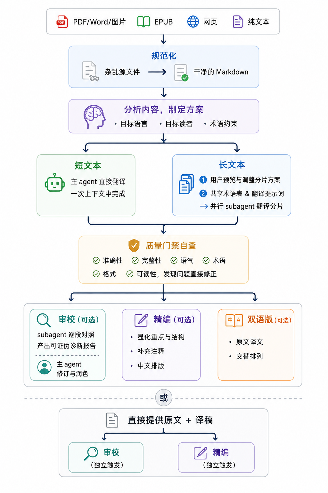
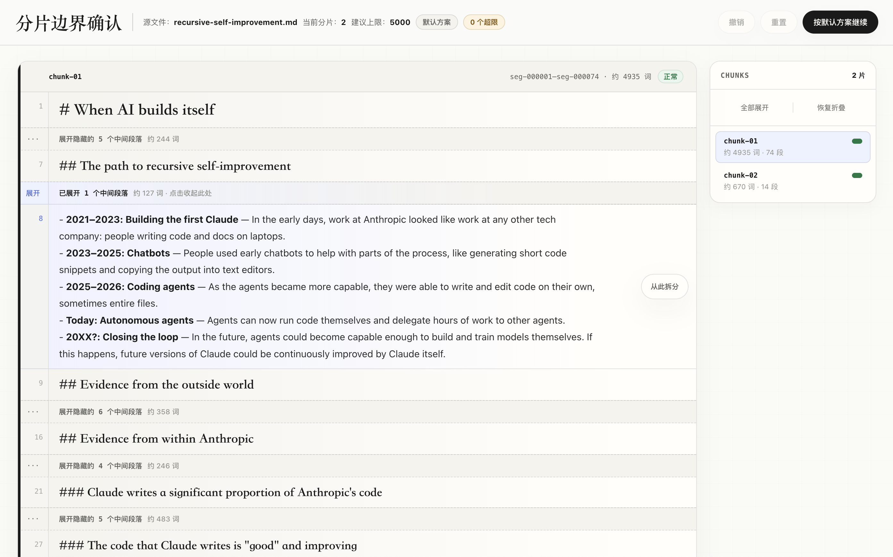
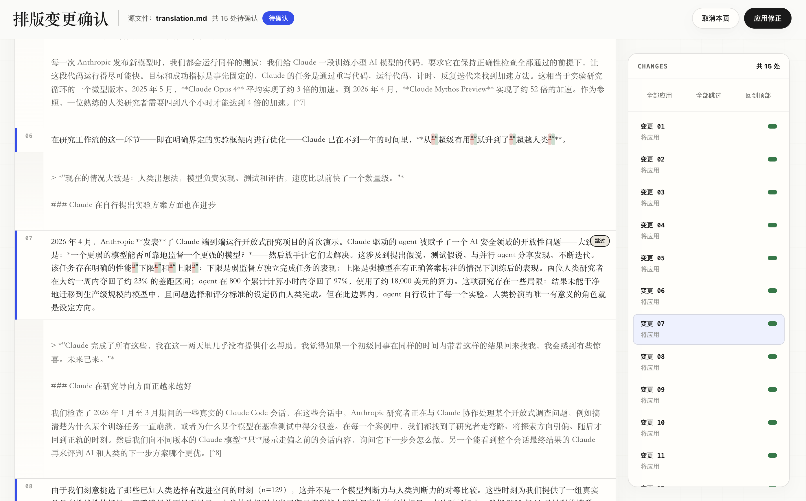

# longtext-translate

面向外文阅读场景的翻译 Agent Skill。把任意格式、任意长度的材料交给 Agent，拿回可以直接舒服阅读的母语译文。

## 解决什么问题

翻译，尤其是长文本翻译，常卡在这几个地方：

- 源文件如果是 PDF 或 EPUB，得先手动提取文字、清洗排版、处理图片路径
- 文本一长，LLM 的输出质量便开始衰减：术语漂移、翻译腔加重、段落间逻辑断裂等等
- 即使拿到译文，也未必能放心阅读——一边排查翻译偏差，一边在脑中修正拗口表达，理解成本居高不下

实际过程往往是“准备材料 → 翻译 → 磕磕碰碰地读 → 发现问题 → 手动修正润色 → 再读”的反复循环。一篇文献，可能要耗上一两周才能真正吸收。

而这个 Skill 接手了费力的人工环节，你只需在关键决策点介入。

## 工作流程

<p align="center">
  
</p>

## 翻译原则

- **忠实原文**　完整保留事实、数据、观点、逻辑关系和论证结构
- **重写译文**　按目标语言习惯重组句式、信息顺序和段落节奏，而非字面转换
- **语域匹配**　等价再现原文的口语化程度、情感强度和体裁风格
- **术语一致**　核心术语全文统一，专业术语首次出现时标注原文
- **保留格式**　标题、粗体、链接、图片、代码块等 Markdown 结构原样保留

## 主要特性

**本地留存可追溯**　关键中间产物均保留在本地输出目录，可追溯、可调试、可恢复。

**全格式按需提取**　PDF、EPUB、网页等自动规范化为 Markdown；且 PDF 和 EPUB 可按页码或章节范围只提取所需部分。

**长文本质量稳定**　长文本会先分片，生成共享术语表和翻译提示词，再委派 subagent 并行翻译，确保跨分片的术语和风格统一。

**关键决策人把关**　分片边界调整、排版修正审阅等高风险且不适合纯文本描述的环节，均提供可视化操作界面，用户可确认后再落地。

**术语表智能筛选**　大型术语表文件（数百条以上）不直接全量进入上下文，而是自动筛选出源文中实际出现的词条再应用，支持 TSV、CSV、Markdown 表格等常见格式。

**打磨至出版水准**　翻译后可继续选择审校（逐段对照原文审校 + 脱离原文润色）、精编（显化文章重点与结构 / 为读者可能缺失的信息添加注释 / 统一中文排版与格式）或双语版。

<table>
  <tr>
    <td align="center" width="50%">
      <a href="assets/chunk-html-demo.png" target="_blank">
        
      </a>
      <br>分片预览与调整<br>
    </td>
    <td align="center" width="50%">
      <a href="assets/polish-html-demo.png" target="_blank">
        
      </a>
      <br>排版修正预览与确认<br>
    </td>
  </tr>
</table>

## 快速开始

**安装**

```bash
npx skills add zlhhhh8901/longtext-translate
```

或直接告诉 agent：

```
请帮我安装这个 skill：github.com/zlhhhh8901/longtext-translate
```

**使用**

在 Agent 对话中直接说出你的翻译需求，Skill 会自动触发。比如：

- “把这篇论文的第 10 到 20 页翻译成中文：@paper.pdf”
- “这份译稿质量不太好，审校一下，原文在 @original.md，译稿在 @draft.md”

Skill 内置无障碍流程引导，使用者无需了解内部实现，开箱即用。

## 翻译质量对比

**测试样本**：[Anthropic - When AI builds itself](https://www.anthropic.com/institute/recursive-self-improvement)

**运行模型**：deepseek-v4-pro（推理强度：High，运行环境：ClaudeCode），经「翻译 + 审校 + 精编」全流程产出

**结果对比**：https://compare-gules.vercel.app （译文 A 为 Skill 直出，译文 B 为[数字生命卡兹克](https://mp.weixin.qq.com/s/mJbuKJChVk7ktIHEtKzChg)发布的版本）

## 费用与耗时参考

**测试样本**：《Stein on Writing》英文原版 228 页，10.4 万词（体量接近《哈利·波特与阿兹卡班的囚徒》英文原版的 10.7 万词）

**运行模型**：deepseek-v4-pro（推理强度：High，运行环境：ClaudeCode）

| 阶段 | 耗时 | 费用 |
|------|------|------|
| 规范化（PDF → Markdown） | 57 秒 | ¥0.16 |
| **翻译**（22 个 subagent 并行） | **14 分 21 秒** | **¥4.91** |
| 审校 | 8 分 41 秒 | ¥0.40 |
| 精编 | 2 分 33 秒 | ¥0.28 |
| 双语版 | 2 分 3 秒 | ¥0.09 |
| **合计** | **28 分 35 秒** | **¥5.84** |

## 产出文件

翻译结果存放在源 Markdown 文件所在目录，目录名为 `{源文件名}-{目标语言}/`。比如 `article.md` 译后结果放在 `article-zh/` 中。

而源 Markdown 文件的位置取决于输入类型：

-  PDF / EPUB / Word / 图片：规范化后保存在源文件同级目录
-  内联文本 / URL：保存在 `translate/` 目录
-  已有文本文件：直接作为源文件使用

目录实际包含的文件因翻译模式和后续选项而异。

```
article-zh/
├── translation.md        ← 最终译文（必有）
├── glossary.md           ← 共享术语表（长文本模式）
├── prompt.md             ← subagent 共享翻译提示（长文本模式）
├── chunk-preview.html    ← 分片预览页面（长文本模式）
├── chunks/               ← 各分片原文与译稿（长文本模式）
├── draft.md              ← 审校/精编前的译稿快照
├── critique.md           ← 结构化审校报告
├── polish-preview.html   ← 排版修正预览页面
└── bilingual.md          ← 双语对照文件
```

## 致谢

本 Skill 在 [baoyu-translate](https://github.com/baoyu-io/baoyu-translate) 的基础上修改而来——分片策略、subagent 并行调度的流程骨架，以及“重写，而不只是翻译”这一核心翻译原则，均源自该项目。

此外，以下项目在具体实现环节提供了重要参考或直接支撑：

- [MinerU](https://github.com/opendatalab/MinerU)：PDF、Word 与图片等文档的规范化提取，直接使用该项目提供的服务
- [baoyu-format-markdown](https://github.com/baoyu-io/baoyu-format-markdown)：精编流程中“重点与结构显化”的设计参考自该项目
- [chinese-copywriting-guidelines](https://github.com/sparanoid/chinese-copywriting-guidelines)：精编流程中“中文排版与格式修正”的规范依据来源
- [Superpowers](https://github.com/obra/superpowers)：分片预览与排版修正的浏览器交互设计思路参考自该项目

## 友链

[LINUX DO - 新的理想型社区](https://linux.do)

## 许可证

MIT
