## The Big Picture

Imagine if all of human history were written down in a fat book called *The Story of Us*.

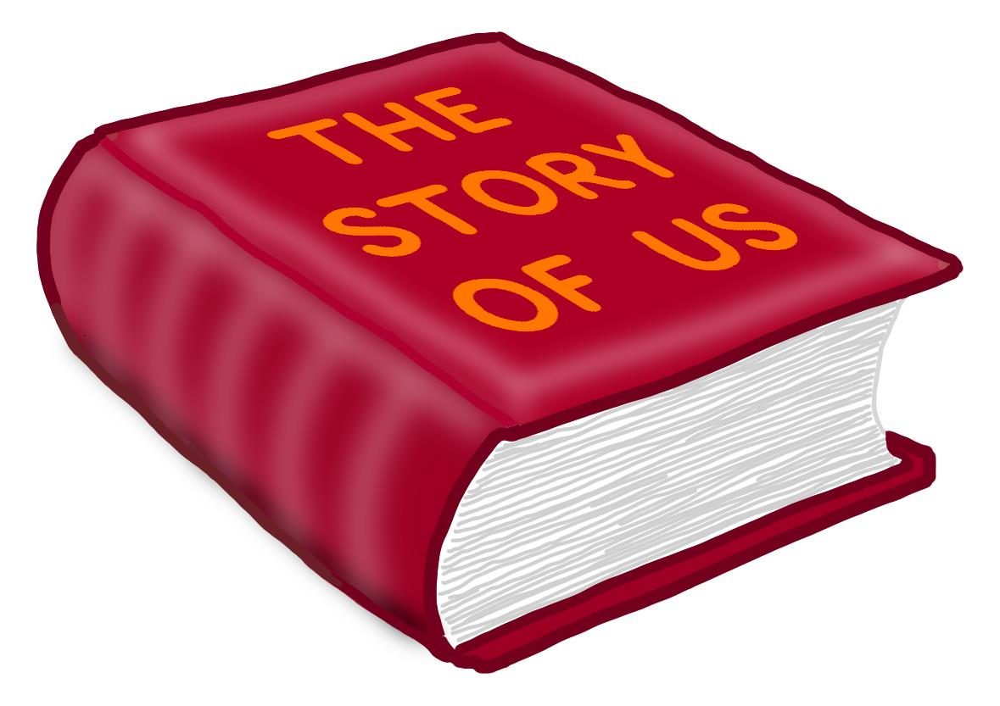

Humans have been around for a long, long time—according to the most recent estimates, between 200,000 and 300,000 years.

If every page of *The Story of Us* covered 250 years of history, the book would be about 1,000 pages long. To take a closer look, let’s tear all the pages out and lay them on the table:

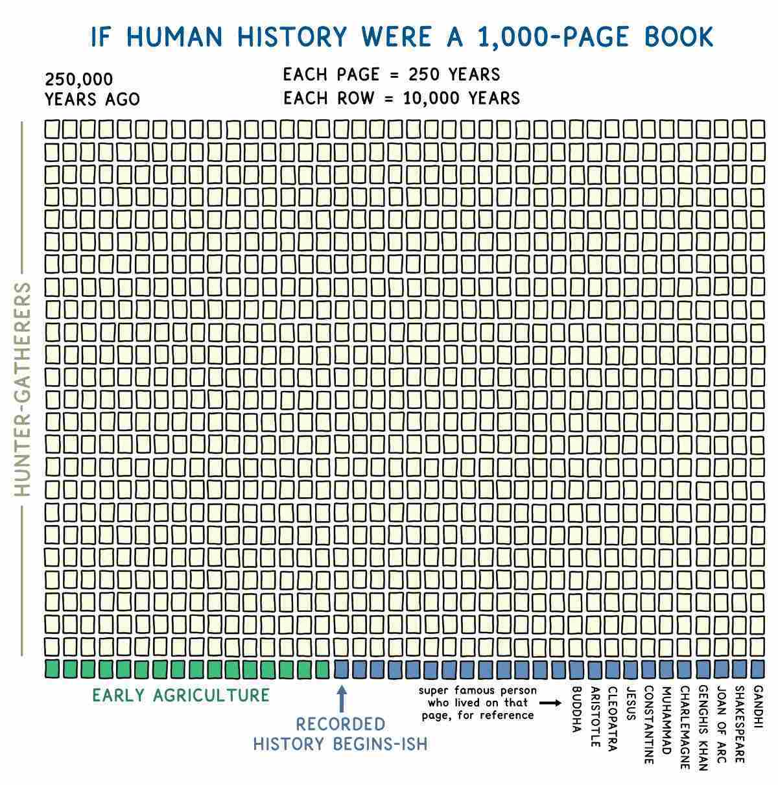

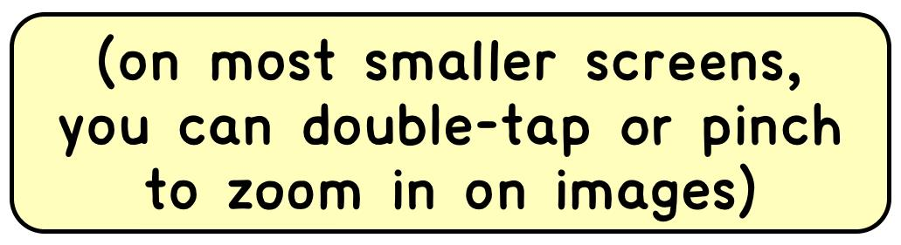

When we really zoom out, we see that most of what we consider ancient history is really just the very last pages of the story. The Agricultural Revolution starts around page 950 or 960, recorded history gets going at about page 976, and Christianity isn’t born until page 993. Page 1,000, which goes from the early 1770s to the early 2020s, contains all of U.S. history.

We’re now collectively venturing into the mysterious new world of page 1,001. This excites me—and also scares me—because of three concurrent facts.

#### Fact 1: Technology is exponential

Say we went back to page 760 of *The Story of Us,* kidnapped someone, and transported them a few centuries forward to page 761. Other than having to find new friends and make some cultural adjustments, they’d probably get along fine, because the worlds of pages 760 and 761 were pretty much the same.

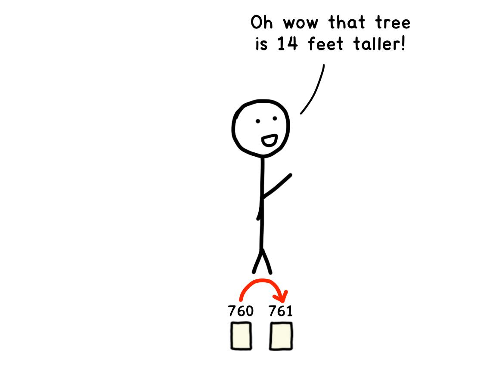

For most of our history, that’s what it would be like to jump forward 250 years to the next page. But the closer you get to page 1,000, the less the rule holds. Like, what if we did the same thing with someone on page 992, 998, or 999?

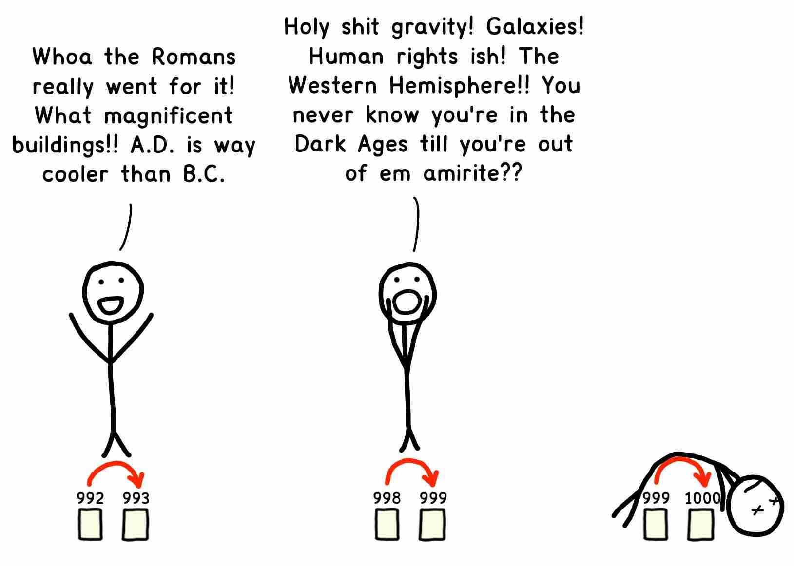

The later you lived in *The Story of Us,* the more mind-blowing it would be to jump forward to the next page. As you can see, our little person on page 999 was so shocked by the world he saw on page 1,000, he keeled over and died. We can see why when we compare page 1,000 to all the pages before it.

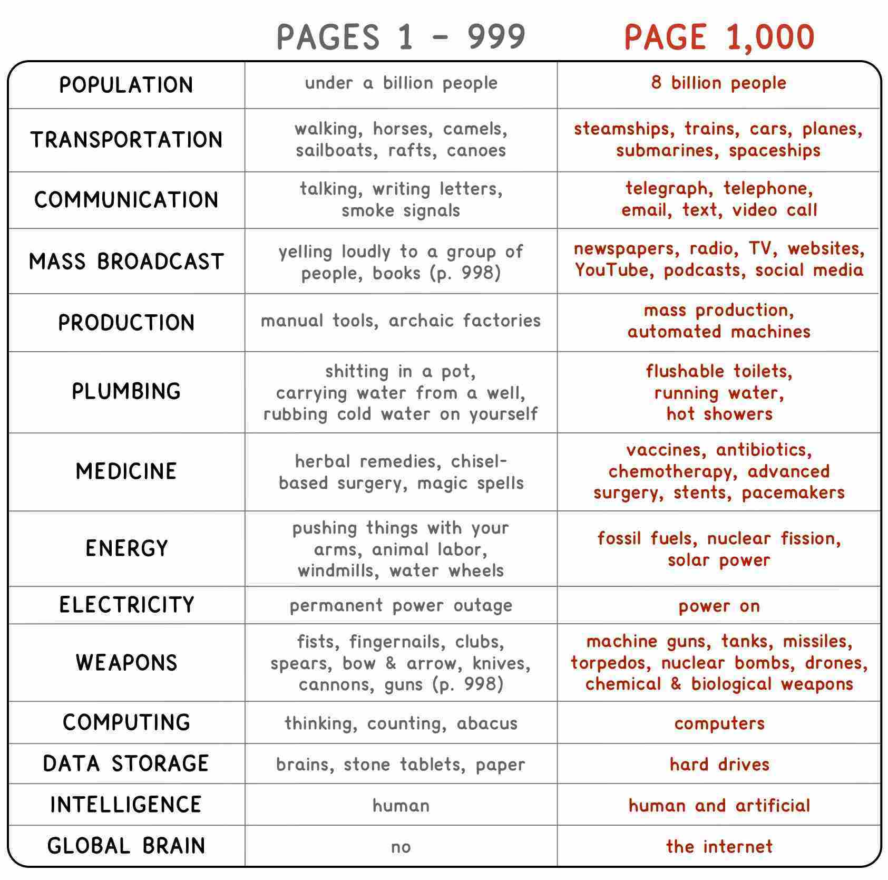

It’s natural to assume that the world we grew up in is normal. But nothing about our current world is normal. Because technology is exponential. More advanced societies make progress at a faster *rate* than less advanced societies—*because* they’re more advanced. People in the 19th century knew more and had better technology than people in the 16th century, so it’s no surprise that there were more advances on page 1,000 than on page 999. Over the centuries, this builds upon itself, leading to increasingly rapid progress. And ever since the Middle Ages ended, human technology has been advancing on an exponential fast track, leading to a world on page 1,000 that would seem like a totally different planet to humans on any previous page.

#### Fact 2: More technology means higher stakes

Technology is a multiplier of both good and bad. More technology means better good times, but it also means badder bad times.

On page 999 of human history, the Enlightenment and Scientific Revolution that generated vast improvements in human prosperity also generated an explosion of slavery and brutal imperialism.

Page 1,000, a time of unprecedented life expectancy, wealth, and political freedom, also saw the two most catastrophic wars in history followed by existential threats with the invention of nuclear and biological weapons and the onset of climate change.

As the times get better, they also get more dangerous. More technology makes our species more powerful, which increases risk*.* And the scary thing is, if the good and bad keep exponentially growing, it doesn’t matter how great the good times become. If the bad gets to a certain level of bad, it’s all over for us.

So far in the 21st century, Fact 1 and Fact 2 seem to be holding strong. The pace of change has been dizzying, with the advent of widespread internet, social media, smart phones, self-driving cars, and crypto, not to mention the dramatic leaps in AI powering many of these advances. The jump in technology from page 1,000 to 1,001 should prove to be even more extreme than the jump from 999 to 1,000—maybe many times more so. This could be unfathomably awesome. We could conquer every problem that ails us today—disease, poverty, climate change, maybe even mortality itself.

But if the catastrophes of page 1,000 were the most devastating yet, what does that mean about catastrophes on page 1,001? The same technology that has made our world magical has also opened a large number of Pandora’s boxes: rapidly advancing AI, cyber warfare, autonomous weapons, and bioweapons, to name a few.

With the stakes this high, we’d want to be our wisest selves. Which is unfortunate, because:

#### Fact 3: My society is currently acting like a poopy-pantsed four-year-old who dropped its ice cream

I picture society as a giant human—a living organism like each of us, only much bigger. And when I look at the American society around me, I’m not really seeing this:

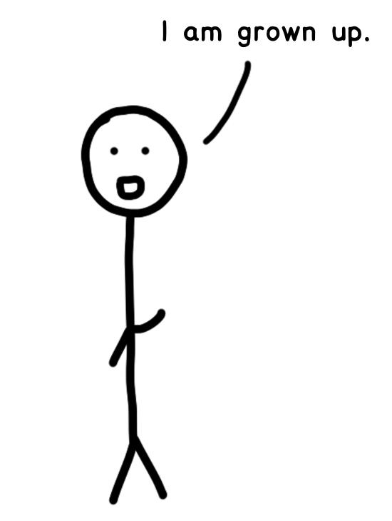

It looks more like this:

Humans are supposed to mature as they age—but the giant human I live in has been getting more childish each year. Tribalism and political division are on the rise. False narratives and outlandish conspiracy theories are flourishing. Major institutions are floundering. Medieval-style public shaming is suddenly back in fashion. Trust, the critical currency of a healthy society, is disintegrating. And these trends seem to be happening in lots of societies, not just my own.

So what’s our problem? Why, in a time so prosperous, with the stakes so high, would we be going *backward* in wisdom?

This wouldn’t be the first time. In 1905, philosopher George Santayana issued a warning to humanity:

*Those who cannot remember the past are condemned to repeat it.*

The worrying thing about that quote is that the philosopher Edmund Burke issued the same warning over a century earlier, in 1790:

*People will not look forward to posterity, who never look backward to their ancestors.*

We seem to be having trouble learning an important lesson here.

When we learn a technology lesson, we tend not to forget it. The invention of the integrated circuit in 1959 was a breakthrough that launched a new paradigm in modern computing. This isn’t the kind of thing we later forget, finding ourselves accidentally going back to making computers with vacuum tubes. But wisdom lessons don’t always seem to *stick.* Unlike technological growth, wisdom seems to oscillate up and down, leading societies to repeat age-old mistakes.

As I look at the world around me today, I worry that we’re on our way toward making some terrible—and preventable—mistakes. When I think about Facts 1 and 2, I picture our societies as giants trudging upward on a mountain ridge toward a glorious future—but as they move upward, the ridge gets thinner and the cliffs on either side grow steeper. The higher we go, the more deadly a fall we risk. When I think about Fact 3, I see those giants losing their composure and becoming more erratic in their steps, at the worst possible time.

If you were reading *The Story of Us* and turned the page to 1,001, everything would seem to be coming to a head, with many storylines suddenly converging. You’d be glued to the book, needing to find out *what happens to this species.*

Except we’re not reading *The Story of Us*—we’re living inside of it, as its characters. We’re also its authors, writing the story as we go along.

Our responsibility is immense. If we can figure out how to get page 1,001 right, Future Us and trillions of our descendants could live high up on that mountain in what would seem like a magical utopia to Today Us. If we get page 1,001 wrong and stumble off those steep cliffs, this might be the last page of the story.

As the authors of *The Story of Us*, we have no mentors, no editors, no one to make sure it all turns out okay. It’s all in our hands. This scares me, but it’s also what gives me hope. If we can all get just a little wiser, together, it may be enough to nudge the story onto a trajectory that points toward an unimaginably good future.

## Hey

Hey.

I know we’re all intense-feeling right now after that intro, but I just want to pause for a minute and introduce myself.

I’m Tim. I spend my time writing a blog called *Wait But Why*, where I explore all kinds of things—artificial intelligence, procrastination, relationships, aliens, and lots of other random topics that interest me. Then I illustrate the writing with drawings that seem like they were done by a fourth grader but actually were done by a grown-up man. This was all going fine until a few years ago, when something began to nag at me. The society around me seemed to be devolving, and if that kept happening, none of those other topics I write about would matter. If we really were losing our grip on things, every other topic was secondary to *that* topic. So I dove in.

When I pick a topic to write about, I like to go deep down the rabbit hole. But this topic—*what’s our problem?—*turned out to be a rabbit hole like no other. As I began to crawl in, I slipped and fell and ended up here.

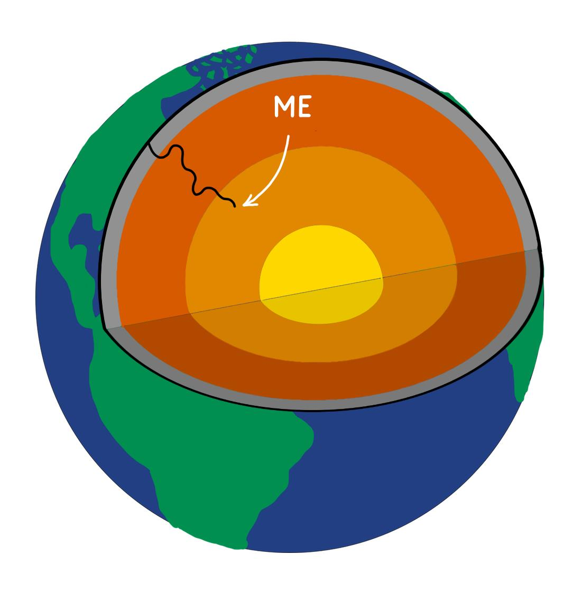

Normally, I spend somewhere between three days and three months learning and pondering and discussing a topic before I know what I want to say. This one took me six years. When I finally emerged from the extended rabbit hole, I had a new perspective on the world, on politics, on group dynamics, on how we think and why we believe the things we believe. In this book, I’ll share that perspective with you.

In Chapter 1, we’ll get to know the book’s primary tool—a framework that I’ve spent the past six years developing, testing, and refining. I call it the Ladder. The Ladder is a thinking lens—a pair of glasses for the brain to help us better understand the world and ourselves. It’s made me a much better thinker and communicator, and I hope it will do the same for you.

In Chapter 2, we’ll look at the familiar subject of politics through our unfamiliar new glasses. Instead of seeing politics as a mere horizontal axis of left, right, and center, we’ll use the Ladder to supplement the one-dimensional political discussion with a badly needed vertical dimension.

In Chapter 3, we’ll examine the story of our regression: how and why I believe we’ve been slipping down the Ladder as a society.

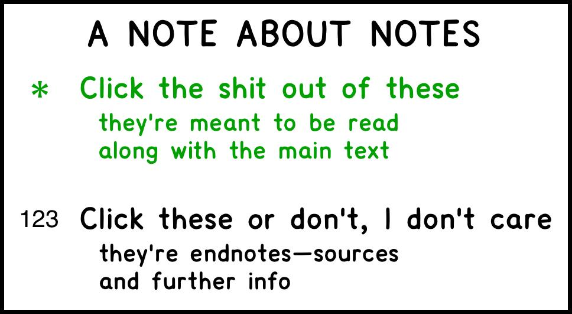

From there, we’ll look at our current trajectory up close by examining two American stories. First, in Chapter 4, we’ll turn our attention to America’s Republican Party, and then, in Chapters 5-7, a deep dive into the controversial world of American social justice. The tired discussions around these phenomena are, I believe, missing the forest for the trees. In both cases, the Ladder will reveal a more interesting and more useful story than is portrayed in popular discourse.

All together, our journey looks like this:

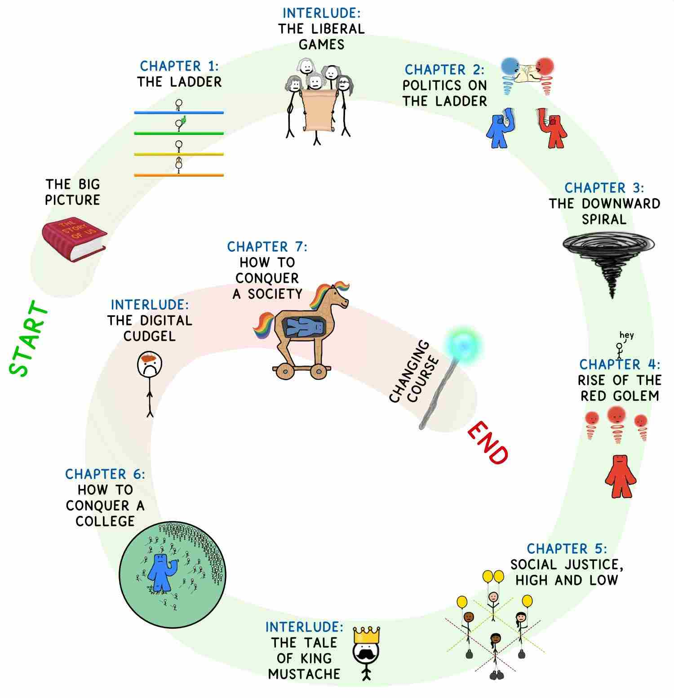

Ready?

# Chapter 1

## The Ladder

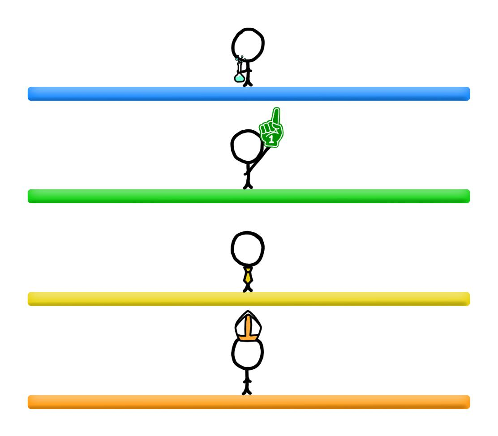

There is a great deal of human nature in people.

– Mark Twain

## The Tug-of-War in Our Heads

The animal world is a stressful place to be.

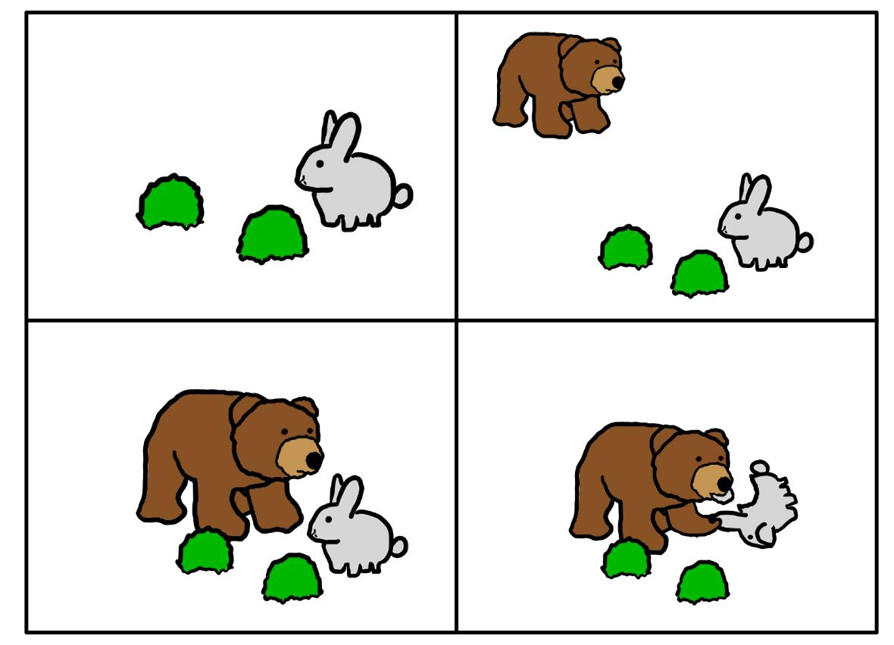

The issue is that the animal world isn’t really an animal world—it’s a world of trillions of strands of genetic information, each one hell-bent on immortality. Most gene strands don’t last very long, and those still on Earth today are the miracle outliers, such incredible survival specialists that they’re hundreds of millions of years old and counting.

Animals are just a hack these outlier genes came up with—temporary containers designed to carry the genes and help them stay immortal. Genes can’t talk to their animals, so they control them by having them run on specialized survival software I call the **Primitive Mind**:

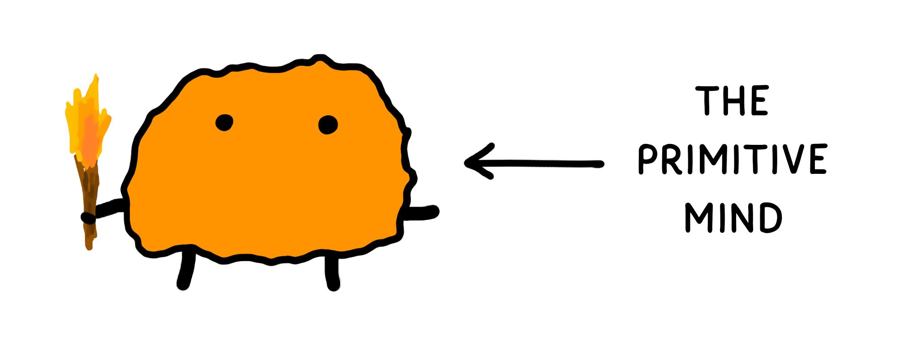

The Primitive Mind is a set of coded instructions for how to be a successful animal in the animal’s natural habitat. The coder is natural selection, which develops the software using a pretty simple process: Software that’s good at making its animal pass on its genes stays around, and the less successful software is discontinued. Genetic mutation is like a bug appearing in the software from time to time, and every once in a while, a certain bug makes the software *better*—an accidental software update. It’s a slow way to code, but over millions of generations, it gets the job done.

The infrequency of these updates means an animal’s software is actually optimized for the environment of its *ancestors*. For most animals, this system works fine. Their environment changes so slowly that whatever worked a hundred thousand or even a million years in the past probably works just about as well in the present.

But humans are strange animals. A handful of cognitive superpowers, like symbolic language, abstract thinking, complex social relationships, and long-term planning, have allowed humans to take their environment into their own hands in a way no other animal can. In the blink of an eye—around 12,000 years, or 500 generations—humans have crafted a totally novel environment for themselves called civilization.

As great as civilization may be, 500 generations isn’t enough time for evolution to take a shit. So now we’re all here living in this fancy new habitat, using brain software optimized to our old habitat.

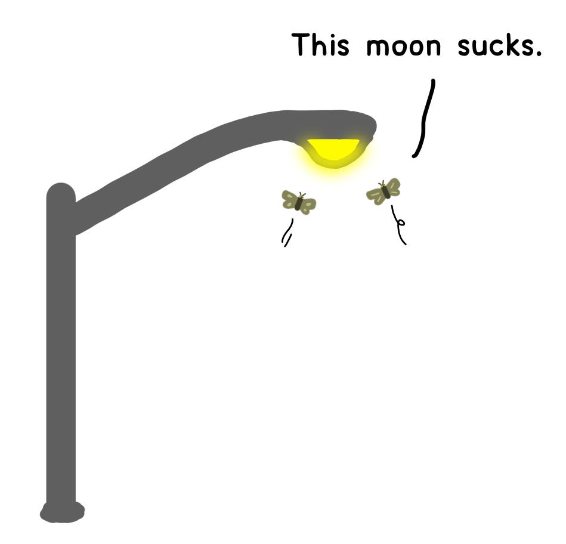

You know how moths inanely fly toward light and you’re not really sure why they do this or what their angle is? It turns out that for millions of years, moths have used moonlight as a beacon for nocturnal navigation—which works great until a bunch of people start turning lights on at night that aren’t the moon. The moth’s brain software hasn’t had time to update itself to the new situation, and now millions of moths are wasting their lives flapping around streetlights.

In a lot of ways, modern humans are like modern moths, running on a well-intentioned Primitive Mind that’s constantly misinterpreting the weird world we’ve built for ourselves.

The good news is, our Primitive Mind has a roommate: the **Higher Mind**.

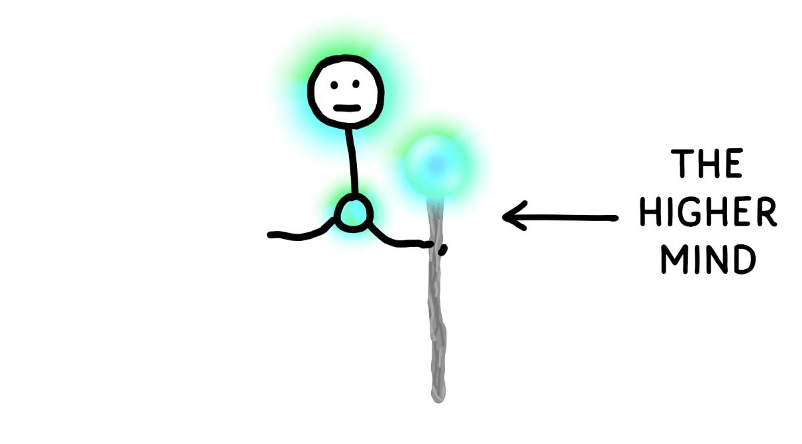

The Higher Mind is the part of you that can think outside itself and self-reflect and get wiser with experience.

Unlike the Primitive Mind, the Higher Mind can look around and see the world for what it really is. It can *see* that you live in an advanced civilization and it wants to think and behave accordingly.

The Primitive Mind and Higher Mind are a funny pair. When things are going well, the inside of your head looks like this:

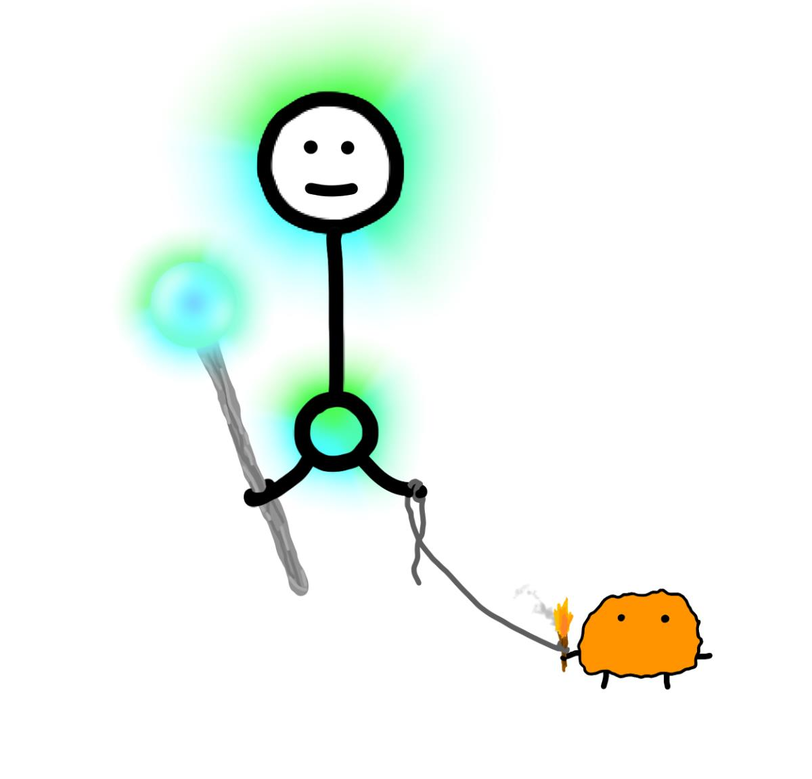

The Higher Mind is large and in charge, while its little software pet chases dopamine around, taking care of the eating and sleeping and masturbating. The Primitive Mind, at its core, just wants to survive and reproduce and help its offspring reproduce—all things the Higher Mind is totally on board with *when it makes sense.* When the Primitive Mind wants you to think and behave in a way that doesn’t map onto reality, the Higher Mind tries to override the software, keeping you within the “makes sense” circle on the right:

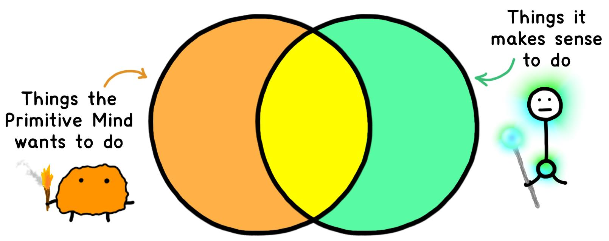

The trouble starts when the balance of power changes.

As smart as the Higher Mind may be, it’s not very good at managing the Primitive Mind. And when the Primitive Mind gains too much control, you might find yourself drifting over to the No Sense Zone.

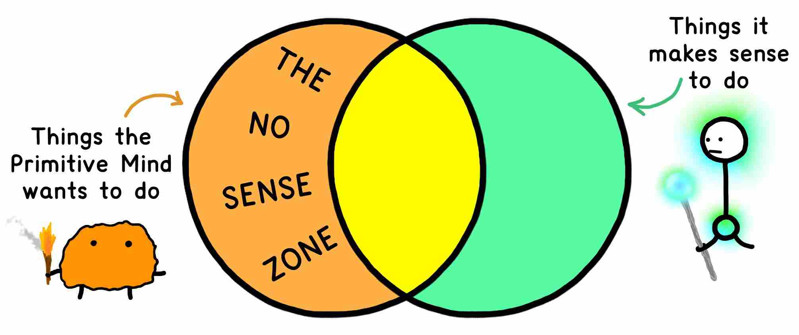

Like we’ve all been here, trying to buy something at a drugstore and becoming enticed by a succulent bag of junk food.

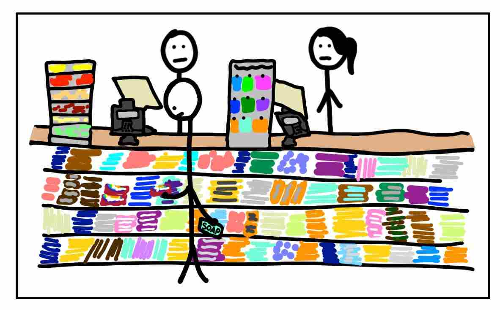

The Primitive Mind and Higher Mind help us see what’s really going on:

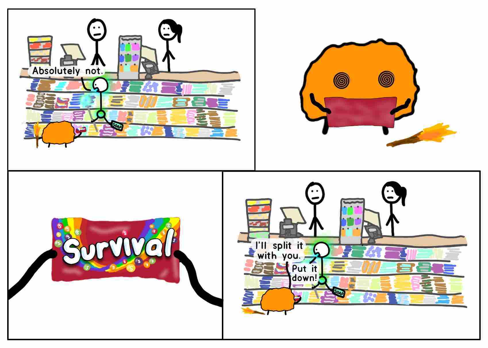

Like the moth flying toward a streetlight, the human Primitive Mind thinks it’s a great decision to eat Skittles. In the ancient human world, there was no such thing as processed food, calories were hard to come by, and anything with a texture and taste as delectable as a Skittle was surely a good thing to eat. Mars, Inc., which makes Skittles, knows what makes your Primitive Mind tick and is in the business of tricking it. Your Higher Mind knows better. If it holds the reins of your mind, it’ll either skip the Skittles or have just a few, as a little treat for its primitive roommate.

But sometimes, there you are, 80 Skittles into your binge, hating yourself—because your Primitive Mind has hijacked the cockpit.

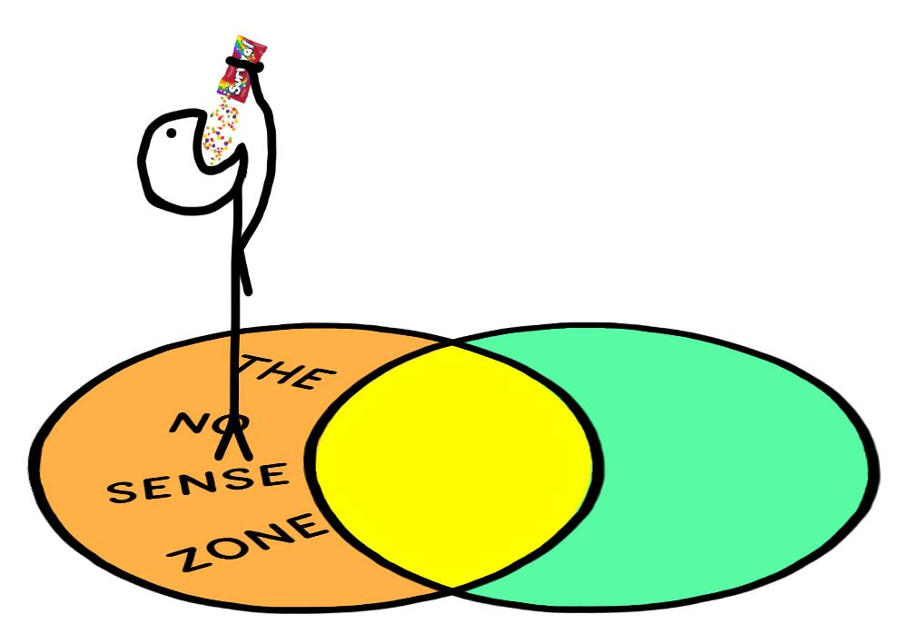

This kind of internal disagreement pops up in many parts of life, like a constant tug-of-war in our heads—a tug-of-war over our thoughts, our emotions, our values, our morals, our judgments, and our overall consciousness.

The tug-of-war is a spectrum that we can simplify into four basic states—or four rungs of a **Ladder**:

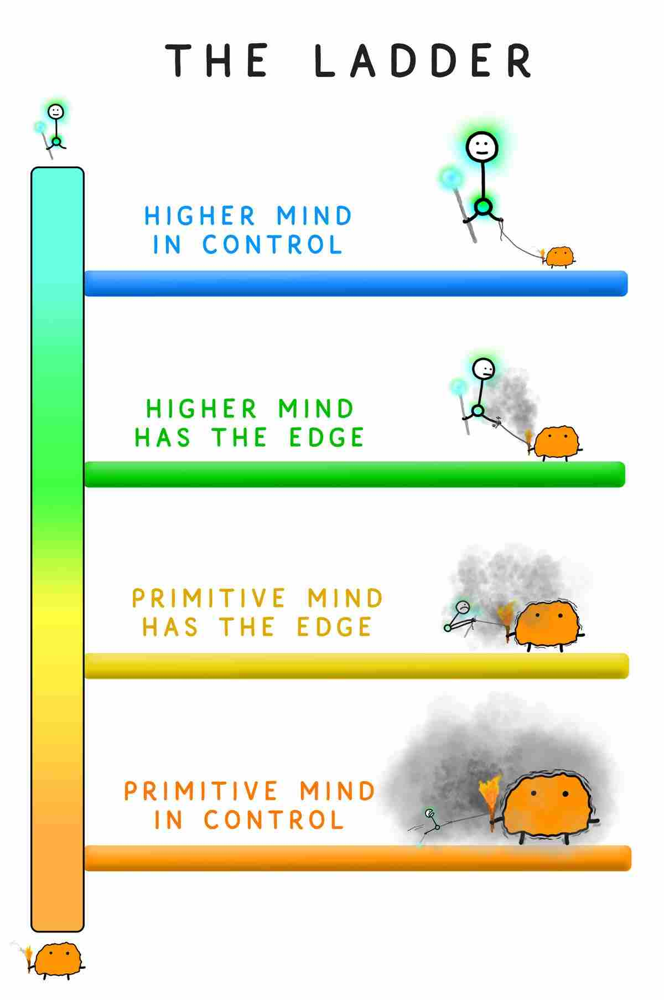

### ON MULTIPLE MINDS

Philosophers and scientists have been grappling with the “multiple minds” idea for millennia. Plato wrote about a “charioteer” (intellect) that managed the “horses” of rational modesty and passionate insolence. Sigmund Freud’s structure consisted of the “id” (primitive instinct), the “superego” (the conscience), and the “ego” that balances the two with external reality. More recently, social psychologist Daniel Kahneman wrote about “System 1” (fast, involuntary thinking) and “System 2” (slow, complex thinking that requires effort). Social psychologist Jonathan Haidt wrote about the emotional “elephant” and its rational “rider” which appears to be in control but often is not. Harvard’s Todd Rogers and Max H. Bazerman wrote about the conflict between the “want self” and the “should self.” Others analyze specific brain structures, distinguishing between the more rational thinking of the prefrontal cortex and the more primitive workings of the limbic system.

While the Higher Mind and Primitive Mind in this book overlap with elements of some of these other models, it is not meant to map perfectly onto any of them. Our characters and the tug-of-war between them will become intuitive as you read this book.

Humans are so complicated because we’re all a mixture of both “high-rung” and “low-rung” psychology.

When the Higher Mind is winning the tug-of-war, its staff illuminates our minds with clarity, including awareness of the Primitive Mind and what it’s up to. The Higher Mind understands that primitive pleasures like sex, food, and all-in-good-fun tribalism like sports fandom are enjoyable, and often necessary, parts of a human life. And like a good pet owner, the Higher Mind is more than happy to let the Primitive Mind have its fun. Primitive bliss is great, as long as it’s managed by the Higher Mind, who makes sure it’s done in moderation, it’s done for the right reasons, and no one gets hurt. In short, when we’re up on the high rungs, we act like grown-ups.

But when something riles up the Primitive Mind, it gets bigger and stronger. Its torch—which bears the primal fires of our genes’ will for survival—grows as well, filling our minds with smoky fog. This fog dulls our consciousness, so when we’re most under the spell of our Primitive Mind, we don’t even realize it’s happening. The Higher Mind, unable to think clearly, begins directing its efforts toward supporting whatever the Primitive Mind wants to do, whether it makes sense or not. When we slip down to the Ladder’s low rungs, we’re short-sighted and small-minded, thinking and acting with our pettiest emotions. We’re low on self-awareness and high on hypocrisy. We’re our worst selves.

We all have our own Ladder struggles. Some of us struggle with procrastination, an uncontrollable temper, or an addiction to sugar or gambling; others suffer from an irrational fear of failure or crippling social anxiety. We all self-defeat in our own way—in each case because our Higher Minds lose control of our heads and send us flapping our moth wings toward the streetlights.

In this book, we’re going to explore a particular group of Ladder struggles—those I believe are most relevant to our big question about today’s societies: What’s our problem? The first stop on our journey will be our own heads, where we’ll use the Ladder to help us make sense of a key process: how we form our beliefs.

## Vertical Thinking

Why do we believe what we believe?

Our beliefs make up our perception of reality, drive our behavior, and shape our life stories. History happened the way it did because of what people believed in the past, and what we believe today will write the story of our future. So it seems like an important question to ask: How do we actually come to believe the things we end up believing?

To explore this question, let’s create a way to visualize it.

When it comes to our beliefs, let’s imagine the range of views on any given topic as an axis we can call the **Idea Spectrum**.

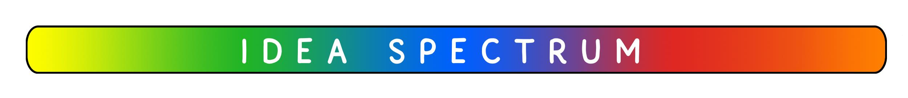

The Idea Spectrum is a simple tool we can use to capture the range of what a person might think about any given topic—their beliefs, their opinions, their stances.

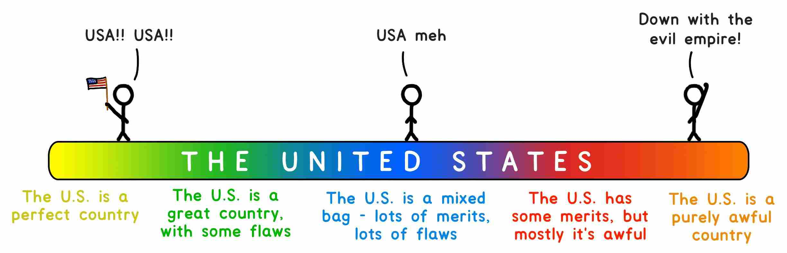

For most beliefs, we’re so concerned with where people stand that we often forget the most important thing about what someone thinks: *how* they arrived at what they think. This is where the Ladder can help. If the Idea Spectrum is a “what you think” axis, we can use the Ladder as a “how you think” axis.

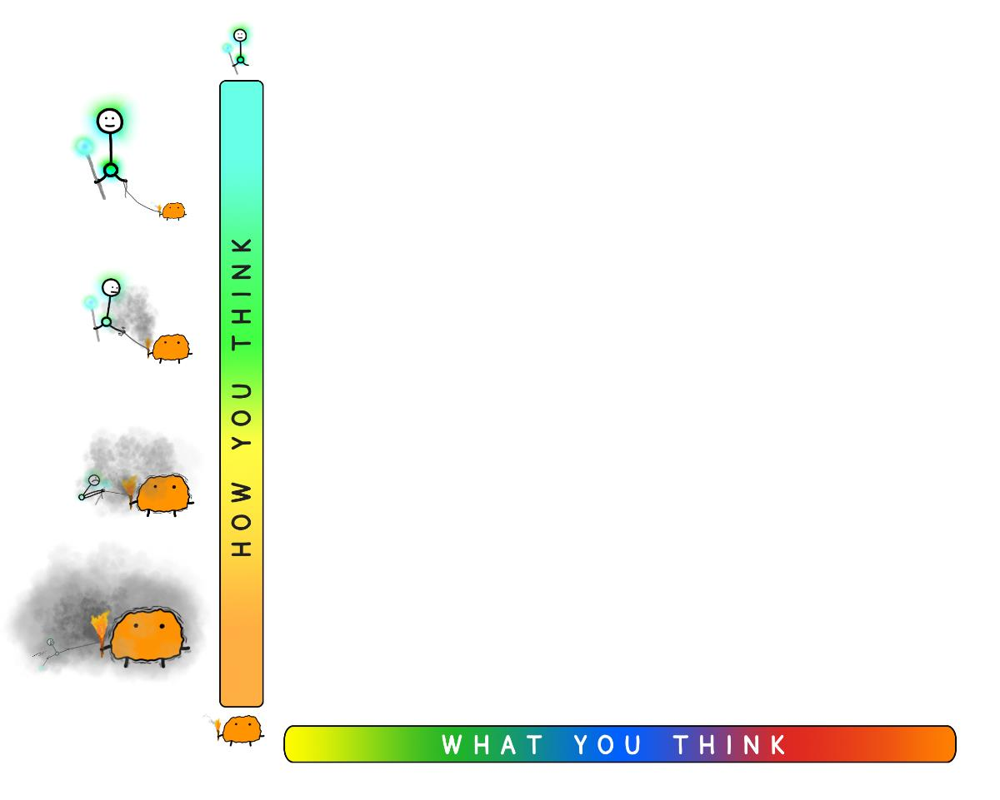

To understand how our thinking changes depending on where we are on the Ladder, we have to ask ourselves: how do the two minds like to form beliefs?

Your Higher Mind is aware that humans are often delusional, and it wants you to be not delusional. It sees beliefs as the most recent draft of a work in progress, and as it lives more and learns more, the Higher Mind is always happy to make a revision. Because when beliefs are revised, it’s a signal of progress—of becoming less ignorant, less foolish, less wrong.

Your Primitive Mind disagrees. For your genes, what’s important is holding beliefs that generate the best kinds of survival behavior—whether or not those beliefs are actually true. The Primitive Mind’s beliefs are usually installed early on in life, often based on the prevailing beliefs of your family, peer group, or broader community. The Primitive Mind sees those beliefs as a fundamental part of your identity and a key to remaining in good standing with the community around you. Given all of this, the last thing the Primitive Mind wants is for you to feel *humble* about your beliefs or interested in *revising* them. It wants you to treat your beliefs as sacred objects and believe them with conviction.

So the Higher Mind’s goal is to get to the *truth*, while the Primitive Mind’s goal is *confirmation* of its existing beliefs. These two very different types of *intellectual motivation* exist simultaneously in our heads. This means that our driving intellectual motivation—and, in turn, our thinking process—varies depending on where we are on the Ladder at any given moment.

In the realm of thinking, then, the Ladder’s four rungs correspond to four ways of forming beliefs. When your Higher Mind is running the show, you’re up on the top rung, thinking like a Scientist.

### Rung 1: Thinking like a Scientist

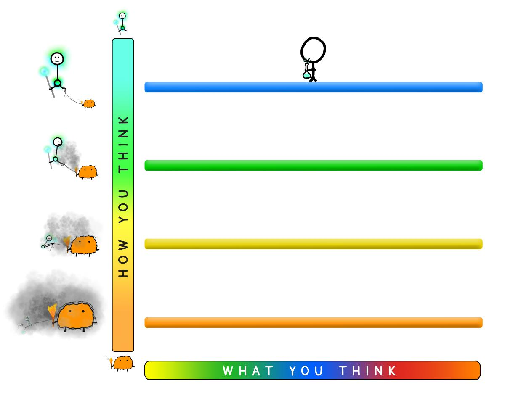

When you’re thinking like a Scientist, you start at Point A and follow evidence wherever it takes you.

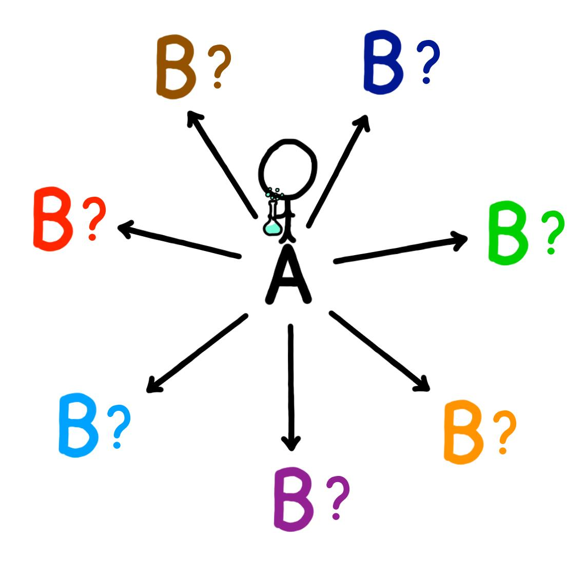

More specifically, the Scientist’s journey from A to B looks something like this:

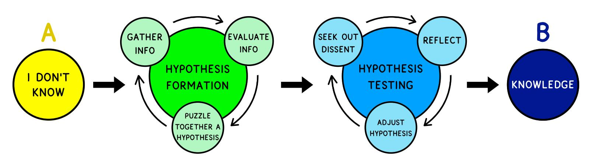

The Scientist’s default position on any topic is “I don’t know.” To advance beyond Point A, they have to put in effort, starting with the first stage: hypothesis formation.

#### Hypothesis formation

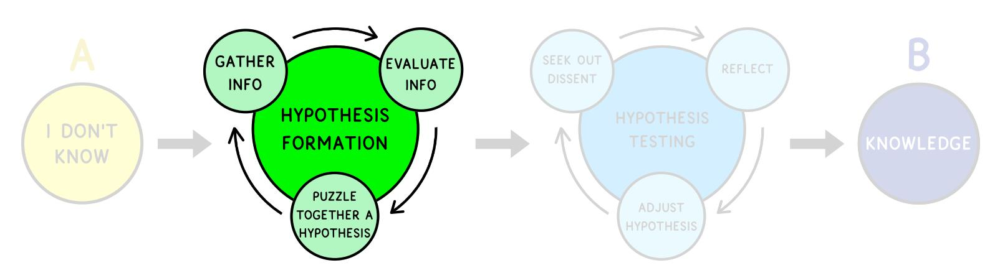

Top-rung thinking forms hypotheses from the bottom up. Rather than adopt the beliefs and assumptions of conventional wisdom, you puzzle together your own ideas, from scratch. This is a three-part process:

##### 1) Gather information

In order to puzzle, you need pieces. Each of us is constantly flooded with information, and we have severely limited attention to allot. In other words, your mind is an exclusive VIP-only club with a tough bouncer.

But when Scientists want to learn something new, they try to soak up a wide variety of information on the topic. The Scientist seeks out ideas across the Idea Spectrum, even those that seem likely to be wrong—because knowing the range of viewpoints that exist about the topic *is* a key facet of understanding the topic.

##### 2) Evaluate information

If gathering info is about quantity, evaluating info is all about quality.

There are instances when a thinker has the time and the means to collect information and evidence *directly*—with their own primary observations, or by conducting their own studies. But most of the info we use to inform ourselves is *indirect* knowledge: knowledge accumulated by others that we import into our minds and adopt as our own. Every statistic you come across, everything you read in a textbook, everything you learn from parents or teachers, everything you see or read in the news or on social media, every tenet of conventional wisdom—it’s all indirect knowledge.

That’s why perhaps the most important skill of a skilled thinker is knowing when to *trust*.

Trust, when assigned wisely, is an efficient knowledge-acquisition trick. If you can trust a person who actually speaks the truth, you can take the knowledge that person worked hard for—either through primary research or indirectly, using their own diligent trust criteria—and “photocopy” it into your own brain. This magical intellectual corner-cutting tool has allowed humanity to accumulate so much collective knowledge over the past 10,000 years that a species of primates can now understand the origins of the universe.

But trust assigned wrongly has the opposite effect. When people trust information to be true that isn’t, they end up with the *illusion* of knowledge—which is worse than having no knowledge at all.

So skilled thinkers work hard to master the art of *skepticism.* A thinker who believes everything they hear is too gullible, and their beliefs become packed with a jumble of falsehoods, misconceptions, and contradictions. Someone who trusts no one is overly cynical, even paranoid, and limited to gaining new information only by direct experience. Neither of these fosters much learning.

The Scientist’s default skepticism position would be somewhere in between, with a filter just tight enough to consistently identify and weed out bullshit, just open enough to let in the truth. As they become familiar with certain information sources—friends, media brands, articles, books—the Scientist evaluates the sources based on how accurate they’ve proven to be in the past. For sources known to be obsessed with accuracy, the Scientist loosens up the trust filter. When the Scientist catches a source putting out inaccurate or biased ideas, they tighten up the filter and take future information with a grain of salt.

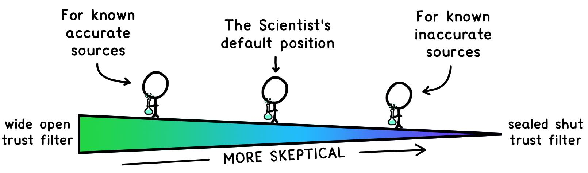

When enough information puzzle pieces have been collected, the third stage of the process begins.

##### 3) Puzzle together a hypothesis

The gathering and evaluating phases rely heavily on the learnings of others, but for the Scientist, the final puzzle is mostly a work of independent reasoning. When it’s time to form an opinion, their head becomes a wide-open creative laboratory.

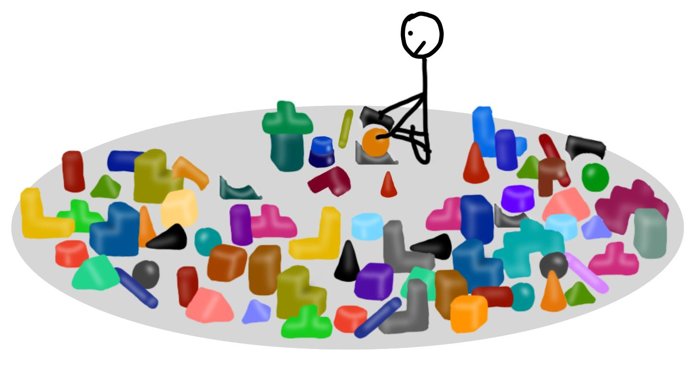

Scientists, so rigid about their high-up position on the vertical How You Think axis, start out totally agnostic about their *horizontal* position on the What You Think axis. Early on in the puzzling process, they treat the Idea Spectrum like a skating rink, happily gliding back and forth as they explore different possible viewpoints.

As the gathering and evaluating processes continue, the Scientist grows more confident in their puzzling. Eventually, they begin to settle on a portion of the Idea Spectrum where they suspect the truth may lie. Their puzzle is finally taking shape—they have begun to form a *hypothesis*.

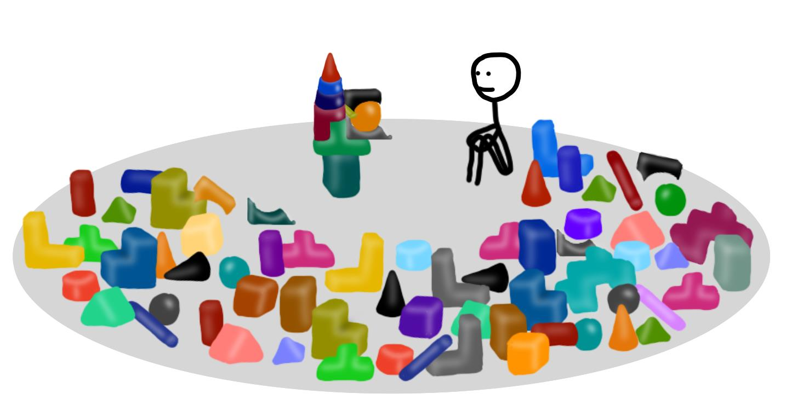

#### Hypothesis testing

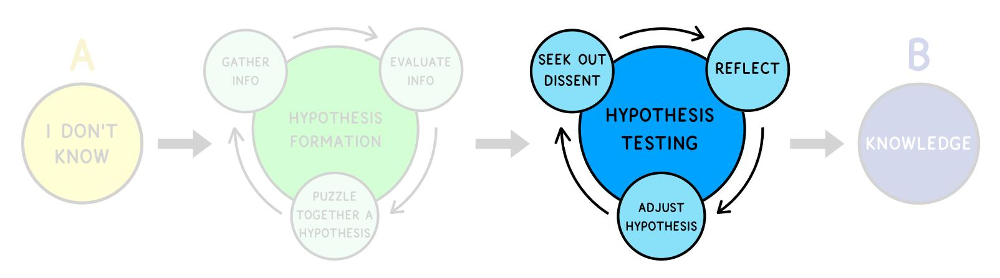

Imagine I present to you this boxer, and we have this exchange:

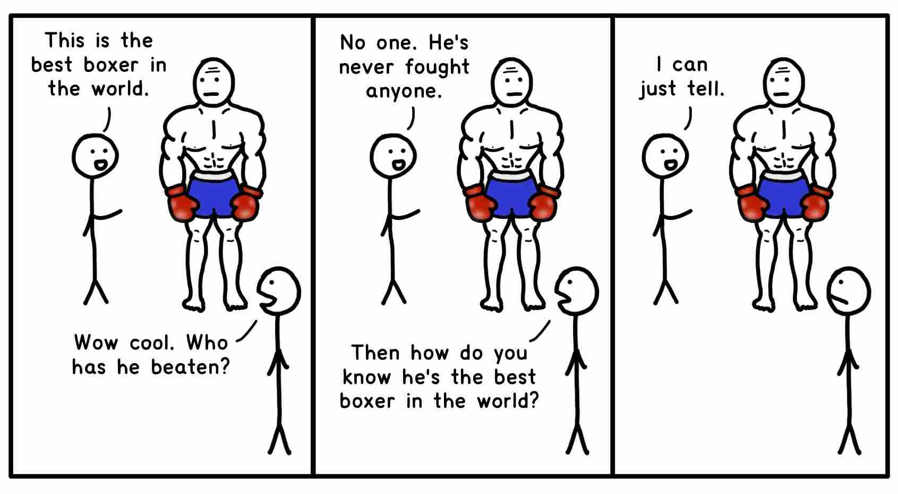

You’d think I was insane.

But people do this with ideas all the time. They feel sure they’re right about an opinion they’ve never had to defend—an opinion that has never stepped into the ring. Scientists know that an untested belief is only a hypothesis—a boxer with *potential*, but not a champion of anything.

So the Scientist starts expressing the idea publicly, in person and online. It’s time to see if the little guy can box.

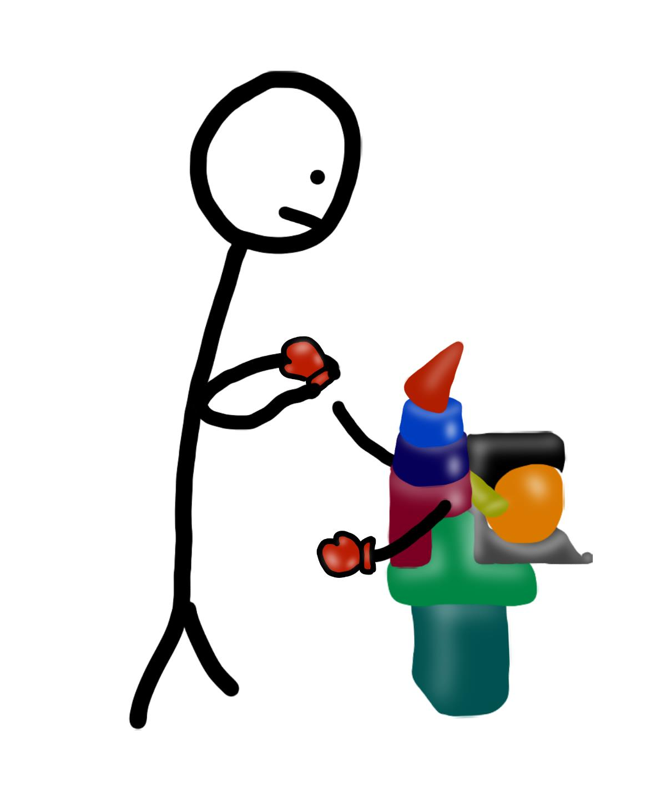

In the world of ideas, boxing opponents come in the form of *dissent*. When the Scientist starts throwing ideas out into the world, the punches pour in.

Biased reasoning, oversimplification, logical fallacies, and questionable statistics are the weak spots that feisty dissenters look for, and every effective blow landed on the hypothesis helps the Scientist improve their ideas. This is why Scientists actively seek out dissent. As organizational psychologist Adam Grant puts it in his book *Think Again*:

I’ve noticed a paradox in great scientists and superforecasters: the reason they’re so comfortable being wrong is that they’re terrified of being wrong. What sets them apart is the time horizon. They’re determined to reach the correct answer in the long run, and they know that means they have to be open to stumbling, backtracking, and rerouting in the short run. They shun rose-colored glasses in favor of a sturdy mirror.

The more boxing matches the Scientist puts their hypothesis through, the more they’re able to explore the edges of their conclusions and tweak their ideas into crisper and more confident beliefs.

With some serious testing and a bunch of refinements under their belt, the Scientist may begin to feel that they have arrived at Point B: knowledge.

It’s a long road to knowledge for the Scientist because truth is hard. It’s why Scientists say “I don’t know” so often. It’s why, even after getting to Point B in the learning process, the Scientist applies a little asterisk, knowing that all beliefs are subject to being proven wrong by changing times or new evidence. Thinking like a Scientist isn’t about knowing a lot, it’s about being aware of what you do and don’t know—about staying close to this dotted line as you learn:

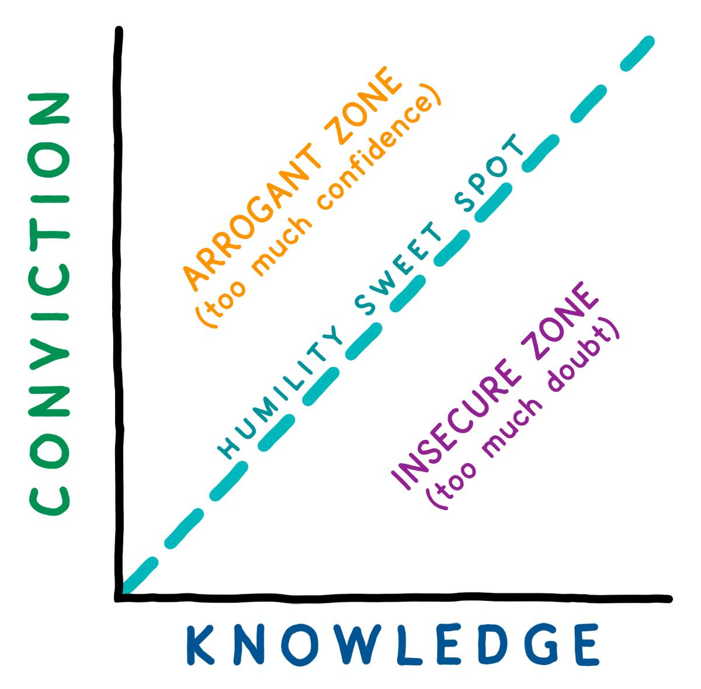

When you’re thinking like a Scientist—self-aware, free of bias, unattached to any particular ideas, motivated entirely by truth and continually willing to revise your beliefs—your brain is a hyper-efficient learning machine.

But the thing is—it’s *hard* to think like a Scientist, and most of us are bad at it most of the time. When your Primitive Mind wakes up and enters the scene, it’s very easy to drift down to the second rung of our Ladder—a place where your thinking is caught up in the tug-of-war.

### Rung 2: Thinking like a Sports Fan

Most real-life sports fans want the games they watch to be played fairly. They don’t want corrupt referees, even if it helps their team win. They place immense value on the integrity of the process itself. It’s just…that they really, really want that process to yield a certain outcome. They’re not just watching the game—they’re rooting.

When your Primitive Mind infiltrates your reasoning process, you start thinking the same way. You still believe you’re starting at Point A, and you still want Point B to be the truth. But you’re not exactly objective about it.

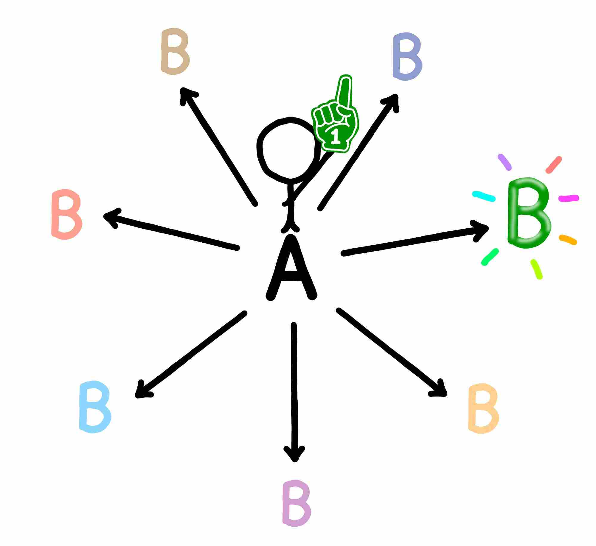

Weird things happen to your thinking when the drive for truth is infected by some ulterior motive. Psychologists call it “motivated reasoning.” I like to think of it as Reasoning While Motivated—the thinking equivalent of drunk driving. As the 6th century Chinese Zen master Seng-ts’an explains:

If you want the truth to stand clear before you, never be for or against. The struggle between “for” and “against” is the mind’s worst disease.

When you’re thinking like a Sports Fan, Seng-ts’an and his apostrophe *and* his hyphen are all mad at you, because they know what they’re about to see—the Scientist’s rigorous thinking process corrupted by the truth-seeker’s most treacherous obstacle:

Confirmation bias.

Confirmation bias is the invisible hand of the Primitive Mind that tries to push you toward confirming your existing beliefs and pull you away from changing your mind.

You still gather information, but you may cherry-pick sources that seem to support your ideas. With the Primitive Mind affecting your emotions, it just *feels good* to have your views confirmed, while hearing dissent feels irritating*.*

You still evaluate information, but instead of defaulting to the trust filter’s middle setting, you find yourself flip-flopping on either side of it, depending less on the proven track record of the source than on how much the source seems to *agree with you*:

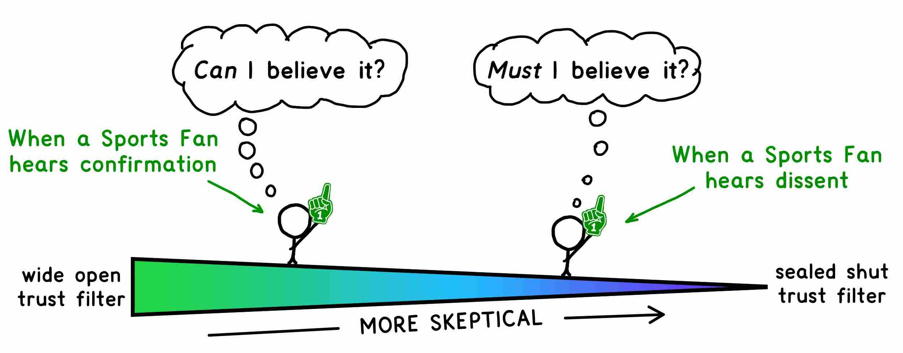

So the puzzle pieces collected in the Sports Fan’s head are skewed toward confirming a certain belief, and this is then compounded by a corrupted puzzling process. Compelling dissent that does make it into a Sports Fan’s head is often forgotten about and left out of the final puzzle.

When it’s time to test the hypothesis, the Sports Fan’s bias again rears its head. If you were thinking like a Scientist, you’d feel very little attachment to your hypothesis. But now you watch your little machine box as a *fan*, wearing its jersey. It’s Your Guy in the ring. And if it wins an argument, you might even catch yourself thinking, “We won!”

When a good punch is landed on your hypothesis, you’re likely to see it as a cheap shot or a lucky swing or something else that’s not really legit. And when your hypothesis lands a punch, you may have a tendency to overrate the magnitude of the blow or the high level of skill it involved.

Being biased skews your assessment of other people’s thinking too. You believe you’re unbiased, so someone actually being neutral appears to you to be biased in the other direction, while someone who shares your bias appears to be neutral.

As this process wears on, it’s no surprise that the Sports Fan often ends up just where they were hoping to—at their preferred Point B.

On this second rung of the Ladder, the hyper-optimized learning machine that is the Scientist’s brain has become hampered by a corrupting motivation. But despite learning less than the Scientist, the Sports Fan usually feels a little *more* confident about their beliefs.

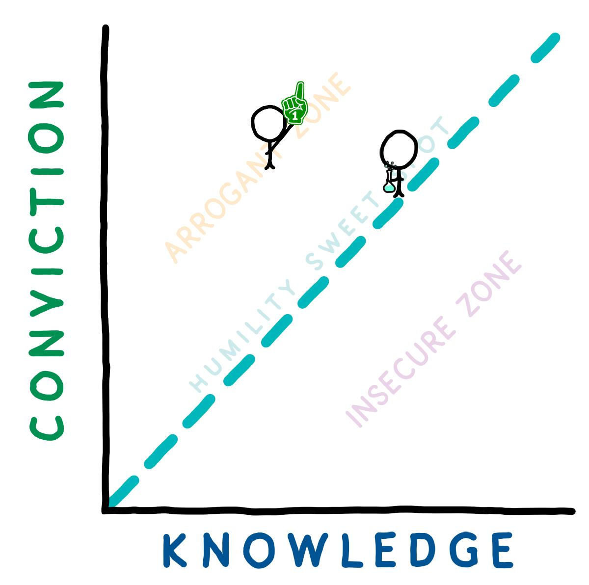

Sports Fans are stubborn, but they’re not hopeless. The Higher Mind is still a strong presence in their head, and if dissenting evidence is strong enough, the Sports Fan will grudgingly change their mind. Underneath all the haze of cognitive bias, Sports Fans still care most about finding the truth.

Drift down any further, though, and you cross the Ladder midpoint and become a different kind of thinker entirely. Down on the low rungs, the Primitive Mind has the edge in the tug-of-war. Whether you’ll admit it or not (you won’t), the desire to feel right, and appear right, has overcome your desire to *be* right. And when some other motivation surpasses your drive for truth, you leave the world of intellectual integrity and enter a new place.

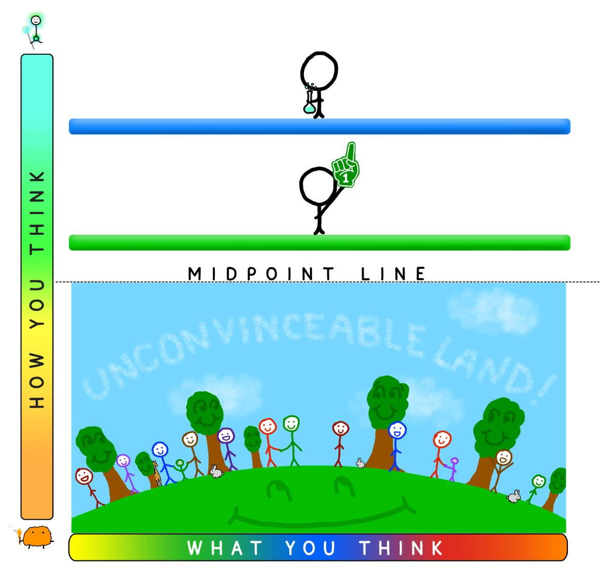

Unconvinceable Land is a world of green grass, blue sky, and a bunch of people whose beliefs can’t be swayed by any amount of evidence. When you end up here, it means you’ve become a disciple of some line of thinking—a religion, a political ideology, the dogma of a subculture. Either way, your intellectual integrity has taken a backseat to intellectual *loyalty*.

As we descend into Unconvinceable Land, we hit the Ladder’s third rung.

### Rung 3: Thinking like an Attorney

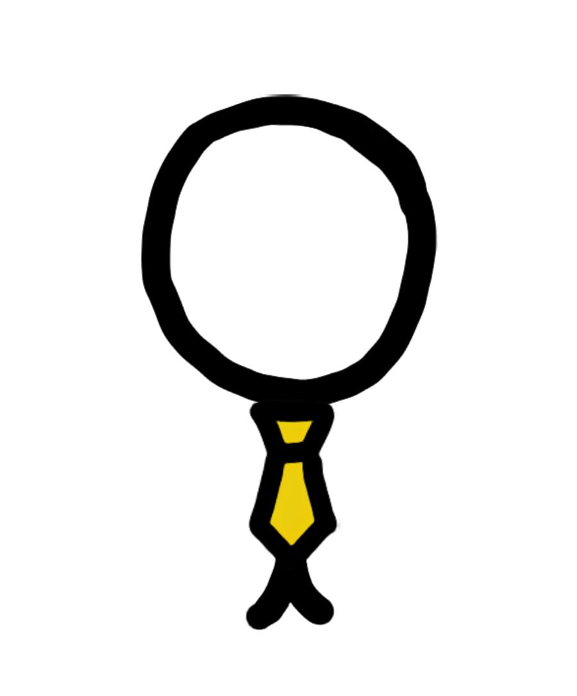

An Attorney and a Sports Fan have things in common. They’re both conflicted between the intellectual values of truth and confirmation. The critical difference is which value, deep down, they hold more sacred. A Sports Fan wants to win, but when pushed, cares most about truth. But it’s as if it's an Attorney’s *job* to win, and nothing can alter their allegiance.

Because would this be a good attorney?

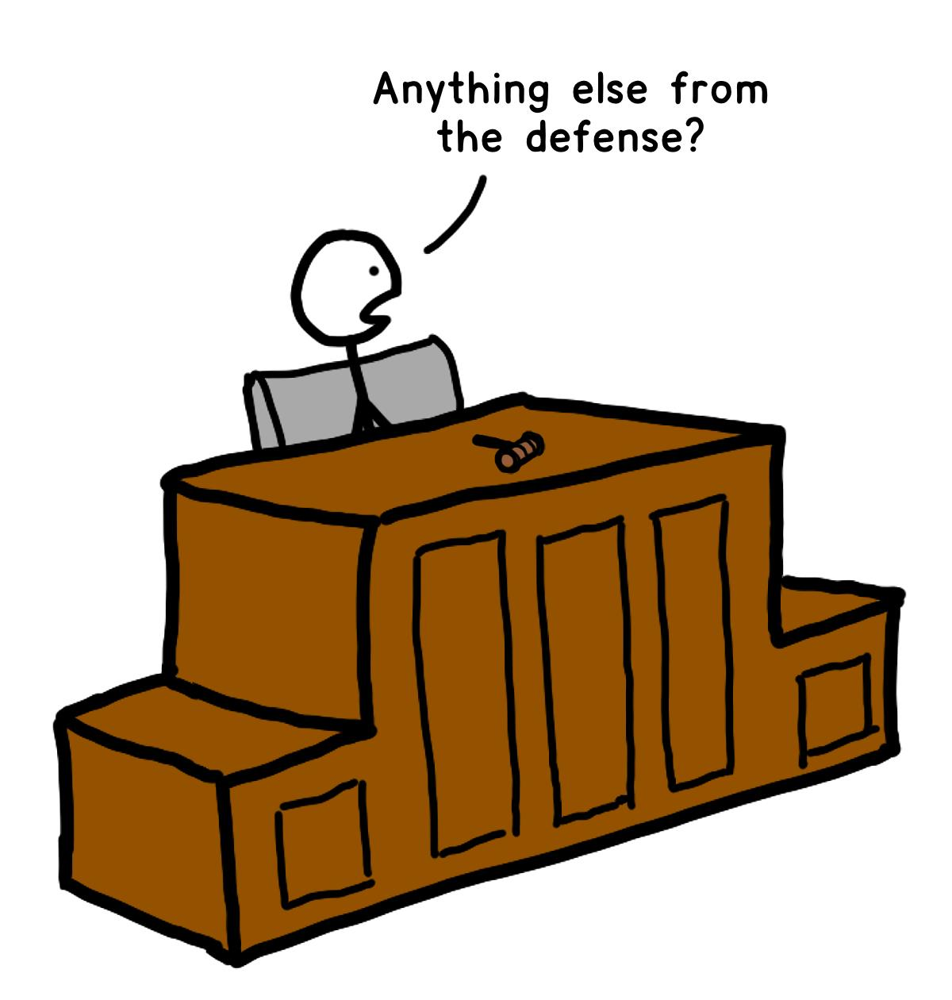

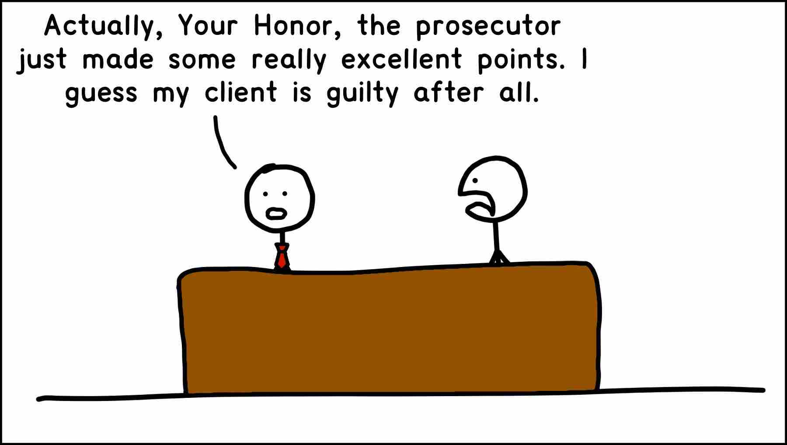

No, it wouldn’t. An Attorney is *on a team, period.*

When you’re thinking like an Attorney, you don’t start at Point A at all. You start at Point B. *The client is not guilty. Now let’s figure out why.*

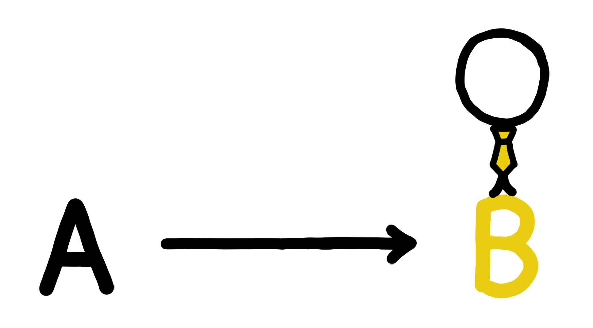

From there you’ll go through your due diligence, cherry-picking evidence and piecing together an argument that leads right where you want it to.

This isn’t a criticism of real-world attorneys. In an actual courtroom, the attorney’s way of thinking makes sense—because each attorney’s case is only *half* of what will be presented to the jury. Real-world attorneys know that the best way for the *system* to yield truth is for them to make the best possible case for one side of the story. But on our Ladder, the *cognitive* Attorney’s head is like a courtroom with only one side represented—in other words, a corrupt courtroom where the ruling is predetermined.

The Attorney treats their preferred beliefs not like an experiment that can be revised, or even a favorite sports team, but like a *client*. Motivated reasoning becomes obligated reasoning, and the gathering, evaluating, and puzzling processes function like law associates whose only job is to help build the case for Point B.

If someone really wants to believe something*—*that the Earth is flat, that 9/11 was orchestrated by Americans, that the CIA is after them—the human brain will find a way to make that belief seem perfectly clear and irrefutable. For the Attorney, the hypothesis formation stage is really a belief-strengthening process. They inevitably end up with the same viewpoints they started with, now beefed up with a refreshed set of facts and arguments that remind them just how right they are.

In the hypothesis testing phase, the Attorney’s refusal to genuinely listen to a dissenter, combined with a bag of logical fallacy tricks and their strong sense of conviction, ensures that they’re an absolutely infuriating person to argue with. The Attorney’s opponents will feel like they’re arguing with a brick wall, and by the end, it’ll be clear that nothing they could have said—nothing whatsoever—would have made the Attorney say, “Hmm that’s a good point. I need to think about that. Maybe I’m wrong.”

The result of thinking like an Attorney is that your brain’s incredible ability to learn new things is mostly shut down. Even worse, your determination to confirm your existing beliefs leaves you confident about a bunch of things that aren’t true. Your efforts only make you more delusional. If there’s anything you can say about Attorney thinking, it’s that it at least acknowledges the *concept* of the knowledge-building process. When you’re thinking like an Attorney, you’re unconvinceable, but you’re not *that* big an internal shift away from high-rung thinking. From somewhere in the periphery of your mind, the voice of the Higher Mind still carries some weight. And if you can learn to listen to it and value it, maybe things can change.

But sometimes, there are beliefs that your Primitive Mind holds so dear that your Higher Mind has no influence at all over how you think about them. When dealing with these topics, ideas and people feel inseparable and changing your mind feels like an existential threat. You’re on the bottom rung.

### Rung 4: Thinking like a Zealot

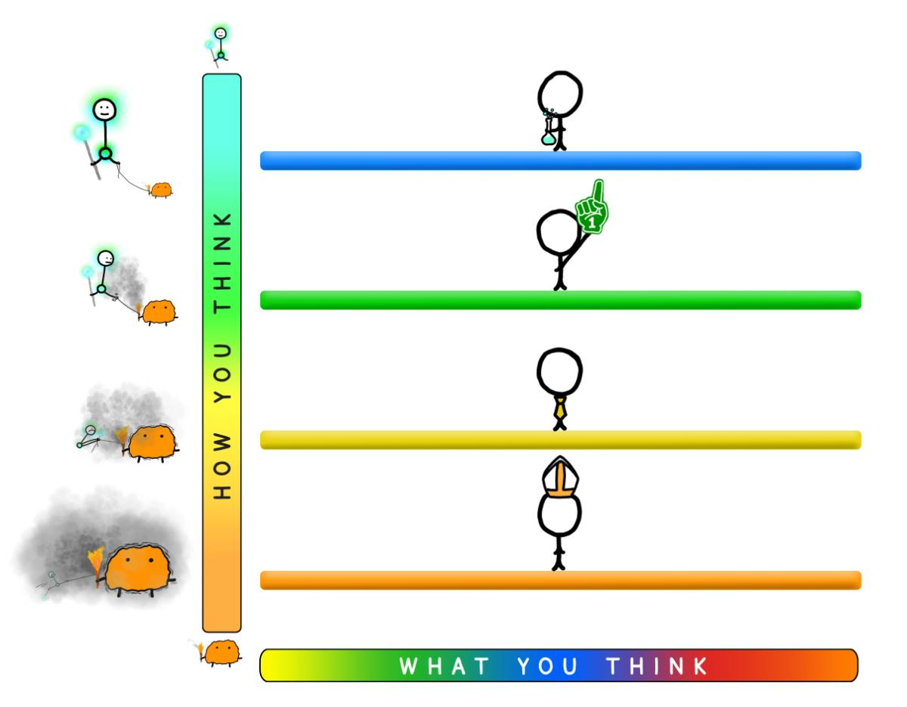

Imagine you’ve just had your first baby. Super exciting, right?

And every day when you look at your baby, you can’t believe how cute it is.

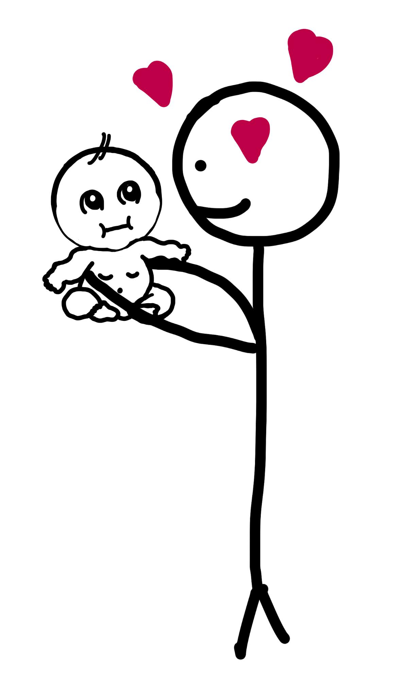

This is the relationship Zealots have with their sacred ideas: the ideas aren’t rugged experiments to be kicked around, they’re fragile, precious babies to be adored and protected.

Just like no parent has to research whether their baby is lovable, the Zealot doesn’t have to go from A to B to know their viewpoints are correct—they just know they are. With 100% conviction.

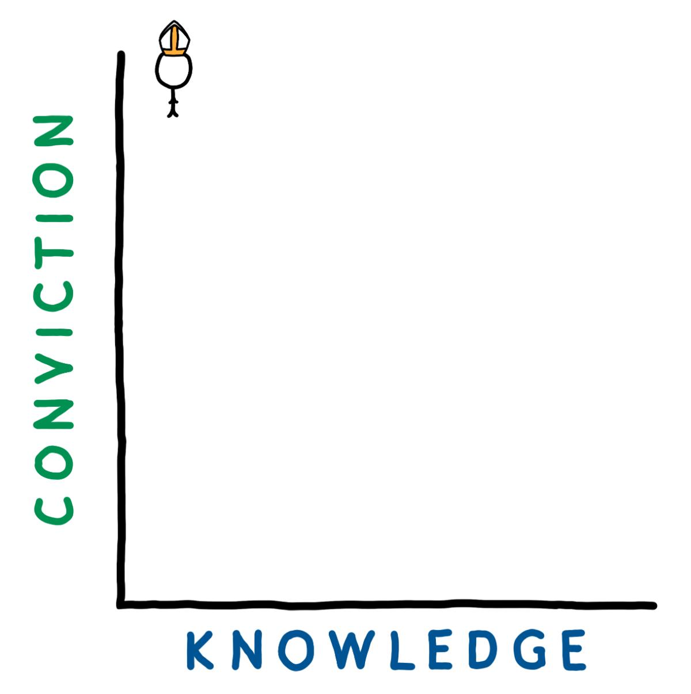

Likewise with skepticism. If someone told you your actual baby was super cute, you wouldn’t assess their credibility, you’d be in automatic full agreement. And if someone told you your baby was an asshole, you wouldn’t consider their opinion, you’d just think they were a terrible person.

That’s why the Zealot’s flip-flop goes from one extreme to the other, with no in between.

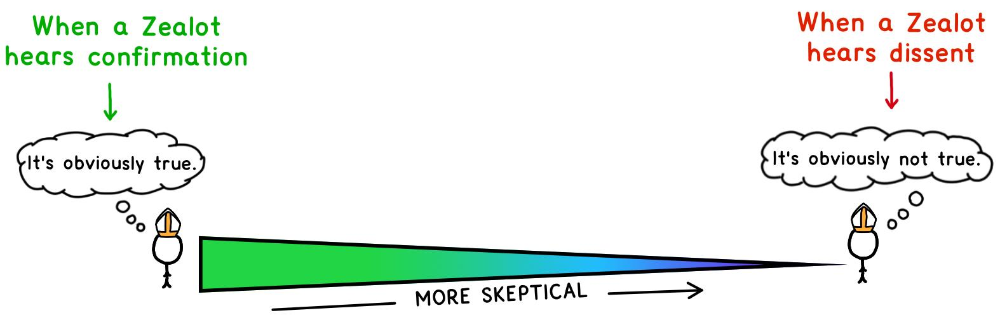

When Zealots argue, things can quickly get heated, because for someone who identifies with their ideas, a challenge to those ideas feels like an insult. It feels personally invalidating. A punch landed on a Zealot’s idea is a punch landed on their baby.

When the Primitive Mind is overactive in our heads, it turns us into crazy people. On top of making us think our ideas are babies, it shows us a distorted view of ourselves.

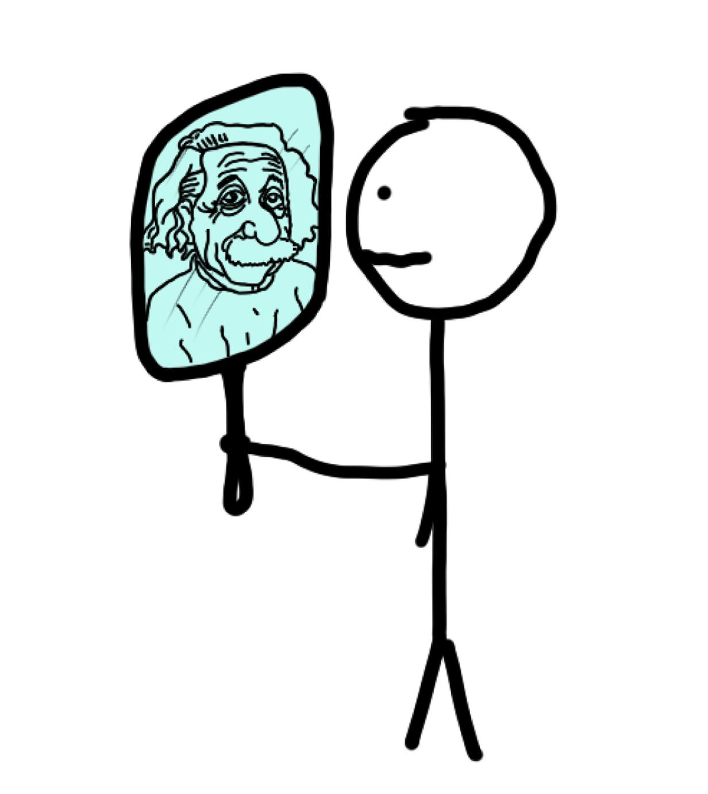

And it shows us a distorted view of the world. While the Scientist’s clear mind sees a foggy world, full of complexity and nuance and messiness, the Zealot’s foggy mind shows them a clear, simple world, full of crisp lines and black-and-white distinctions. When you’re thinking like a Zealot, you end up in a totally alternative reality, feeling like you’re an omniscient being in total possession of the truth.

#### High-rung thinking, low-rung thinking

The four thinking rungs are all distinct, but they fall into two broad categories: high-rung thinking (Scientist and Sports Fan) and low-rung thinking (Attorney and Zealot).

High-rung thinking is independent thinking, leaving you free to revise your ideas or even discard them altogether. But when there’s no amount of evidence that will change your mind about something, it means that idea is your boss. On the low rungs, you’re working to dutifully serve your ideas, not the other way around.

High-rung thinking is productive thinking. The humility of the high-rung mindset makes your mind a permeable filter that absorbs life experience and converts it into knowledge and wisdom. On the other hand, the arrogance of low-rung thinking makes your mind a rubber shell that life experience bounces off of. One begets learning, the other ignorance.

We all spend time on the low rungs, and when we’re thinking this way, we don’t realize we’re doing it. We believe our conviction has been hard-earned. We believe our viewpoints are original and based on knowledge. Because as the Primitive Mind’s influence grows in our heads, so does the fog that clouds our consciousness. This is how low-rung thinking persists.

Each of us is a work in progress. We’ll never rid our lives of low-rung thinking, but the more we evolve psychologically, the more time we spend thinking from the high rungs and the less time we spend down below. Improving this ratio is a good intellectual goal for all of us.

But this is just the beginning of our journey. Because individual thinking is the center of a much larger picture. We're social creatures, and as with most things, the way we think is often intertwined with the people we surround ourselves with.

## Intellectual Cultures

We can define “culture” as the unwritten rules regarding “how we do things here.”

Every human environment—from two-person couples to 20-person classrooms to 20,000-person companies—is embedded with its own culture*.* We can visualize a group’s culture as a kind of gas cloud that fills the room when the group is together.

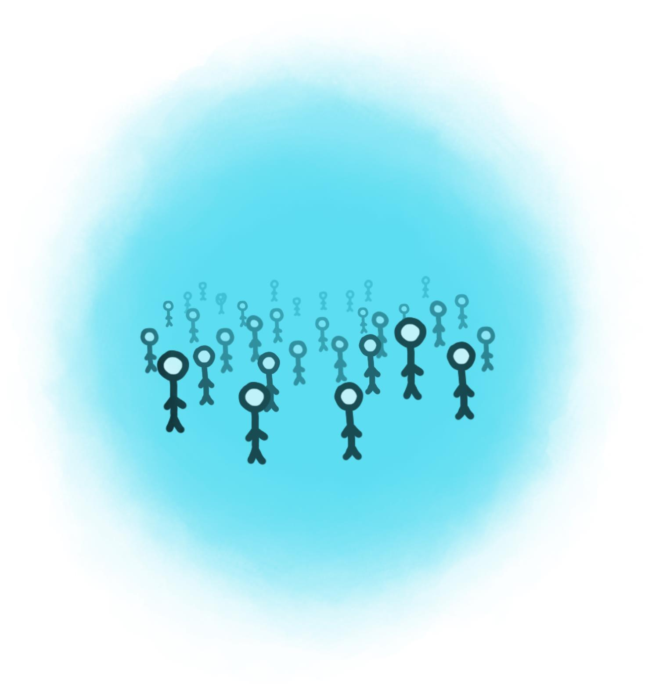

A group’s culture influences its members with a social incentive system. Those who play by the culture’s rules are rewarded with acceptance, respect, and praise, while violating the culture will result in penalties like ridicule, shame, and ostracism.

Human society is a rich tapestry of overlapping and sometimes sharply contradictory cultures, and each of us lives at our own unique cultural intersection.

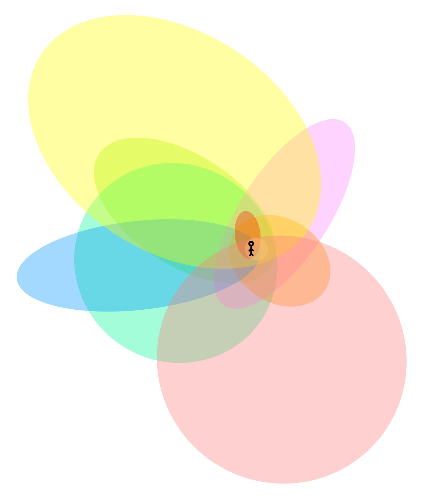

Someone working at a tech startup in the Bay Area is simultaneously living within the global Western community, the American community, the West Coast community, the San Francisco community, the tech industry community, the startup community, the community of their workplace, the community of their college alumni, the community of their extended family, the community of their group of friends, and a few other bizarre SF-y situations. Going against the current of all these larger communities combined tends to be easier than violating the unwritten rules of our most intimate micro-cultures, made up of our immediate family, closest friends, and romantic relationships.

Living simultaneously in multiple cultures is part of what makes being a human tricky. Do we keep our individual inner values to ourselves and just do our best to match our external behavior to whatever culture we’re currently in a room with? Or do we stay loyal to one particular culture and live by those rules everywhere, even at our social or professional peril? Do we navigate our lives to seek out external cultures that match our own values and minimize friction? Or do we surround ourselves with a range of conflicting cultures to put some pressure on our inner minds to learn and grow? Whether you consciously realize it or not, you’re making these decisions all the time.

Culture can encompass many aspects of interaction. A group of friends, for example, has a way they do birthdays, a way they do emojis, a way they do talking behind each other’s backs, a way they do conflict, and so on. For our purposes, we’ll again limit our discussion to how all this pertains to thinking, or a group’s *intellectual* culture*—*“how we do things here” as it relates to the expression of ideas.

In the same way the two aspects of your mind compete for control over how you think, a similar struggle happens on a larger scale over how the *group* thinks*.* Higher Minds can band together with other Higher Minds and form a kind of coalition, and a group’s collective Primitive Minds can do the same thing. One coalition gaining control over the culture is like home-field advantage in sports—a hard one for the “away team” to overcome.

Let’s first explore what it looks like when the Higher Minds have the reins of a group’s intellectual culture.

### Idea Labs

Most of us know the term “Echo Chamber,” and we’ll get to that in a minute—but we sorely lack a term for the *opposite* of an Echo Chamber. When the rules of a group’s intellectual culture mirror the values of high-rung thinking, the group is what I call an **Idea Lab.**

An Idea Lab is an environment of *collaborative high-rung thinking*. People in an Idea Lab see one another as experimenters and their ideas as experiments. Idea Labs value independent thinking and viewpoint diversity. This combination leads to the richest and most interesting conversations and maximizes the scope of group discussions.

Idea Labs place a high regard on humility, and saying “I don’t know” usually wins trust and respect. When someone who often says “I don’t know” *does* express conviction about a viewpoint, it really means something, and others will take it to heart without too much skepticism needed—which saves the listener time and effort. Likewise, unearned conviction is a major no-no in an Idea Lab. So someone with a reputation for bias or arrogance or dishonesty will be met with a high degree of skepticism, no matter how much conviction they express.

Idea Labs also love arguments. Ideas in an Idea Lab are treated like hypotheses, which means people are always looking for opportunities to test what they’ve been thinking about. Idea Labs are the perfect boxing ring for that testing.

Sometimes high-rung thinkers engage in debate, defending an idea, strenuously arguing for its validity.

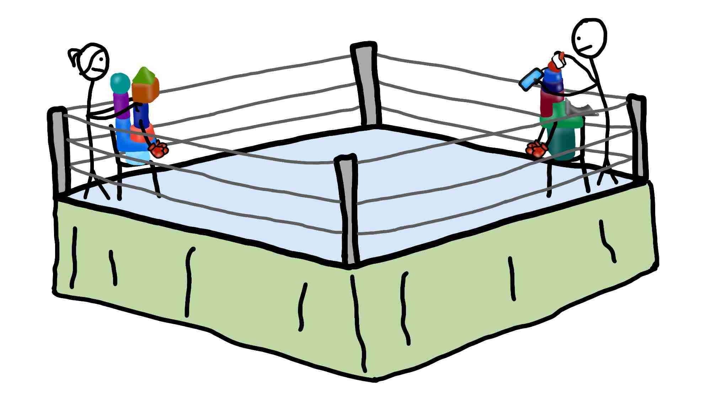

Other times, they’ll engage in dialectic, joining the dissenter in examining their idea.

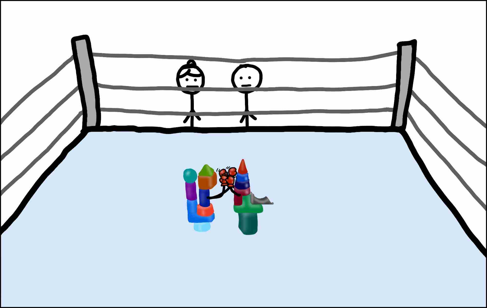

They may even try flipping sides and playing *devil’s advocate*, debating against someone who agrees with them in order to see their idea through another lens.

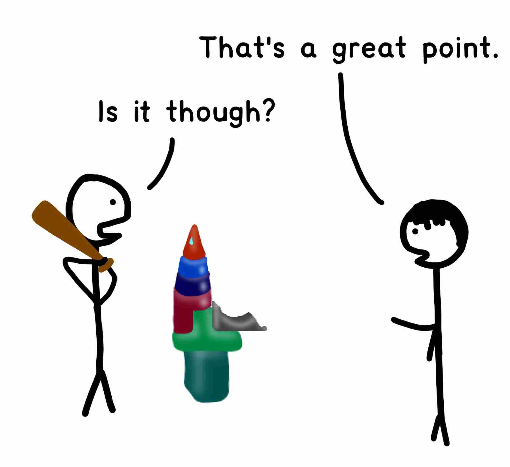

People in an Idea Lab don’t usually take arguments personally because Idea Lab culture is built around the core notion that people and ideas are separate things. People are meant to be respected, ideas are meant to be batted around and picked apart.

Perhaps most importantly, an Idea Lab helps its members stay high up on the Ladder. No one thinks like pure top-rung Scientists all the time. More often, after a brief stint on the top rung during an especially lucid and humble period, we start to *like* the new epiphanies we gleaned up there a little too much, and we quickly drop down to the Sports Fan rung. And that’s okay. It might even be optimal to be a *little* over-confident in our intellectual lives. Rooting for our ideas—a new philosophy, a new lifestyle choice, a new business strategy—allows us to really give them a try, somewhat liberated from the constant “but are we really sure about this?” nag from the Higher Mind.

The Sports Fan rung alone isn’t a problem. The problem is that inviting some bias into the equation is a bit like closing your eyes *for just another minute* after you’ve shut your alarm off for good—it’s riskier than it feels. Getting a little attached to an idea is a small step away from drifting unconsciously into Unconvinceable Land and the oblivion of the rungs down below. We’re pre-programmed to be low-rung thinkers, so our intellects are always fighting against gravity.

This is why Idea Lab culture is so important. It’s a support network for flawed thinkers to help each other stay up on the high rungs.

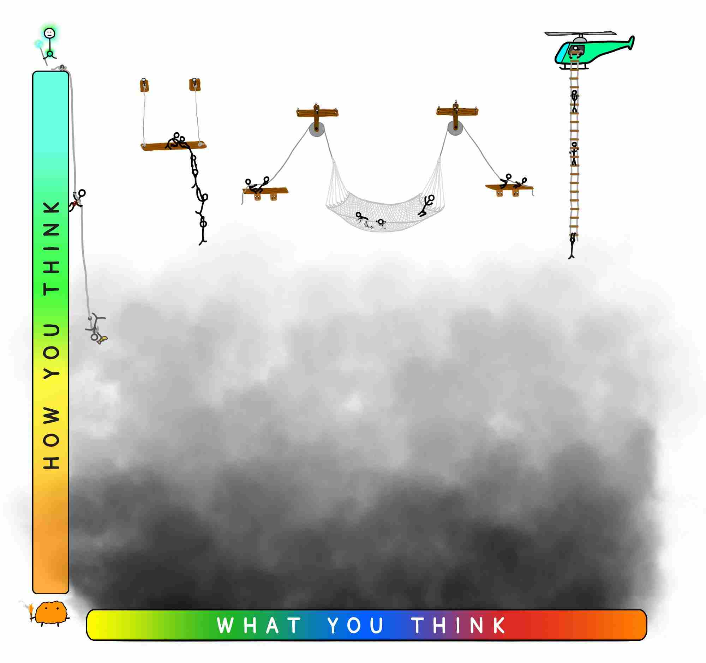

The social pressure helps. If high-rung thinking is what all the cool kids are doing, you’re more likely to think that way.

And the intellectual pressure helps. In an Idea Lab—where people don’t hesitate to tell you when you’re wrong or biased or hypocritical or gullible—humility and self-awareness are *inflicted* upon you. Whenever you get a little too overconfident, Idea Lab culture pulls you back to an honest level of conviction.

All these forces combine to make an Idea Lab a big magnet on top of the Ladder that pulls upward on the psyches of people immersed in it.

But what happens when a group’s Primitive Minds can run things their way?

### Echo Chambers

An **Echo Chamber** is what happens when a group’s intellectual culture slips down to the low rungs: collaborative low-rung thinking.

While Idea Labs are cultures of critical thinking and debate, Echo Chambers are cultures of groupthink and conformity. Because while Idea Labs are devoted to a *kind of thinking*, Echo Chambers are devoted to a* set of beliefs* the culture deems to be sacred.

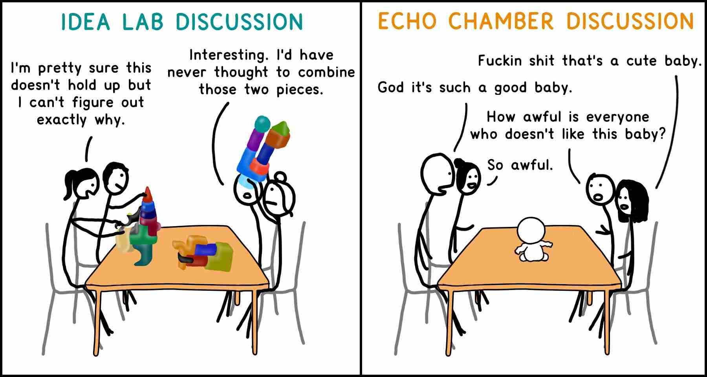

A culture that treats ideas like sacred objects incentivizes entirely different behavior than the Idea Lab. In an Echo Chamber, falling in line with the rest of the group is socially rewarded. It’s a common activity to talk about how obviously correct the sacred ideas are—it’s how you express your allegiance to the community and prove your own intellectual and moral worth.

Humility is looked down upon in an Echo Chamber, where saying “I don’t know” just makes you sound ignorant and changing your mind makes you seem wishy-washy. And conviction, used sparingly in an Idea Lab, is social currency in an Echo Chamber. The more conviction you speak with, the more knowledgeable, intelligent, and righteous you seem.

Idea Labs can simultaneously respect a person and disrespect the person’s ideas. But Echo Chambers equate a person’s ideas with their identity, so respecting a person and respecting their ideas are one and the same. Disagreeing with someone in an Echo Chamber is seen not as intellectual exploration but as *rudeness*, making an argument about ideas indistinguishable from a *fight*.

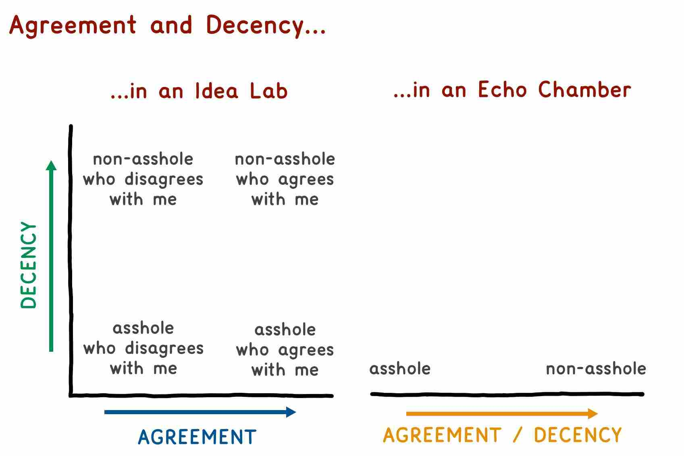

This moral component provides Echo Chambers with a powerful tool for cultural law enforcement: taboo. Those who challenge the sacred ideas are seen not just as wrong but as *bad people*. As such, violators are slapped with the social fines of status reduction or reputation damage, the social jail time of ostracism, and even the social death penalty of permanent excommunication. Express the wrong opinion on God, abortion, patriotism, immigration, race, or capitalism in the wrong group and you may be met with an explosive negative reaction. Echo Chambers are places where you must watch what you say.

An Echo Chamber can be the product of a bunch of people who all hold certain ideas to be sacred. Other times, it can be the product of one or a few “intellectual bullies” who everyone else is scared to defy. Even in the smallest group—a married couple, say—if one person knows that it’s never worth the fight to challenge their spouse’s strongly held viewpoints, the spouse is effectively imposing Echo Chamber culture on the marriage.

Intellectual cultures have a major impact on the individuals within them. While Idea Lab culture encourages intellectual and moral growth, Echo Chamber culture discourages new ideas, curbs intellectual innovation, and removes knowledge-acquisition tools like debate—all of which repress growth.

Spending too much time in an Echo Chamber makes people feel less humble and more sure of themselves, all while limiting actual learning and causing thinking skills to atrophy.

In a broader sense, both primitive-mindedness and high-mindedness tend to be contagious. While Idea Lab culture is a support group that helps keep people’s minds up on the high rungs, Echo Chamber culture pumps out Primitive Mind pheromones and exerts a general downward pull on the psyches of its members.

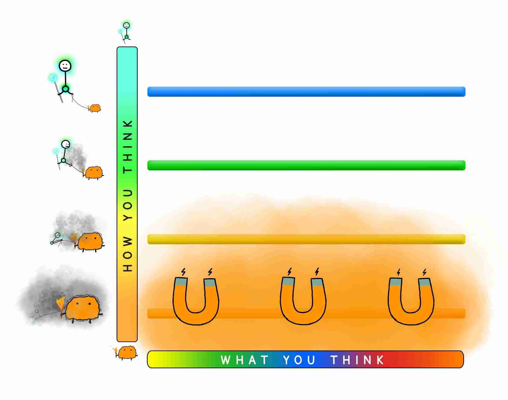

Given the obvious benefits of Idea Lab culture, it’s odd that we ever go for the alternative. We eat Skittles because our Primitive Minds are programmed to want sugary, calorie-dense food. But why do our Primitive Minds want us to build Echo Chambers?

Let’s zoom out further.

## Giants

Billions of years ago, some single-celled creatures realized that being just one cell left your options pretty limited.

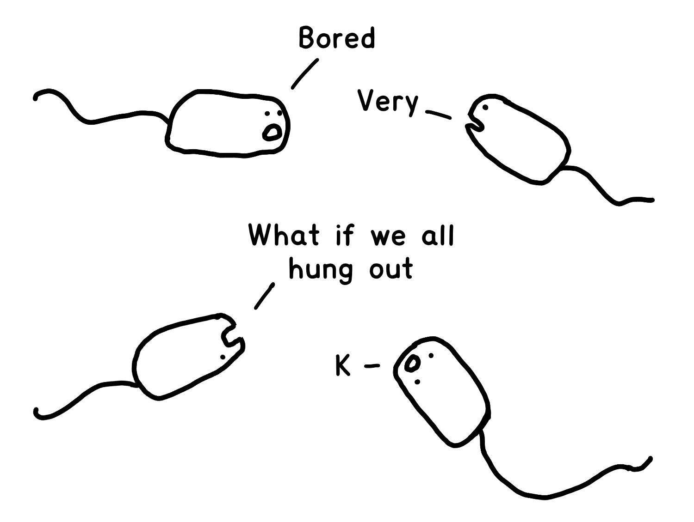

So they figured out a cool trick. By joining together with other single cells, they could form a giant creature that had all kinds of new advantages.

This concept—a bunch of smaller things joining together to form a giant that can function as more than the sum of its parts—is called emergence*.* We can visualize it using an **Emergence Tower**.

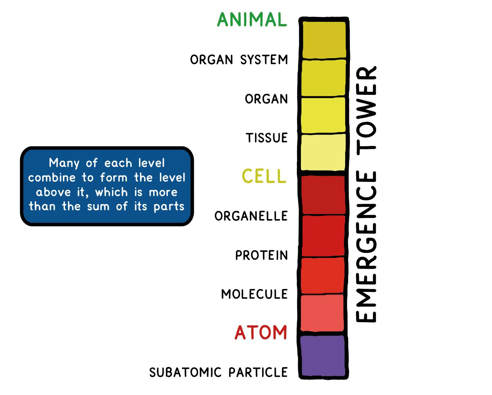

Not long after cells started joining together to form animals, some of the animals discovered that they could go up *another* level of emergence and form even bigger giants made up of multiple animals.

Sometimes, when we see animals cooperating, it seems like they’re being considerate—but that’s missing the bigger picture. The emergence picture.

Take ants and spiders. Ants are furiously loyal. They always put the team first. The ants I’ve gotten to know in my life have a long list of bad personal qualities, but “individual selfishness” isn’t one of them.

Meanwhile, two rival spiders will compete with each other ruthlessly, both entirely self-interested.

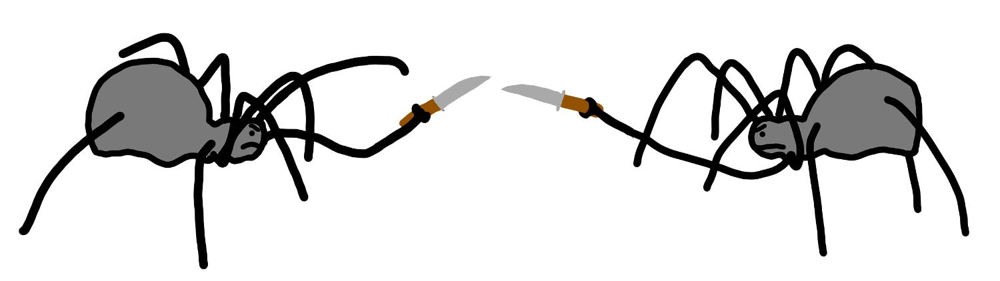

So what’s the deal? Are ants nicer than spiders?

No. It’s just that spiders stop doing the emergence thing at the individual organism level, while ants go up a level higher—to the ant *colony*.

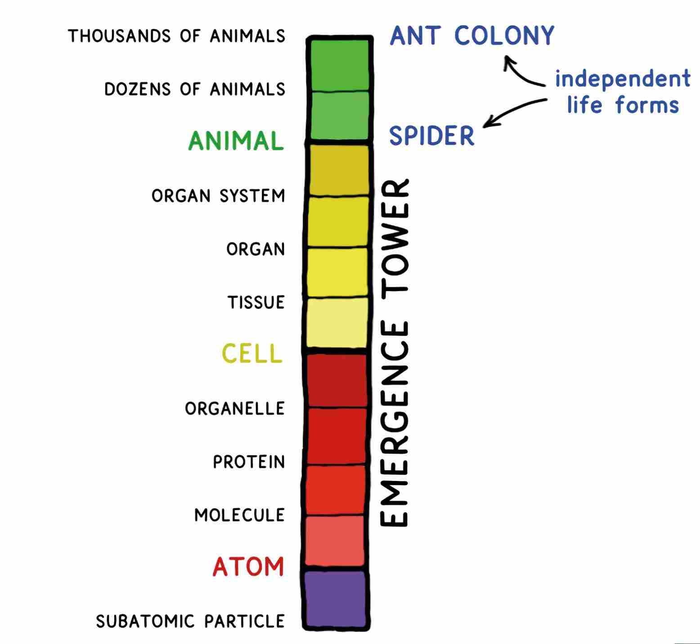

The ant colony is really the “independent life form” of the ant world. If we look at how ant colonies treat other ant colonies, it’s a lot like the way one spider treats another.

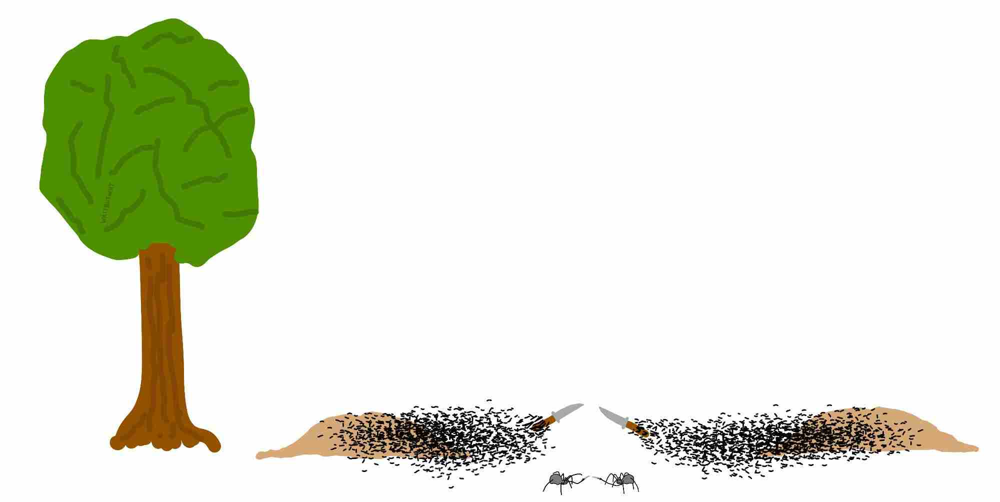

Individual ants in a colony are kind of like the cells that make up your body, which cooperate with each other not because they’re nice, but because they’re part of a bigger life form.

Humans do emergence too—and like all things human, it’s complicated.

First, in the same way we bounce up and down the Ladder, we’re all over the place on the Emergence Tower.

You might wake up in the morning with your psyche firmly on the bottom of the tower, feeling like a lone individual. You head to work, where you brainstorm a project with five other people, becoming part of a six-person thinking machine. After work you join a political protest outside, losing your sense of self in the exhilaration of being a tiny piece of a thousand-person megaphone. Depending on the situation, we can act like spiders *or* ants, and everything in between. It’s as if there’s an elevator in the Emergence Tower, and our minds take regular trips up and down.

Second, humans form weird giants. There are all kinds of ways animal species “glue” together into higher-emergence giants. Simple creatures like ants and bees achieve cooperation on a mass scale, which comes at the expense of individual autonomy. Complex animals like wolves, lions, and dolphins are more individually independent, but they also have smaller families, which typically limits the size of the “giant” they can make.

Early humans were similar to other complex animals—limited to small, tightly knit tribes. But at some point along the way, we figured out how to hack the system. By uniting through shared beliefs, shared culture, shared values, or shared interests, we shattered the previous ceiling on giant size and achieved something other complex animals couldn’t: mass cooperation.

When you take the already impressive power of human cognition and combine it with the capability of mass cooperation, you have a species with superpowers.

But here we come back to our Ladder, because the human Higher Mind and Primitive Mind each have their own way of doing emergence. Idea Labs and Echo Chambers are more than just group cultures—they’re two very different ways to build a human giant.

### High-Rung Giants: Genies

Your brain is a giant of its own, made up of a network of 86 billion neurons. An isolated neuron is pretty useless.

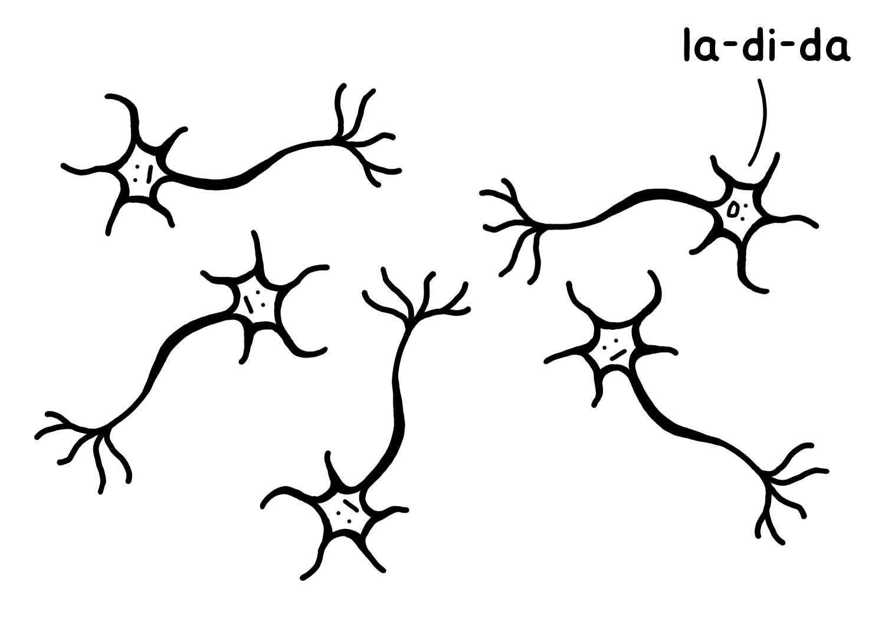

But by *communicating* with one another, a group of neurons can move upward on the Emergence Tower and combine into a single thinking system that’s far more powerful than the sum of its parts: the brain**.**

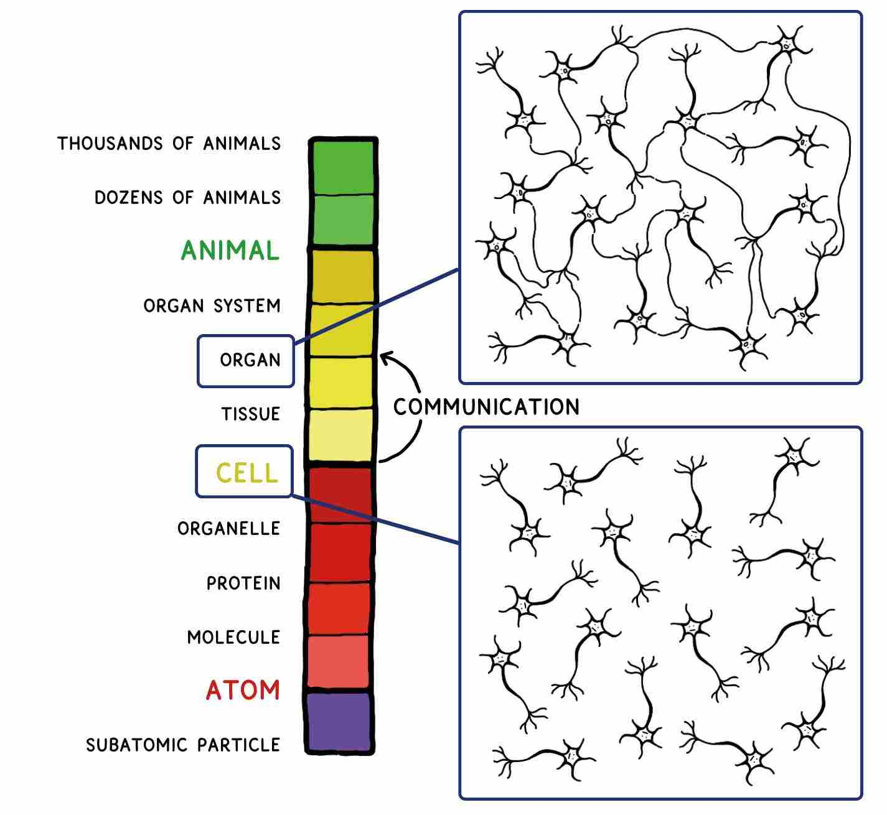

A parallel phenomenon happens a few floors up the tower, on the human level. A bunch of people together, but not communicating, is just a bunch of individual brains in the same place. Language is so important because it allows individual brains to *connect*, like neurons, to form a larger thinking system: a communal brain.

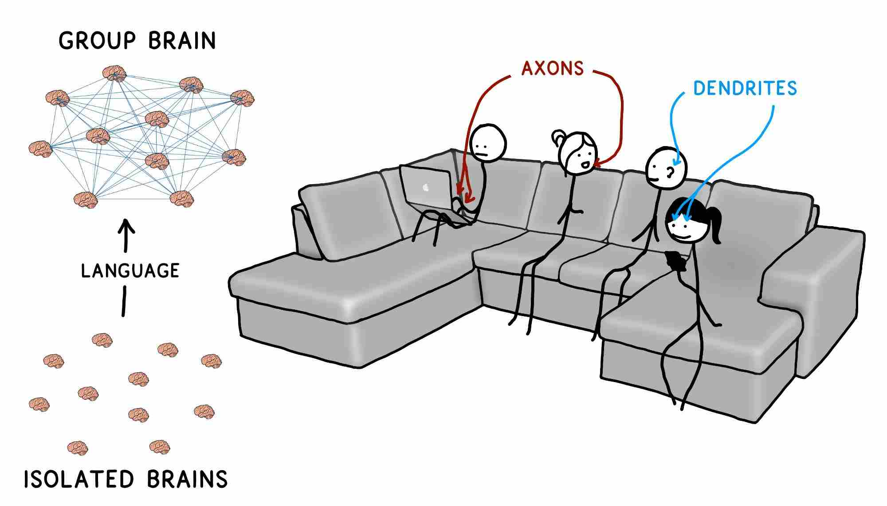

In his book *The Righteous Mind*, social psychologist Jonathan Haidt talks about how group communal brains work:

If you put individuals together in the right way, such that some individuals can use their reasoning powers to disconfirm the claims of others … you can create a group that ends up producing good reasoning as an emergent property of the social system. This is why it’s so important to have intellectual and ideological diversity within any group or institution whose goal is to find truth.

This is the magic of Idea Lab culture. While individual thinking suffers from bias, a *diversity* of biases helps the communal brain reduce blind spots. In a culture where changing your mind is encouraged, new findings spread quickly through the system, and all it takes is one member discovering a falsehood for the whole group to reject it. When disagreement is encouraged, new ideas can be tested as they’re being formed, in real-time, combining the knowledge-building efforts of each person into a single, dynamic process.

The result is a multi-mind thinking system that’s superior to any of its individual members at learning new things and separating truth from fiction. Let’s call this thinking system **a genie.**

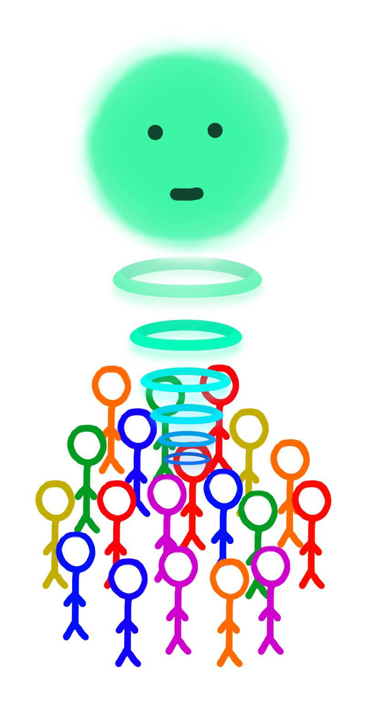

Because genies convert disagreement into higher-level collaboration, there’s nothing stopping them from endlessly scaling up. For example, a research institution is an official Idea Lab, where practices like peer review generate a hyper-efficient genie. But then, research centers from different universities or even different countries can criticize or build upon each other’s findings, allowing many genies to combine forces into a global supergenie.

None of this collaboration comes at the expense of the individual. Quite the opposite, as genies flourish when its members are independent thinkers. So people in a genie get the best of all emergence worlds: they can simultaneously thrive as free individuals and as smaller pieces of a larger system.

This is the Higher Mind’s way of building giants. When Primitive Minds take the reins, we end up with an entirely different kind of beast.

### Low-Rung Giants: Golems

In 1245, the Pope approached a minister named Giovanni da Pian del Carpini with a request.

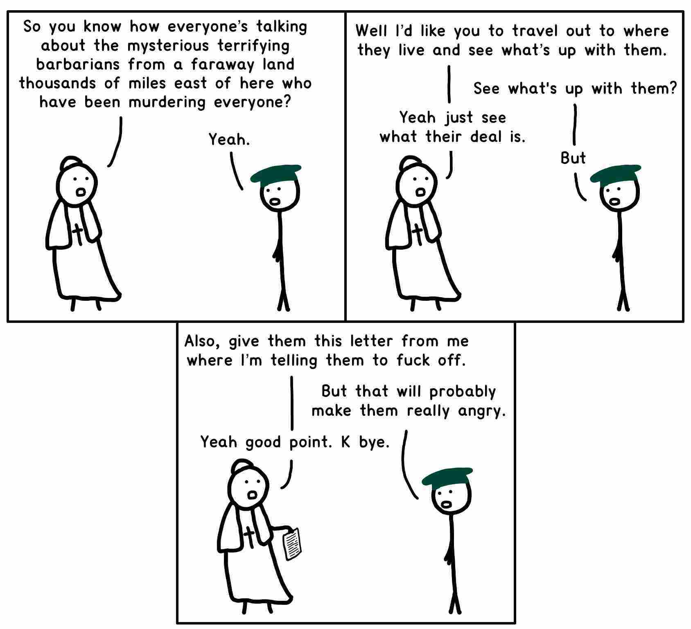

So Giovanni got on his horse and spent four months traveling 3,000 miles to Mongolia—a place almost no Europeans had ever set foot (Marco Polo wouldn’t begin his famous voyage for another 26 years). Somehow Giovanni survived the whole ordeal and, after spending four months with Mongols, made his way back to Europe.

It turns out the Mongols were not overhyped. Giovanni wrote a book about how they lived and how they conducted their conquests.

According to Giovanni, the Mongol army was organized using a decimal system that worked like this:

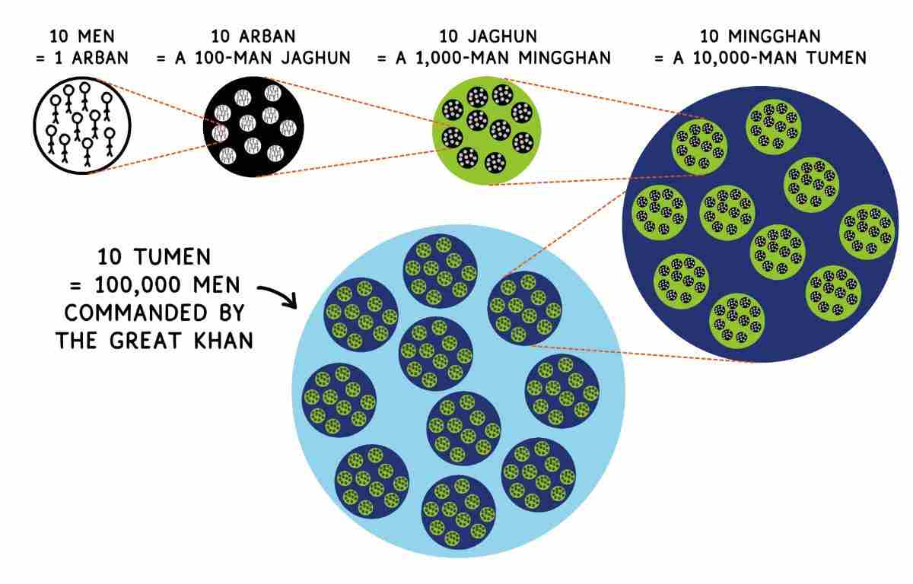

Giovanni wrote about the incredibly strict discipline Mongol rulers imposed on their army:

When they join battle against any other nation, unless they do all consent to retreat, every man who deserts is put to death. And if one or two, or more, of ten proceed manfully to the battle, but the residue of those ten draw back and follow not the company, they are in like matter slain. Also, if one among ten or more be taken, their fellows, if they fail to rescue them, are punished with death.

Pretty happy I’m not in the Mongol army. But I’m even happier to not be in the *path* of the Mongol army. Historian J. J. Saunders writes:

[Genghis] was adept at psychological warfare of the most horrific kind. He deliberately set out to create a reputation for ferocious terror in the expectation (often realized) of frightening whole nations into surrendering without resistance. There is something indescribably revolting in the cold savagery with which the Mongols carried out their massacres. The inhabitants of a doomed town were obliged to assemble in a plain outside the walls, and each Mongol trooper, armed with a battle-axe, was told to kill so many people, ten, twenty, or fifty. […] A few days after the massacre, troops were sent back into the ruined city to search for any poor wretches who might be hiding in holes or cellars; these were dragged out and slain.

How many people can you name who lived in the 1200s? Like two, right? But you know about Genghis Khan. Everybody knows about Genghis Khan. Because Genghis Khan built one of the biggest, baddest golems in human history.

In mythology, a **golem** is a big dumb-looking monster, which makes it a perfect representation of the low-rung giant.

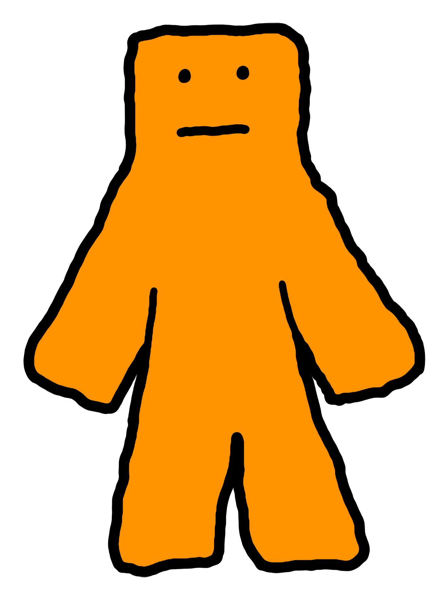

If the genie is the product of human collaboration, the golem is the emergent property of human obedience. Golems are what happen when humans act like ants.

Ant behavior has two components: strict conformity within the colony and total ruthlessness when dealing with other colonies.

On the internal conformity side, Mongol leaders viewed their army like a machine. If a member of a 10-man unit deserted, they saw that unit as a defective part in the machine that couldn’t police itself, so they tossed it out by killing the whole unit. This may sound insane to us, but if your only goal is to create the perfect golem, this is simply like cutting out a cancerous tumor before it spreads.

On the external ruthlessness side, the Mongol army had clear rules for settled societies that lay in its path: you’re with us or against us. If you immediately surrender, you’ll be allowed to join our forces and live. If you resist, we will destroy you, down to every man, woman, and child.

I use the Mongols as an example because they’re the extreme version of a human golem. But golems are everywhere. When a group of people exhibits a combination of strict conformity internally and an Us vs. Them mindset externally—militaries marching in unison, activists chanting a slogan, citizens raising a fist or saluting en masse, or just a group of people being super Echo-Chamber-y—that’s a group of people in golem mode.

The human cognitive weaknesses a genie tries to mitigate are the golem’s strengths. Confirmation bias tricks like cherry-picking, motivated skepticism, and motivated reasoning benefit hugely from economies of scale, as the snappiest and most convincing articulations of the sacred ideas spread quickly through the system. Individual biases, all pointing in the same direction in an Echo Chamber, scale up to make the golem’s ultra-biased macro-mind. And while individual minds inside a golem may have doubts about the sacred ideas, the social pressure of Echo Chamber culture keeps the giant as a whole steadfast in its beliefs. If the genie is the ultimate Scientist, the golem is the ultimate Zealot—a giant that’s totally certain of itself, totally unable to learn or change its mind, and *worse* at thinking than the average human.

But golems aren’t made to be good at thinking or finding the truth. The golem’s specialty is brute strength. It’s a group’s way of turning itself into a big scary monster.

We talked about how genies can seamlessly combine their forces with other genies to create supergenies. Golems scale up too, but in a very different way—based on conflict. Golems don’t just prefer the Us vs. Them mindset, they rely on it. The presence of a rival golem is a critical part of what holds them together. The way golems combine forces is by sharing a common enemy. If a group of golems vanquishes their common enemy, the alliance will often fracture into smaller rival golems to maintain the Us vs. Them structure.

Let’s try to jam all of this into a chart:

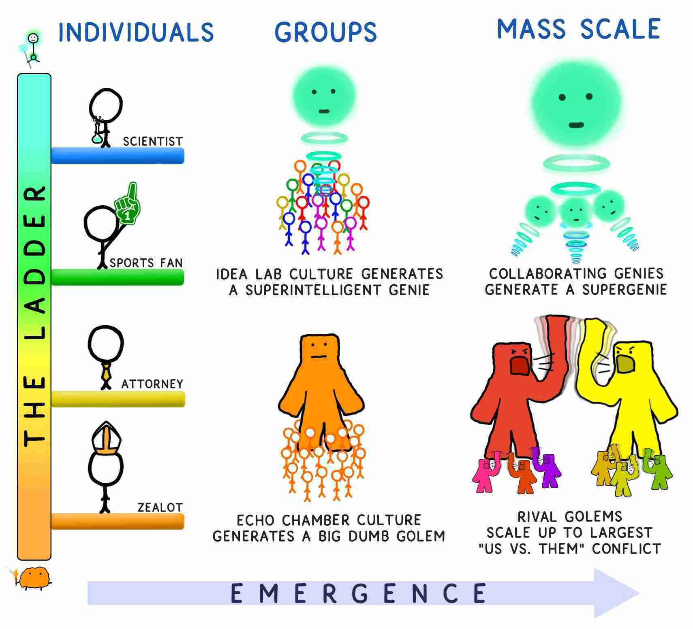

On the high rungs, individuals can thrive and grow, and human intelligence and knowledge can scale up exponentially. The low rungs squash individuality, breed delusion, and sacrifice group intelligence in favor of brute strength and large-scale conflict.

Which brings us back to the same question: given that the high rungs are so awesome, *why are we so inclined to be down on the shitty low rungs?*

It’s what our Primitive Minds are programmed to do because it was the best way to survive in our distant past. Low-rung thinking, low-rung culture, and low-rung giant-building are all ancient survival behavior—behavior that was necessary a long time ago but today seems a lot like moths flying toward streetlights.

When I look out at the world today, I see a rising epidemic of low-rung thinking and behavior. Too many of the Ladder struggles that exist in our heads, in our communities, in our political parties, and in our societies are slipping in the wrong direction.

This is the framework we’ll be using throughout the book, and it can also serve as our compass. In the introduction, I compared the path of our species to a big organism trudging its way up a great mountain ridge, with steep cliffs on either side. I see the high rungs as our source of stability and positive progress, and low-rungness as the force pushing us toward those cliffs.

To give ourselves the best chance to stay up on that ridge, we need to see low-rung psychology where it resides and figure out how to outsmart it.

# Interlude

## The Liberal Games

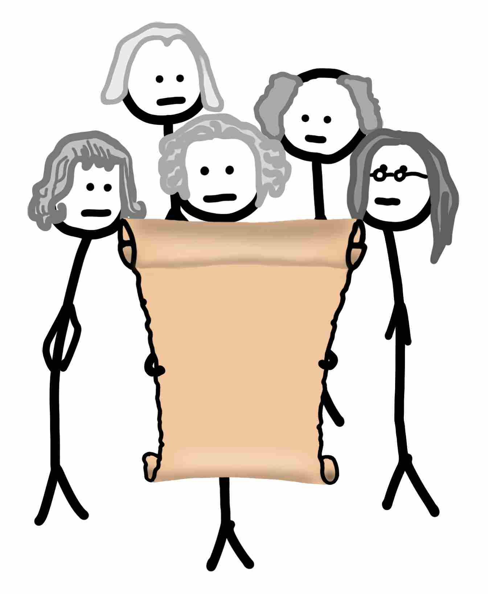

Earlier, we met a bear and a bunny, in a situation that didn’t go very well for the bunny.

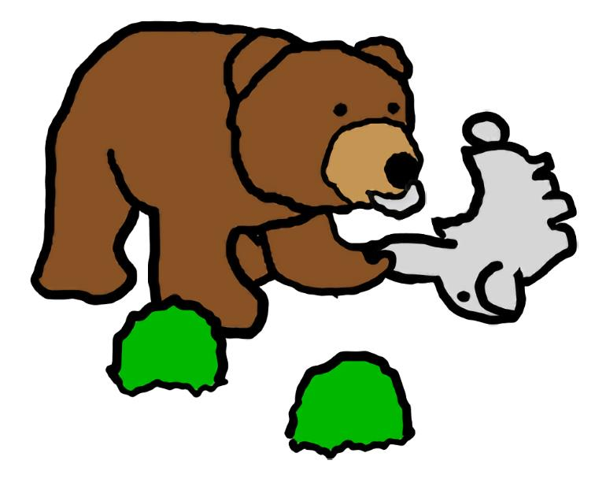

The animal world is a stressful place to be because there are no morals, no principles, no one to make sure things are fair. The rules are simple:

**Everyone can do whatever they want, if they have the power to do so.**

If the bear wants to eat the bunny, it can—as long as it can catch it. If the bunny prefers to keep being alive, it can—as long as it’s fast enough. And that’s about all there is to it.

Let’s call this **the Power Games**.

For a long time, humans were like the bunny and the bear—living in some forest or grassy plain, trying to be skilled enough to feed themselves and avoid being eaten, struggling through the Power Games like all the other animals.

But the mass cooperation hack changed everything. It gave humans a tool better than any spear or bow and arrow: the genie.

If you zoom out on human history, you see over a hundred thousand years of people living in small tribes—a time during which knowledge and technological advancements happened very slowly. Then came the agricultural revolution, which brought humans together into much larger cooperative groups—and the same species started performing magic. Knowledge and technology raced forward and built vast civilizations. The people hadn’t gotten smarter—but their genies had.

Larger societies yielded genies with ever bigger brains—more people comparing notes, sharing learnings, and debunking misconceptions. The advent of writing allowed brains to communicate across time and space, enhancing the memories of genies and making them more clear-headed.

The civilization you’re living in today, with all of its incredible technology, wasn’t created by humans. Humans aren’t nearly smart enough to do that. The amazing world around you was created by genies.

Mass cooperation got humans out of the food chain—an accomplishment that would make any bunny or bear envious. But mass cooperation has a dark side. The same emergence hack that gave us genies also generated a scarier superpredator than any bear, lion, or shark: the golem.

As everyone who fell into the expansionary path of the Assyrians, Persians, Macedonians, Romans, Huns, Muslims, Christians, or Mongols could tell you, if a golem comes your way, and you can’t put up a strong enough defense, you’re finished. You can live in a flourishing high-rung utopia with clear, civilized rules, but when a golem arrives at your gates, none of those rules matter if you can’t beat the golem at the Power Games.

For most of our history, the only way to defend yourself against the world’s golems was to be able to form an even bigger, fiercer golem yourself. Which is why much of the past 10,000 years was golems fighting other golems, with the biggest, meanest golems ruling the day.

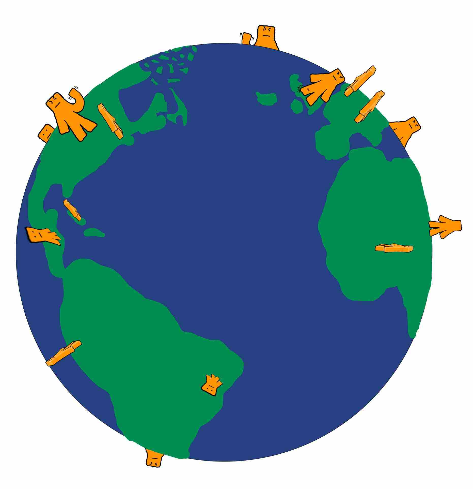

The Primitive Mind was programmed for survival in the Power Games, and this is why we all come programmed to snap into golem mode at the drop of a hat. It’s the great catch-22 of our species: the biggest threat to humanity is low-rung humanity, and low-rung humanity persists because it has often been the best defense against this very threat.

To truly free ourselves from the stresses of the animal world, we’d have to find a way to outsmart the scariest superpredator of all. A few hundred years ago, a group of rebellious thinkers started kicking around a plan they believed might be able to do just that.

* * *

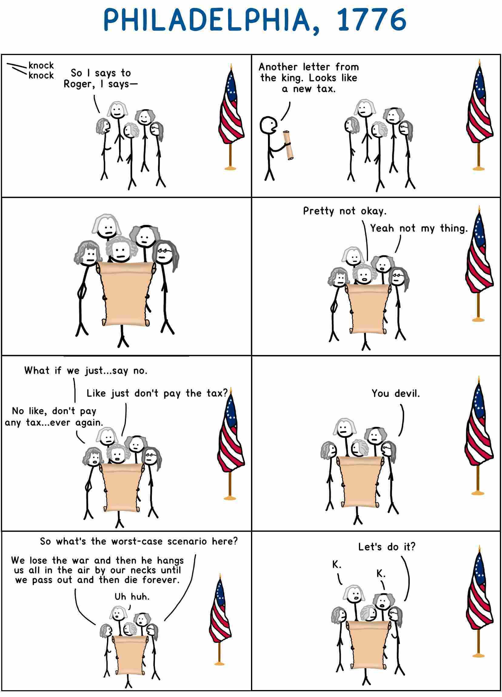

Rebellion wasn’t anything out of the ordinary in 1776, a time when many nations were on the “tyranny → coup → chaos → tyranny” merry-go-round. What was unusual about the American forefathers was their long-term plan.

Normally, the people rebel because they’re annoyed about being powerless and they want to turn the tables. So a rebellion topples the tyrant, some chaos ensues, some friends murder friends, and when the dust settles, there’s a new tyrant. But this was the late 1700s, and the forefathers were Enlightenment Kids.

During the Enlightenment, philosophers in parts of Europe had started talking about a new story.

The story, building on ideas that had been kicking around Western countries ever since ancient Greece, explored concepts like human rights, legal equality, tolerance, and freedom. The Power Games, the story went, were unpleasant, unfair, unproductive, and unnecessary—and they were fundamentally immoral, violating the most sacred elements of being a human.

The story was like a mind virus, and it started to spread. Before long, it had crossed the Atlantic and taken hold in minds throughout the American colonies, turning well-behaved English subjects into dissatisfied Enlightenment Kids. The American forefathers were coming of age right in the middle of all of this, and they decided to take action.

So they sent a letter to London, explaining the new situation.

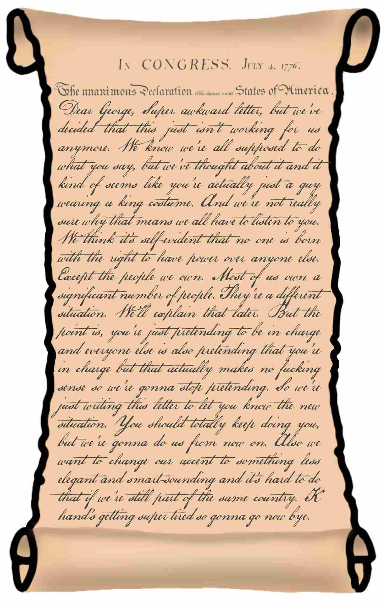

King George and his parliament were terribly unamused by the development, and the British waged war. A 44-year-old George Washington found himself in charge of fending them off—which, hilariously, his mom apparently hated.

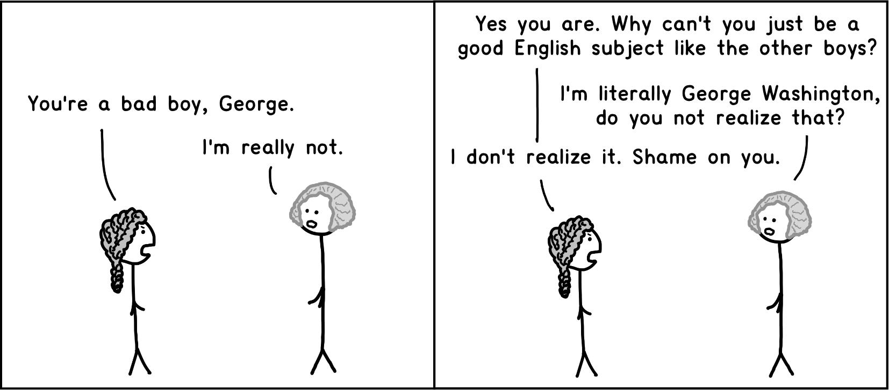

But George didn’t let that stop him, and he and his crew, with the help of a delighted France, held off the British long enough that they finally gave up and headed back across the ocean.

The Americans had won their independence, leaving them with a rare opportunity: a chance to create a new kind of country, from scratch—a chance to take the “here’s what *I’d* do if I could start my own country” fantasy and actually play it out. It was time to put the Enlightenment to the test.

## Designing the American Giant

We can boil human activity down to a simple operation.

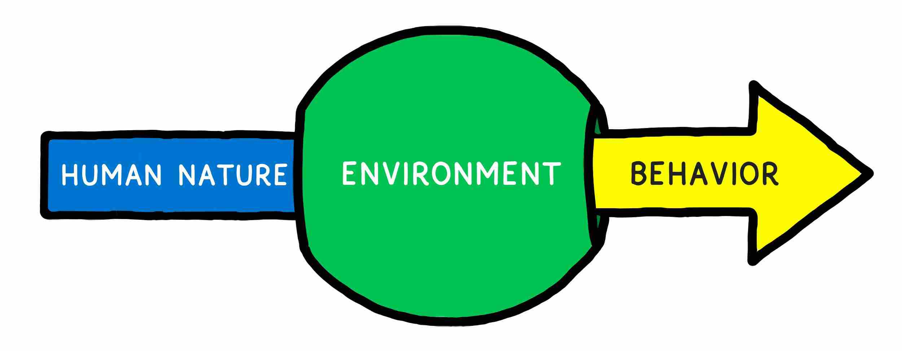

Human nature is a constant, and when you put that constant into different environments, it produces different behavior. That makes environment the independent variable. And human environments are complicated—they include the physical environment, the surrounding people and cultures, the prevailing beliefs and belief systems, and the laws and rules.

Many kings, emperors, and warlords of the past have done environments the Power Games way, governing with totalitarian power, strict laws, and harsh penalties in order to generate controlled and obedient behavior.

Thinkers of the Enlightenment believed they could improve upon this. They believed the same good behavior could be generated with a gentler, fairer, more hands-off form of government. I call this system **the Liberal Games.**

Instead of being ruled by the cudgel, Liberal Games citizens would be governed by a set of *guiding liberal principles* inspired by Enlightenment philosophy.

The U.S. has long been embroiled in conflict about how well the country has actually lived up to its promises. In some obvious ways—like the fact that the country’s full set of human rights initially applied only to white men—it certainly has not. We’ll get into all that later in the book. The first step, though, is to brush up on what the country’s promises even are. That’s what we’re doing in this chapter.

America’s founders formalized this with the U.S. Constitution: a set of rules that, rather than serving any particular goal or outcome, would be sacred *in themselves.* The Constitution describes a sacred *process*—a set of inviolable boundaries within which any and all national or individual goals would need to be accomplished. It outlines the means by which leaders would be elected, the means by which conflicts would be settled and people who broke the rules would be punished, the means by which the country could pass bills and make laws and declare war—all processes that emerged from Enlightenment values. Most importantly, the Constitution would protect the people from their own government by strictly limiting its power. The government would be the grand enforcer holding the operation together, but its use of force would be restricted beyond its core tasks.

Another critical component of the Liberal Games pertains to freedom.

One of the worst parts about living in the Power Games is the lack of freedom. Imagine that you’re living with 100% freedom, and that all of your fellow citizens are also living with 100% freedom.

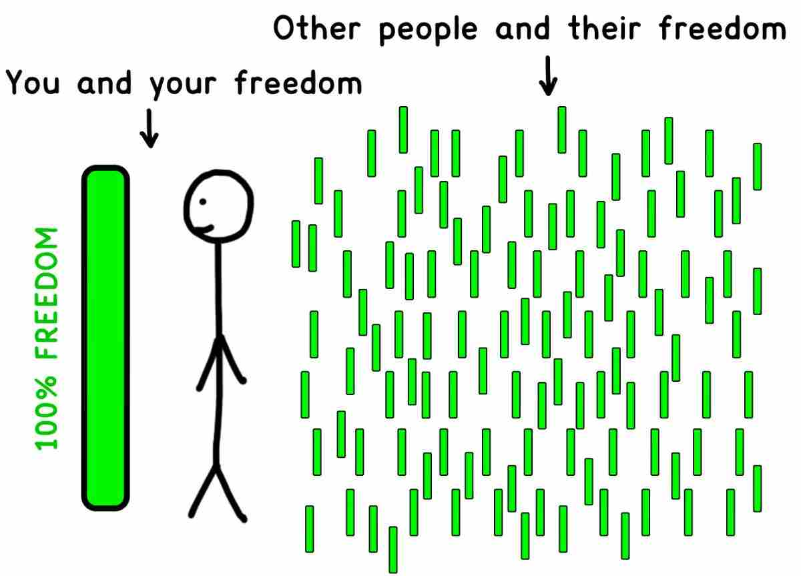

If everyone got along perfectly all the time, this might be able to last. But people have never gotten along perfectly all the time. In the Power Games, when there’s a conflict, the rule of power kicks in and whoever has the biggest cudgel gets their way. If someone with the power to bully you decides to restrict an element of your freedom, there’s nowhere to turn and no one you can appeal to.

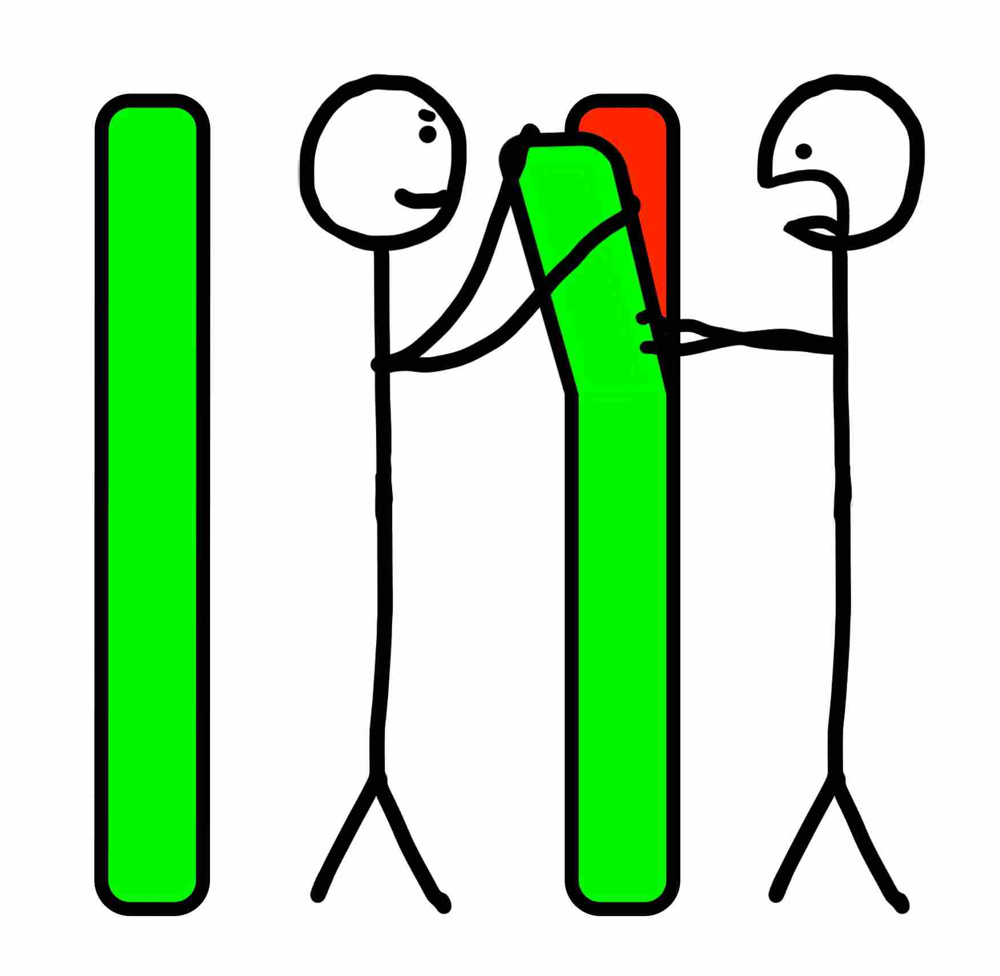

Then comes along an even bigger bully, who gets *their* way. After a few rounds of this, the biggest bully of all is declaring the rules everyone will live by. Depending on who that person is and how they feel about you, you may find yourself with almost no freedom at all.

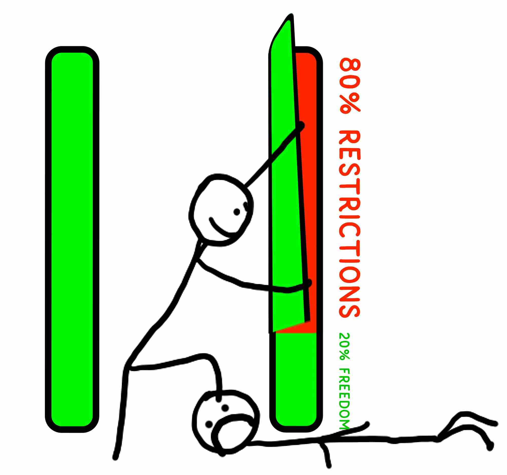

That’s why the typical Power Games environment has a few freedom winners and lots and lots of freedom losers. Your country ends up looking like this:

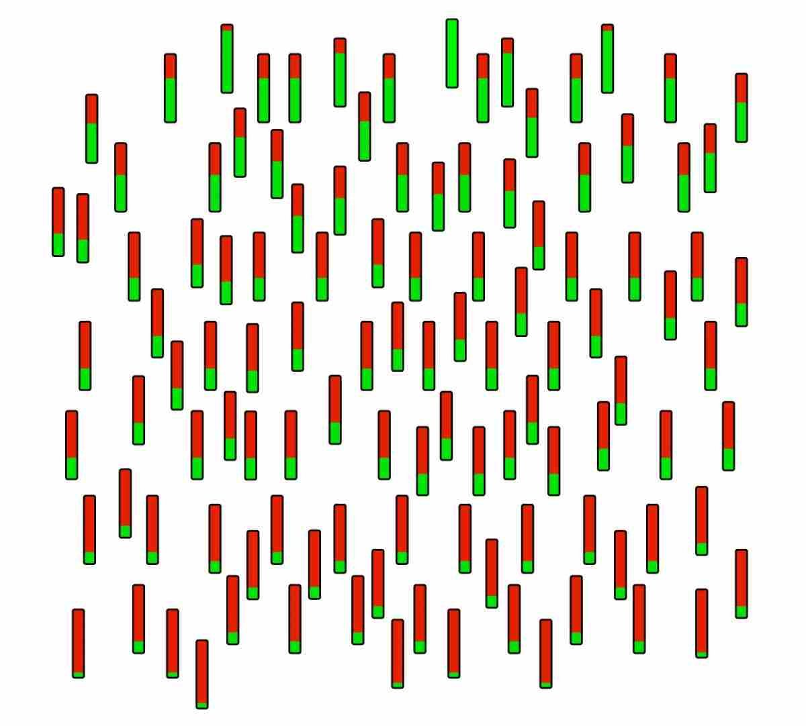

Enlightenment thinkers focused heavily on the freedom problem—a problem that the Liberal Games addresses by changing the Power Games rule—

**Everyone can do whatever they want, if they have the power to do so**

—into a compromise that goes something like this:

**Everyone can do whatever they want, as long as it doesn’t harm anyone else.**

Or, as it has been said:

*Your right to swing your arms ends just where another person’s nose begins.*

In exchange for handing over the cudgel and giving up the freedom to oppress others, you could live a life entirely free from anyone oppressing you. Pretty good trade, right? In the Liberal Games, no one would be *completely* free, but *all* citizens would be mostly free:

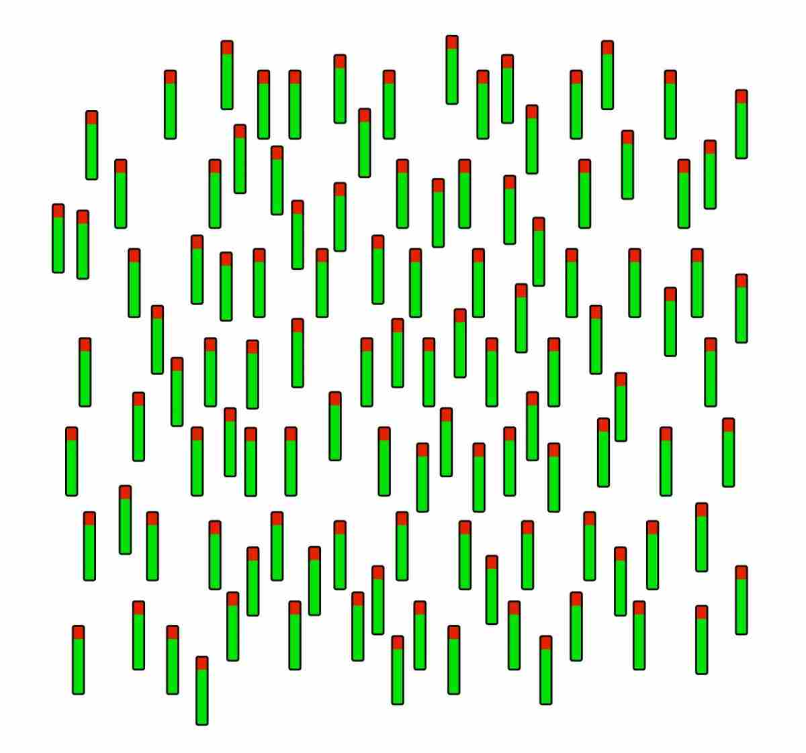

This compromise has two points baked into it. The first point—*everyone can do whatever they want—*describes what citizens *can* do. Their rights. The second point—*as long as it doesn’t harm anyone else—*describes what citizens *cannot* do. Their restrictions. The U.S. government would be responsible for both protecting citizen rights and enforcing restrictions.

Rights and restrictions are mutually exclusive: protecting citizens from a certain kind of behavior is also a decision to prohibit that behavior. Likewise, every freedom granted to citizens is something citizens will have to live with others doing. That’s why Liberal Games freedom isn’t really *freedom* as much as it’s a *freedom-safety compromise.* What matters is *harm*: if an action is harmful, citizens must be protected from it; if it’s not harmful, it’s a right that must itself be protected.

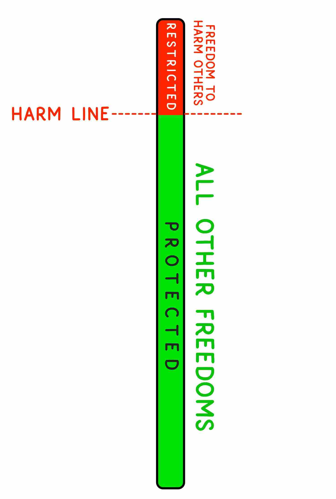

The specific definition of the harm line has been articulated by decades of judicial rulings, but at its core is the Enlightenment philosophy that individuals have a fundamental right to life, liberty, and property.

We can imagine it as two circles surrounding every citizen: a red circle of safety and a green circle of rights.

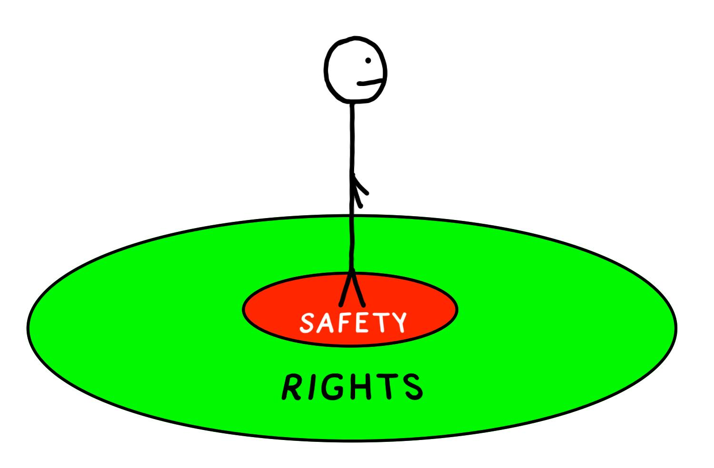

A person’s green circle would give them a tremendous amount of freedom rarely enjoyed in the Power Games. But the second someone’s green circle invaded anyone else’s *red* circle, they’d be breaking the law and the government would be obligated to step in.

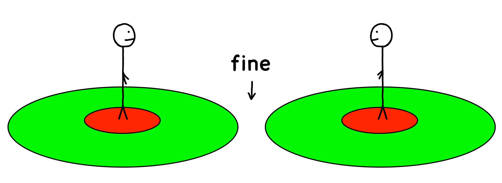

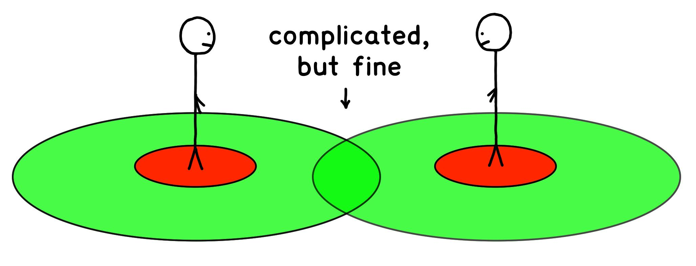

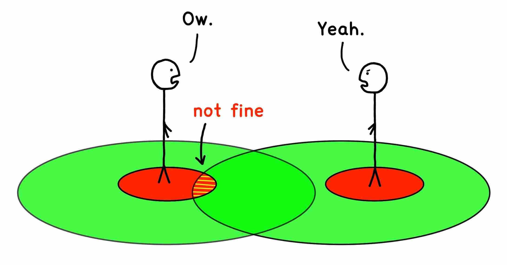

Alongside Liberal Games rules about freedom were rules of equality. Enforcing equality of outcome, or an equal distribution of resources, would require a controlling government and a large sacrifice of individual freedom—which fundamentally conflicted with the Founders’ vision and the spirit behind the Liberal Games. Instead, they aimed for another compromise, this one between freedom and equality: U.S. citizens would be *equal under the law* and enjoy *equality of opportunity*. (The extent to which this is actually what happens in the U.S. is, of course, another story.)

Thinkers of the Enlightenment believed that the Liberal Games combination of freedom, safety, and equal opportunity would go beyond satisfying core philosophical tenets and generate a brilliant side effect: *fantastic productivity*.

The Liberal Games are driven by human nature, just like the Power Games are. But in the Liberal Games, a key limitation is added into the environment: *You can’t use physical force to get what you want.* Where the Power Games did business by way of the cudgel, the Liberal Games would be all about persuasion*.*

If I want something you have, but I’m not allowed to get it by physically bullying you, then the only option I’m left with is to get you to give it to me *voluntarily*. And since you’re self-interested too, the only way you’ll do that is if I can come up with a “carrot”—a piece of value I can offer—that you want more than the resource I want from you.

Removing the cudgel from the game-playing options (or, rather, adding in harsh-enough penalties for it that coercion becomes an undesirable game-playing strategy) changes the game from a contest of who can be the scariest, the most dangerous, and the most intimidating, to a contest of who can provide the most *value* to their fellow citizens.

Two basic examples:

In the *economic* Liberal Games, any citizen can theoretically vie for wealth. You’re free to apply for a job or start a business—but for your *pursuit* of wealth to turn into *actual* wealth, you’ll need employers or customers to volunteer to trade their money for the value you can provide.

In the *political* Liberal Games, any citizen can run for office and vie for the power to allocate government muscle and funding. But to actually *acquire* that power, you have to convince other citizens to vote for you.

Without the right laws, human selfishness gets out of hand and quickly overruns everything, which is why the Primitive Mind dominates the Power Games. But the Liberal Games turn the tables on the Primitive Mind, forcing it to play by Enlightenment rules.

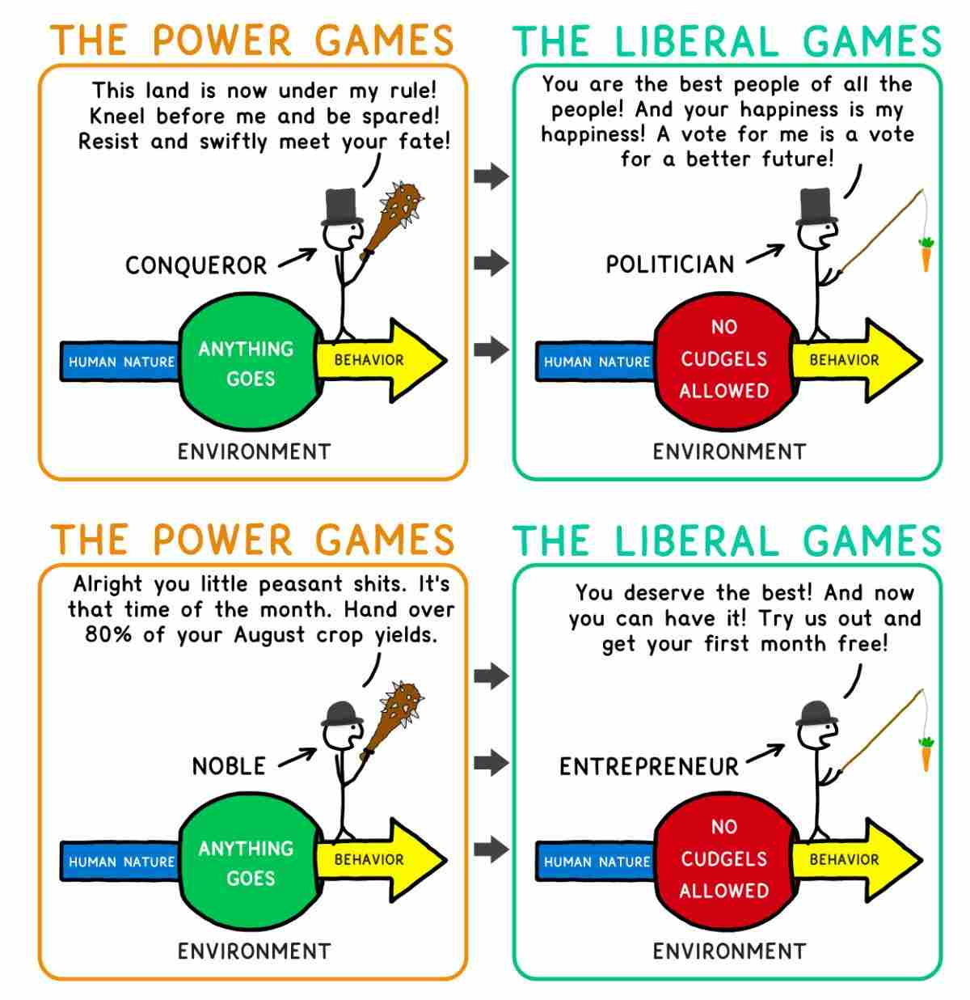

Rather than try to repress the nation’s Primitive Minds, Enlightenment philosophers believed the Liberal Games would transform the fires of human selfishness into an inexhaustible, self-regulating, self-propelling *steam* *engine*.

On a day-to-day basis, the Liberal Games would make high quality of life a self-perpetuating phenomenon. As Adam Smith put it, “It is not from the benevolence of the butcher, the brewer, or the baker, that we expect our dinner, but from their regard to their own interest.”

Over the long run, Enlightenment thinkers believed the Liberal Games would yield a giant forward arrow of progress and prosperity that would benefit all citizens. Today’s hot showers and antibiotics and airplanes and mobile phones—page-1,000 luxuries the wealthiest people of the 1700s could only dream of—are testaments to the effectiveness of the Liberal Games. The genius of the Liberal Games is that it doesn’t repress the Primitive Mind but redirects its energies toward productive means, while preventing those energies from conquering the society.

But perhaps the most important development to emerge from the Enlightenment was the principle of free speech. America’s free speech laws would open the gates to another Liberal Games market: the marketplace of ideas, where anyone could vie for attention and influence and over time, the cream would rise to the top. Free speech would allow citizens to use golems to achieve their goals, but those golems would have to play by liberal rules—drawing their power from mechanisms like political protest and boycotts, not from physical force.

The Founders knew that they didn’t have all the answers. They knew that, in the decades and centuries that would follow, the world would change. They were wise enough to know that no matter how smart they were, their country was a first draft—United States 1.0. The U.S. was a promising child who would need to grow up into a more perfect union. With a mysterious, foggy future ahead, the Liberal Games would give the new nation a way to figure things out as it went.

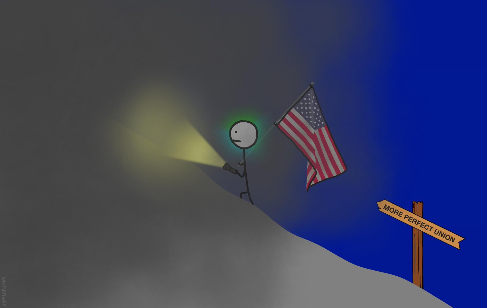

But when you’re dealing with humans, nothing is ever easy.

Taking the human out of the Power Games is one thing. Taking the Power Games out of the human is quite another. While the Liberal Games are the official way of doing business in the U.S., at the core of every U.S. citizen and government official runs a piece of primitive software that speaks a more ancient language. Enlightenment-born constitutions put the Primitive Mind in a cage, but just how strong are those bars?

In his book *The Constitution of Knowledge*, Jonathan Rauch reminds us that “the written U.S. Constitution is only words on paper; the real Constitution is a dense system of explicit and implicit social rules, many of which are not written down.” If the Liberal Games is a brick wall, and the written Constitution provides the bricks, this dense system of social rules—of liberal *norms*—is the mortar that glues the bricks together and gives the wall its strength. No matter how many written rules there are, it is the citizens’ ability to uphold liberal norms that determines the fate of the country.

This is why American history is, above all, the story of a nation’s struggle against itself. The eternal tug-of-war that goes on in our heads and in our communities also rages in the mind of the big American giant. Let’s see what it’s made of.

# Chapter 2

## Politics on the Ladder

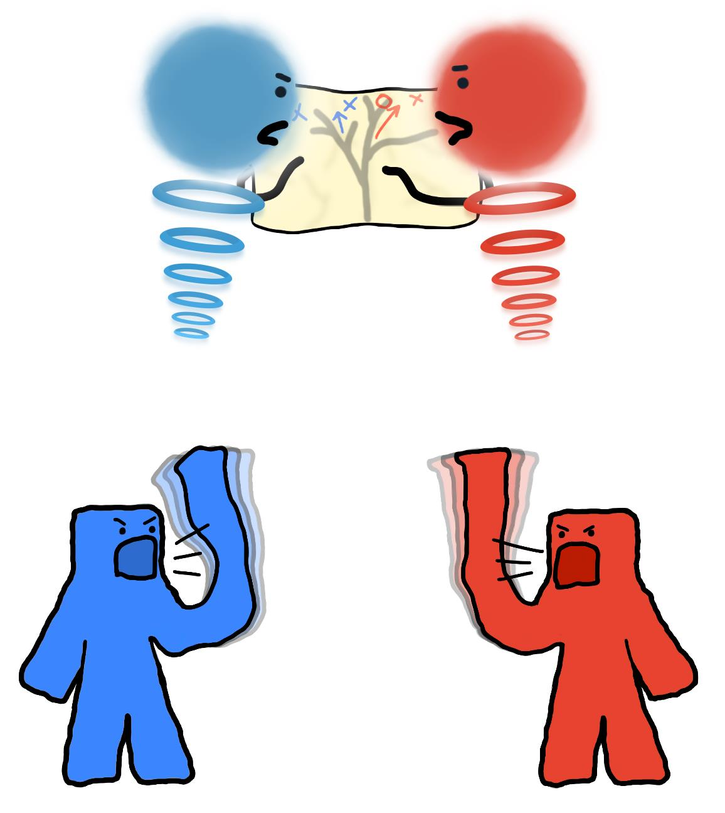

Knowledge of human nature is the beginning and end of political education.

—Henry Adams

In the U.S., we talk about the political landscape like this:

It’s a two-party system, with the red conservatives on the right, represented by the Republican Party, and the blue progressives on the left, represented by the Democratic Party. This is a simplification: there are nuanced differences between, say, libertarians and social conservatives, or socialists and more traditional progressives. But these still all fall under the “What You Think” umbrella, which in our framework makes them all equally one-dimensional.

### “Liberal” vs. “Progressive”

In the U.S., we often use the words “liberal” and “progressive” interchangeably to mean “politically left.” I’m not sure why we started doing this, but I wish we hadn’t. As I mentioned, in this book, I’ll use “progressive” to refer to “politically left.” I’ll use “liberal” in a much broader sense, referring to the Enlightenment philosophy that values individual rights, civil liberties, democracy, and free enterprise. The majority of Americans on both the political Left and Right would call themselves “liberals” under this definition.

We’ll be using U.S. politics as our framework’s “demo system,” but the same concept applies to all countries: we can give politics a vertical dimension by adding the Ladder onto the standard horizontal political axis.

Like, consider these four political thinkers. The two thinkers on the left side, at least on the topic at hand, hold common political *stances*. Same for the two thinkers on the right.

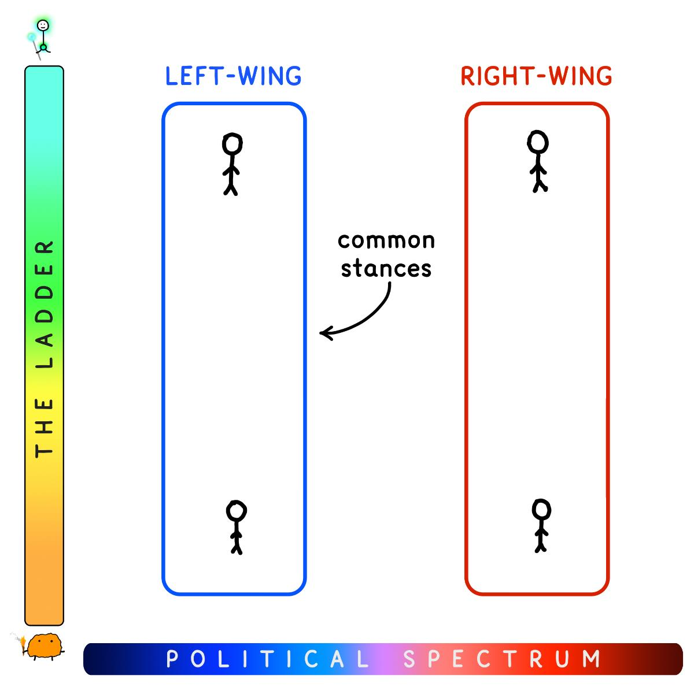

But the two high-rung thinkers have something in common—they share a certain *way of thinking* about politics. Their views may be different, but their approach is similar.

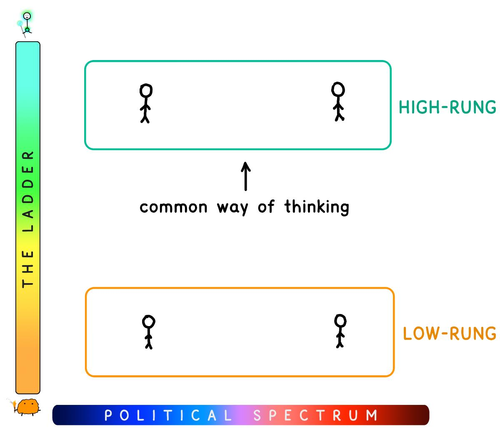

Our societies talk ad nauseum about the horizontal distinction along the political spectrum. We’re experts at identifying what people think politically and grouping people that way, so we look at these four thinkers and see two left-wingers and two right-wingers.

But we’re awful at talking about the vertical distinction. When I listen to arguments or read op-eds, I notice people *trying* to make high-rung / low-rung distinctions in their arguments about politicians or ideas. But without a common language, those attempts are usually misunderstood or missed altogether.

People who try to refer to our concept of high-rung political thinking often use the term “center.” But center is a *What* You Think word. It refers to the middle parts of the x*-*axis—as if holding viewpoints in those areas is the mark of a good thinker. Likewise, people often use “far” as a proxy for “low-rung,” calling, say, an uncompromising, progressive zealot part of the “far left.” This is a misnomer because A) there are plenty of uncompromising, progressive people whose views are mainstream, and B) there are plenty of people who hold radical left views who are well informed and open-minded. Vertical terms like “high-rung” and “low-rung” make our discussions less constrained and allow us to better express what we’re actually trying to say.

So let’s put the horizontal discussion aside for a bit and focus in on the vertical aspect of politics.

## High-Rung Politics

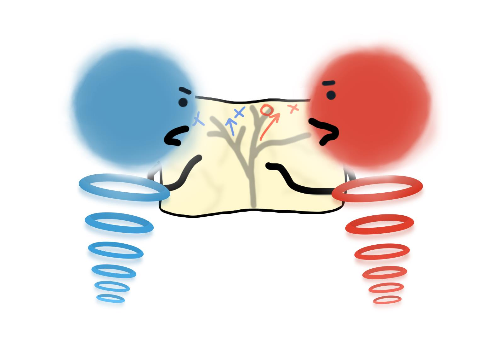

High-rung politics is the Higher Mind’s way of doing politics. It places the highest value on truth. It treats political viewpoints like science experiments to be tinkered with, via criticism and vigorous debate. It is suspicious of fervent conviction and smiles upon humility, incentivizing people to say “I don’t know” when they don’t know and reminding them to stay humble as they learn. High-rung political culture encourages intellectual diversity and independent thought among individuals and a collaborative attitude among opposing genies.

Not everyone who participates in high-rung politics approaches politics in a perfectly non-tribal, open-minded way. In high-rung political environments, you’ll find plenty of somewhat partisan, pretty confirmation-bias-y political Sports Fans. You’ll also find some hopelessly partisan people mired in the low rungs, in Unconvinceable Land. But the prevailing *culture* is high rung, and the culture stands up for itself in the face of inevitable challenges from the low-rung mentality, both from within and outside the group. Low-rungers in high-rung political discussions are forced to play by the rules of high-rung discourse or they’ll be socially penalized.

None of this means everyone in the high-rung political world gets along with each other. Arguments are the rule, not the exception. Most broadly, high-rung political disagreement takes place in three basic realms:

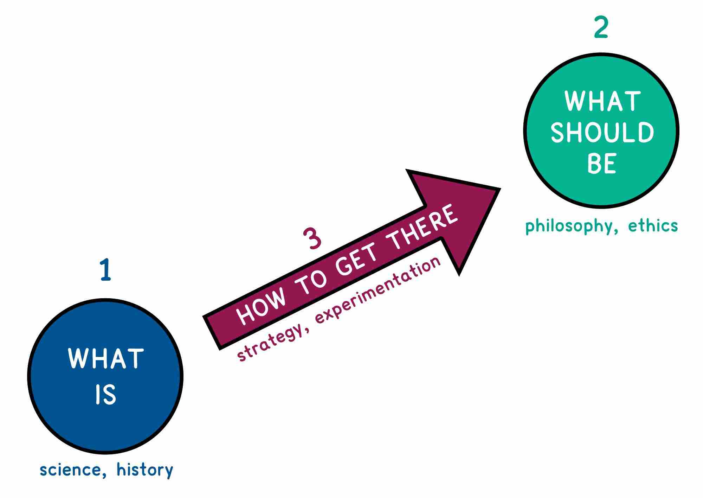

##### Question 1: What Is?

You can’t figure out how to make a more perfect union if you don’t have a good sense of the status quo. What does the population look like, and how has it evolved over time? What are the current policies, and how do they work? Which experimental programs are being attempted, and what does the data say about their efficacy? How are resources currently distributed? Where are there problems with corruption, exploitation, or discrimination? What are the biggest threats facing the country? This is the domain of political science.Embedded in What Is, and critical to its understanding, is the study of What Has Been—i.e., how did What Is become What Is? This is the domain of history.

##### Question 2: What Should Be?

What Should Be is the domain of philosophy and often the subject of fierce conflict on the high rungs. The overarching goal in high-rung politics is to move toward a more perfect union, but thinkers disagree about which policies and systems are the fairest, the most morally acceptable, and the most philosophically consistent. They’ll dig deep on lots of hard questions with no objectively correct answer: What should the role of government be? Which freedoms should be restricted in the name of citizen protection, and which shouldn’t? When does a fetus become a human being? What are the criteria for “equal opportunity”? How big and how powerful should government be, and where should the boundaries be drawn between state and federal government power? What should the country’s role be in the world, and under what circumstances should it involve itself in foreign affairs? Which resources are rights, and which are privileges? The list is long, and the debates are heated.

##### Question 3: How do we get from What Is to What Should Be?

What Is and What Should Be, when compared, yield the gaps between reality and the ideal—the high-rung political to-do list. Even when high-rung thinkers agree about What Is and What Should Be, they often disagree about the best way to get there. Two people who agree that the middle class should be larger than it is can completely disagree about which tax structure will best achieve the goal. Two people who feel the same way about racial injustice in the U.S. can hold opposite viewpoints about the ethics or efficacy of affirmative action.

Parsing political arguments using these three questions can help us isolate what the arguments are really about. Many disagreements are about What Is, because figuring out what’s true is anything but obvious. Sometimes thinkers who agree philosophically will disagree strategically. Some will disagree on all fronts.

Of course, politics isn’t just a mishmash of arguing—in a liberal democracy, politics necessarily organizes itself into parties. Even in high-rung politics, sometimes the best way to compromise is to form two sides and go at it.

On the high rungs of U.S. politics are two supergenies.

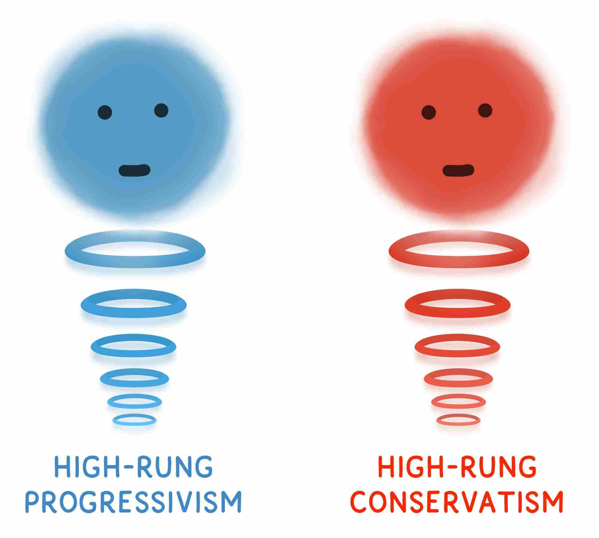

High-rung thinkers don’t usually lock themselves into political prisons by identifying as “a progressive” or “a conservative,” and individuals on the high rungs often hold progressive stances on some issues and conservative stances on others. The same high-rung thinker may choose to apply progressive pressure in the realm of drug laws and a conservative force on the country’s health care evolution. While individuals bounce back and forth between the two camps, enough people fall into each camp on any given issue that the two genies have a constant presence.

To simplify a bit, high-rung battles in the U.S. serve two positive purposes:

#### Regulating the pace of change

Throughout history, the terms “progressivism” and “conservatism” have each been the banner for a huge range of political, economic, social, and philosophical ideas—some that overlap, some that are unrelated to each other, and some that are totally contradictory with others. In many countries, political Echo Chambers have appropriated these words as banners for themselves and for their enemies. But it’s good to remind ourselves that the words themselves have *literal* definitions, and I think those meanings provide an important and useful distinction in political thinking:

- Progressivism: concerned with helping society make forward *progress* through positive changes to the status quo. That progress can come from identifying a flaw in the nation’s systems or its culture and working to root it out, or by trying to make the nation’s strong points even stronger. If the country is a car, progressives are in charge of the gas pedal.

- Conservatism: concerned with* conserving* what is already good about society, either by fighting against the erosion of the nation’s strong qualities, or by pushing back against well-intentioned attempts at positive progress that may actually be changes for the worse. In the country car, conservatives manage the brakes (and occasionally the reverse pedal).

It’s easy to see why progressivism is important. No country is perfect, and you can’t become a better country without making changes. Progressivism drives that change.

But conservatism is just as important. There are usually some aspects of a country that are already working well—and in these cases, the conservative impulse to resist change will be wise. Progressivism is also the generation of lots of new ideas—most of them untested—and inevitably, many of them will be bad ideas. The conservative resistance to progressive ideas provides an important filter.

These aren’t binary positions but rather a spectrum that generates a rich ecosystem of disagreement on any given political issue.

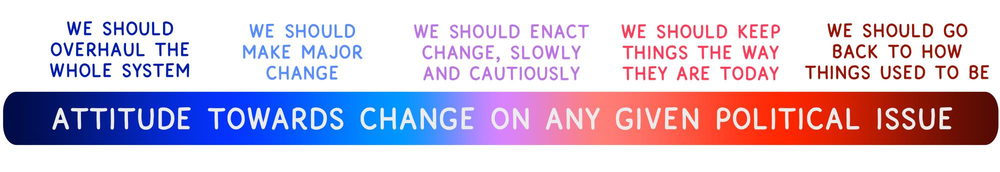

Much of high-rung politics takes place within the range of mainstream ideas, but the extreme ends of the spectrum are also important pieces of the high-rung political puzzle. People with a radical progressive mindset are the disruptors and the outside-the-box innovators—those for whom no tradition is too sacred to be questioned. People with a far-right conservative mindset are the staunchest guardians of the country’s core ideals and will keep pressing to revive a long-lost way of life. These more extreme groups are also prone to believe conspiracy theories, and they’re wrong more than they’re right—but that's their job, because sometimes the mainstream really *is* wrong about something big.

In the big picture, each side of high-rung politics acts as a counterforce against the other and helps keep it in check. When the conservative genie gets riled up, it can drift too far into “Our country is perfect just as it is” or “Our country used to be perfect” territory. When the progressive genie gets out of hand, it can fall too far down the “Our country is and always has been awful” hole. The presence of its rival genie restrains each giant from becoming a caricature of itself.

#### Finding happy mediums

Some political debates aren’t about whether to change but about a spectrum of possibility and where exactly on the spectrum our policies should lie.

Spectrum battles don’t always map very well onto “progressive” or “conservative,” and the Left and Right can flip-flop on the same issue in different eras. And that’s fine—the important thing is that both sides of each issue have a genie advocating for them. This allows the marketplace of ideas to home in on a point that represents a reasonable compromise (represented below by the green arrow). As the debates rage on and public opinion evolves, the arrow’s position can evolve along with it. Some very oversimplified examples of American spectrum battles:

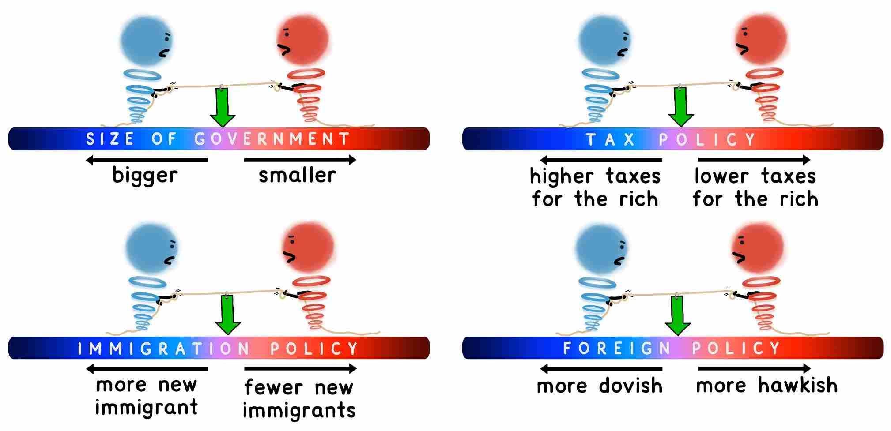

In modern day America, the Left usually makes the case for globalization while the Right makes the argument for national interests. The Left stays wary of unchecked capitalism while the Right is wary of over-reaching government. The Left focuses on protecting and lifting up marginalized groups while the Right worries about how such efforts could potentially backfire. In each case, the blind spots of one side are seen clearly by the other side, allowing the complete system to function more wisely than either side could on its own.

As fierce as the debates can be, high-rung political culture reminds its members that ultimately, they’re all on the same team, working together to navigate their way up the same mountain.

People engaged in high-rung politics, without the burden of rigid attachment to any one ideology, can combine ideas from across the spectrum to form a nimble political superbrain that can respond in nuanced ways to changing times.

* * *

It would be great if this was how politics always worked. But as any Skittles eater can tell you, overriding ancient software is not easy. Each of us has a Primitive Mind in our head, and even the skilled high-rung thinkers among us are prone to morph into childish low-rungers when it comes to politics. That’s no surprise: Politics deals with fairness, resource distribution, and groups of people competing for power—concepts that the Primitive Mind is programmed to freak out about because they were fundamental to ancient survival. And there’s neurological evidence that politics really does ignite parts of our brain we’d associate with low-rung thinking. There’s no shortage of studies showing that politics tends to turn people into low-rung thinkers—and this is *most* pronounced in people with high levels of education.

There is a vibrant world of high-rung politics. There’s just an even larger world down below, where politics is less about working together to build a more perfect union and more about the good guys triumphing over the bad guys in a political war.

## Low-Rung Politics,

## aka

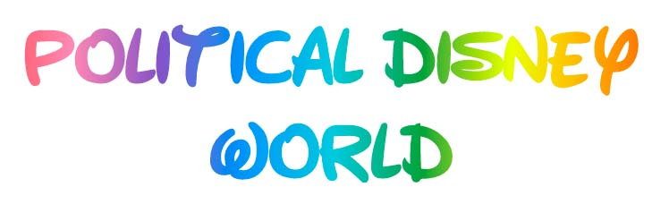

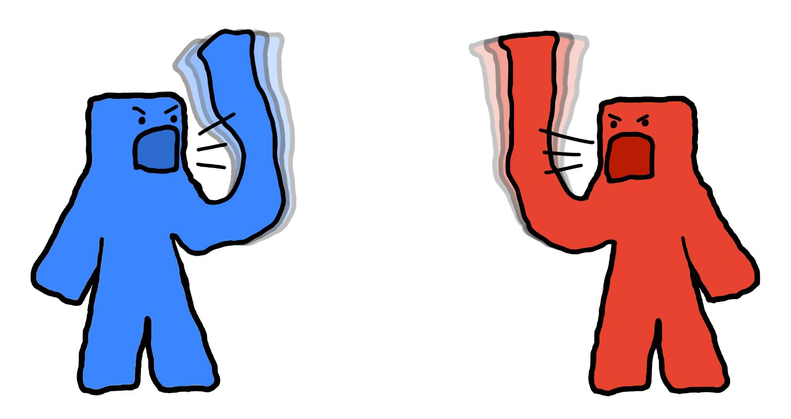

I’m pretty into most Disney movies, but especially *The Little Mermaid*, *Beauty and the Beast*, *Aladdin*, and *The Lion King*. I’ve never been sure if those are objectively the best four Disney movies or if everyone just loves whichever Disney movies came out when they were between the ages of 7 and 12. Either way, those are clearly the four best Disney movies.

The thing about those movies, though, is that they’re definitely not real life, right? Like, kids might think Disney movies are the way the real world is, but everyone else knows that the real world is not like Disney movies.

Right?

I thought so too. Then I started writing this book. After spending the last few years thinking about political partisanship and Echo Chambers, it hit me: a ton of Americans think they live inside a Disney movie. Let me explain.

The real world is gray, amorphous, and endlessly nuanced. But Disney movies simplify the world into a binary digital code of 1s and 0s. There’s pure good (1), pure bad (0), and rarely anything in between.

Real people are complex and flawed, full of faults but almost always worthy of compassion. Disney characters, on the other hand, are either entirely good or entirely bad.

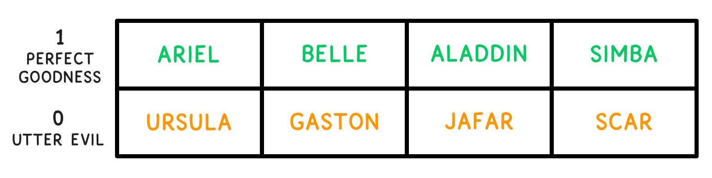

In the real world, each turn of events is mired in potential positives and potential negatives, which is a mess to sort out. Disney movies get rid of that messiness. Aladdin gets ahold of the genie = 1. Jafar steals the genie away = 0. Disney even digitizes the weather, which is always either perfect or, when the bad guys are getting their way, stormy.

Going full binary makes sense in Disney movies. Their core audience is little kids, who aren’t ready to sort through too much gray. Before a person learns to think in nuance, they first need to learn the basic concepts of good vs. bad, right vs. wrong, safe vs. dangerous, happy vs. sad.

But oversimplifying the *real* world is a bad idea—and unfortunately, that’s exactly what the Primitive Mind likes to do. So low-rung politics ends up feeling, to its participants, a lot like a Disney movie.

Up on the high rungs, people know the world is a mess of complexity. They know that people are little microcosms of the messy world—each person an evolving gray smattering of virtues and flaws.

Political Disney World is much more fun. Everything is crisp and perfectly digital. Good guys and bad guys, with good ideas and bad ideas. Good politicians and bad politicians with good policies and bad policies, winning their seats in good or bad election outcomes. Right and wrong. Smart and ignorant. Virtuous and evil. 1s and 0s.

When a bunch of adults are pretty sure that they live in a Disney movie, it’s usually a sign that primitive psychology has taken over and we’re dealing with golems.

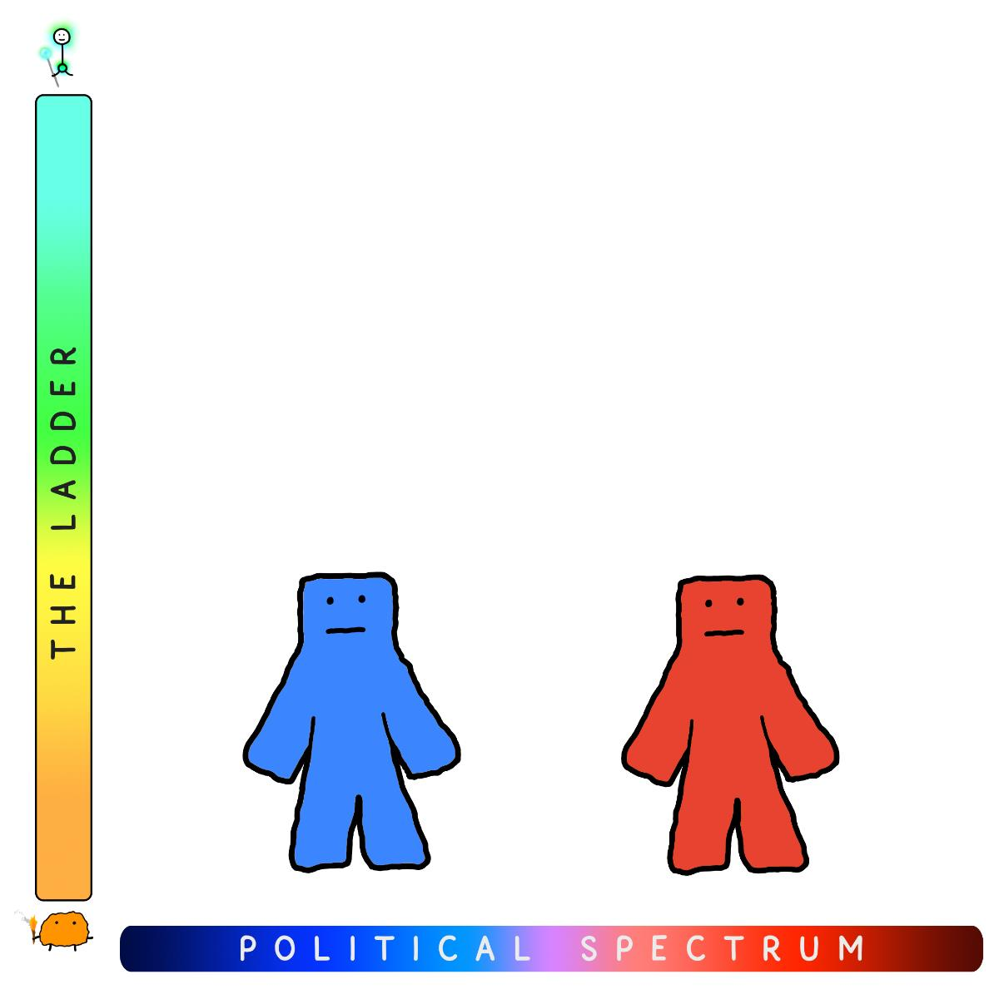

Both the individualism and collaboration of high-rung politics melt away on the low rungs, leaving only the rigid ant colony structure. People inside the tribe are pressured to conform, drawing unity and strength from an obsession with the common enemy and how stupid, ignorant, evil, bigoted, opportunistic, sneaky, toxic, selfish, and dangerous the bad guys are.

At the heart of every faction in Political Disney World is a guiding story: their political narrative. These narratives are all-encompassing versions of reality. They come with their own worldview, their own telling of history, and their own depiction of the present. A unique, customized Disney movie for the tribe, by the tribe.

In the U.S., people in the Democratic Disney kingdom see themselves as righteous citizens in a continual struggle to deliver the country to a progressive utopia even as the mean, bigoted Republicans try to pull the country backward into the land of all-powerful corporations and a government run by gun-slinging misogynists and white supremacists.

The Republican Disney kingdom tells the story of honest, hard-working families doing their best to keep the country afloat as the lazy, morally defunct Democrats try their hardest to pull it down into a dystopian hell of a tyrannical government run by ivory tower elitists that give endless handouts to hordes of dangerous immigrants.

These narratives allow believers to swap the gray mess of debates over What Is, What Should Be, and How to Get There for a clean, digitized list of issues—each with a Good, Correct Stance and an Evil, Wrong Stance. In the U.S. narratives, the current checklist includes items like these:

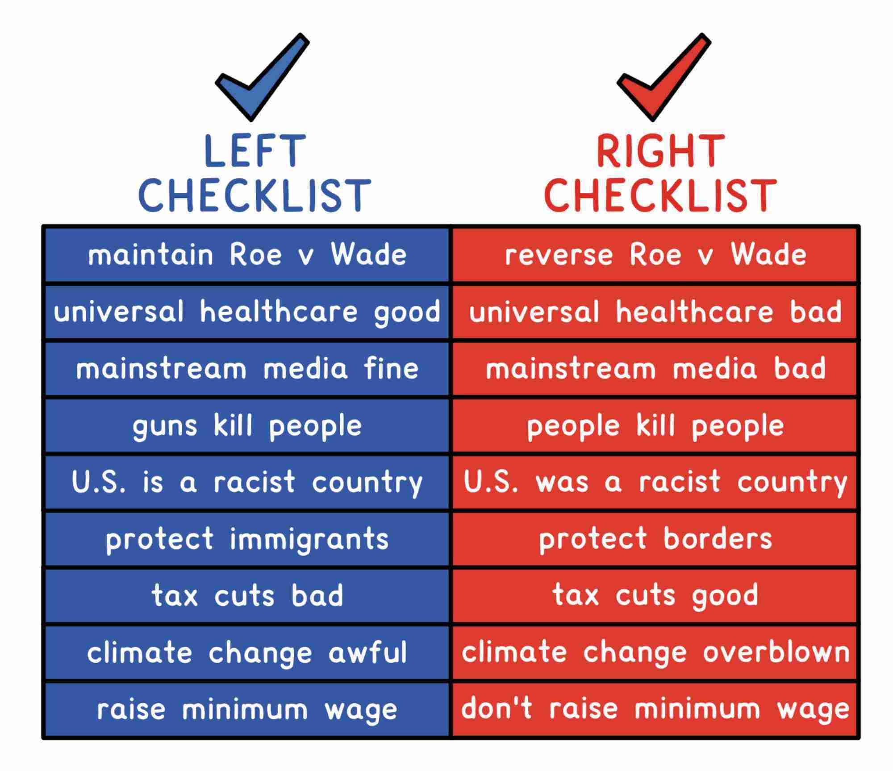

Teammates abide faithfully by the entire list of protagonist viewpoints, and for each issue, the villain stance is seen as having zero merit.

Political Disney World narratives are also rife with outlandish conspiracy theories.

The intellectual filters of high-rung politics are great at evaluating conspiracy theories, squashing them when they’re wrong but allowing true ones to work their way into mainstream consciousness. In Political Disney World, this critical sorting mechanism is nonexistent, allowing all conspiracy theories that confirm the narrative to swirl continually around each golem’s thoughts. This is why so many clearly disproven wild theories never seem to die. They actually died long ago up on the high rungs, but they live on down below.

So far, we’ve kept our Ladder discussions mostly focused on the way we form our beliefs. But there are two other ways we’ll use the Ladder as well. The second way has to do with our values and principles.

A telltale sign of Political Disney World is what we might call low-rung morality.

High-rung political thinkers will disagree about what’s *morally* right and wrong as vigorously as they disagree about what’s factually right and wrong. But whatever their conclusions, they apply their moral standards *consistently—*to themselves, to friends, to strangers, to foes. They work hard to avoid falling into the tribal mindset and try to maintain a balance of empathy and criticism when dealing with people on other parts of the political spectrum.

But the Us vs. Them mindset distorts our morality, generating one set of standards for Us and another for Them. When judging members of their own group, people will condone and even applaud the same behavior they see as morally reprehensible when done by their opponents.

Low-rung morality distorts our capacity for empathy. In Political Disney World, people are great at being empathetic toward members of their group, seeing the best in their intentions, and forgiving their mistakes. But we treat members of the out-group the opposite way, labeling them with dehumanizing stereotypes, assuming the worst about their intentions, and viewing any moral failing as an exposure of permanent moral bankruptcy.

When it comes to political principles, low-rung morality yields rampant hypocrisy. We can think of it like a simple Venn diagram.

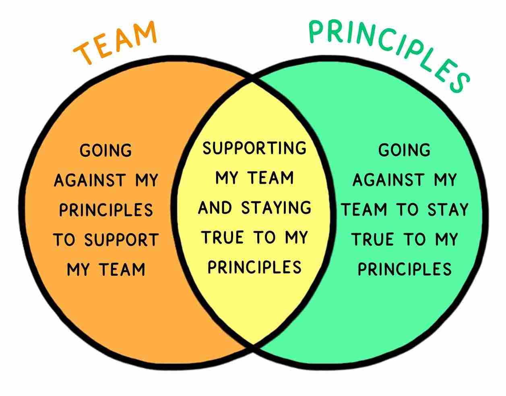

Everyone in politics spends time in the middle section of the diagram, where your team’s behavior aligns with your principles—say, defending the free speech of someone you agree with—so you don’t learn anything about someone when they’re here. The litmus test comes when the middle section isn’t an option—when your team and your principles are in conflict. High-rung political thinkers stay inside the circle on the right, criticizing their own teammates or even standing up for the other team when doing so aligns with their principles. But low-rung political culture encourages people to stay inside the left circle, keeping true to their team, even when doing so flies in the face of their principles.

We’ve seen a lot of this kind of hypocrisy in recent decades in the U.S., on issues like foreign intervention, government surveillance, aggressive executive orders, the national debt, state autonomy, free speech, campaign finance reform, border policy, and political protesting. On issues like these, the stances of hyperpartisans have flip-flopped based not on consistent principle but on which party is in power.

In Political Disney World, people who claim to hold liberal values won’t hesitate to go illiberal if it helps their team win. When they’re unhappy with the result of an election, they insist that they’re disenfranchised, that the system must be broken, that the election was manipulated by foreign powers or rigged by the opposition. When their candidate wins, they say things like, “faith in democracy restored!” which translates to “democracy is only working when my candidate wins.”

Alongside low-rung thinking and low-rung morality are low-rung tactics. Golems play by Power Games rules—*everyone can do what they want, if they have the power to do so.* When they do play by Liberal Games rules, it’s only out of necessity, because they have to for survival’s sake. When they can get away with it, golems will use whatever dirty tactics they can to defeat their enemies. Voter suppression, delegitimizing election results, censorship, obstruction, bribes, blackmail, even physical violence—it’s all fair game for golems. We’ll talk a lot more about high- and low-rung tactics later in the book.

**Low-rung thinking**, **low-rung morality**, and **low-rung tactics** all stem from the same concept: When the Primitive Mind is running the show, our minds are in ancient survival mode, and politics becomes a vehicle for tribalism. When our heads are here, truth, moral consistency, and fair play all go out the window.

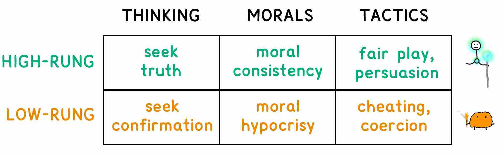

The tricky thing is, when our psyches are mired in Political Disney World, we’re usually too foggy to realize it. Most people reading this book will picture themselves on the high rungs. Political Disney World, we believe, is where those other shitty people are.

The distinctions we’ve talked about can help us evaluate where we and others *actually* are on the political ladder. Do our political views conform a little too perfectly with the exact checklist of stances on one side? Do we see ourselves and our political allies as having a monopoly on truth and moral good? Do we demonize our political opponents, feeling more disgust than empathy for them and assuming the most uncharitable interpretation of their motives? Did we feel outraged about a certain policy or tactic of the opposition and then stop feeling that way later when our own side took it up? These are all signs that you’ve drifted down into Political Disney World—the land of lumbering political golems.

In the Liberal Games, where physical force is off the table and information flows freely, large golems face an uphill battle. To survive, they do what any organism in a hostile environment must: protect themselves with an immune system.

## The Golem Immune System

A golem’s lifeblood is conformity, anchored by its members’ steadfast belief in its guiding narrative. The stronger and more unified the belief, the stronger and more powerful the golem.

For the same reason, doubt in the narrative is like cancer for a golem. Doubt, if allowed to fester and spread, weakens the golem and threatens its very existence.

So the golem’s immune system has a simple job: keep belief strong and keep doubt out. To do this job, it uses three primary mechanisms.

### Mechanism 1: Information filtering

The simplest way for a golem to stay healthy is to control which information puzzle pieces are circulating around the system. But in a society with free speech, free press, and the internet, this can be a challenge. This is where its filters come in.

The first line of defense for a golem is the media. In today’s world, every political golem has its own media channels, which serve as the giant’s eyes and ears. To keep the golem strong and well-fed, these channels broadcast and sensationalize the stories that confirm the narrative. To keep the giant free of intellectual contamination, they downplay stories that challenge the narrative or neglect to report them at all. This is cherry-picking on an industrial scale, driven by market forces: To maintain the trust of the golem’s members, these media sources must filter stories in a way that aligns with the golem’s interests.

When dangerous dissent does manage to enter the golem’s airwaves, it’s handled by the second line of defense: the social pressure of Echo Chamber culture. A low-rung political tribe tends to be a motley crew.

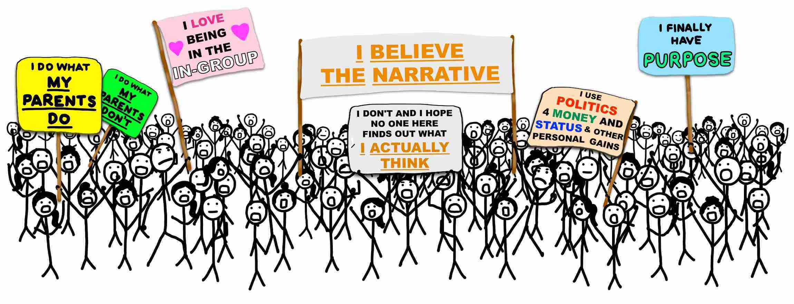

There are the zealots, who believe every word of the narrative. The tribal people, who get off on being part of a powerful in-group and talking shit about the out-group. The opportunists, who use politics to gain social status or career advancement, to get clicks, take down their enemies, or generate profit. Some have stitched their identities so closely to their political colors that their sense of meaning, purpose, and righteousness have become one and the same with those colors*.* Others are the opposite: undercover high-rung thinkers who for various reasons, like geography, are mired in a Political Disney World social scene and they go with the flow to avoid social conflict.

While many of these categories overlap with one another, we can simplify them into two key categories: people who believe the narrative, and people who pretend to believe the narrative.

For the golem’s immune system, what matters isn’t what its members are actually thinking but that they’re all outwardly *saying* the right thing. Doubt in an individual’s head is mostly harmless—only when they *express* that doubt does it become a danger to the system.

The powerful social incentives of Echo Chamber culture keep everyone in line. The culture rewards the continual expression of narrative-confirming sentiment, and brands ideas that threaten the guiding narrative as taboo. If the golem’s media channels determine what enters the political golem’s brain, social pressure provides a second filter, setting the cultural rules about how information circulates through the brain.

These filtering systems do much of the heavy lifting in keeping the golem’s mind pure. But to really supercharge a golem and keep it in top health, golem immune systems supplement filtering with a second tactic.

### Mechanism 2: Information twisting

Like the human hand or the human eye, the human brain is a tool developed by evolution for a specific set of purposes. Truth wasn’t one of those purposes.

We can do truth, but a human doing truth is like a dog standing on its hind legs—it’s a real effort and we’re not in our element. This is why we’re so susceptible to reasoning errors, aka logical fallacies. The high-rung world exposes logical fallacies and roots them out, but bad reasoning thrives down below. And for the golems of Political Disney World, logical fallacies—both accidental and intentional—are an immune system superpower.

Let’s look at some common ways information is twisted inside political golems.

##### Fallacies that misrepresent reality

Low-rung politics has a long tradition of misrepresenting reality by concocting questionable studies or misleading statistics or by spinning news stories in a way that best fits the narrative.

A common practice is what we might call **trend-anecdote swapping.**

It’s simple: If you come across an anecdote that supports the narrative, you frame it as evidence of a larger *trend* to make it seem representative of broader reality. Meanwhile, if there’s an actual trend happening that really is representative of broader reality—but it’s a trend that makes your narrative look bad—you frame it as nothing more than a handful of freak anecdotes.

Another common fallacy has to do with **correlation and causation.** A common Statistics 101 concept is that *correlation does not imply causation.* A 2013 study found that people who have sex more often make more money**.** A statistics amateur might read a headline about the study and jump to the conclusion that having more sex *caused* people to make more money. Or maybe that making more money led people to have more sex. But what the study actually found was that a third variable—*extraversion—*lies behind both the sex and money trends.

There are four possible explanations for any correlation:

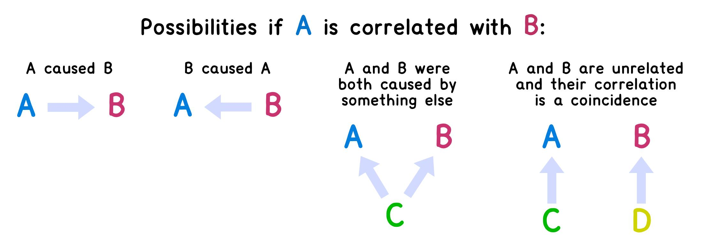

In high-rung politics, when people come across a correlation, they dig deeper to explore which of the above is actually going on. But in Political Disney World, people believe whichever explanation best supports the narrative.

Let’s imagine there’s a political tribe whose narrative says that dogs are almost always good boys (and anyone who says otherwise is a bigot), while most raccoons are dangerous, vile creatures (and anyone who says otherwise is a bigot). Now imagine that one week, these six news stories happen:

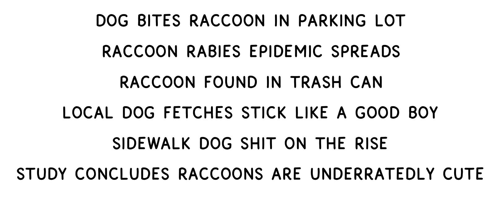

The actual information at hand here suggests that both animals can be good sometimes and bad sometimes. But the required narrative leaves no room for mixed messages. Dogs are good. Raccoons are bad. Period. So the pro-dog media starts twisting things.

The anecdotes that align with the narrative (say, “racoon found in trash can”) can be reframed as trends (“yet another racoon found in trash can”). Pro-dog media could use the correlation/causation fallacy to further nudge the day’s news in their favor by fiddling with blame in two of the stories: “Dog bites racoon in parking lot” places the blame on the dog, which conflicts with the pro-dog narrative, so it could be adjusted to the more neutral “dog and racoon get in parking lot skirmish.” The headline about dogs shitting on the sidewalk could be rewritten in a way that implies it’s not caused by dogs at all: “With the city continuing to neglect dog park conditions, more dogs resort to shitting on the sidewalk.”

To top things off, pro-dog media might add their own sensationalistic touch to the headlines that fit the pro-dog narrative, while downplaying those that don’t. Meanwhile, pro-raccoon media has been doing all of the same things in the opposite direction. After all this twisting, the pro-dog and pro-raccoon audiences are looking at an entirely different set of stories.

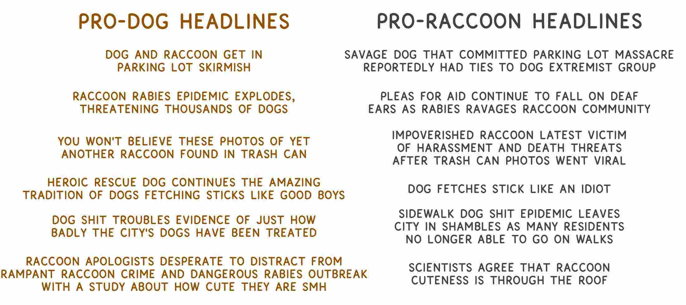

High-rung politics relies on a shared sense of reality—a shared understanding of *What Is*. In Political Disney World, the beliefs and viewpoints of people in different tribes are premised on entirely different versions of reality.

##### Fallacies that misrepresent an argument

The real test of any argument is how well it stands up to rigorous criticism. When you’re confident in your viewpoint, you love a chance to throw it into the ring with other arguments and show off its strength. It works like boxing: the stronger the opponents you’ve beaten, the better your ranking. That’s why a strong college paper always includes a strong “grizzly bear” counterargument—it lets the thesis “show off” in front of the professor.

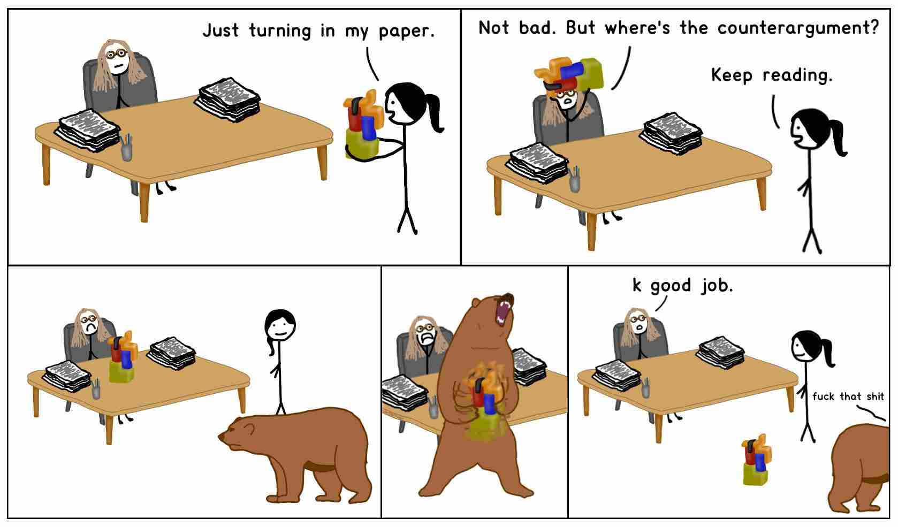

But what if you’re not so confident in your viewpoint? And you still want to make it *seem* like it can do well in the ring? As a procrastinator who wrote a lot of hasty, shitty papers in college, I can tell you firsthand that one of the trademarks of a paper with a weak thesis is an even weaker counterargument.

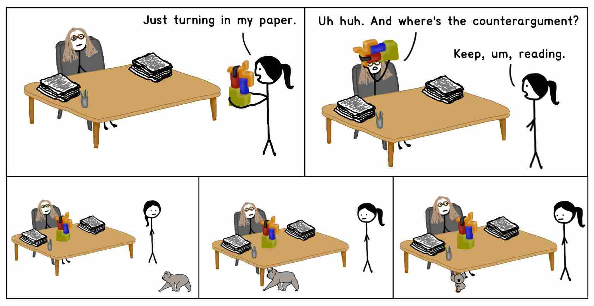

When exposed to high-rung opponents, oversimplified narratives are usually knocked out in the first round. So political Echo Chambers make it taboo to criticize the narrative—it’s their way of banning anyone from landing a good punch.

But to generate intense conviction in its members—the belief that *of COURSE the narrative is correct*—political Echo Chambers need to make it *seem* like the narrative is a champion heavyweight boxer. So they rely on what are essentially fake fights that seem real to the Echo Chamber’s members—fights where the narrative always comes out on top. They pull this off using one of the most tried-and-true tools of the low-rung intellectual world: **the straw man fallacy**.

To straw man your opponent, you invent a weak counterargument to your position and pretend that it’s your opponent’s position, even though it’s not. It’s the real-world version of what shitty college students do in their papers: conjure up a weakling opponent, pound it to the floor, and then declare victory.

The straw man makes regular appearances in political debates.

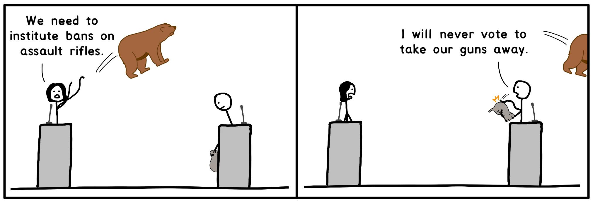

Political speeches tend to be full of straw men too.

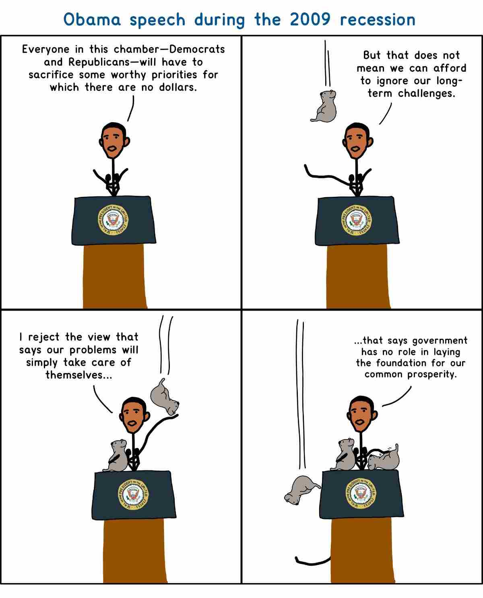

Using a straw man can make you appear victorious to unwitting viewers, like a boxer who takes a swing at the balls mid-match and hopes the ref won’t see it.

In Political Disney World, when a cleverly worded tweet or op-ed straw mans the opposing side, it goes viral, and soon, the farce boxing match is played on loop throughout the Echo Chamber, ad nauseam.

The straw man fallacy also has its inverse—the **“motte-and-bailey” fallacy**—which can be used as a defensive tactic. The name comes from a type of two-part medieval fortification common in Northern Europe between the 10th and 13th centuries. It looked something like this:

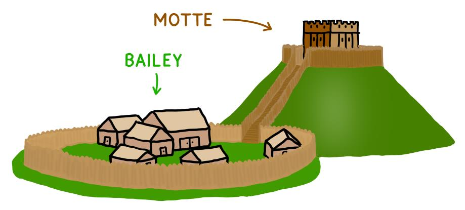

The bailey was an area of land that was desirable and economically productive to live on but vulnerable to attack and hard to defend. When the bailey was threatened, inhabitants would run up the motte and into the tower. The motte, unlike the bailey, was easy to defend and nearly impossible to conquer—so invaders who captured the bailey would be unable to conquer the whole fortification. Eventually, with arrows raining down on them from the motte’s tower, the attackers would give up and leave, at which point the inhabitants could resume life in the pleasant, profitable bailey.

Philosopher Nicholas Shackel popularized the motte-and-bailey as a metaphor for a cheap argument tactic, whereby someone holding a convenient but not-very-defensible “bailey” viewpoint could, when facing dissent to that viewpoint, quickly run up the motte and swap out the viewpoint with a far stronger “motte” position. Kind of like in 2003, during the arguments about whether to invade Iraq.

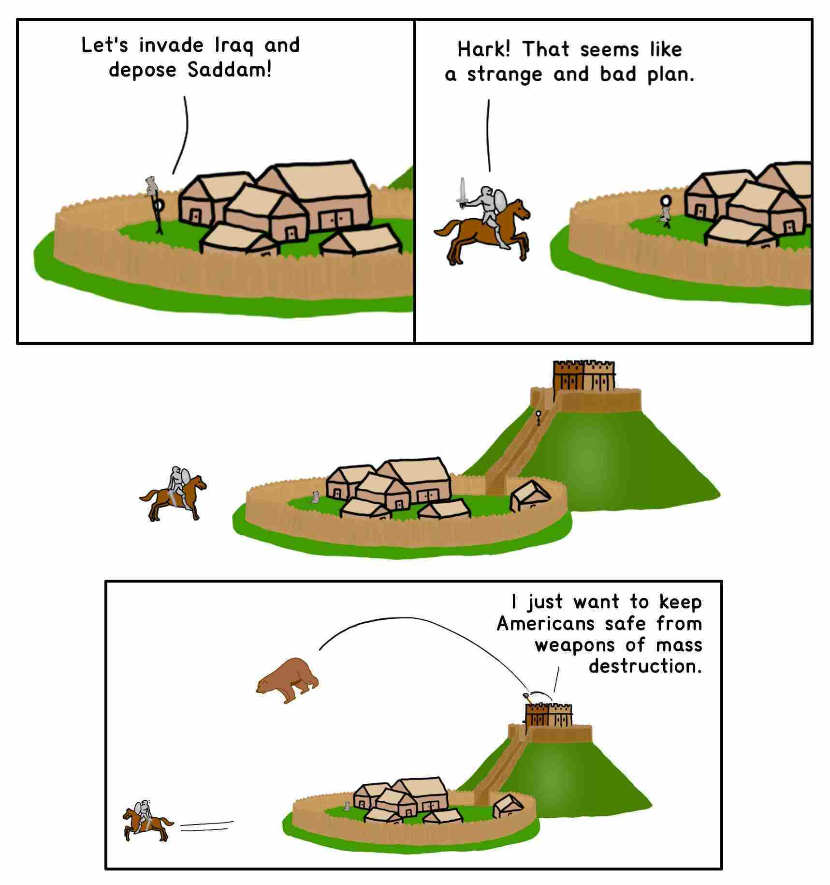

Political Disney World is a land of sprawling baileys, dotted with motte hills. And if you listen carefully, you’ll notice people darting up to their trusty mottes whenever their views come under fire.

The motte-and-bailey is often used alongside the straw man fallacy. Political Echo Chambers use the straw man to make their opponent’s position seem weaker than it is, and they use the motte-and-bailey to make their own position appear to be more ironclad than it is.

In 2004, George W. Bush countered opponents of the Iraq War with this: “There’s a lot of people in the world who don’t believe that people whose skin color may not be the same as ours can be free and self-govern…I reject that. I reject that strongly. I believe that people who practice the Muslim faith can self-govern. I believe that people whose skins … are a different color than white can self-govern.”

So: We just want to keep Americans safe from weapons of mass destruction (motte-and-bailey), but they don’t think brown people can self-govern (straw man).

##### Fallacies that discredit ideas based on their speaker

Perhaps the easiest way to squash a dissenting argument is to just disqualify it right off the bat *based on who said it*, without ever addressing the argument itself. The infamous **ad hominem fallacy**.

In Political Disney World, ad hominem fallacies happen constantly, because when our minds are on the low rungs, we tend to trust people who agree with us much more than those who don’t. In 2019, professors Steven Sloman and Elke Weber compiled a wide range of articles exploring the science behind political polarization. Many of the findings confirmed that people are highly uncharitable in their assumptions about those in their political out-group. For example, if an opposing candidate has mostly mainstream views but holds a few extreme positions, people tend to assume that the candidate’s supporters voted for them *because of*, not *in spite of*, the candidate’s extreme positions—despite no evidence that this is true. Another study found that “constituents are likely to attribute the actions of in-group leaders as intended to benefit the country (national interests), and the actions of out-group leaders as intended to benefit the political leaders themselves (egoistic interests)”—even when the actions in question are identical.

People in Political Disney World slap a “bullshit” sticker onto an argument the second it leaves the wrong person’s mouth, regardless of the argument’s substance.

These two mechanisms of information control—filtering and twisting—maintain an intellectually pure environment inside the golem.

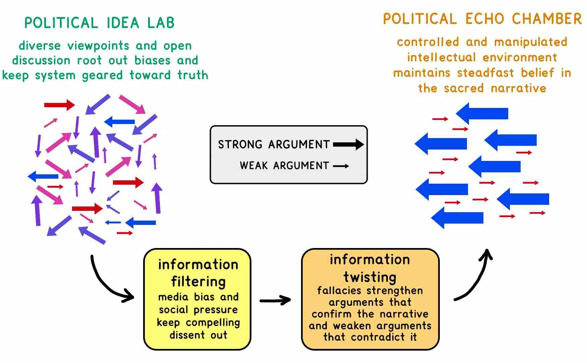

As a final safeguard to keep the tribe intact:

### Mechanism 3: Confirmation bias

When someone believes strongly in their tribe’s narrative, they’re usually highly motivated to continue believing it. This motivation can emerge from multiple places:

##### Social dependence

It’s hard living in an Echo Chamber community if you don’t believe the community’s narrative. You either keep your mouth shut and feel distant from the other people, or you become a contrarian and, at best, find yourself in a lot of unpleasant interactions (at worst, you end up cut off from the community).

More often than not, the surrounding community is made up of beloved friends, family members, and colleagues. Even if you don’t like the way they think, you still love them and very much want them in your lives. Believing the narrative makes all of this so much easier and simpler.

##### Intellectual dependence

An Echo Chamber makes its members feel perfectly informed while crippling them as intellectuals. It teaches them that knowledge is easy and gets them hooked on the feeling of knowing the truth about everything without having to work for it.

When you spend too much time in an environment like that, you don’t just lack knowledge, your learning skills dull. People who surround themselves with Idea Lab culture get constant practice at defending their ideas and challenging others. In the Echo Chamber’s safe-from-dissent space, people remain amateurs.

And the longer this goes on, the more it eats away at intellectual confidence. It’s a scary feeling, but as long as the narrative really is true, it’s all okay.

##### Self-esteem dependence

Low-rung political narratives always paint the in-group as perfectly righteous protagonists, which makes the believers feel great about themselves.

But what if the narrative isn’t true?

If the narrative isn’t all it’s cracked up to be, its members look like brainwashed ideologues. When our heads are in Political Disney World, deep-down belief in the narrative and self-esteem go together.

Sometimes it feels like even more is at stake. We’ve talked about how our beliefs can become intertwined with our identity because the Primitive Mind has a hard time distinguishing between the two. When we associate ourselves with our most fervent beliefs, doubting those beliefs feels like an existential crisis. So dissent can send our Primitive Minds into fight-or-flight mode, where we lock our beliefs in a protective bunker.

If Echo Chamber culture is an external incentive to *say* the right things, these phenomena combine into an internal incentive to *believe* the right things. That motive will drive a person’s psychology down the Ladder to Unconvinceable Land where any dissent that does make it into their head will run into the brick wall of confirmation bias.

The Echo Chamber environment makes confirmation bias easy. The “bandwagon effect” describes our tendency to feel that “if everyone else believes it, it must be true.” Echo Chambers give their members the distinct impression that everyone believes the narrative, which alone is enough evidence for most people to stop questioning it.

There’s also the “inoculation effect,” a term coined by social psychologist William McGuire in 1961. The trick of many of our vaccines is to expose a person’s immune system to a weak version of a dangerous virus. After the body defeats the weak version of the virus, it develops an immunity against all versions of the virus, including the strong ones. McGuire found that people’s beliefs worked in a similar way: being repeatedly exposed to weak arguments for a particular position makes people dismissive of *all* arguments for that position.

In other words, if straw man arguments are repeated enough inside a political Echo Chamber, people come to believe they are representative of what the opposition thinks. After enough of this, *any* version of dissenting arguments—even the strong ones—will be disregarded as nothing more than better-worded versions of the well-known absurd arguments. People will have become “immune” to changing their mind. The same goes for motte-and-baileys—when people continually hear their own views reframed as ironclad mottes, it can make them feel so overconfident in their beliefs they become immune to self-doubt.

The way giants treat information forms a big arrow pointing to the group’s overarching motivation. For a political golem, narrative-confirming information is welcomed, spread by social incentives, boosted by fallacy distortions, and accepted uncritically. Dissenting information is hindered by the media and sharing filters, weakened by fallacy distortions, and blocked by a wall of skepticism. It’s a terrible system for discovering truth, but it works great for protecting belief in a guiding narrative.

### The high-rung immune system

Genies handle information in a completely different way. Without the burden of having to protect any particular narrative, the political high rungs don’t need to control or manipulate information. Political genies are configured to root out bias and misconception and figure out the truth—so they welcome all kinds of people with all kinds of ideas, *especially* those that challenge existing beliefs.

But genies need immune systems too. All humans come programmed for low-rung thinking, and our Primitive Minds communicate with one another like wolves communicate with pheromones. While golems protect themselves against doubt, genies need to protect themselves from slipping down to the low rungs and becoming golems.

The high-rung immune system is the product of a culture of open discourse, debate, and moral consistency—and the willingness of its members to stand up for that culture in the face of inevitable attempts, from inside and out, to shut it down.

## The National Tug-of-War

So even though we talk about U.S. politics like it’s like this—

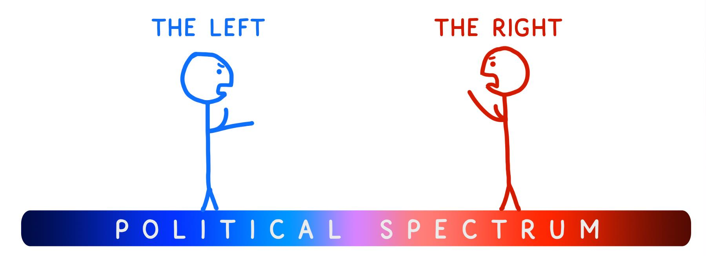

—the Ladder helps us see it’s closer to something like this:

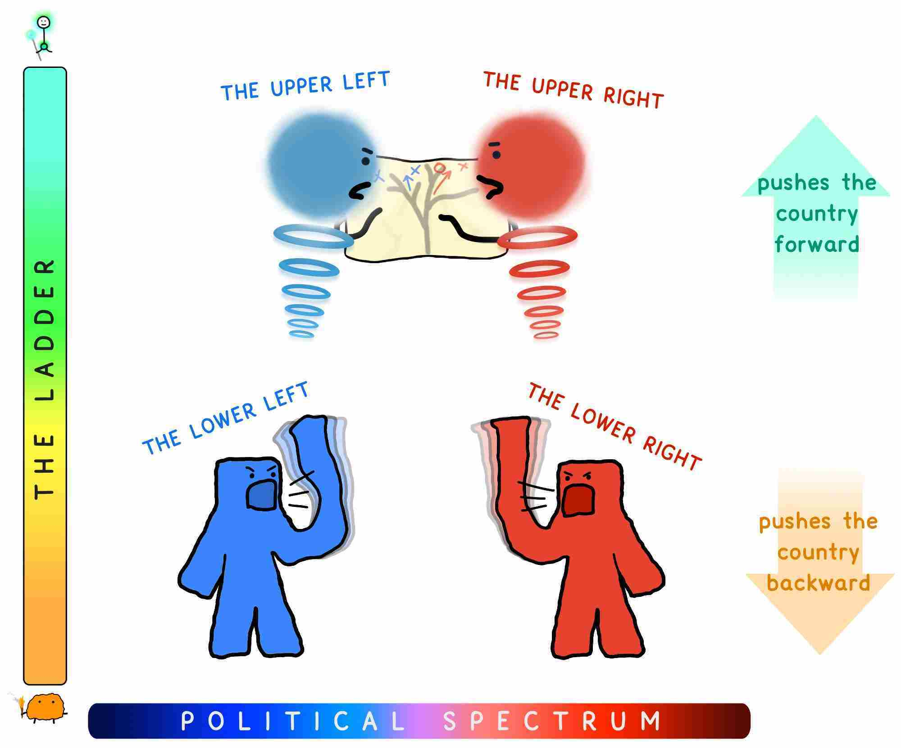

High-rung politics marries liberal laws with liberal culture to create an environment where people can enjoy the full benefits of the Liberal Games. Over time, it yields positive steps toward national improvement. But America’s political golems only understand a simpler, ancient rulebook: the zero-sum Power Games. The battle of the golems ultimately hurts the country and undermines the progress of high-rung politics.

Earlier, we imagined the U.S. as a giant organism trudging up a mountain on a mission to become a more perfect union. Splitting this organism into its component parts gives us a clearer view of what’s really going on: like each of us, the national giant faces an internal tug-of-war between the high and low rungs. During eras when high-rung politics has the edge, the U.S. can take steps up the mountain. When the golems get into a frenzy that overwhelms high-rung America, the U.S. giant slips downward on the mountain.

None of this means the system isn’t working. Modern democracies weren’t built to eradicate low-rung psychology or low-rung culture. They were built to ensure that low-rung giants wouldn’t be able to do what they’ve done throughout history: conquer the country*.*

In a way, the U.S. is like an ecosystem.

In nature, an animal species is constrained from expanding endlessly by the limitations of its ecosystem—the tyranny of the predators above them on the food chain and the supply of prey below them. An ecosystem is a web made up of many species, the existence of each providing limitations on others, ultimately achieving a fragile equilibrium.

In a liberal country, communities run by high-rung and low-rung culture butt up against each other, and the boundary between them is an ecosystem equilibrium. Political genies, unimpeded, would inject the entire nation with the culture of open discussion and debate. Likewise, if a political golem had its way, it would expand and conquer the whole country, ruling the government and imposing its ideology from coast to coast. Neither the genie nor the golem can accomplish this, though, because each has an immune system that’s capable of protecting itself from invasion by the other. So they coexist at equilibrium.

The Founders’ hope was that something like high-rung America would prevail in the long run—that for every step backward, there would be two or three steps forward. And U.S. history has mostly proven this correct. For all our current problems, few Americans would prefer to live in 1920s America.

But ecosystems can change.

In nature, when something changes in an ecosystem—say a species goes extinct—it has a ripple effect on the other species. The extinct species’ predators may starve and go extinct, or be pruned down, while its prey, no longer being pruned by predators, grows and expands. Eventually, the chaos settles into a new equilibrium.

When we grow up within an artificial habitat that values human inventions like reason and fairness and humanity, it can be easy to forget just how tenuous that environment is. It’s easy to forget that we’re living in a rare anomaly within human history—an anomaly held up only by trust, cultural norms, and shared assumptions. It’s easy to become overconfident in the stability and permanence of that environment and forget that the *natural* human habitat—the Power Games—is always lurking just beneath the surface.

As in every natural ecosystem, small changes in our social ecosystem can throw it into chaos. Remembering our big question—*what’s our problem?—*I believe this concept offers us our first clue: Our environment has been changing at breakneck speed.

# Chapter 3

## The Downward Spiral

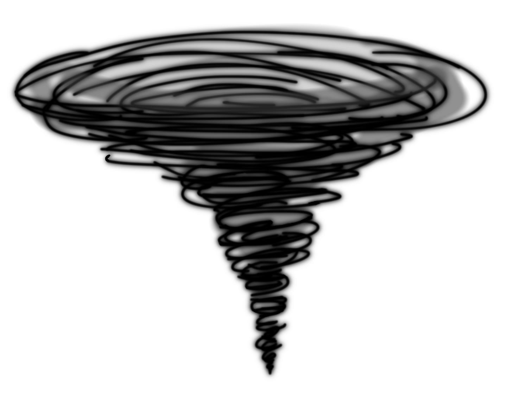

It's human nature to start taking things for granted again when danger isn't banging loudly on the door.

– David Hackworth

With our Ladder framework in mind, let’s return to the original point that got me (and now you) into this whole mess in the first place: Something is wrong in America.

Some call it political polarization, or a rise in authoritarianism, or a culture war. I’d put it like this:

*Golems are on the rise.*

We talked about how human behavior is what happens when you put human nature into a given environment.

So if golems are on the rise, it’s not because people have changed biologically—it’s because something has changed about the environment. To get a feel for how environmental changes are shaping our current political behavior, let’s look at two major shifts that have transformed the American ecosystem over the past few decades.

###### Shift 1: Distributed Tribalism → Concentrated Tribalism

A diverse country like the U.S. is ripe ground for group conflict, and its history is packed with it. Loyalist vs. Revolutionary. Federalist vs. Anti-Federalist. North vs. South. Homegrown vs. Immigrant.

There have been periods of intense political conflict—the years following George Washington’s presidency, the years leading up to and through the Civil War, and the turn of the 20th century, to name a few. In other periods, political division has taken a backseat to other types of division or to international conflicts like World War II.

The 1950s was one such period of political unity, to the point where many Americans had a genuinely hard time telling the two parties apart. Both parties were home to large numbers of conservatives and progressives, and when the talk began about national hero Dwight Eisenhower running for president in the early 1950s, it wasn’t even clear which party he’d join.

But the lack of political polarization didn’t mean that everyone in 1950s U.S. politics was getting *along*.

There’s an old proverb that goes like this:

*Me against my brothers; my brothers and me against my cousins; my cousins, my brothers, and me against strangers.*

When I hear this, I see humans taking a ride up the elevator of the Emergence Tower.

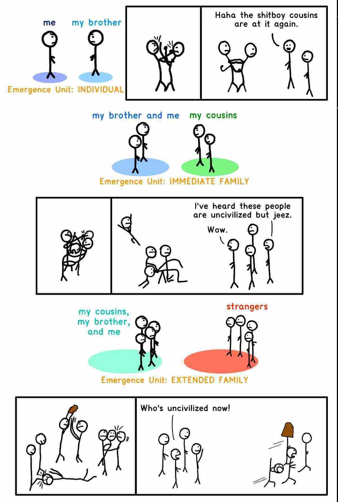

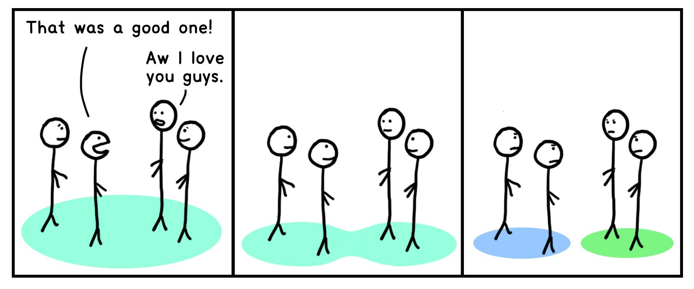

This is how golems function. A golem always must be the Us in a zero-sum, Us vs. Them conflict. The thing that allows multiple golems to merge into a larger golem is a common enemy—a common *Them* that makes the golems feel like a united *Us.* When that common enemy goes away, the higher-tier cooperation melts away and golems split back into smaller competing parts.

Golems *rely* on a common enemy for unity and for might. The stronger and more dangerous the rival *Them* seems, the stronger and more united the Us group will typically be.

If you pay attention to the world around you, and to your own psychology, you’ll spot this proverb in action. Ever notice how countries in one region of the world will often despise each other, focusing most of their national anger on each other—until there’s a broader conflict or war in play, at which time they put aside their differences? How different sects of a religion in fierce conflict with each other will suddenly find common ground when a rival religion or other outside entity insults or threatens their religion as a whole? How about when rivalries in club soccer become less heated during the World Cup? Or when political factions with differing or even totally contradictory ideologies start marching in the street, arm in arm, during a national election or mass movement? I saw people travel up the emergence elevator en masse in the days following 9/11, when millions of usually unfriendly New Yorkers were suddenly holding doors for each other, showing concern for each other’s well-being, and even hugging each other in the street. While an alien attack would suck overall, it would do wonders for species solidarity.

The proverb provides an important clue for understanding modern America. In the U.S., we can think of factions within a political party as the “brothers” in the proverb. That would make the two major political parties “cousins,” and other *countries* “strangers.”

The first half of the 20th century was dominated by world wars. International war put the U.S. into “*my cousins, my brothers, and me against strangers”*mode, which helped the entire American “extended family” psychologically bind together as a single Us.

During the 1950s, World War II was fresh in Americans’ minds, and some of that sentiment of national unity remained. At the same time, the two parties were themselves ideologically messy, with both containing a wide range of ideological positions, so “sibling” battles *within* parties were also vicious at the time.

So what is remembered as a time of relatively high political unity was actually full of division—it’s just that the division was *distributed* up and down the Emergence Tower. In other words, some of the country’s Primitive Minds were focused on the lower, “factions” tier of the tower, riled up about local or state politics. Others were gathered on the “parties” tier above, fixated on national politics. Others still were obsessed with international conflict up on the “countries” tier, intoxicated with patriotism and xenophobia.

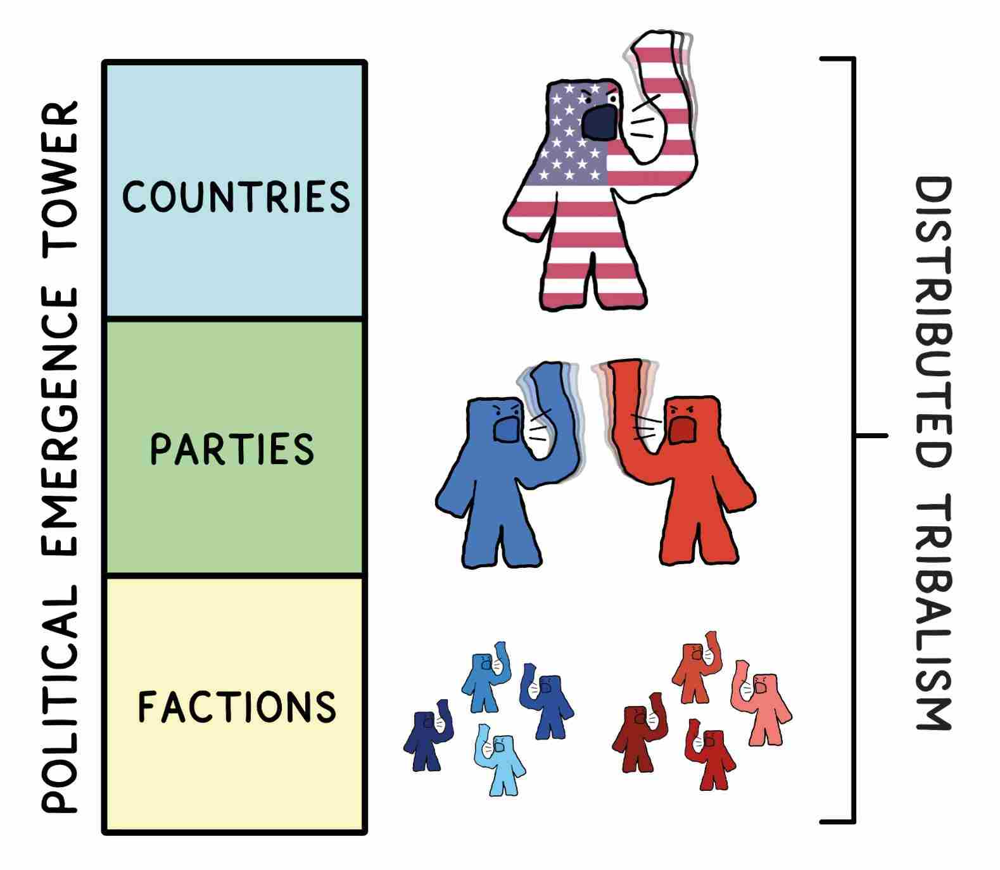

Distributed tribalism can help quell the Primitive Mind’s worst instincts on any given tier. Each “higher” divide helps unite the tier below (e.g., a foreign threat provides something for politicians to unite around). Each lower division helps take some of the heat off of the higher tiers (e.g., division within parties can incentivize factions to unite with like-minded politicians across the aisle). This balance prevents the rivalries on any one tier from subsuming the whole country.

But this kind of “distributed tribalism” relies on a tenuous balance. Primitive Minds gravitate toward the most intense tribal divide in their environment, and small changes to the environment can send a balanced distribution of tribalism into collapse. In the second half of the 20th century, the pillars upholding America’s political tribal balance began to crumble.

As the 1950s became the ‘60s, ‘70s, and ‘80s, World War II became a distant memory and the fear of Communism and nuclear war waned. International conflict that had sucked up a lot of the tribal air since the 1930s began to lose its grip over American Primitive Minds, whose thirst for common enemies increasingly turned inward to U.S. politics. In other words, *me, my brothers, and my cousins* lost the “strangers” that helped them all unite.

Meanwhile, another environmental change was in progress.

#### The ideological purification of America’s political parties

The 1960s was a chaotic decade in American politics, as sweeping economic programs were enacted and landmark civil rights legislation was passed, along with a Vietnam War that divided Americans more than it united them.

While all this change was happening, the country’s two major political parties were trying to figure out exactly who they were and what they stood for—and the Civil Rights Movement forced the issue. The Democrats had spent decades as an awkward alliance of progressive Northerners and conservative Southerners. Civil rights had become a transcendent cause for the Democrats’ young voters but supporting the movement would alienate the Southern voting bloc that Democrats needed to win elections.

Republicans, the proud party of Lincoln, came from a long tradition of fighting for the civil rights of Black Americans. They also came from a long tradition of being a largely white party with lots of voters who were icked out by multiculturalism and, in the 1960s, fearful of the rapid changes happening in the country. For these reasons, neither party was entirely for or against the Civil Rights Movement at the time.

When Barry Goldwater won the Republican nomination for president in 1964, it was the first domino to fall in what would prove to be a seismic shift in American politics. Goldwater had campaigned against the Civil Rights Movement and had tried to appeal to Southern segregationists to woo them away from the Democrats for the first time in a century. Goldwater wasn’t popular with much of his own party, and he was crushed in the general election, but he succeeded in winning an unprecedented number of the Southern states, which helped establish the Republican Party as the future home of civil rights opposition.

Political realignment tends to start off as a slow trickle, against a strong force of inertia and entrenched loyalties. But once the trickle starts, it can become a self-reinforcing process. The events of 1964 were enough to start that trickle.

Black Americans had been somewhat split in 1960, with 32% voting for Nixon, the Republican candidate. But after watching Goldwater spend his campaign openly flirting with Southern racists, Black Republicans were like “yeah, no” and moved en masse to the Democrats (Goldwater won only 6% of the Black vote), along with many other progressive Republicans.

Four years later, with the Republicans now having alienated their progressive base in return for new voters from the South, Richard Nixon doubled down on Goldwater’s “Southern strategy.” He was careful not to criticize the segregationists and many have accused him of dog-whistling to Southern whites with calls for “states' rights” and “law and order.”

Meanwhile, the Democrats were dealing with the rise of their own extreme faction—the young, radical, politically militant New Left, with their drugs and their campus protests and their signs and their hair and their riots. The Democrats, no longer able to rely on their Southern bloc, were hesitant to criticize the often illiberal and sometimes violent elements of the New Left.

When moderate and extreme factions are vying for a party’s identity, anything but a loud, unwavering rejection of the hardliners is an implicit admission that those factions are indeed part of who the party is. Because if that *weren’t* the case, the party would of course make it crystal clear: “those people are *not* who we are.” Neither party would take this stand, allowing hyper-polarizing factions to take up long-term residence in the parties’ identities. Extreme factions are like repellent magnets, and the more prominent they become, the more each party becomes defined as the place for people who hate the other party’s extreme faction.

This is how a trickle of realignment can quickly accelerate. Conservative Democrats and progressive Republicans are driven to switch parties by their party’s growing hardline ideological faction, which shrinks the area of overlap. Politicians respond in kind by catering their messages more to the hardliners, which causes more defections, and ideological plurality within the parties slowly morphs into ideological purity.

In the terms of our proverb, conflict between “brothers” melted away as the parties increasingly became ideologically unified. With the “strangers” mostly gone and the “brothers” more united, the distributed tribalism of the 1950s began to rapidly collapse into a single, concentrated tribal divide between the American Left and the American Right.

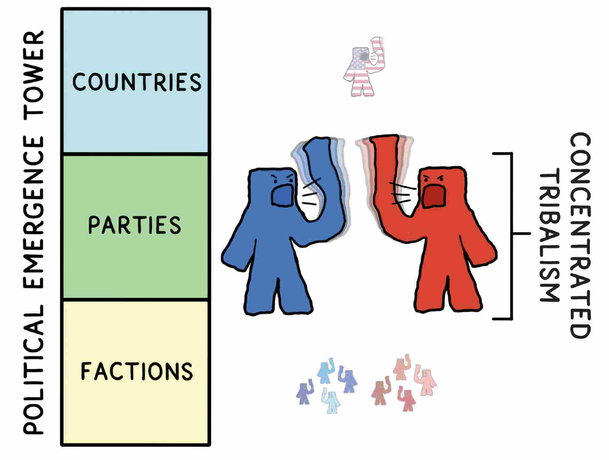

###### Shift 2: Concentrated Tribalism → Hypercharged Tribalism

### Geographic Sorting

Over the past generation, Americans have become more educated, which has made them more mobile. The Economist notes that “45% of young Americans with a college degree moved states within five years of graduating, whereas only 19% of those with only a high-school education did.”

### Defining “Polarization”

There are a lot of modern disagreements about political polarization—some of which seem to stem from semantic confusion.

Many have pushed back against the notion that American voters have become ***ideologically* polarized**, pointing out data that suggest Americans, while more sorted in a partisan sense, have not grown more extreme in their views (i.e., there aren’t fewer people in the center than there used to be). This is true—ideological sorting is far more prevalent among politicians than voters.

But when many of us talk about how politically polarized America seems to be today, we’re talking about something different: ***affective* polarization**, i.e., people not trusting or liking those from the other party. This *has* been on the rise—and this is the phenomenon we’re mostly exploring in this chapter.

And here’s the thing about mobility: If lots of people have the means to choose where they settle down, and those people tend to have even a *slight* preference to live near other people like them, everyone ends up totally segregated. This phenomenon is explained in a 1971 paper called Dynamic models of segregation, and it’s nicely illustrated in an interactive simulation by online creators Nicky Case and Vi Hart.

The simulation has two kinds of characters: blue squares and yellow triangles.

These could represent people of different religions, races, socioeconomic backgrounds, or anything else.

In the simulation, there’s one key metric, called “bias percentage”—a number that represents how important it is to the shapes to have neighbors that are like them. If the bias percentage were 33%, it would mean that the residents need at least a third of their direct neighbors to be like them, or they’ll move. If one-third or more of their neighbors are like them, they’ll stay.

The simulation starts with a random scattering of blue squares and yellow triangles, and it lets you set the bias percentage of the neighborhood’s residents. I started by setting it to 20%. When I did this, a few of the residents became “unhappy” and the simulation rejiggered things until every resident’s 20% minimum similar-neighbor threshold was met. It resulted in a neighborhood that was still pretty mixed up:

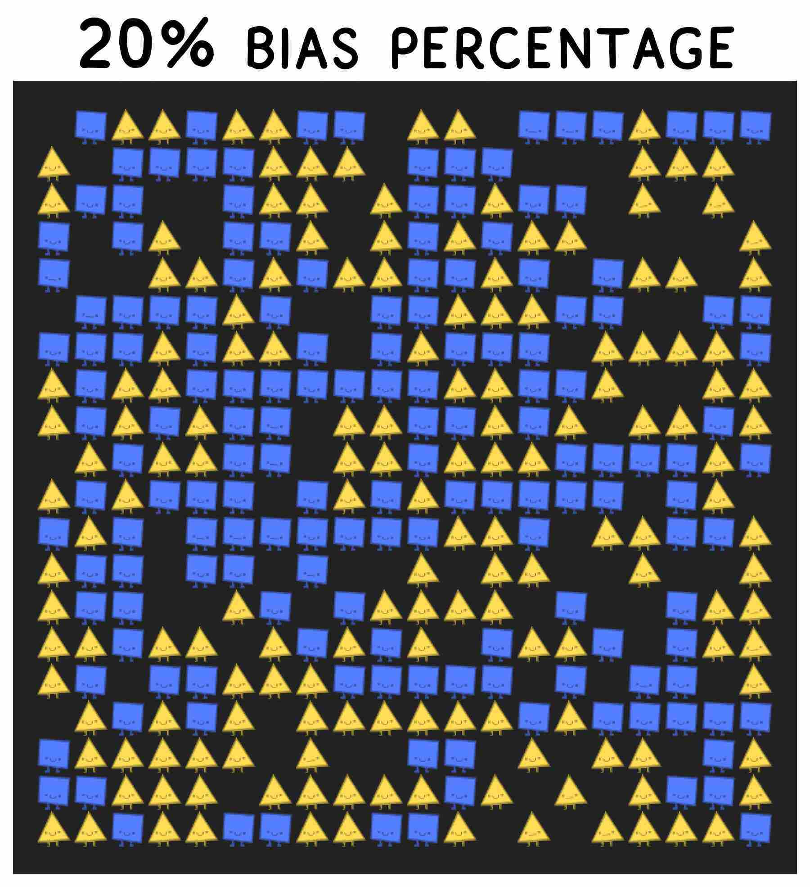

But then I bumped the bias percentage up to 33%, which made a few more residents unhappy. To satisfy everyone, the simulation had to make things much more homogeneous. When I bumped the percentage up again, this time to 50%—meaning the shapes are still totally fine with variety, they just don’t want to be in the minority in their neighborhood—we end up with complete segregation:

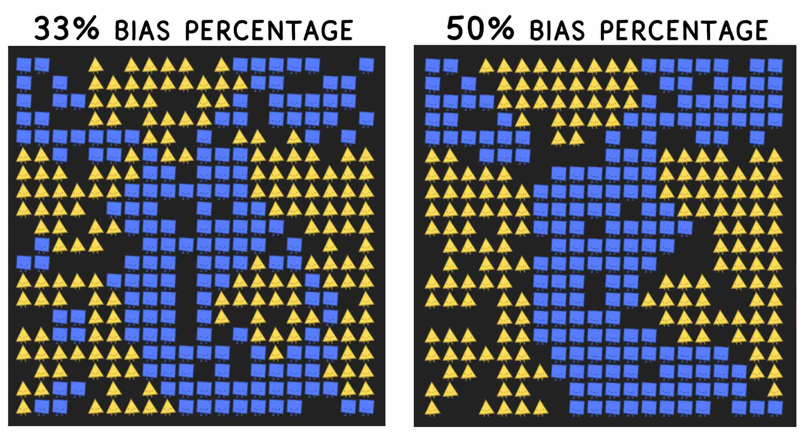

All it takes is a little bit of bias for almost everyone to end up surrounded entirely by people like them. As Case and Hart put it, “Small individual bias can lead to large collective bias.” In a simplified simulation like this, the only way areas stay diverse—racially, ethnically, politically—is if people prefer diversity significantly more than they dislike being in the minority.

Now consider that alongside another fact: as the political parties purified ideologically, political identity took on more meaning. Over time, the parties also began to purify *culturally.*

Modern progressives in the U.S. today don’t agree only on political stuff—they’re likely to not be religious, to have gone to college, to shop at Whole Foods, to read *The New York Times*, to like backpacking and avocado toast. U.S. conservatives, beyond their ideological similarities, often go to church, eat at Cracker Barrel, watch *Fox News*, and like NASCAR. These are, of course, massive generalizations with a million exceptions—but as the simulation shows us, even if this is a *little* true, it can have major implications.

A friend of mine just moved with his family from New York City to Vermont. When he was telling me about their new location, he emphasized that they loved their little town because it was largely progressive. Is it important to my friend to live near people who share his views on tax policy? No. What he really meant is that he and his family just want to be near “people like them.” He wanted to be near the shops, activities, restaurants, and schools that people like them tend to like, near people who use their kind of slang, watch their kinds of TV shows, and vacation in their kinds of places.

In 1950, people wanted to live near people like them too—but with the political parties so mixed up, a culturally homogeneous neighborhood might still be politically diverse. Today, the parties have become proxies for two vast macro-cultures, so seeking out people like you also often means ending up surrounded by people who share your politics.

In his book *The Big Sort,* Bill Bishop examines how Americans have shifted geographically in relation to political leaning—and he found that Americans are far less likely to live in politically diverse areas than they used to be. The idea is that Americans have formed *geographical* Echo Chambers, where they find themselves surrounded by political likeness at dinner parties, at local churches and parks and businesses, and at the schools where children make their lifelong friends.

In a congressional election, pollsters define a “landslide county” as one in which the winning candidate beat the losing candidate by 20 percentage points or more—in other words, a very red or very blue county. In the 1976 presidential election, 27% of Americans lived in landslide counties, with the remaining 73% living in more politically balanced “purple” counties where the election margin was closer. By the 1992 election, the percentage of Americans living in a landslide county had moved from 27% to 38%. That number has continued to rise, with 58% of Americans living in a landslide county during the 2020 presidential election.

Some argue that it’s not so simple. A number of experts argue that the “landslide district” numbers are more of a peculiarity of presidential elections than a general trend. Some dispute the causal relationship, arguing that political sorting is more of a reflection of people’s views coming to match their surroundings than people moving to places that match their politics.

Whatever the case, most experts agree that political tribalism is on the rise. This certainly matches my observations: Americans seem to be spending a lot more time talking with those who agree with their politics than thoughtfully engaging with those who don’t.

When people are surrounded by ideologically homogeneous groups, their views become more extreme. In an interesting study, researchers examined the effects of a kind of “deliberation day,” when two groups of citizens from politically homogeneous areas got together to discuss hot political issues:

Groups from Boulder, a predominantly liberal city, met and discussed global warming, affirmative action, and civil unions for same-sex couples; groups from Colorado Springs, a predominately conservative city, met to discuss the same issues. The major effect of deliberation was to make group members more extreme than they were when they started to talk. Liberals became more liberal on all three issues; conservatives became more conservative. As a result, the division between the citizens of Boulder and the citizens of Colorado Springs were significantly increased as a result of intragroup deliberation.* Deliberation also increased consensus, and dampened diversity, within the groups.*

So cultural sorting yields political sorting as a byproduct, and the resulting homogeneity then makes everyone’s political views more extreme. You end up with increasingly partisan people, holding increasingly negative perceptions of people from the other party, which makes everyone even more determined to surround themselves with people from their own tribe. It’s a classic vicious cycle.

And this is only the beginning of our environmental troubles. In the book’s intro, we talked about exponential technology, and how it can be both a blessing and a curse. The tech revolution of the past 30 years has ramped up political tribalism to another level entirely.

### Narrowcast Media

Here’s a lens I call the Media Matrix:

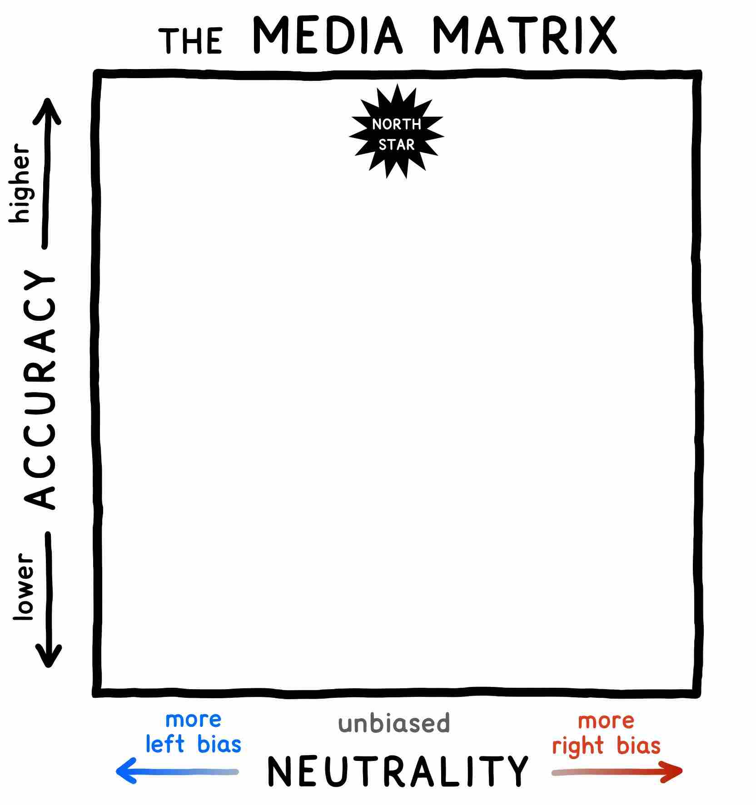

### A Note on Neutrality

Neutrality doesn’t mean portraying both political sides as equally good or equally right. It means portraying them as they are. Sometimes both sides deserve an equal share of praise or blame, in which case neutral media would report on that parallel. But when one side is behaving worse than the other side, neutral coverage portrays exactly that. Depicting both sides as equal when they’re not (aka “bothsidesism”) is not neutral, but is biased toward “presenting the sides as equal.”

Every media brand, media personality, or journalist can be plotted somewhere in the matrix.

At the top-middle of the Media Matrix is media’s North Star. Here you have media sources that are rigorous about both accuracy and neutrality, trying their best to present the truth, the whole truth, and nothing but the truth—along with acknowledging when they don’t *know* what the truth is. This is the realm of high-rung journalism.

As you move to the left and right of the North Star, political bias begins to creep in. Media voices will tell most of the story, but they may omit certain unhelpful-to-their-cause stories. When you get all the way to the upper corners, you have brands with a serious bias—careful about accuracy but not about neutrality. Everything they report is carefully cherry-picked.

As you move *down* in the Media Matrix, accuracy diminishes as a core value in favor of profit, entertainment, a political agenda, or something else. A news source down here is a steadfast ally to its partisan audience, and it stays current with the latest talking points in Political Disney World, even if that means twisting stories, using misleading statistics, pulling quotes out of context, treating rumors as facts, or any other form of bullshit.

#### ****From broadcasting to narrowcasting****

In the 1980s, most Americans got their TV news from the Rather/Jennings/Brokaw trio on CBS, ABC, and NBC; in earlier years, from nationwide titans like Walter Cronkite. In those days, networks competed to capture the largest share of American viewers. They were careful to avoid seeming politically biased and they knew that reporting a story incorrectly could lead to damaged credibility and a loss of viewers. They were incentivized by market forces and government regulation not to stray too far from the North Star.

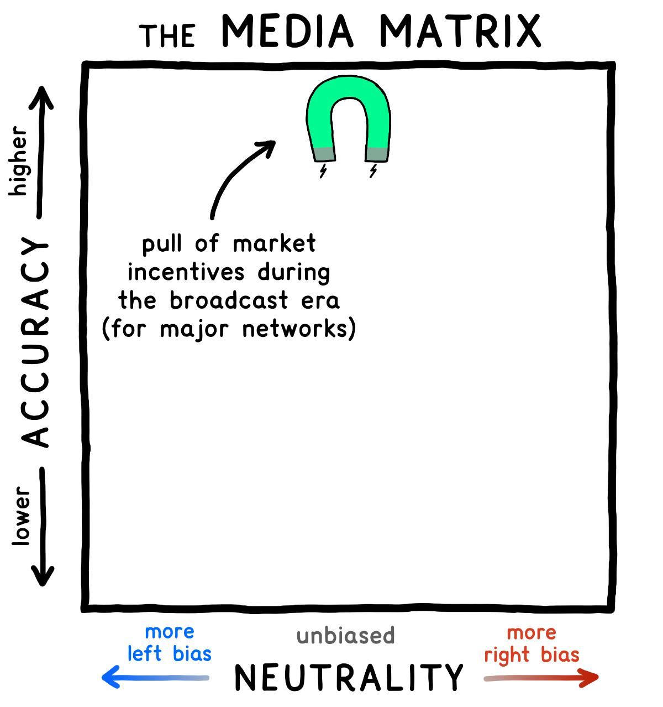

In recent decades, new technology has dramatically changed this landscape.

First, there was **the explosion of cable television** around 1980, and with it, the advent of 24-hour cable news (CNN launched in 1980). Cable channels, with hazier expectations than mainstream networks and 24 hours a day to work with, could be more experimental with the way they covered the news.

Then there was **the end of the Fairness Doctrine.** In 1949, the FCC (the U.S. Federal Communications Commission) established the Fairness Doctrine, which required anyone who held a broadcast license to present “controversial issues of public importance” in a “fair and balanced” manner, giving airtime to “contrasting viewpoints.” In 1987, in the face of arguments that the Fairness Doctrine was in direct conflict with the First Amendment’s freedom of the press clause, it was repealed.

The removal of the Fairness Doctrine was soon followed by a sharp rise in overtly partisan media. Conservative talk radio exploded onto the scene in the late 1980s, most notably with The Rush Limbaugh Show, which debuted to a national audience in 1988 and made Limbaugh the country’s most syndicated radio host by 1991. In 1996, Fox News and MSNBC were born. Rather than broadcasting to all of America, these new media channels could *narrowcast* to a specific subset of the country.

In college in 2004, I attended a live interview with Ted Koppel, the anchor of ABC’s late-night news show Nightline. I remember the host commenting that Koppel was famously secretive about his own political leanings. This was the standard for prominent anchors in the past, but by the end of the 1990s, a huge portion of Americans were getting their news from people whose political leaning was supremely out on the table.

While these changes were happening, the internet sprung into our lives, and with it, sites like The Drudge Report (1995), Slate (1996), The Huffington Post (2005), and Breitbart (2007), along with a trillion political blogs and YouTube channels. The internet took narrowcasting up into a new gear: full-fledged tribal media.

Meanwhile, Fox News and conservative radio continued to grow in size and influence, generating an insular right-wing information bubble that persists today. This was countered with a new genre of TV news on the Left—political comedy shows. *The Daily Show* began in 1996 and became a multi-decade sensation by serving as—depending on who you ask—either the voice of reason and sanity in the face of growing right-wing madness, or a show where elitist progressives would cackle as Jon Stewart relentlessly mocked their political out-group. *The Daily Show* was followed by a slew of similar “look at how awful the Right is” comedy/news shows, hosted by *Daily Show* alums like Stephen Colbert, John Oliver, and Samantha Bee.

Narrowcast media caters to homogeneous audiences, which decreases the incentive to worry about neutrality and heightens the incentive to provide viewpoint confirmation. Rather than tell people which candidate is *likely* to win the next election like the old days, narrowcast media reaps huge rewards for telling people why their favorite candidate *ought* to win. With little risk of reputation damage for biased coverage, narrowcast media can continually bash one side while giving the other side a free pass and end up with a more loyal audience for it. If broadcast media functions like a top-rung Scientist, narrowcast media functions like a third-rung Attorney. Because when the environment changes, so does behavior.

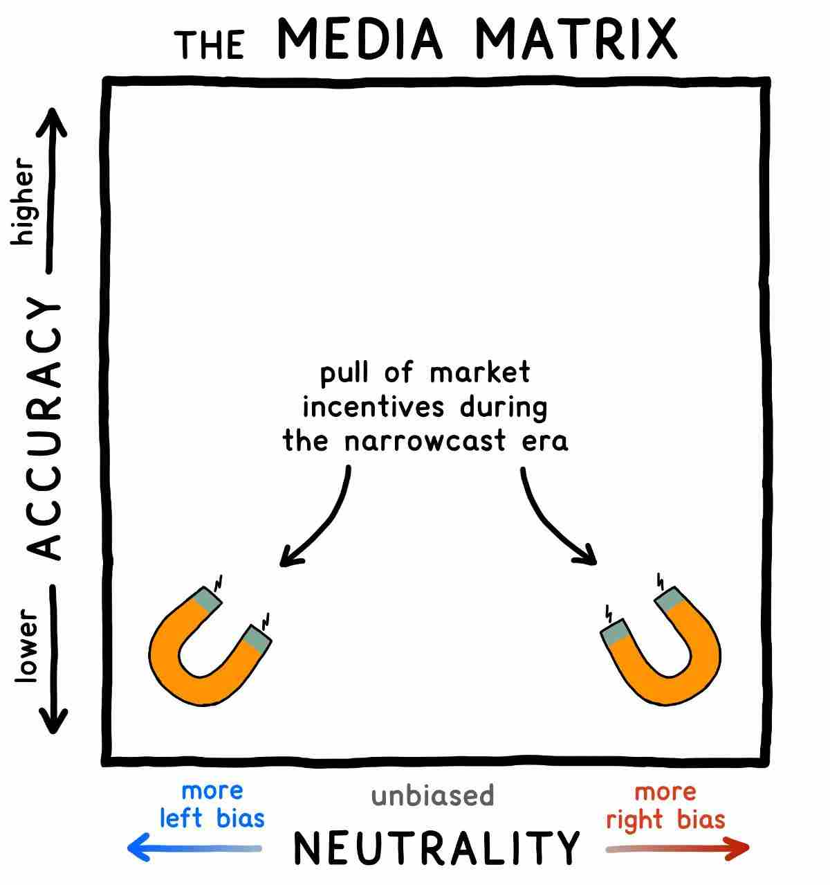

#### Junk food

Many businesses have learned that a great way to make money is to sell directly to the simple, predictable Primitive Mind. To sell food to the Higher Mind, you have to worry about quality and nutrition, which is expensive and hard. Instead, you can sell Skittles to the Primitive Mind, who mistakes them for nutritious food.

If professional news coverage is nutritious food, political junk food looks like this(all actual headlines):

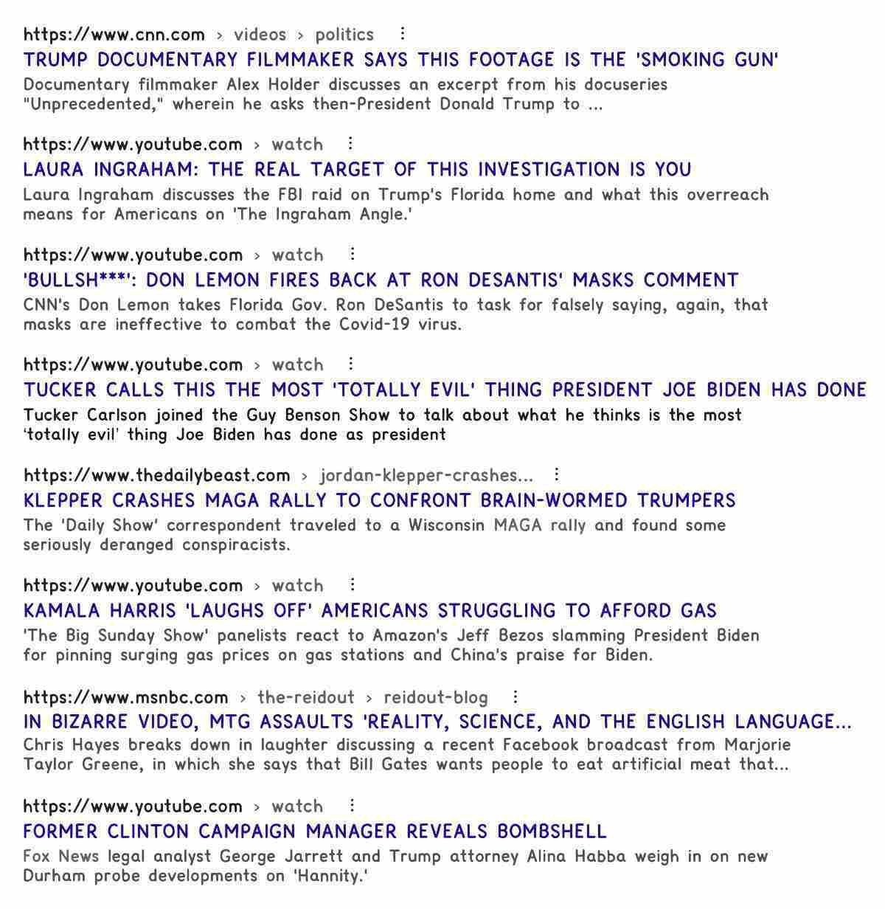

The confirmation promised by these kinds of headlines looks as delectable to the Primitive Mind as the sweet sustenance promised by a Skittles wrapper. Political junk food isn’t geared toward learning. The headlines tell you from the get-go which side will win and which side will lose. It combines three of the Primitive Mind’s favorite things: viewpoint/identity confirmation, out-group bashing, and gossip.

The explosion of the political junk food market has dragged many American minds downward into Political Disney World, the land of good guys, bad guys, and simple storylines—which in turn has continually raised the demand for junk food.

The further this cycle goes, the harder it is to reverse. Media brands that offer up one-sided tribal junk food end up alienating high-rung minds, which makes the brands that much more dependent on the junk-food-loving low-rung audience. And tens of millions of Americans end up with political diabetes.

As the media junk food industry has grown and matured, it has increasingly immersed its audience in a new, hideous genre of entertainment:

#### Political reality TV

Broadcast TV news aimed to be a show about reality. Narrowcast news tries to be a reality show. Big difference.

Reality is interesting sometimes. Reality shows are interesting all the time. And what’s the reality TV producer’s best trick? Drama and negativity. Would anyone watch The Real Housewives of Beverly Hills if the characters got along most of the time? Of course not. That’s why every five minutes of the show includes a conflict of some kind.

As soon as you realize that news media is also entertainment media, the constant coverage of conflict and drama makes perfect sense.

In the U.S., many of us are addicted to a trashy reality show I call The Real Politicians of Washington D.C.

The cast changes from year to year, but the formula is the same: there are whole teams of heroes and villains, lots of ongoing storylines, and endless conflict. It’s a perfect vehicle for a dramatic, super-addictive soap opera.

It’s not that these heavily featured politicians or the played-up storylines are unimportant. It’s that we receive a totally skewed depiction of the *full set* of relevant political issues. The issues that make headlines day in and day out are usually overrepresented, while lots of other important political stories—like the bills being approved each week by the 50 House and Senate committees—are woefully underreported.

I recently had a chance to talk with a U.S. representative named Derek Kilmer. Kilmer is the former head of a major congressional coalition of moderate Democrats with 99 members. He’s full of nuanced, measured, well-thought-out ideas for how to make the country better. Which is exactly why you’ve never heard of him. The editors of The Real Politicians waste no airtime on politicians like Kilmer because he’s measured and nuanced and I’m falling asleep just writing this sentence.

Actual politics, like actual reality, is boring to most people. So tribal media brands do what reality TV producers do—they manufacture a carefully edited, fictional version of politics that’s wildly entertaining.

That’s why most Americans who will tell you they’re passionate about politics can barely name ten current members of Congress. They probably can’t name all the U.S. representatives from their state, let alone members of their state legislatures. But they can tell you about the 10 or 15 politicians chosen by the media to be the main characters on *The* Real Politicians, along with the five or ten hot button issues the show features in any given month.

Concentrated tribalism has led to increased division—but *The Real Politicians* adds fuel to the fire by making the distinction between the parties seem even *more* stark than it actually is.

Take the issue of climate change, where we’re regularly presented with this storyline:

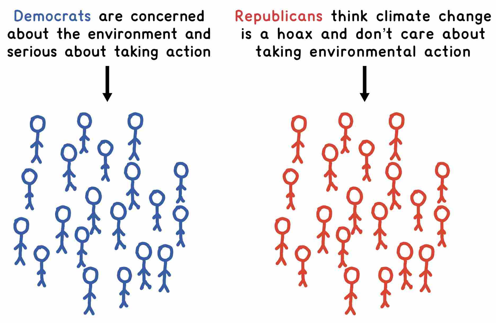

So I was surprised to see this data:

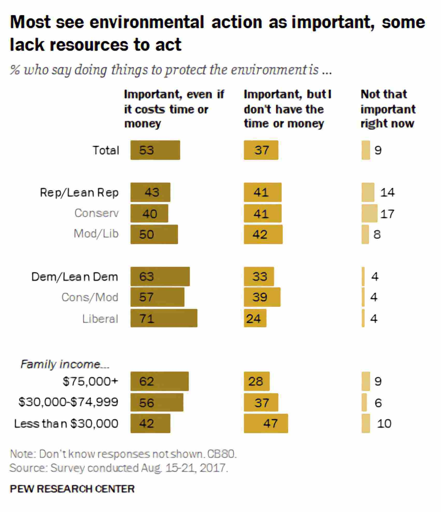

Which suggests that things are more like this:

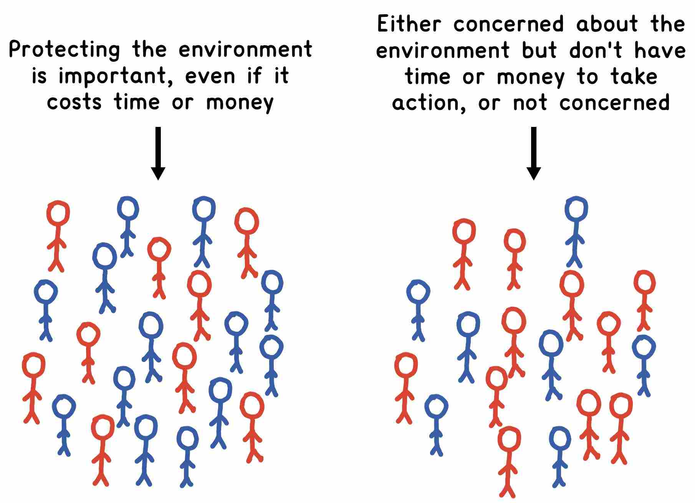

Very different story. Of course, it’s also true that many Republican politicians have been dismissive of climate change. And “doing things to protect the environment” is not necessarily the same as taking action to curb emissions. But the survey makes me feel very differently about the strategies climate activists should be using to build the necessary coalition to change our trajectory.

Presenting an inaccurate version of reality breeds misplaced anger and division and hurts our ability to move toward important goals—all in the name of editing the reality show to be more entertaining with crisper, juicier storylines.

The most dramatic events on The Real Politicians are elections. Elections are the show’s climactic season finales. And the show’s editors make sure to over-dramatize the shit out of them.

This is the past century of U.S. presidential elections.

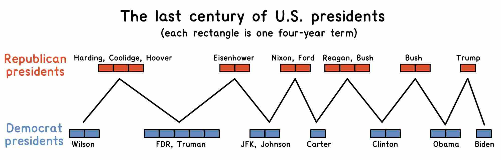

It’s a clear zig-zag pattern. And yet, I remember when Bush won reelection in 2004, media commentators were talking about how Democrats couldn’t win races anymore for a number of seemingly rock-solid sociological reasons. Then the Democrats swept the midterms in 2006 and won the presidency in 2008.

I remember in 2012, when Obama won reelection, hearing people say that the country had fundamentally shifted, that there were more first-generation Americans than there used to be, that the Tea Party had rendered the Republican Party irrelevant, and all of this other proof that times had changed and the Democrats wouldn’t ever lose a presidential election again.

Then Republicans swept all three branches of government in 2016, at which point I read all these articles about how the Left is more *culturally* powerful, but the Right is simply more politically powerful. I also heard a bunch of stuff about how gerrymandering ensured that the Democrats would never win back the House again. In 2018, the Democrats won the House and then swept the Congress, Senate, and presidency in 2020.

I don’t know what truly motivates today’s media. Maybe they make politically motivated propaganda. Maybe they make profit-motivated entertainment, which happens to double as political propaganda. Whatever the motivation, the consequence is the same: enhanced political tribalism.

Around a decade after the transformation to narrowcasting began, another technological development added even more fuel to the fire.

### Internet Algorithms

I appreciate the Google search algorithm. It filters results that are most relevant to where I live and what I’m typically interested in, and it can guess remarkably well what I want to search for after I type just a few letters, saving me the trouble of typing the whole search.

I appreciate the YouTube algorithm, which knows my favorite channels and makes sure I never miss their latest videos.

I appreciate the Facebook algorithm, which spares me the knowledge of what Jake from high school 20 years ago made for dinner last night while making sure to let me know when Jake gets engaged, so I can go look through his 87 most recent photos to see the deal with his fiancé.

Internet algorithms can be great things.

But new technology often comes along with unanticipated consequences.

When I’m watching a YouTube video and I glance at the thumbnails on the sidebar, I’m more likely to click on a video featuring someone explaining history or science than I am to click on a video featuring someone reviewing movies. YouTube has picked up on that, which is why I never see movie review videos on my YouTube sidebar, but I’m constantly being introduced to new history or science explainer videos.

But then one night last year, someone sent me a funny video a driver took with their phone. The driver taking the video had pissed off another driver, who opened his window and started screaming curses. The angry driver got so worked up that he swung his arm at the video-taking driver angrily, and in the process, punched *his own side mirror* off. A delight of all delights.

Then the video ended, and YouTube offered me my choice of nine more videos in the road rage genre. I clicked on one of them and watched it. Then YouTube offered me nine more. I had a lot of work to do, so I held down the Command key and clicked on all nine, opening them in nine new tabs, and watched them all. Two hours later, utterly disgusted with myself, I pulled the dramatic “punishing Chrome by holding down Command-Q and closing all eight Chrome windows and all 127 of their open tabs” move. A nightmare waste of time. But at least it was over.

Except it wasn’t over. Somewhere out there, the YouTube algorithm was baiting its Tim Urban fishhook with the best of the best road rage videos, which have reliably appeared in my YouTube sidebar ever since that regrettable night, damning me to an entire life wasted watching hilarious road rage videos.

Internet algorithms are profit-maximizing mechanisms that want to spoon-feed me whatever I’m most likely to click on. This is a win-win, symbiotic relationship—until it’s not. When an algorithm is jibing with your Higher Mind, it’s your friend. When it’s luring in your Primitive Mind against your Higher Mind’s will, the relationship is parasitic.

So how does this apply to politics? Primitive Minds like to click on political junk food. They’re drawn to articles and videos that don’t just report the news but sensationalize it and make it *entertaining*. The YouTube sidebar can quickly turn into a wall of *The Real Politicians of Washington D.C.* content the same way YouTube inundated me with road rage videos. This feeds political tribalism and distorts our picture of reality.

Then there’s social media, a phenomenon so peculiar and so specific to modern times that it would seem incomprehensible to everyone who came before us. Social media doesn’t just amplify political junk food, it plays a role in shaping it. When a new political news story makes waves, thousands of hot takes quickly bubble up. It’s not necessarily the most accurate takes that rise to the top but those that are most likely to make people click the retweet or share button—those that have the catchiest wording and hit the right emotional buttons. Through an almost evolutionary process, complex topics are dumbed down and packaged into irresistible nuggets for our Primitive Minds.

Only a minority of people are hyperpartisan. But internet algorithms make people who are already extreme even more extreme. On social media, these voices disproportionately drive the conversation, making people *feel* like things are even more nasty and polarized than they actually are.

In the 2020 documentary *The Social Dilemma,* computer scientist Jaron Lanier uses Wikipedia as an example to highlight the craziness of this situation:

When you go to a [Wikipedia] page, you’re seeing the same thing as other people. So it’s one of the few things online that we at least hold in common. Now, just imagine for a second that Wikipedia said, “We’re gonna give each person a different customized definition, and we’re gonna be paid by people for that.” So, Wikipedia would be spying on you. Wikipedia would calculate, “What’s the thing I can do to get this person to change a little bit on behalf of some commercial interest?” Right? And then it would change the entry. Can you imagine that? Well, you should be able to, ‘cause that’s exactly what’s happening on Facebook. It’s exactly what’s happening in your YouTube feed.

What happens on social media often determines what happens in the actual media. In his book *Why We’re Polarized*, Ezra Klein talks about the way journalists choose what to cover—the way they decide *what is newsworthy*. “A shortcut to newsworthiness,” he says, “has always been whether other news organizations are covering a story—if they are, then it’s newsworthy by definition.”

In the past, audience members had limited ability to influence what news was covered. But social media changes the equation. “In the modern era,” Klein writes, “a shortcut to newsworthiness is social media virality; if people are already talking about a story or a tweet, that makes it newsworthy almost by definition.**”**

It’s a vicious cycle. As political junk food pulls audiences further into Political Disney World, the low-rung narratives go more viral, more often, on social media. These viral narratives are then converted into a wave of new junk food media content, which reinforces and legitimizes the ideas circulating on social media. The connectivity of the internet melds media and its audiences into a single self-perpetuating system.

It's no surprise where all this leaves us.

### Separate Realities

Pew data, collected since 1994, shows us that the gap between the viewpoints of Democrats and Republicans has grown on a selection of issues across the board:

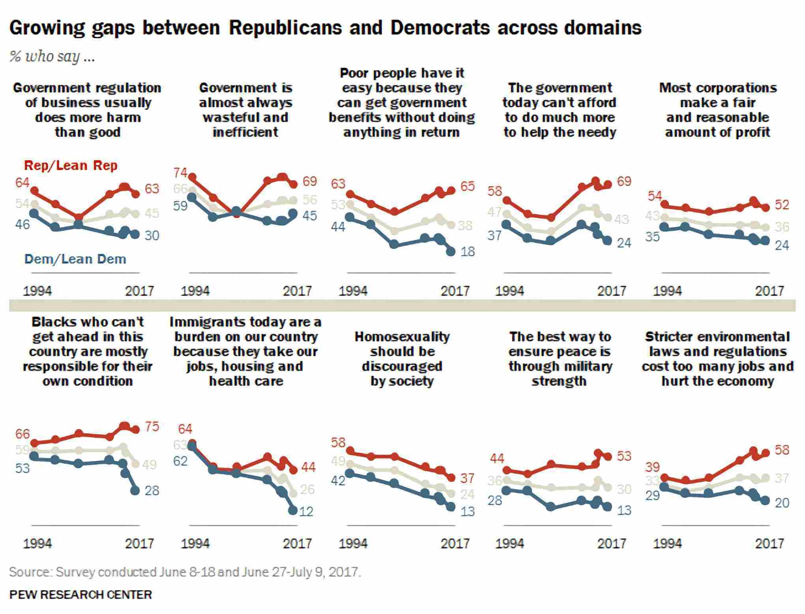

Averaging out the growth of the gap in those ten graphs yields a smooth upward trend—even as gaps in viewpoints between other kinds of demographics have remained unchanged:

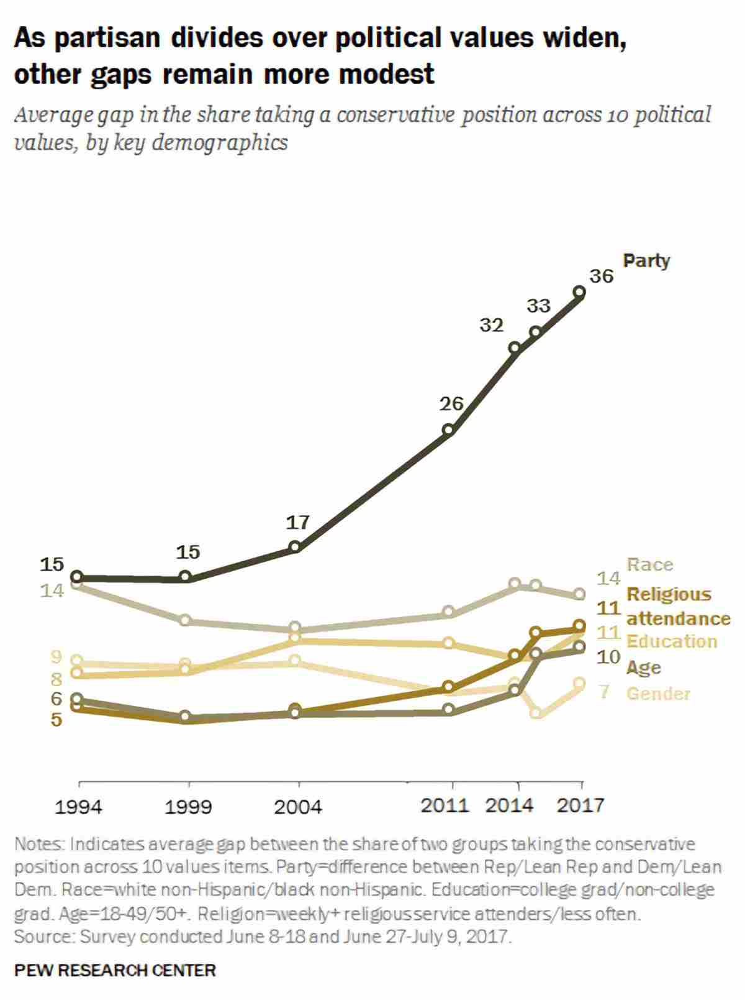

When we hear about growing political division, most of us assume it means citizens are divided in their *values*—that people are unable to agree about What Should Be. But take another look at the ten questions from Pew. There’s an element of What Should Be embedded in some of the questions—but mostly, they are questions about What Is. Many are statements about the status quo that the two political sides do not agree on.

We see the same story again and again. A 2020 poll called *Dueling Realities* found that 81% of Republicans believe “the Democratic Party has been taken over by socialists,” while 78% of Democrats believe “the Republican Party has been taken over by racists.” In 2022, Pew found that 72% of Americans believe that “on the issues that matter to them, their side in politics has been losing more often than winning” while only 24% felt that their side was winning more than losing—a natural result of political media that increasingly focuses on grievance and negativity.

A 2017 survey titled “The Parties in our Heads” had an even more revealing finding: *the more political news respondents consumed, the more skewed their perception of members of the other party.*

Separate realities are a natural consequence of market incentives moving from the North Star region closer to the lower corners of the Media Matrix, where there’s almost no overlap in coverage between the two sides. It makes sense that those most hooked on political media would be the most delusional, the same way consumers of political news in dog-raccoon-ville left the pro-dog and pro-raccoon crowds with totally different perceptions of reality.

### A Rise in Bigotry

News media is infamous for what we could call “destructive cherry-picking”—a selection bias that sees negative stories as the most newsworthy, because they draw the most interest. It’s why, for example, Americans surveyed by Gallup since 1990 consistently think crime is increasing, even though in almost every one of those years, it decreased from the year before.

Destructive cherry-picking spreads fear and pessimism, and over the past 20 years, it’s been steadily on the rise. In political media, this can have especially dangerous consequences.

Geographic sorting means many people barely spend time with anyone on the other political side, so the only information they have on what those people are like comes through distorted media and social media filters. The right-wing narrative floods right-wing people with anecdotes that make it seem like everyone on the left positively despises them and everything they stand for, and vice versa. Outrage about these messages then spreads like wildfire on social media.

Vocal Primitive Minds activate other Primitive Minds. Presenting people with a steady stream of “they hate you” jolts awake their Primitive Minds, in many cases filling them with reciprocal disdain, clouding their humanity, and flipping on that ancient tribal switch that makes people want to band together into golems. Portraying a society where everyone hates each other becomes a self-fulfilling prophecy. So it’s no surprise that between 1994 and 2022, the percentage of people who rate the opposing party as "very unfavorable" has tripled.

It doesn’t take long before this awakens the scariest human emotion of all: disgust.

Like happiness, sadness, anger, and fear, disgust is a basic emotion, meaning that it’s hardwired into all humans. Basic emotions were helpful for survival in the ancient human world. A Google Images search for “disgust” shows a bunch of people, all making the same hideous face—squinting their eyes, curling up their noses, and exhaling (and if it gets really bad, exhaling turns to gagging and eventually vomiting). Scientists believe this is evolution’s way of getting us to close up our incoming passages and expel outward whatever we can, in order to protect ourselves when we’re in the presence of toxins or disease. We react this way to anything our primitive software believes is potentially dangerous and disease-carrying—like rotten food, blood, feces, or maggots.

The strange thing is that disgust can carry over to how we view people. There’s a sizable amount of research that suggests that when people are exposed to something that brings out their disgust emotion, they become harsher moral judges. In one experiment, a group of Canadians were shown disturbing-but-not-disgusting images of car accidents while another was shown photos of coughing people and other disease-related visuals. Then both groups were questioned about which countries they felt Canada should try to attract immigrants from. Both groups showed a preference for immigrants from familiar countries over immigrants from less familiar countries, but the group that had seen images of disease felt this preference much more strongly. In another study, participants sitting at a dirty desk were harsher in their judgments of a series of criminal acts than participants sitting at a clean desk. In another, a wafting noxious odor made participants feel less warmly toward gay men.

Scientists use the term “behavioral immune system” to describe the theory that disgust in humans is linked to xenophobia and discomfort with practices and rituals (especially sexual) that seem foreign or different to us—an ancient impulse we developed long ago, when contact with foreign people and practices often did put you at risk of disease.

The reason I call disgust the scariest of all human emotions is that it’s a trigger for dehumanization, and dehumanization is the doorway to the worst things humans do. It’s not a coincidence that two of the most horrifying events in recent human history—the Holocaust and the Rwandan genocide—were made possible by disgust. Nazi propaganda constantly compared Jews to disgust-inducing animals like rats, swine, and insects. The Rwandan radio broadcasts that incited the 1994 genocide referred to Tutsis as “cockroaches” repeatedly. These are just two examples of a well-worn tradition.

Disgust fills our mind with a special kind of primitive fog—one that turns ordinary humans into psychopaths who can commit or condone unthinkable harm without remorse. Scary shit.

Geographic sorting and political junk food make a lethal combo, ripe for disgust. It’s hard to feel dehumanizing disgust for people you know personally. Less hard when you rarely see your enemies in person. Less hard still when destructive cherry-picking teaches you only the worst about them. As affective polarization has risen, political opponents have gone from seeming like wrong or stupid people to seeming like disgusting people.

We like to think of bigotry as something that other people do. But we’re all capable of rank bigotry when our environment pushes the right buttons in our psyche.

Political bigotry is as real as any other bigotry. In a 2014 paper on political polarization in the U.S., political scientist Shanto Iyengar and researcher Sean J. Westwood find evidence that *“*hostile feelings for the opposing party are ingrained or automatic in voters’ minds” and that “partisans discriminate against opposing partisans, doing so to a degree that exceeds discrimination based on race.”

Bigotry is at its most dangerous when it goes unrecognized. The best tools to combat bigotry are social norms that penalize its expression—but today in the U.S., political bigotry is rarely treated as taboo.

### Downward We Spiral

Human environments are made up of a complex fabric of culture, norms, values, laws, and prevailing beliefs. Changes to any element of our environment can trigger changes in other parts of the environment, which in turn can cause more changes.

We discussed the way that the advent of tribal media made people more partisan and more hooked on political junk food, and how the resulting rise in demand pushed media to be even more tribal and one-sided.

A similar feedback loop has taken place between voters and politicians. Increasingly partisan politicians draw constituents deeper into Political Disney World, and a lower-rung electorate is more likely to reward politicians who cater to the low-rung mindset and snub the politicians who act like grown-ups.

Side-by-side with these macro trends are other changes political scientists have studied—like increased competitiveness for legislative majorities, changes in electoral rules, changes to campaign finance rules, and rising immigration. The extent to which these changes are causes or effects of today’s political atmosphere is up for debate. I won’t analyze all these here, because for our purposes, what matters is the big trend toward hypercharged tribalism, not the full array of potential causes for it.

As political tribalism has ramped up, the number of undecided votes has dwindled. It makes less sense than it used to for candidates to try to persuade moderate voters and more sense to run hyperpartisan, negative campaigns that fire up their base and increase turnout.

And as the media’s political coverage has morphed into a reality TV show, it has created an incentive system that rewards politicians who use inflammatory rhetoric. As the famously bombastic Representative Newt Gingrich has put it: “You have to give them confrontations. When you give them confrontations, you get attention.” Politicians who act like children are great TV, which incentivizes the media to give them more airtime, which helps those politicians win elections, which encourages more of the same behavior.

In the first part of this chapter, we talked about how the distributed political tribalism of the 1960s coalesced into a single, concentrated tribal divide—an environment that makes a populace more vulnerable to the pull of the low rungs. When this was coupled with other changes in geography, media, and social media, it sent the country spinning down a vortex of negative feedback loops.

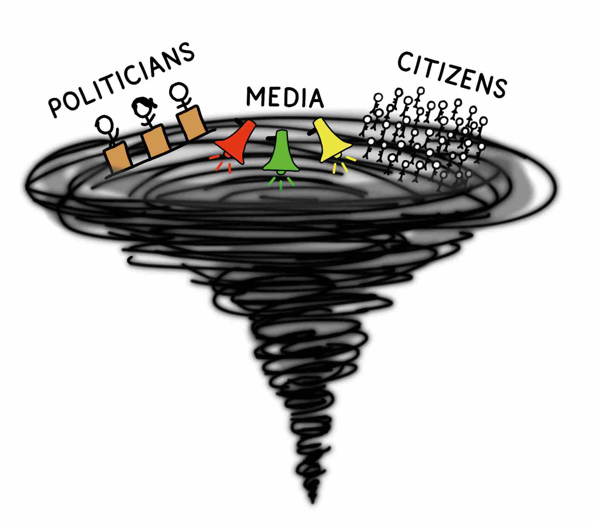

This vortex has led us to a scary place I call hypercharged tribalism.

## Hypercharged Tribalism

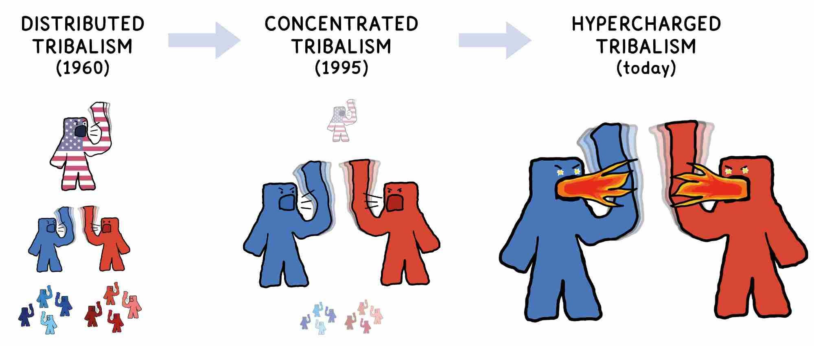

Hypercharged tribalism happens when a concentrated tribal divide reaches such intensity that it resembles a religious war, subsuming the entire society and the people within it. Hypercharged tribalism turns thinking, feeling human beings into loyal colony ants, overriding their intellect, their humanity, even their love of family and friends. It’s a form of group madness—a contagion that spreads like an epidemic, awakening the ancient survival instincts in millions of minds all at once, as huge groups of people slip into golem mode in lockstep.

Political scientists Alan Abramowitz and Steven Webster studied an interesting metric: what we could call political *loyalty*. Over the past five decades, they looked at how districts voted in presidential elections and compared it to how those same districts voted in congressional elections. In the 1970s, the correlation was 0.54, which means that it was common at that time for Americans to vote for one party for Congress and a different one for president. That metric for political loyalty has steadily increased:

1972 – 1980: **0.54**

1982 – 1990: **0.65**

1992 – 2000: **0.78**

2002 – 2010: **0**.**83**

2012 – 2014: **0.94**

2018: **0.97**

A correlation of 0.7 or 0.8 would imply some seriously concentrated tribalism. A 0.97 correlation implies something more extreme. By 2018, almost *no* Americans voted for two different parties in the same election. In a span of a few decades, it has become unthinkable for Americans to vote for their out-group party, no matter *who* the candidates are.

We see the same kind of rigid allegiance when we look at how Americans feel about different political issues. In the past, a voter could tell you their stance on guns and it wouldn’t tell you much about their stances on abortion or immigration or climate change. Today, the views of Democrats and Republicans are far more predictable. Pew looks at this by analyzing “ideological consistency” among voters by plotting Americans on a spectrum from “consistently liberal” on one end to “consistently conservative” on the other. People who adhere perfectly to one party’s “opinion checklist” are plotted toward the ends, while people who hold a mix of views are closer to the center. Here are three recent snapshots:

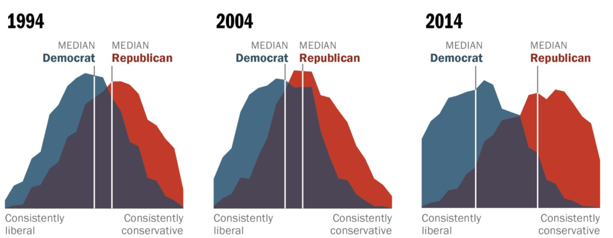

This isn’t going all the way back to the days of political plurality in the ‘60s—it *starts* in 1994. Mere concentrated tribalism wasn’t enough to skew things too much—but hypercharged tribalism was.

The story with politicians is even starker. Advisory services company *National Journal* has ranked representatives along an ideological axis based on how they vote on economic, social, and foreign issues. Here’s what these scores look like over four decades:

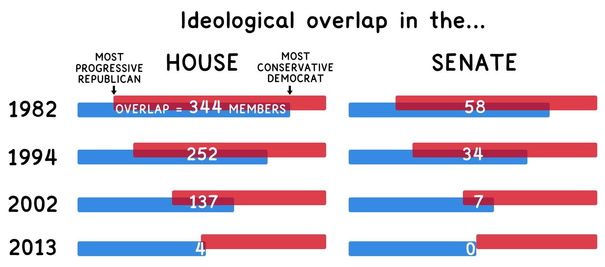

By the ‘80s, the Republicans had mostly become the conservative party and Democrats the party for progressives. But there was still a sizable overlap—as you’d expect from hundreds of politicians making independent decisions. Today, the overlap is *gone.* Voting against your party’s ideology isn’t just unpopular—it’s become *blasphemy.* That’s hypercharged tribalism.

One commonly cited metric to measure ideology of U.S. representatives is something called the DW-NOMINATE, which places politicians on a liberal-to-conservative scale based on their roll-call vote behavior. Here’s a chart showing the gap between the mean in each party—a nice proxy for polarization:

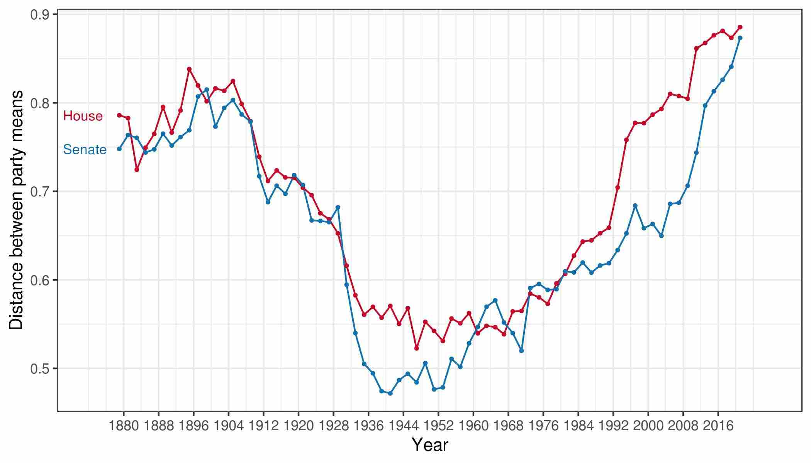

Even the Supreme Court, supposedly a non-partisan institution, has reflected these trends. Writing in *The New York Times,* political scientist Lee Epstein and law professor Eric Posner looked at the history of Supreme Court votes, examining the correlation between the way justices voted and the party that appointed them. The correlation did not used to be strong. In fact, Epstein and Posner write, “as late as the early 1990s, it was possible for justices to vote in ideologically unpredictable ways.” In an era of hypercharged tribalism, this is no longer the case. In close votes (5-3 or 5-4), today’s justices almost always vote along party lines.

According to Epstein and Posner, “For the first time in living memory, the court will be seen by the public as a party-dominated institution, one whose votes on controversial issues are essentially determined by the party affiliation of recent presidents.”

Many of what we think of as hot-topic political divides today only became that way over the past 30 years. As recently as the mid-‘90s, for example, people from the two parties polled about equal in their support for legalized abortion. It’s a similar story with the push for stricter gun laws, which was supported by parties in the early ‘90s (83% of Democrats, 76% of Republicans in 1990) but has wildly diverged since (90% of Democrats, 33% of Republicans in 2017). Republicans are far more likely to be religious today than Democrats—but in 1990, the numbers were just about the same across parties. These issues have all fallen into the grip of hypercharged tribalism.

America’s two sides hate each other so much that whenever one of them emphasizes the danger of a foreign rival, the other instinctively downplays the threat and frames the concern as dishonest political maneuvering or bigotry. Even the American flag is, today, increasingly viewed by many on the left as a right-wing symbol. When a nation’s Primitive Minds become maniacally fixated on a particular Us/Them divide, phenomena that would normally take some of the heat off the divide just become more fuel for it.

Hypercharged political tribalism is a magnet that pulls in everything around it. Race. Religion. Education. Media. Tech. Business. Music. Entertainment. Science. History. Sports. Thanksgiving. Christmas. In the U.S., they’ve all become political. When something new happens—like Covid—it’s only a matter of days before issues are parsed out, sides are taken, and the whole thing turns into yet another political proxy war. The lab leak theory becomes a right-wing thing that the Left hates. Masks become a left-wing thing the Right hates. When a society is in the clutches of hypercharged tribalism, it invades workplaces, dinner tables, churches, schools. It becomes inescapable.

As these forces have pulled more and more Americans down into Political Disney World, the macro effect is the American giant slipping downward on the Ladder, losing its giant tug-of-war more with each passing decade. A liberal society’s ecosystem is supposed to yield a balance between genies and golems that keeps the golems in check—but as the U.S. has descended down the Ladder into hypercharged tribalism, the society’s high-rung immune system has begun to break down. And political golems have seized the opportunity, tramping across the land, flattening liberal rules and norms beneath their lumbering feet.
