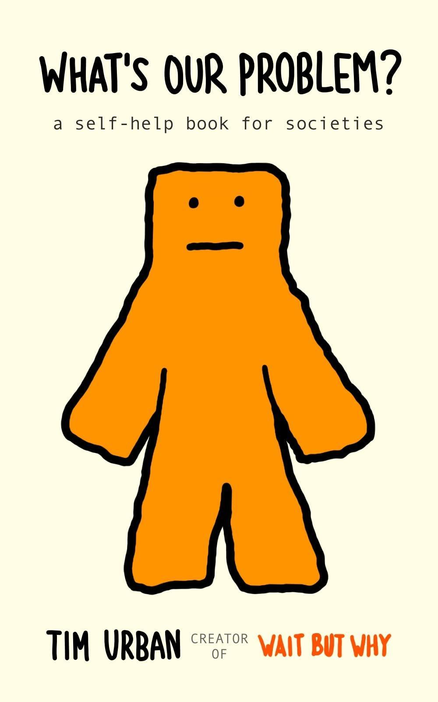

### 译者注

本书为《What's Our Problem: A Self-Help Book For Societies》的独立中文译本。原作者为Tim Urban，首发于微信公众号“阿加莎鼠”。需特别说明的是，本书未包含原著中的注释及附录部分，且于学习与分享目的，仅限个人阅读和学术交流使用，禁止商业性牟利。如有错漏，欢迎留言指出。谢谢你的理解与阅读。

对坦迪丝来说，她从未想过要嫁给一个花六年时间念叨他的政治著作的人，但我们还是结婚了。

人的局限在于人终究只是人。

——比尔·沃特森

## 纵观大局

想象一下，如果整个人类历史都被写在一本厚厚的书里，书名就叫《我们的故事》。

人类已经存在了很长时间——据最新估计，大约在20万到30万年。

如果《我们的故事》的每一页都涵盖 250 年的历史，，这本书大概会有1000页那么厚。想看得更仔细点？那就把所有书页撕下来，摊开在桌子上看看：

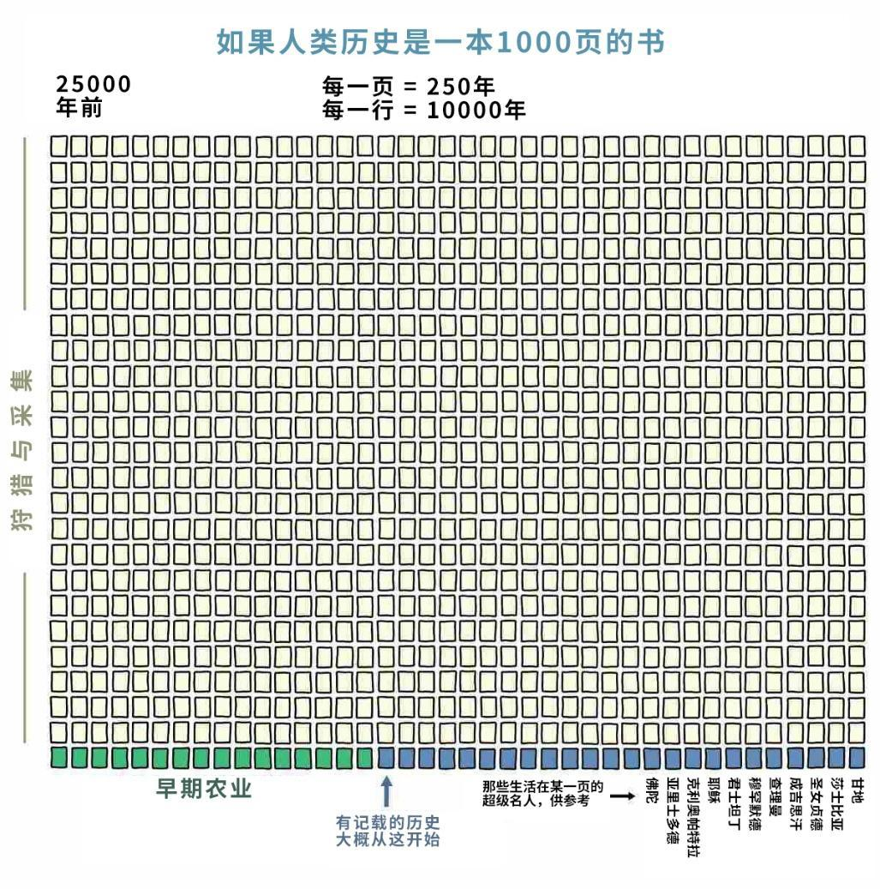

当我们真正站远来看，就会发现，我们通常认为的古代历史，其实只是故事的最后几页。农业革命开始于第 950 或 960 页，有记载的历史到第 976 页才正式起步，基督教的诞生得等到第 993页。第 1000 页，覆盖了 1770 年代初到 2020 年代初，装下了美国的全部历史。

现在，我们正集体迈向第1001页这个神秘的新世界。这让我兴奋——也让我害怕——因为以下三个事实同时存在。

### 事实一：技术呈指数增长

假设我们回到《我们的故事》第760页，绑架一个人，把他带到几个世纪后的第761页。除了得找新朋友、适应一下文化差异，他大概会活得还不错，因为第 760 页和第 761 页的世界本质上没什么区别。

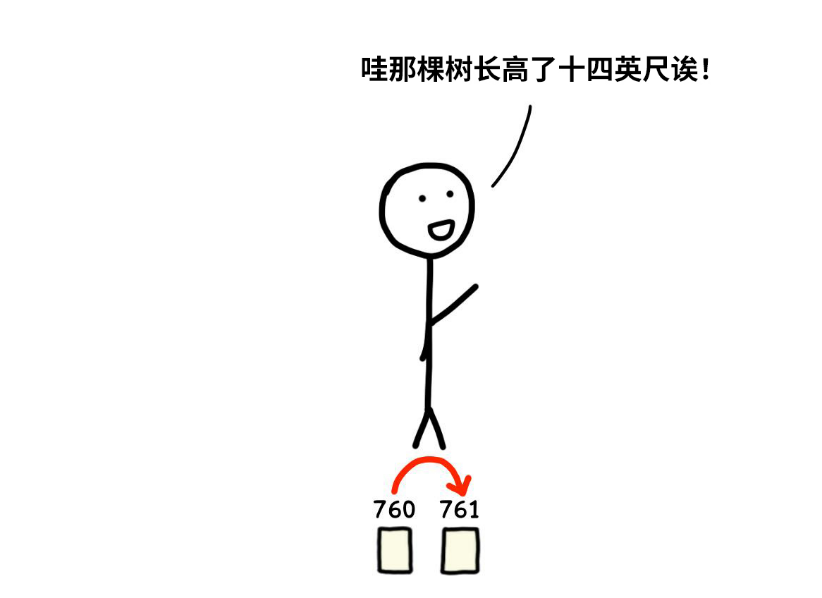

在人类历史的大部分时间里，往前跳250年到下一页，感觉都差不多。但越靠近第1000页，这个规律越不靠谱。比如，要是我们对第992页、998页或999页的人做同样的事会怎样？

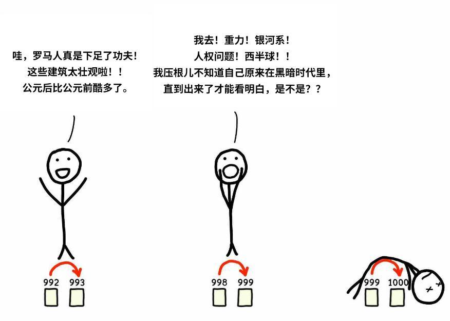

在《我们的故事》中，你生活得越晚，翻到下一页的震撼就越大。正如你所见，第999页的小人物跳到第 1000 页时，看到的世界让他震惊得直接归西。将第 1000 页与之前的所有页面进行比较时，我们就能理解了。

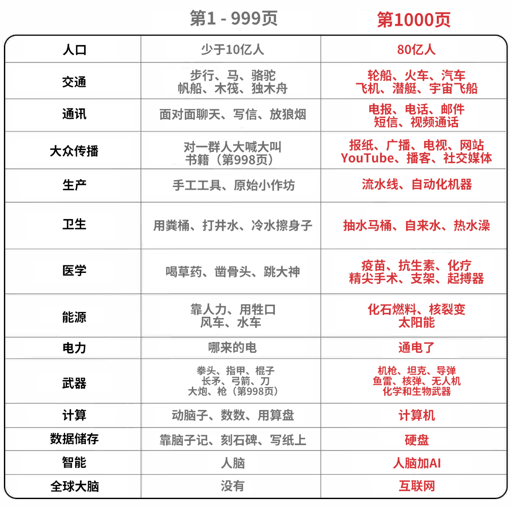

我们自然会认为，我们长大的世界是“正常”的。但现在的世界一点也不正常。因为技术是呈指数增长的。发达的社会往往比欠发达的社会进步得更快——因为他们已经具备了更先进的基础。19世纪的人比16世纪的人知道得更多，技术更先进，所以第1000页上的进步比第999页上的进步更多也就不足为奇了。几个世纪以来，这种积累自我强化，进步越来越快。自中世纪结束以来，人类技术一直在呈指数增长的快车道上前进，导致第1000页上的世界对之前任何一页上的人类来说，都像是一个完全不同的星球。

### 事实二：技术越多，风险越高

技术是好与坏的放大器。技术多了，好日子更好，但坏日子也更糟。

在人类历史的第 999 页，启蒙运动和科学革命为人类带来了繁荣的巨大进步，也带来了奴隶制和残酷帝国主义的爆炸式增长。

第1000页，人类迎来了前所未有的寿命、财富和政治自由，但也经历了历史上最具灾难性的两次大战，随后是核武器、生物武器发明和气候变化带来的生存威胁。

日子越变好，危险也越大。技术越多，我们这个物种的力量越强，风险也就越高。恐怖的是，如果好与坏都按指数级增长，日子再好也没用。一旦坏事达到某个临界点，我们就全完了。

迄今为止，在 21 世纪，事实一和事实二似乎仍然成立。变化速度让人头晕目眩，互联网普及、社交媒体、智能手机、自动驾驶汽车、加密货币接连出现，更别提推动这些进步的人工智能飞跃。从第1000页到第1001页的技术跳跃，应该比999页到1000页还要夸张——可能夸张好几倍。这令人难以置信。我们或许能解决今天困扰我们的一切难题——疾病、贫穷、气候变化，甚至死亡本身。

但是，如果说第 1000 页的灾难是史上最具破坏性的，那么第 1001 页的灾难又意味着什么？使我们的世界变得神奇的技术，也打开了大量的潘多拉魔盒：飞速发展的人工智能、网络战争、自主武器、生物武器，等等等等。

如此紧要关头，我们得多聪明才能应对啊。可惜的是：

### 事实三：我的社会现在像个掉了冰淇淋还拉裤子的四岁小孩

我把社会想象成一个巨型人类——跟我们一样是个活生生的有机体，只是大了很多。当我看看身边的美国社会，我看到的不是这个：

而是更像这样：

按理说，人类会随着年龄的增长而逐渐成熟——但我生活的这个“巨型人类”却一年比一年幼稚。部落主义和政治分裂正在抬头。虚假叙事和荒诞的阴谋论甚嚣尘上。各大机构摇摇欲坠。中世纪风格的公开羞辱突然再次流行。信任，一个健康社会的关键货币，正在瓦解。而且这些趋势似乎不只发生在我身边，很多社会都这样。

所以，我们到底出了什么问题？为什么在这样一个繁荣的时代，在风险如此之高的时代，我们的智慧却在倒退？

这不是第一次。1905年，哲学家乔治·桑塔亚那向人类发出警告：

那些不能记住过去的人注定要重蹈覆辙。

更令人担忧的是，一个多世纪前，1790年，哲学家埃德蒙·伯克就发过同样的警告：

不追溯先祖足迹的人，将无法展望后代未来。

我们似乎学不会一个重要的教训。

学到技术知识时，我们通常不会忘。1959年集成电路的发明是个突破，开启了现代计算的新范式。这不是我们会轻易忘记的事情，不会一不小心就回到了用真空管制造计算机的时代。但智慧的教训却似乎难以长久。不同于技术进步，智慧似乎忽上忽下，导致人类社会总在重蹈历史的覆辙。

当我观察当今世界时，我担心我们正在走向一些可怕的、本可避免的错误。思考事实一和事实二时，我把我们的社会想象成正在山脊攀登的巨人，向着光辉的未来前进——但越往上走，山脊越窄，两边的悬崖越陡。爬得越高，摔下去就越致命。想到事实三时，我看到这些巨人恰在最需要沉着冷静之际，脚步也变得愈发踉跄。

如果你在读《我们的故事》，翻到第1001页，一切似乎都到了紧要关头，许多故事线突然收束到一起。你会紧盯着这本书，迫不及待想知道这个物种的结局。

但我们不是在读《我们的故事》——我们活在里面，是它的角色。我们还是它的作者，一

路边走边写。

我们的责任重大。如果我们能搞定第 1001 页，未来的我们和亿万后代或许能高居山顶，过上对今天的我们来说像魔法乌托邦的生活。如果第1001页搞砸了，从陡峭的悬崖摔下去，这可能就是故事的最后一页。

作为《我们的故事》的作者，我们没有导师，没有编辑，没有人保证结局圆满。一切都掌握在我们手中。这让我害怕，但也给我希望。如果我们都能变得更明智一点，一起努力，这也许足以推动这个故事进入一个美好的未来。

## 嘿

嘿。

我知道那段开场白让我们都感到很紧张，但我只想暂停一分钟，介绍一下我自己。

我是蒂姆。我平时忙着写一个叫“等等，但为什么”(Wait But Why)的博客，在上面探究各种稀奇古怪的东西——人工智能、拖延症、人际关系、外星人，还有一堆我感兴趣的乱七八糟话题。然后我会给这些文章配上插图，画风像是四年级小学生的手笔，但实际上都出自我这个成年人之手。一切都很顺利，直到几年前，有些事开始困扰我。我周围的社会似乎在退化，如果这种情况持续下去，我写的其他所有主题都无关紧要了。如果我们真的在失去对事物的控制，那么其他所有主题都应该先放一放。于是我一头扎了进去。

我挑一个主题写的时候，喜欢钻进兔子洞里深挖。然而这个主题——“我们出了什么问题？”——却是一个前所未有的超级深坑。我刚爬进去，就脚下一滑，摔到了这里。

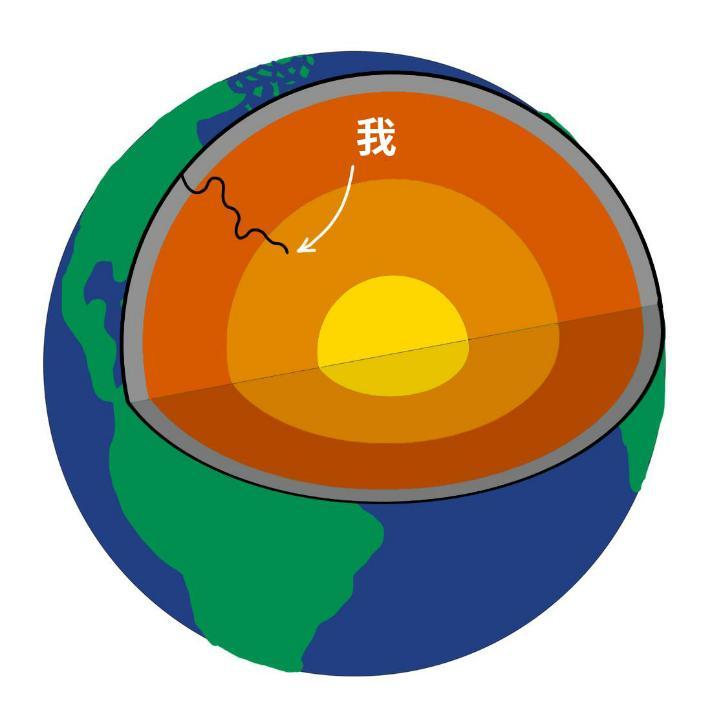

通常，我得花三天到三个月的时间学习、思考、讨论一个话题，才能弄清楚我想说什么。这一次我花了六年。当我最终从这个深坑里爬出来的时候，我对世界、政治、群体动态、我们的思维方式以及我们为什么相信某些东西，都有了全新的看法。在这本书里，我会与你分享这些视角。

在第一章中，我们将了解本书的核心工具——一个我花了六年时间开发、测试和完善的框架。我称之为“阶梯”。这是一种思维透镜——就像给大脑戴上一副眼镜，帮助我们更好地看清世界和自己。它让我变成了一个更好的思考者和沟通者，我希望它也能为你带来同样的改变。

在第二章，我们会通过这副新奇的眼镜，重新审视熟悉的政治话题。我们不会把政治简单

看成左、中、右的水平轴，而是用梯子给这个一维的政治讨论补充一个急需的垂直维度。

第三章将探讨我们倒退的故事：为什么我相信社会一直在下滑，以及这一切都是怎样发生的。

接下来，我们会近距离观察我们现在的轨迹，通过两个美国的故事。首先，在第四章，我们会把目光转向美国的共和党，然后在第五到第七章，深入探讨美国社会正义这个充满争议的世界。围绕这些现象的陈旧讨论，我认为都是只见树木不见森林。我认为，围绕这些现象的讨论是时候该更新了。在这些状况里，阶梯都将揭示一个比流行理论所解释的更有趣、更实用的故事。

总的来说，我们的旅程长这样：

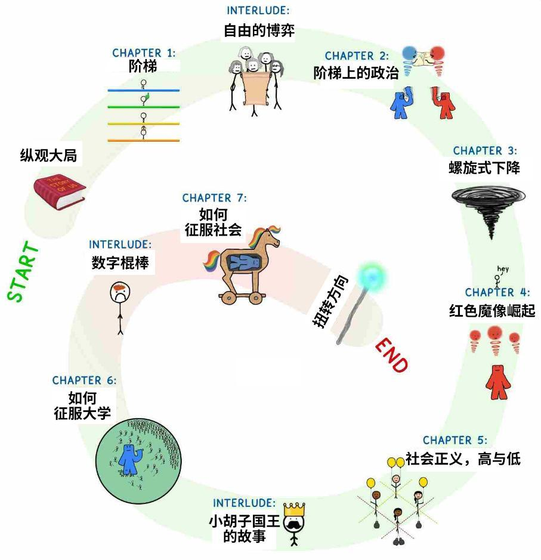

准备好了吗？

注：虽然本书的许多部分不针对任何国家，但某些部分以美国为中心。我之所以选择美国的政党和运动作为我的案例来研究，是因为我在其中长大，最为了解。但其中的教训是放之四海而皆准的。它们的核心是人类共通的本性——这也可能解释了当今其他国家的情况。这本书的视角和教训适用于每个人、每个地方。

### Chapter 1

### 阶梯

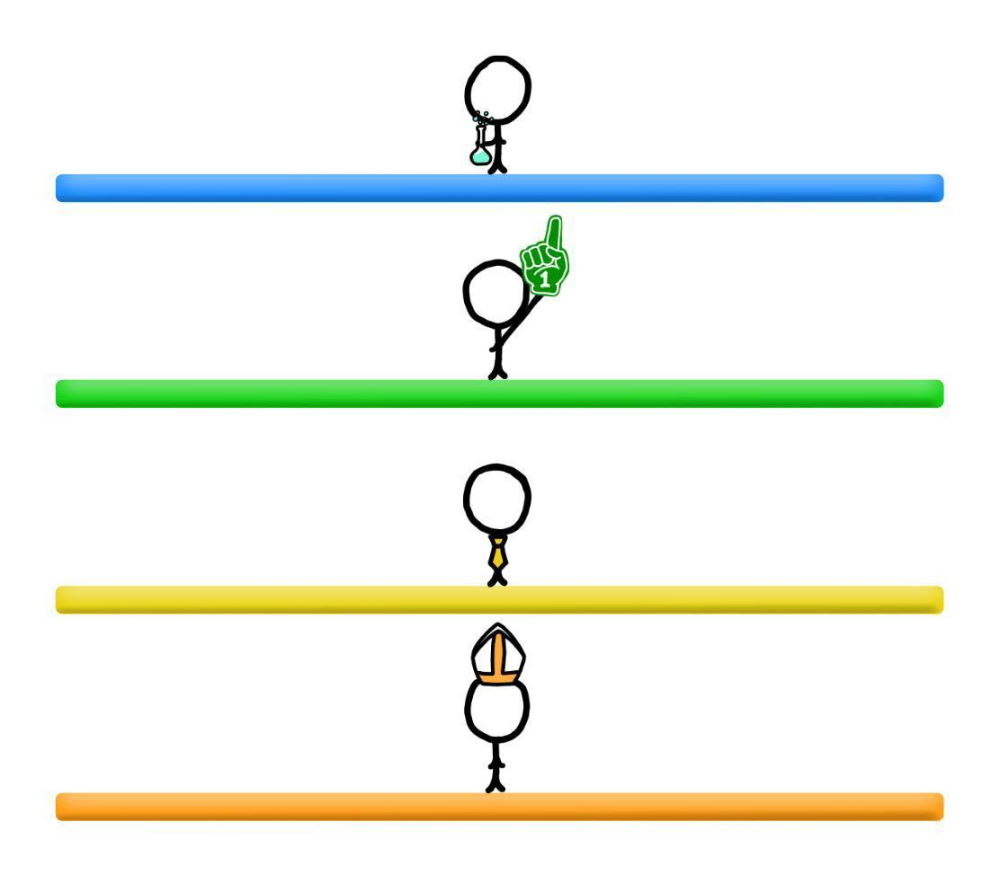

人的本性错综复杂。

——马克·吐温

## 我们头脑里的拔河比赛

动物世界是一个危机四伏的地方。

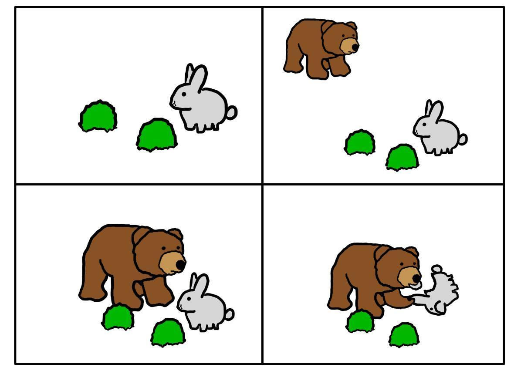

问题在于，动物世界压根儿不是什么“动物的世界”——它其实是亿万条基因信息的竞技场，每条基因都拼了命地想永垂不朽。大多数基因撑不了多久，如今还在地球上混的，都是奇迹般的异类，堪称生存专家，已经好几亿岁，并且还会继续存活下去。

动物不过是这些异类基因搞出来的临时工具——用来装载基因、帮它们追求不朽的移动容器。基因无法与它们的动物交流，所以就靠一套我称之为“原始心智”的专属生存软件来操控它们：

原始心智是一套编码指令，告诉动物怎么在自然栖息地里混得风生水起。编写这套软件的是自然选择，过程简单粗暴：能让动物成功传基因的软件就留下来，不行的就淘汰。基因突变就像软件里偶尔蹦出的小 bug，每隔一阵子，某个 bug 居然让软件变好了——一次意外的软件升级。这种编码方式真是慢，但经过几百万代，总算能把活干完。

这种升级稀稀拉拉，导致动物的软件其实是为祖先的环境量身打造的。对大多数动物来说，这系统还凑合。它们的环境变得慢吞吞，十万年甚至百万年前管用的东西，现在差不多还能用。

但人类是怪胎。一堆认知超能力——像符号语言、抽象思维、复杂社交关系和长远规划——让人类能把环境捏在自己手里玩。一眨眼——大约 1 万 2 千年，也就是 500 代——人类给自己创造了一个全新的环境，称为文明。

文明再伟大， 500 代的时间还是不够进化的。所以，现在我们都住在这个奇特的新环境中，脑子里跑的却是为老环境优化的软件。

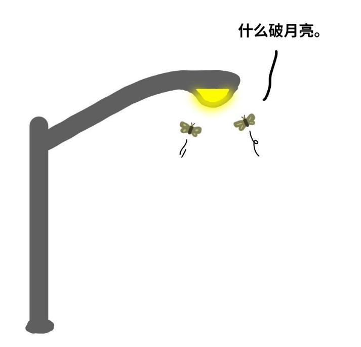

你知道飞蛾为什么傻乎乎地往灯光扑，搞不清它们到底图啥吗？事实上，几百万年来，飞蛾一直拿月光当夜航的灯塔——这方法挺好使，直到人类晚上开始点亮一堆不是月亮的光。飞蛾的大脑软件没来得及更新适应新情况，现在几百万只飞蛾就这么浪费虫生，围着路灯扑腾。

很多方面，现代人类就像现代飞蛾，跑着一套好心好意的原始心智，却总是误读我们给自己创造的这个怪世界。

好在，我们的原始心智有一个室友：高阶心智。

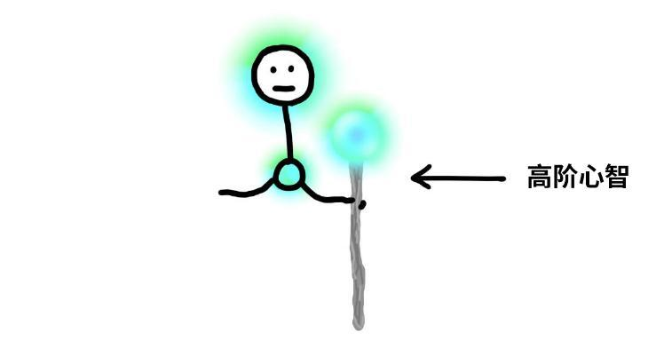

高阶心智，是你能跳出自我思考、反省自己、随着经验变得更智慧的那个部分。

不像原始心智，高阶心智可以环顾四周，看清世界的真面目。它知道你生活在一个先进的文明里，也想让你相应地思考和行动。

原始心智和高阶心智是一对有趣的组合。当日子顺利时，你大脑里看起来像这样：

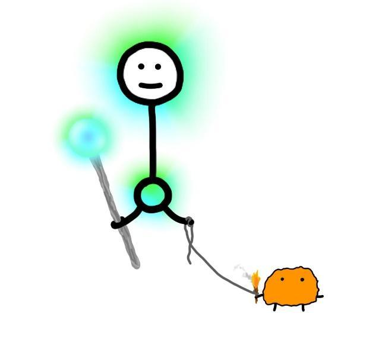

高阶心智大权在握，掌控全局，而它的小软件宠物——原始心智——就四处追着多巴胺跑，管管吃喝拉撒和自娱自乐。

更高层次的大脑掌控全局，而其低级的小软件宠物四处追逐多巴胺，负责饮食、睡眠和手淫。原始心智的核心就是想活下去、繁殖、帮后代也繁殖——只要合理，高阶心智完全支持。当原始的大脑希望你以一种与现实不符的方式思考和行事时，可一旦原始心智想让你按不靠谱的方式思考或行动时，高阶心智会试图接管软件，把你拉回“讲道理”的正确圆圈内：

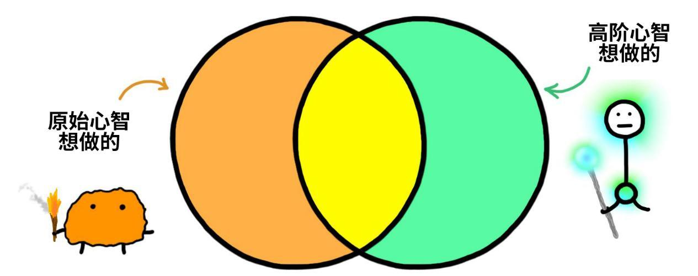

当力量失衡时，麻烦就开始了。

虽然高阶心智可能很聪明，但管原始心智也不太在行。一旦原始心智获得过多控制权，你可能会发现自己漂到“没道理”区去了。

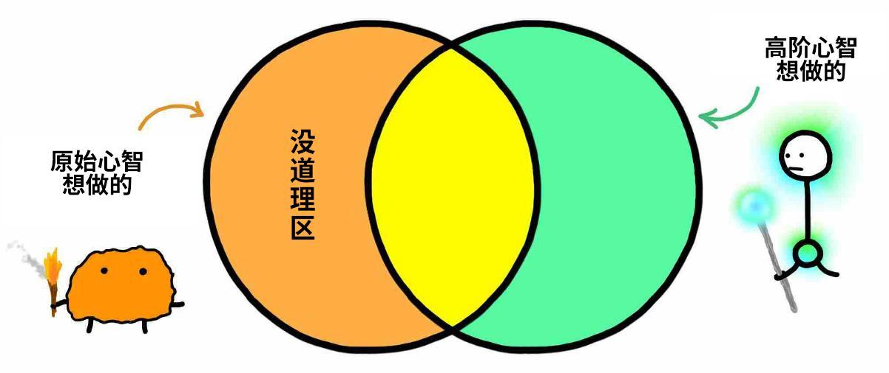

我们都经历过这事儿，比如在药店买东西时，却被一袋美味的垃圾食品勾走了。

让我们看看原始心智和高阶心智间发生了什么：

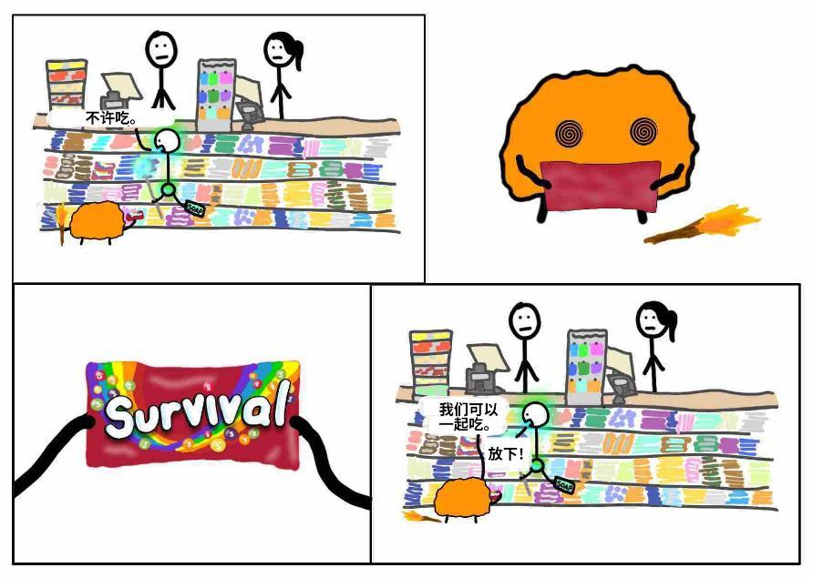

就像飞蛾扑向路灯，人的原始大脑觉得吃彩虹糖是个好主意。在远古时代，没有加工食品这种东西，热量很难获得，任何像彩虹糖一样质地和味道都如此美妙的玩意，肯定是好东西。生产彩虹糖的玛氏公司知道你的原始心智深知你原始心智的弱点，利用了它。可你的高阶心智更理智。如果它控制着你的大脑，你会无视彩虹糖，或者只吃几颗，当作给原始室友的一点小零食。

但有时，当你狂吃了 80 颗彩虹糖，感到自我厌恶时——是因为你的原始心智劫持了驾驶舱。

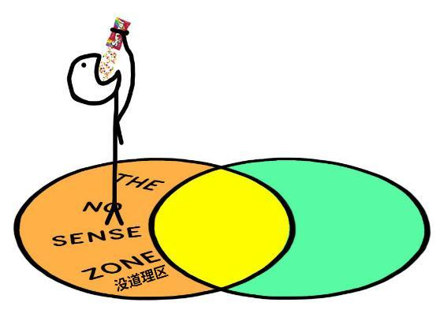

这种内在分歧出现在生活的方方面面，就像头脑中没完没了的拔河比赛——争夺我们的想法、情绪、价值观、道德、判断，和整体意识。

这场拔河是个光谱，可以简化为四种基本状态——或者说阶梯的四个梯级：

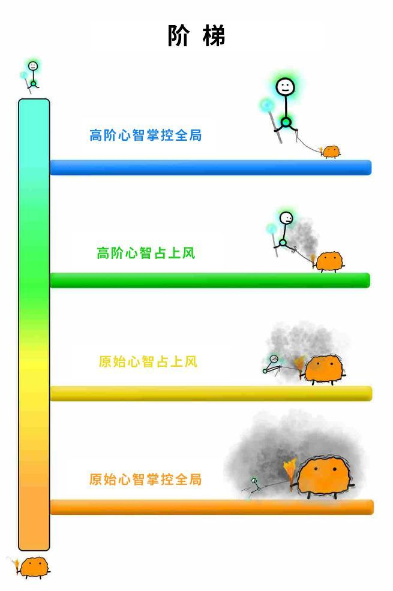

### 论多重心智

数千年以来，哲学家和科学家一直在研究“多重意识”这个概念。柏拉图写过“驭手”（理智）驾驭着“马”（理性克制和激情放纵）。西格蒙德·弗洛伊德提出的结构由“本我”（原始本能）、“超我”（良知）和“自我”（在两者与外部现实间保持平衡）组成。最近，社会心理学家丹尼尔·卡尼曼提出过“系统 1”（快速、无意识的思考）和“系统 2”（缓慢、复杂的思考，需要努力）。社会心理学家乔纳森·海特写过情感的“大象”和理性的“骑手”，“骑手”看似掌控一切，但往往并非如此理性。哈佛大学的托德·罗杰斯和马克斯·H·巴泽曼写过“想要的自己”和“应然的自己”之间的冲突。还有人分析了特定的脑结构，区分了大脑不同分区的运作方式，前额叶皮层更理性，而边缘叶系统更原始。

人类之所以如此复杂，是因为我们都是“高阶”和“低阶”心理的混合体。

当高阶心智赢得拔河比赛时，它的火炬会照亮我们的内心，带来清晰的觉悟，包括对原始心智及小动作的察觉。高阶心智明白，性、食物、体育迷等原始的快乐，都是人类生活中令人愉快且通常必要的部分。就像一个好的宠物主人一样，高阶心智非常乐意让原始心智享受乐趣。原始的幸福感很棒，只要高阶心智能管住它，确保适度、动机正当、没人受伤。简而言之，当我们处于高阶梯子上时，我们就像个成熟的大人。

但是，当原始心智被激怒时，它就会变大、变强。它那支承载着基因生存意志的原始火炬也随之壮大，把我们的内心塞满浓烟般的迷雾。这迷雾让我们变得迟钝，我们甚至意识不到原始心智的蛊惑。高阶心智没法清晰思考，开始直接支持原始心智想干的事，不管有没有道理。当我们滑落到阶梯的低处时，我们目光短浅，心胸狭窄，用我们最琐碎的情绪思考和行动。我们缺乏自知之明，却满是虚伪，活成了最糟糕的自己。

我们都挣扎在自己的阶梯上。有些人纠结于拖延症、坏脾气，或对糖、赌博上瘾；有些人则受对失败的非理性恐惧或严重社交焦虑困扰。我们都以自己的方式自我挫败——每次都是因为高阶心智失控，让我们像扑腾着翅膀的蛾子一样冲向街灯。

在本书中，我们将探讨一个特定的阶梯困境——我认为这些困境与当今社会的大问题密切相关：我们到底出了什么问题？我们旅程的第一站将是自己的头脑，我们将利用阶梯搞清楚一个关键过程：我们的信念是怎么形成的。

### 垂直思考

我们为什么相信我们所相信的？

信念构成了我们对现实的感知，驱动着我们的行为，并构筑了我们的人生。人们过去所相信的事物，塑造了历史；而今天我们所相信的，将书写我们未来的故事。因此，可能得问一个重要的问题：我们到底是如何相信那些我们最终相信的事情的？

为了探索这个问题，让我们创造一种可视化的方法。

当涉及到我们的信念时，我们可以把任何话题上的各种观点想象成一个轴，称为“思想光谱”。

思想光谱是一个简单的工具，我们可以用它来捕捉一个人对任何话题的思考范围——他们的信念，他们的观点，他们的立场。

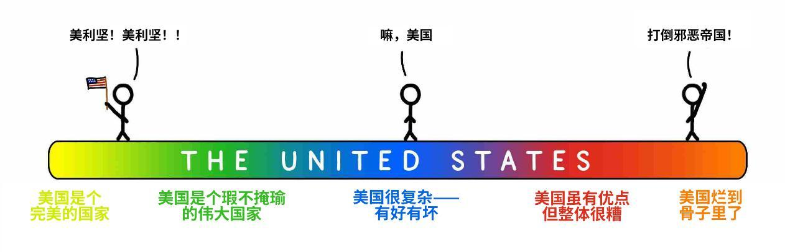

对于大多数信念，我们过于关注人们的立场，以至于我们经常忘了最重要的东西：他们是怎么得出那些想法的。这就是阶梯能帮上忙的地方。如果思想光谱是“你的想法”轴，我们可以用梯子作为“思考方式”的轴。

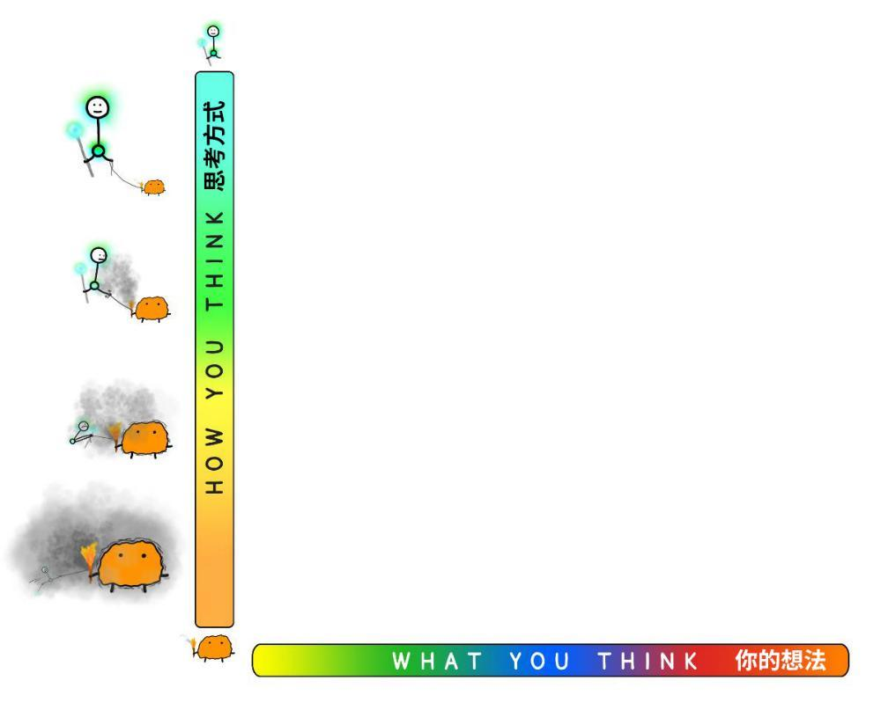

要弄清我们的想法是如何根据阶梯位置而变化的，我们得问自己：两种心智是如何塑造信念的？

你的高阶心智知道人类经常产生错觉，它希望你别这样。它把信念看作正在进行中的草稿，而且随着它生活得越来越好，学到的东西越来越多，它总是乐于进行修订。因为当信念被修

订时，就意味着进步——变得不那么无知、不那么愚蠢、不那么错误。

你的原始心智不同意。对于你的基因来说，重要的是坚持对你生存最有利的信念——无论这些信念是否真实。原始心智的信念通常在人生早期就形成了，往往基于你的家庭、同龄人或更大社区的主流信念。原始心智认为这些信念是你身份的基础，也是你与周围社区保持良好关系的关键。考虑到这些，原始心智最不想看到的就是你对自己的信念谦卑，或者有改进的兴趣。它希望你把你的信念奉若神明，并坚信不疑。

因此，高阶心智的目标是找到真相，而原始心智的目标是确保其已有信念。这两种截然不同的思维动机同时存在于我们的头脑中。这意味着我们驱动思维的动机——以及我们的思考过程——取决于那一刻我们在阶梯上处于什么位置。

因此，在思维领域，阶梯的四个梯级对应于形成信念的四种方式。当你的高阶心智掌管一切时，你处于最高层，像科学家一样思考。

第一级：像科学家一样思考

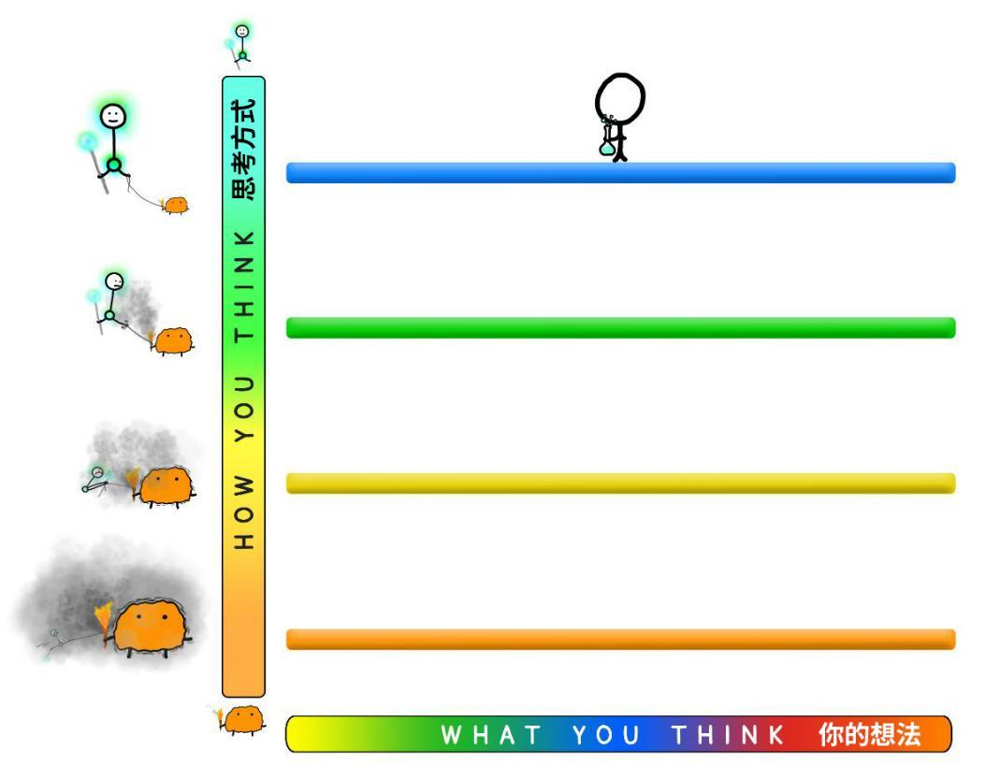

当你像科学家一样思考时，你从A点开始，跟着证据走，无论它把你带到哪里。

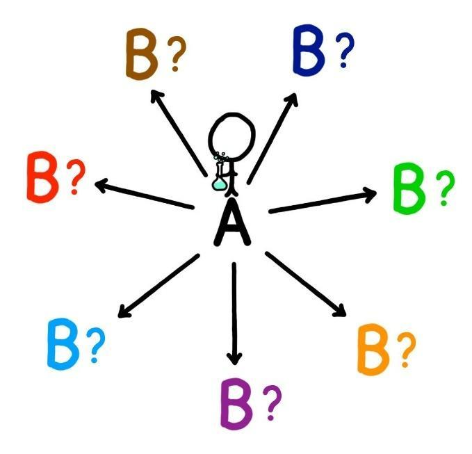

更具体地说，科学家从 A 到 B 的旅程看起来是这样的：

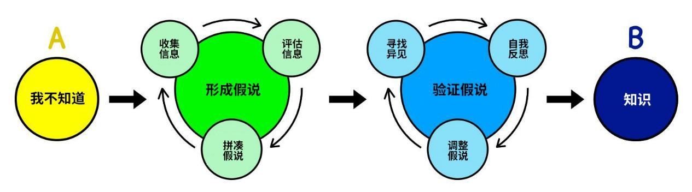

科学家对任何话题的默认立场都是“我不知道”。要从A点往外走，他们必须付出努力，从第一步开始：形成假说。

### 形成假说

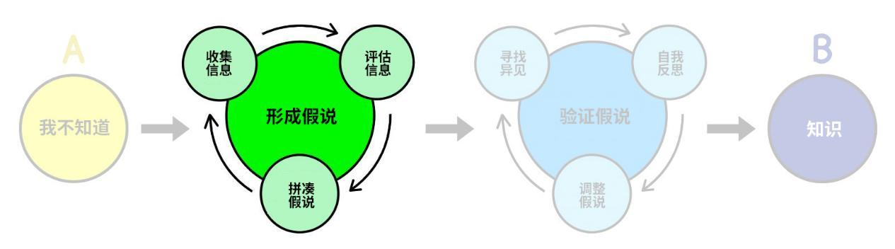

高阶思考是从底层往上构建假说。与其直接采纳传统智慧的信念和假设，你得从零开始拼凑自己的想法。这是一个三步走的过程：

### 1） 收集信息

要想拼图，你得先有拼块。我们每个人都被信息狂轰滥炸，但能分配的注意力少得可怜。换句话说，你的脑袋是个VIP专属俱乐部，门口站着个挑剔的保安。

但当科学家想要学点新东西时，他们会尽量吸收有关话题的各种信息。科学家会跨越思想光谱去找想法，哪怕是那些看起来很可能是错的——因为了解一个话题的各种观点范围，是理解这个话题的关键一环。

### 2） 评估信息

如果收集信息重在数量，那么评估信息就全看质量了。

有时候，一个思考者有时间、有办法直接收集信息和证据——通过初步观察，或自己研究。但，我们用来充实自己的信息大多是间接知识：别人积累的知识，被我们输入大脑，变成自己的。每一个统计数据，教科书上的内容，从父母或老师那里学到的，新闻或社交媒体上看到读到的，传统观念的每个信条——都是间接知识。

因此，一个老练的思考者最重要的技能就是深知什么时候可以信任。

明智地利用信任，是一条高效的知识获取捷径。如果你可以信任一个说真话的人，就能把他辛苦得来的知识——无论是通过直接研究还是间接研究，只要通过了他们的标准——直接“复印”到你的脑袋里。这个神奇的智力偷懒工具，让人类在过去一万年里积累了海量的集体知识，以至于一个灵长类物种现在能搞懂宇宙的起源。

但信任用错地方，后果恰恰相反。当人们相信了错误的信息，就会觉得自己懂了——这比完全不知道还要糟。

因此，老练的思考者努力练就怀疑的艺术。什么都信的思考者太好骗，他们的信念充斥着谎言、误解和矛盾。谁都不信的思考者过于愤世嫉俗，甚至偏执，只通过直接经验来获得新信息。这两种情况都对进取不利。

科学家默认的怀疑态度介于两者之间，他们的过滤器会恰到好处地识别、拦截胡说八道，同时又足够开放，能让真相进来。他们熟悉某些信息来源——朋友、媒体、文章、书籍——之后，会根据过往的准确度来进行评估。对于那些追求准确至上的信息源，科学家会放松他们的信任过滤器。如果某个信息源在散布不准确或带有偏见的观点，他们就收紧过滤器，对之后的信息多留个心眼。

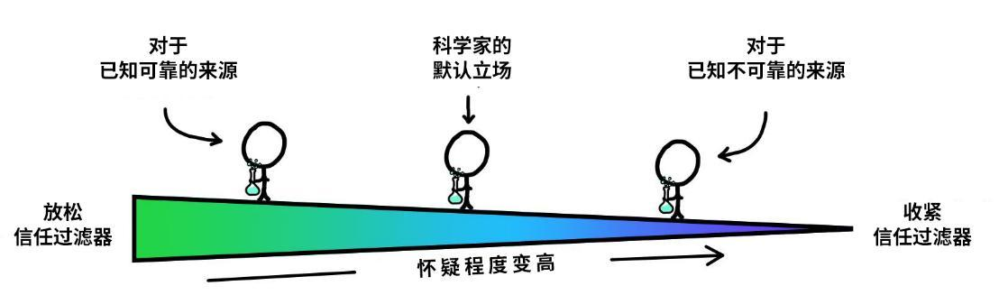

当收集到足够的拼块时，第三个阶段就开始了。

### 3） 拼凑假说

收集和评估阶段十分仰赖他人的经验，但对科学家来说，最后拼图大多是独立推理的结果。到了形成意见的时候，他们的头脑就变成了一个开放的思想实验室。

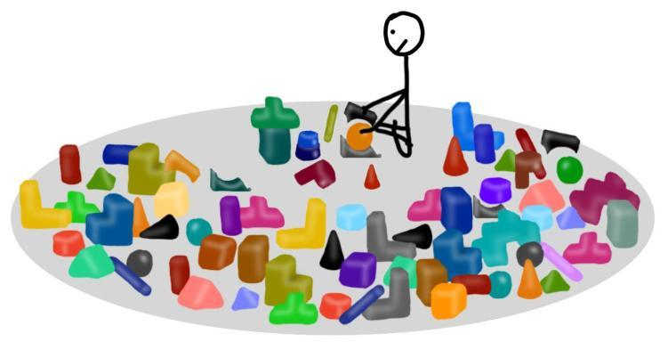

科学家们对自己在“思考方式”轴上站得很高很稳，但对自己在“你的想法”轴上的位置却完全持不可知论态度。拼图早期，他们把思想光谱当作溜冰场，愉快地滑来滑去，探索各种可能的观点。

随着收集和评估过程深入，科学家对自己的拼凑越来越有信心。最终，他们开始锁定思想光谱的某个部分，怀疑真相可能就在那里。拼图终于成形了——他们开始形成一个假说。

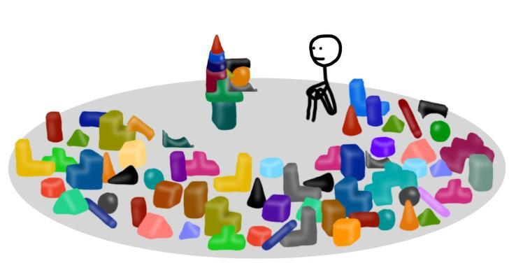

### 验证假说

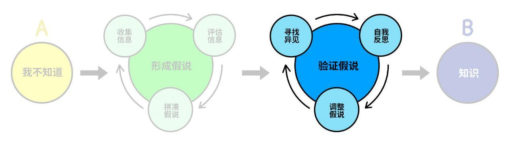

想象一下，我向你介绍一位拳击手，我们有这么一段对话：

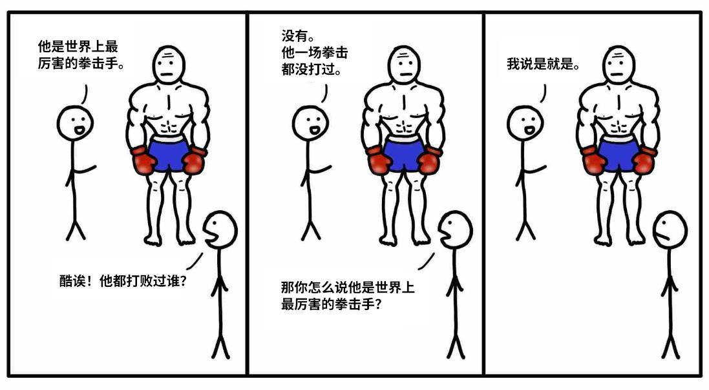

你会认为我疯了。

但人们总是这样对待想法。他们确信自己从未捍卫过的观点是正确的——一个从未上过擂台的观点。科学家知道，未经检验的信念只是一个假说——一个有潜力的拳击手，但什么冠军也不是。

所以科学家开始公开表达自己的想法，无论是当面还是在网上。是时候看看这个小家伙能不能打拳了。

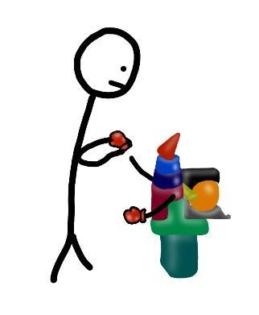

在思想的世界里，拳击对手以异议的形式出现。当科学家开始向世界抛出想法时，拳打脚踢就来了。

有偏见的推理、过度简化、逻辑谬误、靠不住的统计数据，都是好辩的异议者寻找的弱点，每一记有效的重拳打在假设上，都有助于科学家改进他们的想法。这就是为什么科学家积极寻找反对意见。正如组织心理学家亚当·格兰特在他的《再想想》一书中所说的那样：

我注意到，伟大的科学家和超级预言家存在一个悖论：他们这么坦然面对出错，是因为他们非常害怕出错。让他们与众不同的是时间跨度。他们决心从长远上找到正确答案，知道这意

味着短期内必须接受挫折、走弯路或绕远路。他们摒弃了玫瑰色眼镜，而选择使用结实的镜片。

科学家让假说进行的拳击比赛越多，就越能探索结论的边界，把想法调整得更清晰、更自信。

经过一番严肃的测试和多次改进，科学家们可能会觉得他们已经到达了B点：知识。

对科学家而言，通往知识的道路是漫长的，因为真理道阻且长。这就是为什么科学家经常说“我不知道”。所以，即使在学习过程中到达了B点，科学家也会加上一个小小的星号，知道所有信念都可能被时代变迁或新证据推翻。像科学家那样思考，不是为了知道很多，而是要意识到自己知道什么，不知道什么——在学习时，要尽量贴近这条虚线：

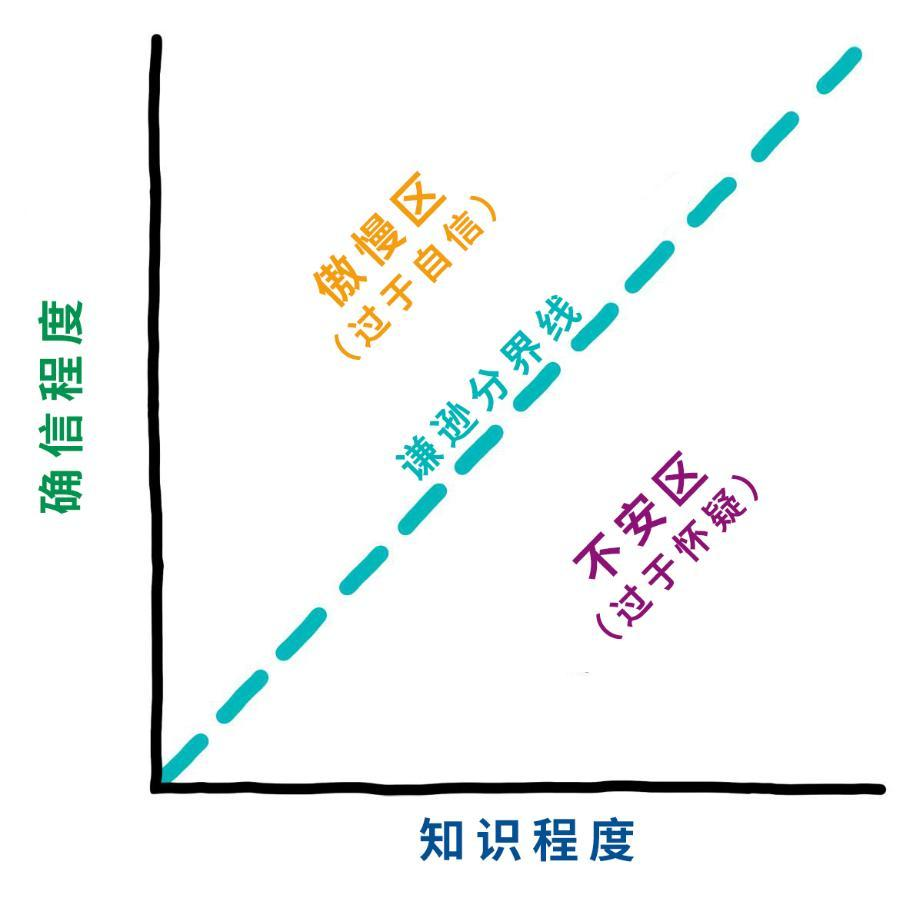

当你像科学家一样思考时——有自知之明，没有偏见，不执着于某个想法，完全由真理驱动，愿意随时修改你的信念——你的大脑是一个极其高效的学习机器。

但问题是——像科学家一样思考很难，大多数人大部分时间都做不好。当你的原始心智醒过来开始掺和，你很容易滑落到阶梯的第二级——一个思维陷入拔河的地方。

第二级：像体育迷一样思考

现实中大多数体育迷希望他们看的比赛是公平的。他们不希望有裁判搞腐败，即使是为了帮他们的球队获胜。他们特别重视比赛过程本身的诚信。只是.....他们真的，真的希望比赛结果就是“那个”结果。他们不光在观看比赛——他们还在呐喊助威。

当你的原始心智渗透你的推理过程时，你也开始这么想。你仍然觉得你是从A点出发的，你还希望B点是真理。但你对这事儿并不完全客观。

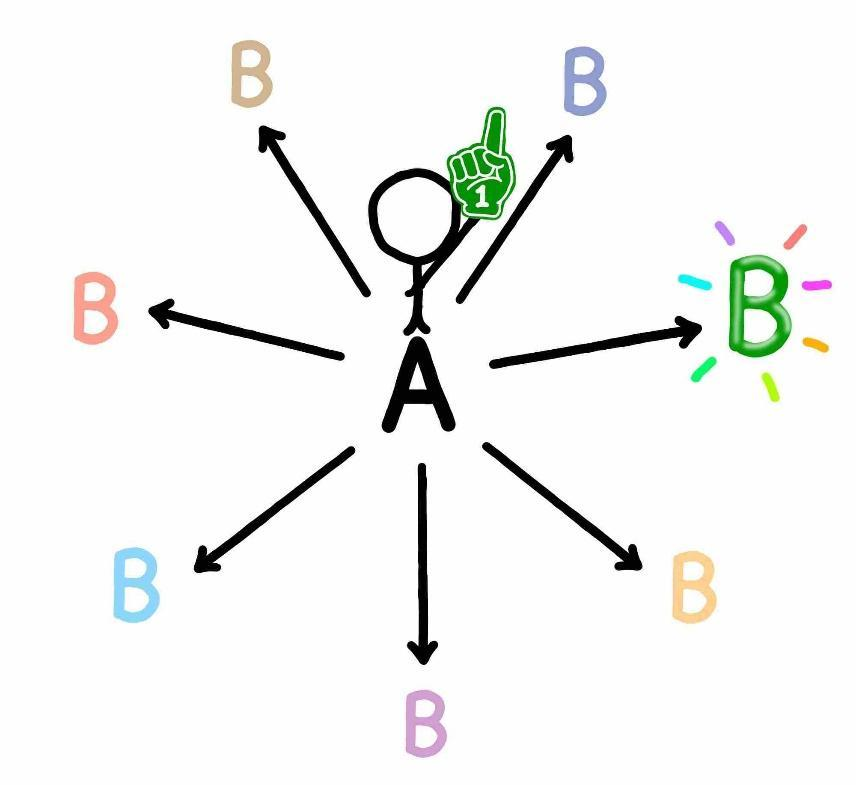

当追求真理的动力被一些隐秘动机所感染时，你的思维就会变得怪怪的。心理学家称之为“动机性推理”。我更愿意把它想成“动机下的推理”——就像一场思维酒驾。正如6世纪的中国禅宗大师僧璨所说：

若欲真相显于前，切勿执着顺或逆。顺逆之争，乃心之大病。

当你像体育迷一样思考时，从僧璨到他的省略号、连字符都会对你颇有微词，因为他们知道

接下来会看到什么——科学家严谨的思考过程，被真理追求之路上最危险的障碍所腐蚀：

确信偏误。

确信偏误是原始心智的无形之手，推着你去确认现有的信念，拉住你不要改变主意。

你仍然会收集信息，但你可能会挑选那些看似支持你想法的来源。原始心智影响了你的情感，毕竟听到观点被确认的感觉真的很好，而听到异议人就会烦躁。

你仍然在评估信息，但不再默认信任过滤器的中立设置，而是发现自己在信任过滤器的两个极端之间摇摆不定，更多地看信息源是不是和你站在一边，而不看信息源的是不是可靠：

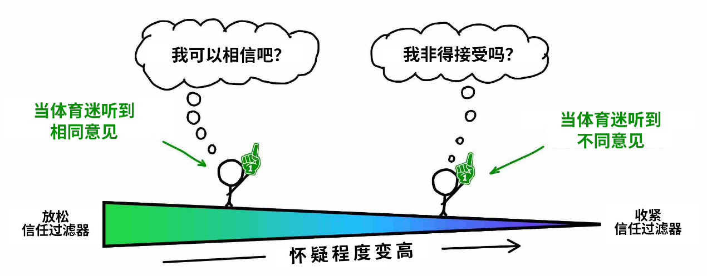

因此，体育迷头脑中收集的信息碎片倾向于证实某种信念，再以扭曲的方式拼凑起来。那些闯进体育迷脑袋、强有力的异议，往往会被遗忘，被排除在最终的拼图之外。

到了验证假说的时候，体育迷的偏见再次抬头。如果你像科学家一样思考，你对假说的依恋会非常小。但现在，你是一个体育迷，穿着它的运动衫，看着你的小家伙打拳。拳击场上，它是“你的人”。如果它在争论中获胜，你甚至可能会发现自己暗想：“我们赢了！”

当一记重拳打在你的假说上时，你很可能会认为这是偷袭或侥幸，不太正当。而当你的假说打出一记重拳时，你可能会倾向于夸大这一击的威力或者技术水准。

偏见也会扭曲你如何评估他人的想法。你觉得自己没有偏见，所以在你看来，持中立态度的人偏向另一方，而与你持有相同偏见的人倒像中立一样。

这个过程拖下去，体育迷最终如愿以偿地抵达他们喜欢的B点，也就不足为奇了。

在这个梯子的第二级，极致优化的学习机器——科学家的大脑，被一种腐化的动机所阻碍。虽然体育迷学得没有科学家多，但他们对自己的信念通常会更有信心。

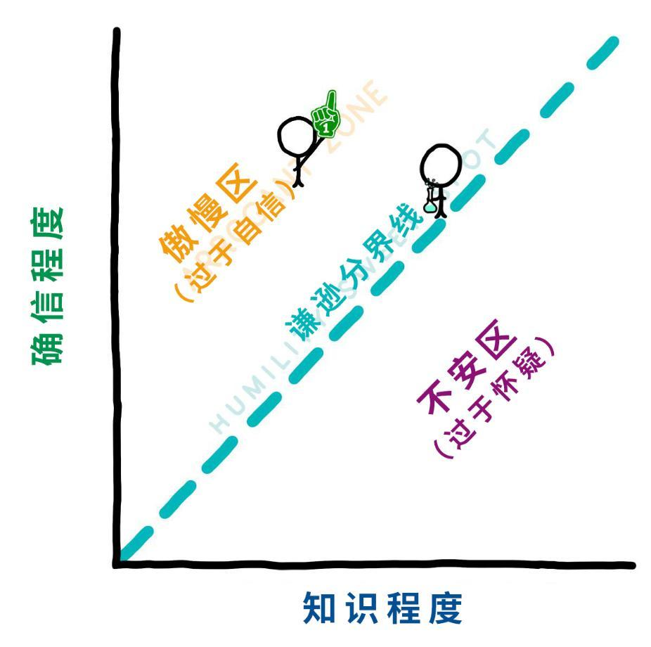

体育迷很固执，但还算有救。高阶心智仍然在他们头脑中占据主导地位，如果反对证据足够硬，体育迷会不情不愿地改变他们的想法。在确信偏误的迷雾下，体育迷仍然最关心找到真相。

然而继续下滑，你就会越过梯子的中点，变成完全不同的思考者。在低级阶梯上，原始心智在拔河中占据优势。不管你承不承认（你才不会承认），想要感觉自己对、显得自己对，已经压倒了你走向正确的渴望。当其他动机超过你对真理的追求时，你就离开理性之光的世界，进入了一个新的地方。

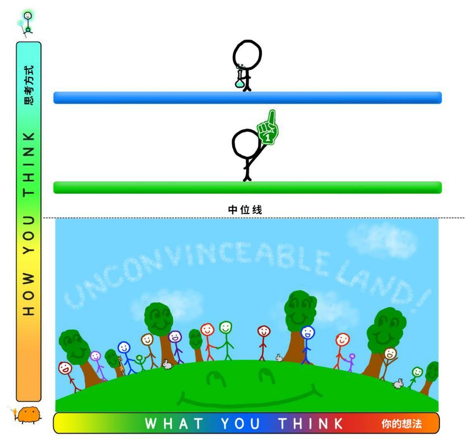

“不可说服之地”是一个绿草如茵、蓝天白云的世界，住着一群不管多少证据都动摇不了信念的人。到了这儿，意味着你已经成为某种思维方式的信徒——一种宗教、一个政治意识形态、一种亚文化教条。无论如何，你的理性之光已经让位给了思想依附。

当我们陷入“不可说服之地”时，就到了阶梯的第三级。

第三级：像律师一样思考

律师和体育迷有很多共同点。他们在“真实的”和“相信的”思想价值观之间摇摆。关键的区别在于，他们内心深处更看重哪个价值观。体育迷想赢，但在不得已的情况下，他们还是在乎真相。但律师的工作就是为了赢，没有什么能改变他们的忠诚度。

不然，难道哪个好律师会这样吗？

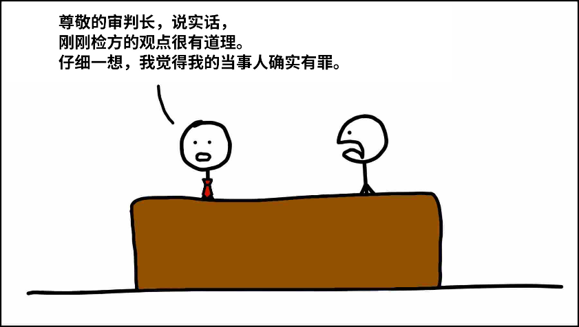

不，不会的。律师是自己人，必须的。

当你像律师一样思考时，你根本不会从A点开始。你直接从B点出发。客户无罪。然后我们再找为什么。

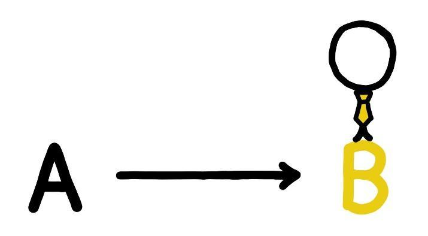

从B点开始，你将尽心尽责，精心挑选证据，拼凑出正好指向你想要结果的论点。

并不是说现实里的律师坏话。在真正的法庭上，律师的思维方式是有道理的——因为每个律师只需要给陪审团呈现案子的一半。现实中的律师知道，让法律系统找到真相的最好方式是让律师各自为故事的一方做出最好的陈述。但在我们的阶梯上，认知律师的头脑就像是一个只有一方的法庭——换句话说，一个腐败的法庭，裁决早已预先判定。

律师对待他们偏好的信念，不像对待一个可修改的实验，也不像支持某个心仪的球队，而像一位委托人。动机性推理演变为强制性辩护，收集、评估、拼图的过程就像法律助理，唯一的任务就是为B点构建有利论据。

如果有人真想相信什么——地球是平的、911是美国人策划的、中情局在追捕他们——人的大脑总会找到一种方法，让这信念看起来明明白白、无可辩驳。对律师来说，假说形成实际上是一个信念强化的过程。他们不可避免地会得出与开始时相同的观点，只是多了一套更新的事实和论据来支撑，让他们更觉得自个儿没错。

在验证假说阶段，律师拒绝真诚地倾听异议。他们自带一套诡辩技巧和强烈的信念感，让他们成为令人火冒三丈的争论对象。律师的对手会感觉自己在和一堵砖墙吵架，到头来，很明显，他们说的任何话——任何话——都不会让律师说，“嗯，是个好观点。我得考虑一下。也许我错了。”

像律师一样思考的结果是，你的大脑学习新事物的能力基本关机了。更糟的是，你一心确认已有信念，让你对一堆错事信心满满。越思考越飘。如果说像律师一样思考有什么可取之处，那就是它至少懂得知识构建的概念。当你像律师一样思考时，你无可说服，但你并没有从高阶思考中脱离太远。在你意识边缘的某个地方，高阶心智的声音还有点分量。如果你能学会倾听并重视它，事情可能会有所改变。

但有时，你的原始心智会非常执着于某些观点，以至于你的高阶心智根本无法影响你对这些信念的看法。面对这些话题，想法和人分不开，改变想法像是生存威胁。你到了最底层。

第四级：像狂信徒一样思考

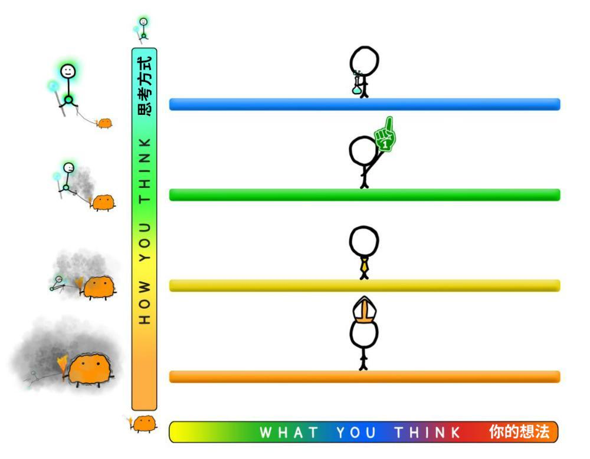

想象一下，你刚有了第一个孩子。超兴奋，对吧？

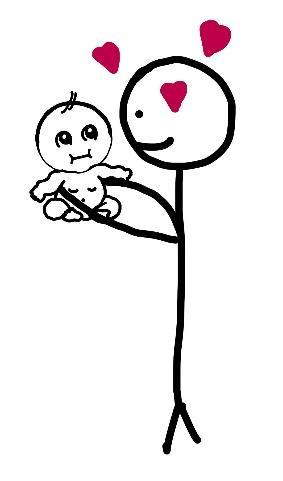

当你每天看到你的宝宝时，你简直要被可爱晕了。

这就是狂信徒和他们神圣信念的关系：这些信念不是可以随便踢来踢去的粗糙实验，它们是脆弱的、珍贵的婴儿，需要被疼爱和保护。

就像没有哪个父母需要研究他们的孩子可不可爱一样，狂信徒不需要从 A 走到 B 来知道他们的观点是对的——他们就是知道。100%确信。

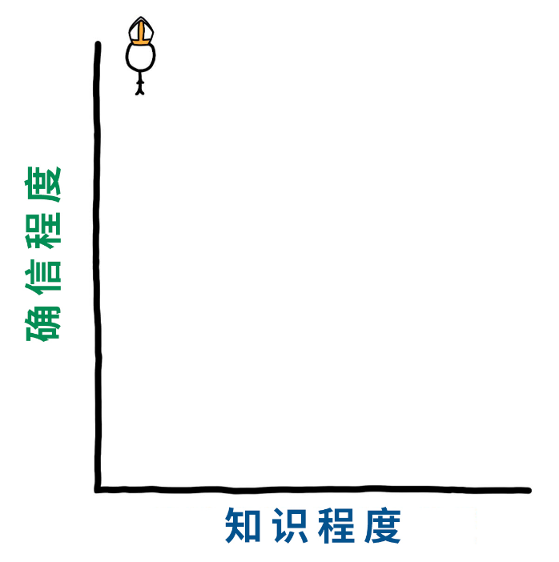

怀疑也是一样。如果有人告诉你，你的宝宝超级可爱，你不会评估他们的可信度，你会不假思索地完全同意。如果有人告诉你，你的宝宝是个混蛋，你不会听他们的，你只会认为他们真是烂人。

这就是为什么狂信徒的摇摆是一个极端走向另一个极端。没有中间地带。

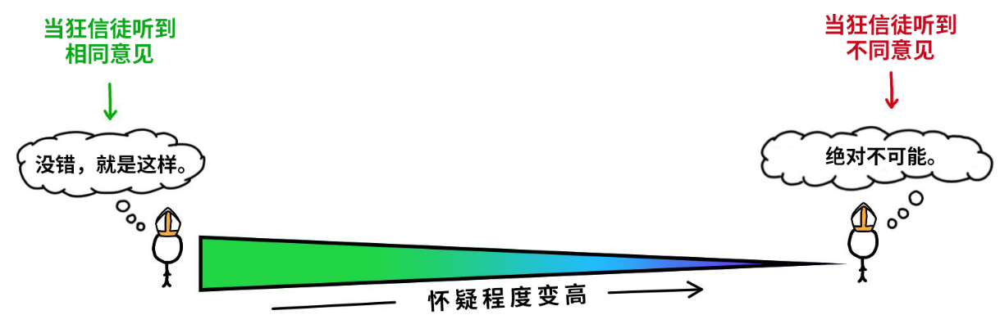

当狂信徒争论时，场面会很快变得激烈，因为对于确信自己想法的人来说，挑战这些想法是种侮辱。感觉在否定他们本人。对狂信徒抨击就像是对他们的孩子拳打脚踢。

当原始心智在我们的头脑中过度活跃时，我们就变得疯狂。我们不仅认为这些信念像婴儿一样，它还给我们展示一个扭曲的自我形象。

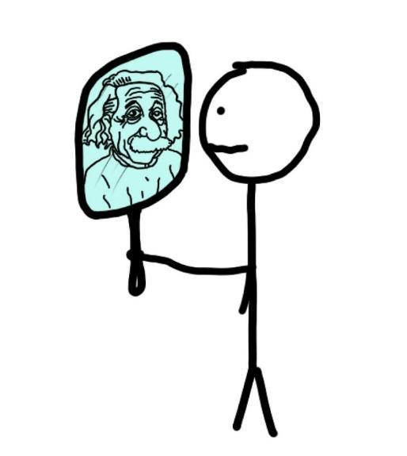

它也向我们展示了一个扭曲的世界。科学家头脑清晰，他们眼中的世界复杂而幽微；狂信徒头脑混乱，而他们眼中的世界却清晰又简单，哪哪都是干脆利落的分界线和非黑即白的区别。当你像狂信徒一样思考时，你最终会沉浸于现实的另一面，觉得自己无所不知，完全掌握了真理。

高阶思维，低阶思维

四种思维阶梯各有区别，但可以分为两大类：高阶思维（科学家和体育迷）和低阶思维（律师和狂信徒）。

高阶思维是独立思考，让你能自由地修正自己的想法，甚至完全抛弃它们。但，如果无论何种证据都无法动摇你对某事的想法时，那意味着这个想法成了你的主人。在低阶思维中，你勤勤恳恳地服务于你的想法，而不是让想法成为你的工具。

高阶思维是有高效的。高阶思维的谦逊，使你的头脑成为一个可渗透的过滤器，吸收生活经验，并将其转化为知识和智慧。与此相对，低阶思维的傲慢让你的头脑像个橡胶壳，生活经验只能弹开。一个带来进步，一个带来无知。

我们都有位于低阶思维的时候，而在那种思维模式下，我们是意识不到的。我们相信自己的信念来之不易。我们相信自己的观点是原创的，是有理有据的。因为随着原始心智的影响力不断增长，笼罩我们意识的迷雾也在变得更浓。这就是低阶思维持续存在的原因。

每个人都不完美。我们永远无法摆脱低层次的思考，但如果对这种心理保持觉察，我们就能更多地运用高阶思考，更少地进入低阶思考。提高这一比例，对所有人都是一个明智的目标。

但这只是我们旅途的开始。个人思维只是更大图景的中心。我们是社会动物，我们如何看待大多数事情，往往受到我们身边人的影响。

### 知识文化

我们可以将“文化”定义为“我们在这里做事的方式”的不成文规则。

每个人类环境——从2个人的伴侣，到20个人的课堂，再到20，000人的公司——都有自己的文化嵌入其中。我们可以将一个群体的文化想象成一种气体云，当这个团体在一起时就会充满整个房间。

群体文化通过社交激励系统影响成员。遵守文化规则的人会得到接受、尊重和赞扬的奖励，而违反文化规则会招来嘲笑、羞耻和排斥等惩罚。

人类社会是一张纷繁的文化织锦，各种文化彼此重叠，时而尖锐对立，我们每个人都生活在自己独特的文化交叉点上。

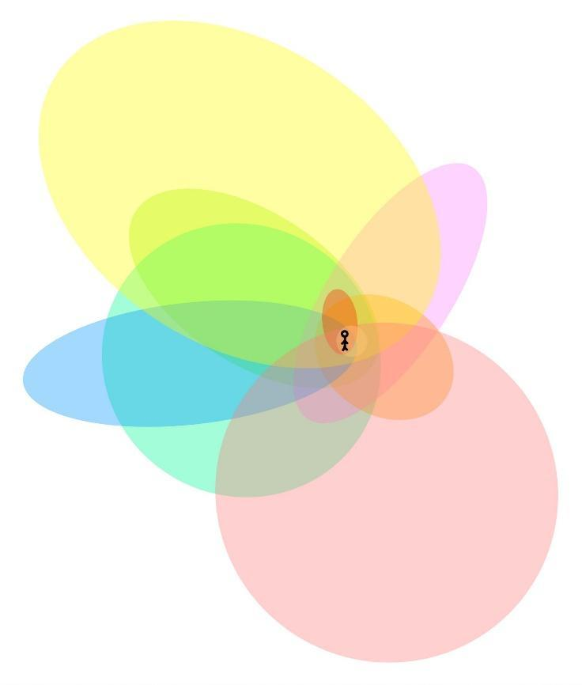

在湾区一家科技初创公司工作的人，同时生活在全球西方社区、美国社区、西海岸社区、旧金山社区、科技行业社区、初创公司社区、工作场所社区、大学校友社区、大家庭社区、朋友圈社区，以及旧金山的一些奇奇怪怪的社区中。违背这些大社区的文化风潮，往往比打破我们最亲密的微观文化的不成文规则要容易——那些由我们的直系亲属、最亲密的朋友和浪漫关系组成的文化。

同时身处在多重文化中，是身为人类复杂的一部分。我们是否该将个人的内在价值观深藏不露，只是尽力使外在行为与当前房间文化相符？或者，我们是否该忠于某一特定文化，无论走到哪儿都照章行事，即使这会危及我们的社交或职业前途也在所不惜？我们是否该在生活中寻找与自身价值观相符的外在文化，尽量减少摩擦？或者，我们是否该让自己置身于一系列相互冲突的文化中，给内心施加一些压力，迫使我们去学习、去成长？无论你是否意识到，你无时无刻不在做这些选择。

文化可以涵盖人际互动的方方面面。例如，一群朋友之间会有他们过生日的方式、使用表情包的方式、背后议论的方式、处理冲突的方式，等等。就本次探讨而言，我们将重点聚焦于这些现象与思维方式的关联，即群体思想文化——“我们这里做事的方式”，它与想法的表达密切相关。

就像你头脑中的两方争夺对你的思维控制权一样，类似的更大规模的斗争发生在群体思维中。高阶心智可以与其他高阶心智联合起来，形成一种联盟，而群体的原始心智们也可以这样做。联盟如果获得对文化的控制权，就像拥有体育运动中的主场优势——这是“客队”难以对抗的。

我们先来探索一下，当高阶心智掌握群体思想文化的缰绳时，它看起来是什么样子的。

### 思想实验室

我们大多数人都知道“回音室”这个术语，我们一会儿会讲到——但我们特别缺少一个与回音室相反的词。当一个团体的思想文化规则映射着高阶思维的价值观时，这个团体就是我所说的“思想实验室”。

思想实验室是一个合作进行高阶思考的环境。这里的人们将彼此视为实验者，思想就是实验。思想实验室重视独立思考和观点多样性。这种组合诞生了最为丰富和有趣的对话，并最大程度地拓展了群体讨论的广度。

思想实验室很看重谦逊，说“我不知道”通常会赢得信任和尊重。当一个经常说“我不知道”的人对某个观点表示肯定时，那必然有所说法，其他人会把它放在心上，无须过多质疑——这为听者节省了时间和精力。同样，随意得来的肯定是思想实验室的一大禁忌。因此，对于一个以偏颇、傲慢或不诚实著称的人来说，无论他们表达多少确信，都会遭到高度怀疑。

思想实验室也喜欢争论。思想实验室中的思想就像假说一样，人们总是在寻找机会来测试他们的想法。思想实验室是做测试的完美拳击场。

有时，高阶思想家们会开启争论，捍卫想法，极力辩称其正确性。

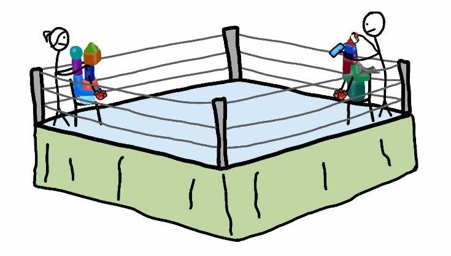

有时，他们会辩证地看待事物，与异议者一起验证他们的想法。

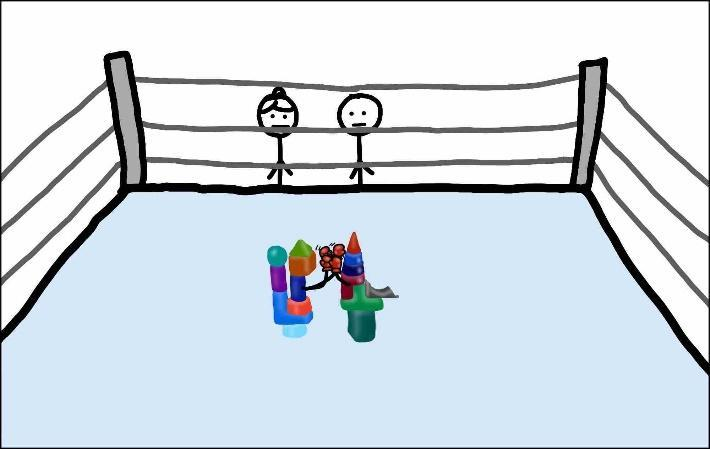

他们甚至可能尝试改变立场，扮演“魔鬼代言人”，与与他们意见一致的人辩论，以便从另一个角度看待他们的想法。

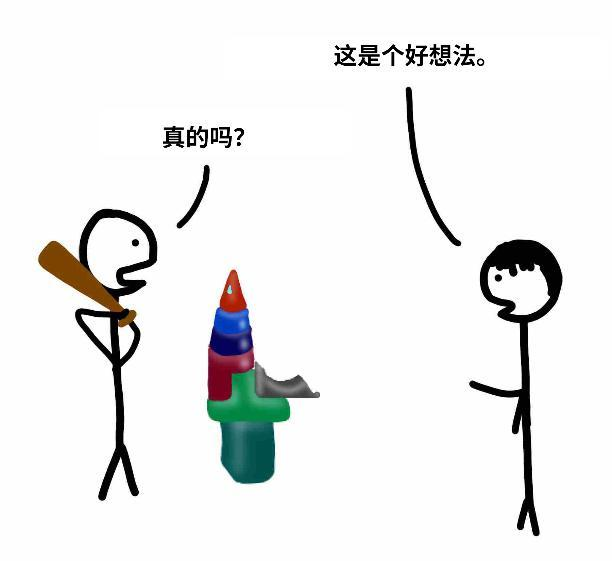

在思想实验室里，人们通常不会把争论当回事。因为思想实验室文化的核心理念在于，人和思想是两码事。人应该受到尊重，思想则应该得到碰撞和剖析。

最重要的是，思想实验室帮助其成员保持在“阶梯”上的高位。没有人会一直像纯粹的顶尖科学家那样思考。更常见的情况是，在某段特别理智而谦卑、短暂的“阶梯”顶端时期后，我们开始过分迷恋于在高处所得的顿悟，迅速滑落到“体育迷”的思维层次。这其实没什么。在我们的求知生活中，保持有点过度自信可能反而是最佳状态。为我们的想法——无论是新的哲学观念、新的生活方式选择，还是新的商业策略——摇旗呐喊，使我们能够真正去尝试这些想法，稍微摆脱了来自高层心智那持续不断的“我们真的确定吗？”的拷问。

做体育迷不是什么大事。问题是，在公正的思考中引入一点偏见，有点像在你关了闹钟后又闭眼多眯一分钟——它总比你预想的更危险。对一个想法有点着迷是不知不觉地漂向“不可说服之地”和更低级阶梯的一小步。我们天生被预设为低阶的思考者，我们的智力与重力作着永恒的斗争。

这就是为什么思想实验室文化如此重要。它是一种支持网络，为有缺点的思考者提供帮助，帮助他们在更高的阶梯上保持清醒。

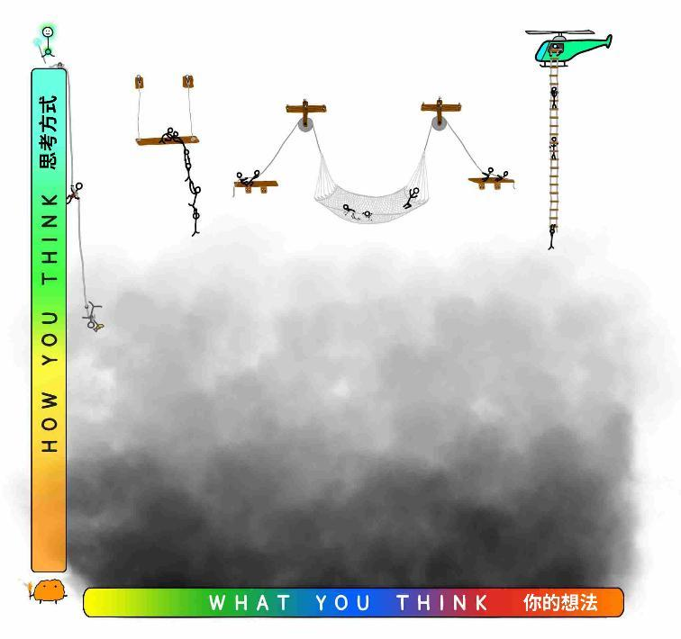

群体压力有其好处。如果高阶思维是所有受欢迎的人都在做的事，你也更可能那样思考。

知识场域中的压力亦有助益。在思想实验室中——人们从不讳言指出你的错误、偏见、虚伪或轻信——谦逊与自省便会常伴左右。每当你变得过分自信时，思想实验室的文化氛围便会将你拉回理性确信的正轨。

这些力量结合在一起，使思想实验室文化成为阶梯顶端的一块大磁铁，吸引着沉溺于低阶的心灵向上攀登。

但，如果一个群体的原始心智大行其道时，会发生什么？

### 回音室

回音室是一个群体的智力文化滑到低阶时的产物：低水平的协作思维。

思想实验室是批判性思维和辩论的文化，而回音室是群体思维和从众的文化，因为思想实验室致力于发掘某种思想，而回音室致力于将信念包装为不容亵渎的信仰。

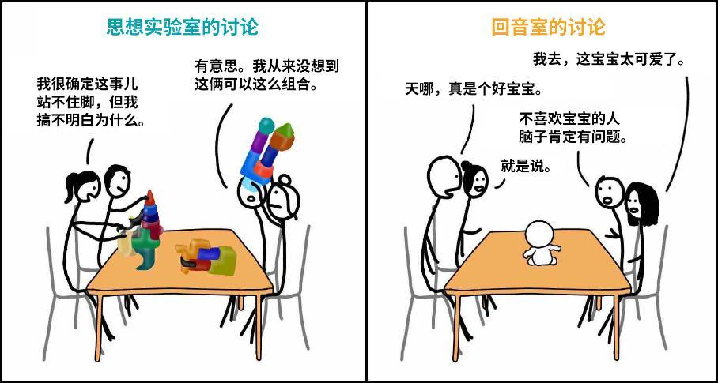

如果一种文化将信念视为神圣，那么它所鼓励的行为与“思想实验室”完全不同。在回音室内，与群体保持一致会得到社交奖励。谈论这些神圣思想是多么正确是一种常见的活动——这是你表达对群体的忠诚并证明自己的智识和道德观的一种方式。

在“回音室”中，谦逊是被看不起的，说“我不知道”只会让你听起来很无知，改变主意会让你看起来优柔寡断。而在“思考实验室”中慎用的信念，在“回音室”中却是社交货币。你表达的信念越多，你看起来就越博学、越聪明、越正直。

思想实验室可以尊重一个人，但否定这个人提出的想法。回音室将一个人的想法等同于他们的身份，所以尊重一个人和尊重他们的想法是一回事。与某人持不同意见不是一种思想的探究，而被视为粗鲁，对于想法的争论更与打架无异。

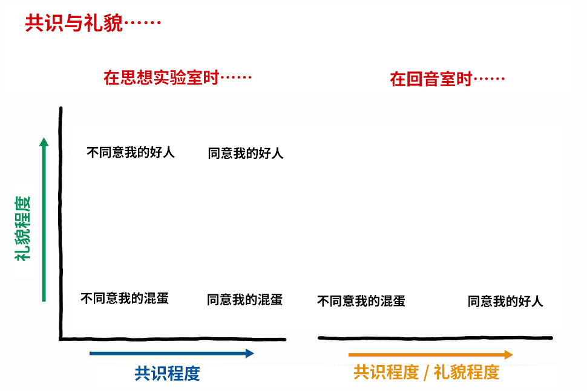

这在道德层面上为回音室提供了一个强大的文化执法工具：禁忌。那些挑战神圣观念的人不仅有错，而且被视为坏人。违反者会受到惩罚，包括付出地位降低、声誉受损的代价，落入遭受排斥的困境，甚至被判处永久流放的社交死刑。在某些群体中，对上帝、堕胎、爱国主义、移民、种族或资本主义表达出不当观点，你可能会遭遇激烈的负面反应。回音室是一个必须谨言慎行的地方。

回音室可能源于一群人共同奉某些观念为圭臬。有时则可能源于一个或少数“思想霸凌者”，其他人都不敢违抗他们。即便在最小的群体中——比如一对夫妻——如果一方认为挑战配偶的强硬观点永远不值得，那么配偶其实就在婚姻中强加了回音室文化。

思想文化对个体有重大的影响。思想实验室文化鼓励智识和道德的成长，而回音室文化则抑制新想法，限制创新，并且摒除辩论等获取知识的工具——这些都阻碍了成长。

在回音室中停留太久会让人变得不那么谦逊，更加自以为是，同时限制了真正的学习，导致思维能力萎缩。

从宏观角度而言，原始心智和高阶心智都容易传染。思想实验室文化是一个支持性的群体，帮助人们从高阶思维上思考，但回音室文化会释放出原始心智的费洛蒙，对成员的心理产生普遍的向下拉力。

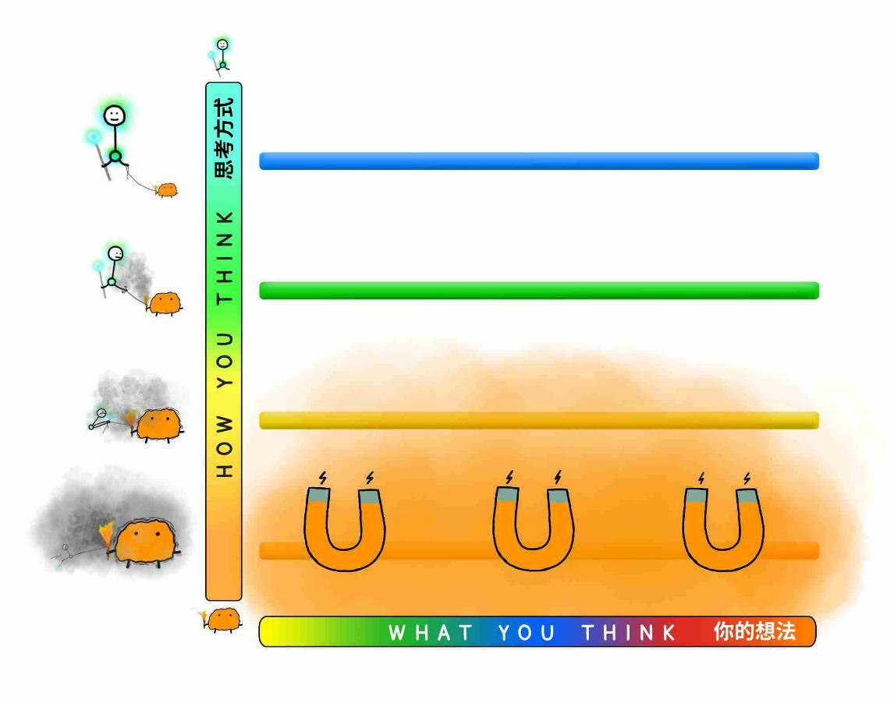

鉴于思想实验室文化带来的好处如此显著，我们竟然会追求另一种选择，真是奇怪。我们吃彩虹糖，是因为我们的原始心智被设定为想要含糖量高的热量密集型食物。但为什么我们的原始心智要我们建立回音室呢？

让我们再把视角拉远一点。

### 巨人队

几十亿年前，一些单细胞生物发现只做一个细胞，选项实在太有限了。

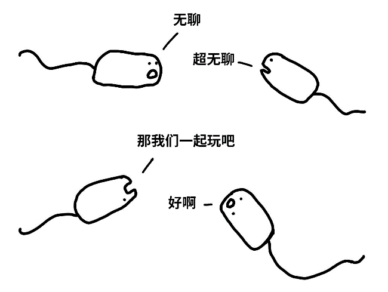

所以它们想出了一个绝妙的方法。通过与其他单细胞结合，它们能形成一个拥有各种新优势的巨人。

这种现象——许多小的个体联合起来形成一个巨大的整体，而这个整体的功能超越了各部分的简单叠加——被称为涌现。我们可以用一个涌现之塔来将其可视化。

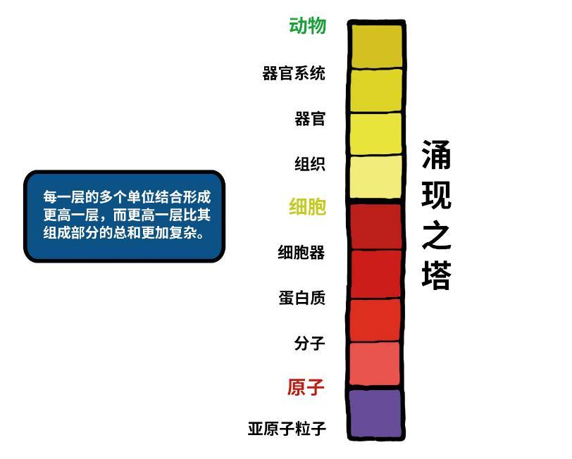

细胞开始结合成为动物后不久，一些动物发现它们可以更上一层，形成由多个动物组成的更大的巨型动物。

当我们观察到动物之间的协作行为时，可能会认为这是出于体恤——但这种理解尚未触及本质。未能从涌现的角度去理解。

以蚂蚁和蜘蛛为例。蚂蚁非常忠诚，总是把团队放在第一位。我深知蚂蚁有很多糟糕的性格特质，但“自私”不在其列。

然而，两只蜘蛛将无情地相互竞争，两者都是完全利己的。

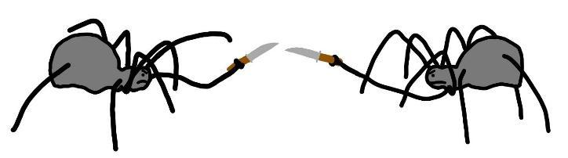

这是为什么？蚂蚁比蜘蛛更善良吗？

不是的。只是蜘蛛在个体水平上停止了涌现，而蚂蚁则上升到更高的水平——蚁群。

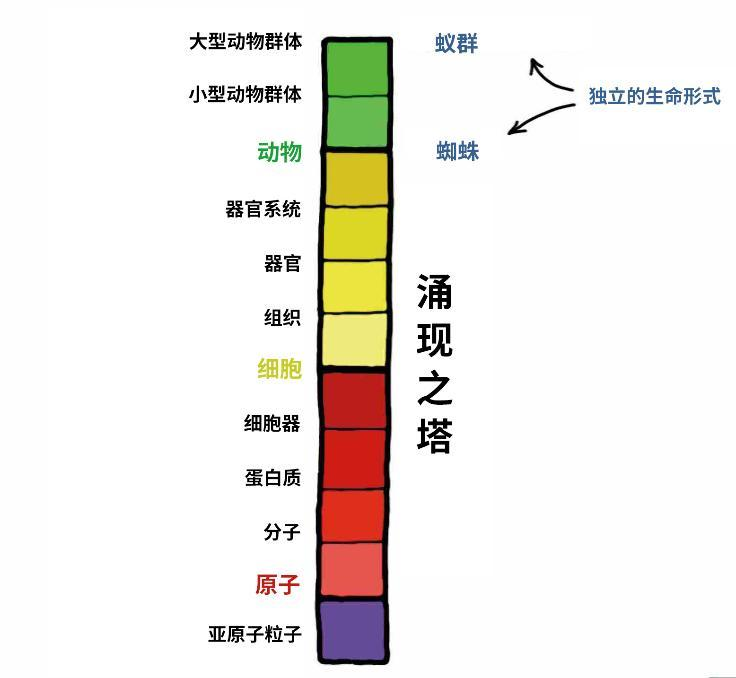

蚁群是蚂蚁世界中真正的“独立生命形式”。如果我们观察蚁群如何对待其他蚁群，就会发现这很像蜘蛛对待另一只蜘蛛的方式。

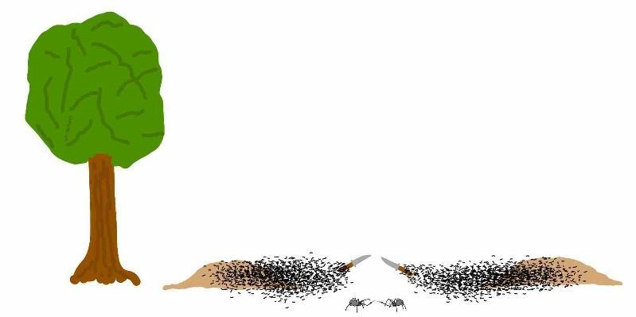

蚁群中的单个蚂蚁有点像组成你身体的细胞，它们相互合作不是因为性格友好，而是因为它们是一个更大的生命形式的一部分。

人类也有涌现现象——跟所有人类的事儿一样，很复杂。

首先，就像我们在阶梯上上下下一样，我们在“涌现之塔”上也是到处乱窜。

你早上醒来时，你的心智还停留在塔的底部，感觉像一个孤独的个体。你去上班，与另外五个人一起头脑风暴一个项目，成为一台六人思维机器的一部分。下班后，你加入一场政治抗议活动，在成为上千人的扩音器的一小部分所带来的兴奋中，你失去了自我。根据不同状况，我们可以表现得像蜘蛛或蚂蚁一样，或者介于两者之间。就好像塔里有一部电梯，我们的思想会定期乘坐电梯上上下下。

其次，人类形成的巨人很怪。动物们有各种各样的方法“粘合”在一起，形成更高级的巨人。像蚂蚁和蜜蜂这样的简单生物在大规模上实现了合作，这是以牺牲个体自主权为代价的。像狼、狮子和海豚这样的复杂生物在个体上更加独立，但它们家庭规模更小，这通常限制了它们能够形成的“巨人”的大小。

早期人类与其他复杂生物相似——局限于小的、紧密结合的部落。但机缘巧合，我们想出了如何破解这个系统。通过共同信仰、文化、价值观或利益联合，我们打破了巨大规模上的天花板，实现了其他复杂生物无法做到的事情：大规模合作。

当人类精妙的认知能力与大规模合作能力相结合时，这就有了一个自带超能力的物种。

回到阶梯，人类的高阶心智和原始心智都有自己的涌现方式。思想实验室和回音室不仅仅是一种群体文化——它们更是两种截然不同的塑造人类巨人的方式。

高阶巨人：精灵

你的大脑是一个巨大的神经网络，由 860 亿个神经元组成。一个单独的神经元没什么用。

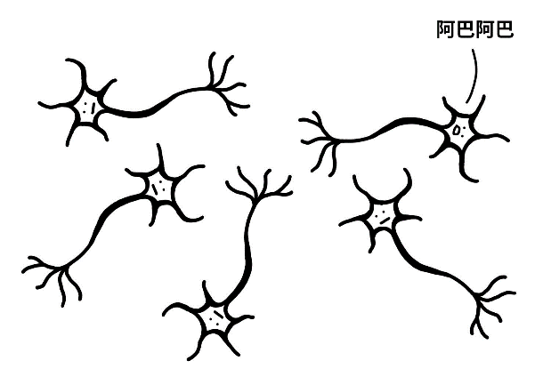

而通过互相交流，一群神经元可以在“涌现之塔”中向上移动，并结合成一个比其组合——大脑——强大得多的独立思维系统。

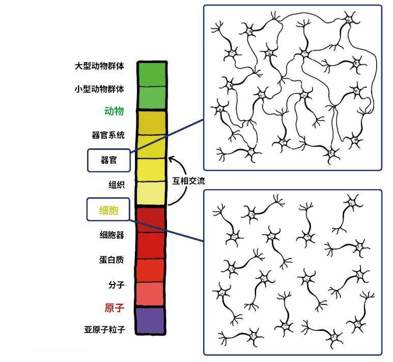

在塔上几层楼高的人类层面，也发生着类似的现象。一群人聚集在一起，但并不交流，只是一群个体大脑聚集在同一个地方。语言非常重要，因为它允许独立的大脑相互连接，就像神经元一样，形成一个更大的思考系统：集体大脑。

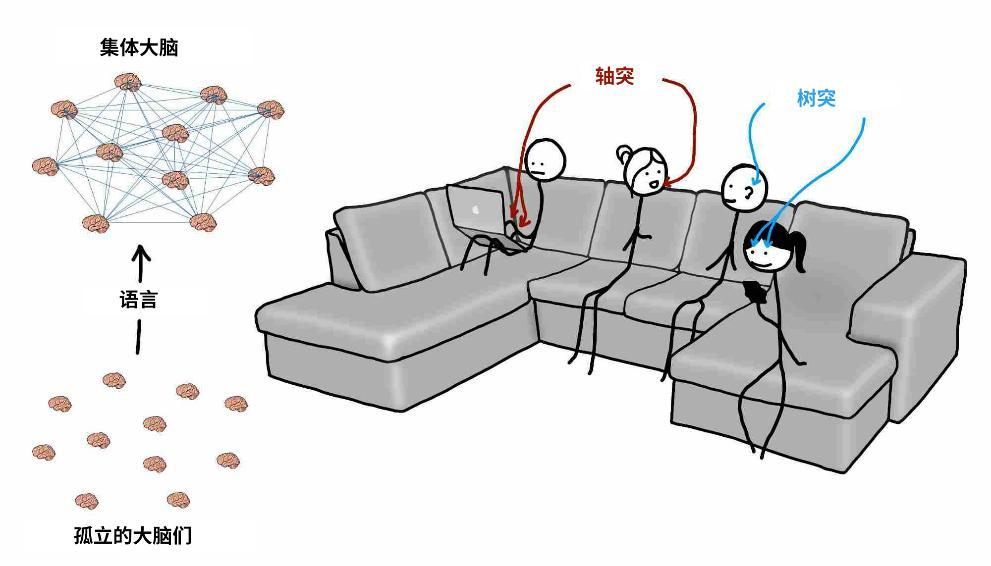

社会心理学家乔纳森·海特在他的著作《正义之心》中谈到了集体大脑怎么运作：

如果你以正确的方式将个体聚集在一起，让一些个体能够用推理能力去验证他人的观点……你就能创造一个群体，让良好的理性思维成为这个社交系统的涌现特性。这就是为什么在任何以寻求真理为目标的群体或机构中，保持思想和意识形态的多样性如此重要。

这就是思想实验室文化的魔法。个体思维容易有偏见，但偏见的多样性却能帮助集体大脑减少盲点。在鼓励改变想法的文化中，新发现能够快速传遍整个系统，只需一个成员发现谬误，整个群体就能将其摒弃。当分歧受到鼓励时，新想法可以在形成过程中实时接受检验，将每个人的知识构建努力结合成单一、动态的过程。

其结果是形成了一个多重思维系统，在学习新知识和辨别真伪方面超越了任何单个成员。让我们称这种思维系统为“精灵”。

精灵能将分歧转化为更高层次的协作，没什么能阻止它们无限扩展。例如，研究机构就是一个官方的思想实验室，同行评议等做法创造了一个极为高效的精灵。来自不同大学甚至不同国家的研究中心可以相互批评，或在彼此的发现基础上继续发展，让众多精灵联合成为一个全球级的智慧精灵。

这种协作并不以牺牲个体为代价。恰恰相反，当成员都是独立思考者时，精灵才能蓬勃发展。因此，身在精灵中的人们能够体验涌现的最大益处：他们既能作为自由个体蓬勃发展，又能作为更大系统中的较小部分茁壮成长。

这是高阶心智构建巨人的方式。当原始心智掌权时，我们最终会得到一个完全不同的怪物。

低阶巨人：魔像

1245年，教皇找到一位名叫乔瓦尼·达·皮安·德尔·卡尔皮尼的牧师，向他提出了一个请求。

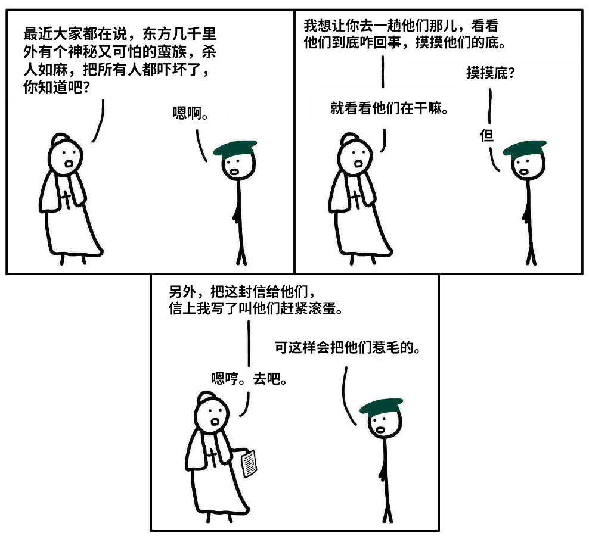

于是乔瓦尼骑上马，花了四个月时间走了3000英里到蒙古——这是一个几乎没有欧洲人踏足过的地方（马可·波罗著名的旅程要在26年后才开始）。不知何故，乔瓦尼居然活了下来，在蒙古待了四个月后，又回到了欧洲。

事实证明，蒙古人名不虚传。乔瓦尼写了一本书，讲他们怎么生活，怎么征服。

根据乔瓦尼的记载，蒙古军队采用十进制系统，具体是这样的：

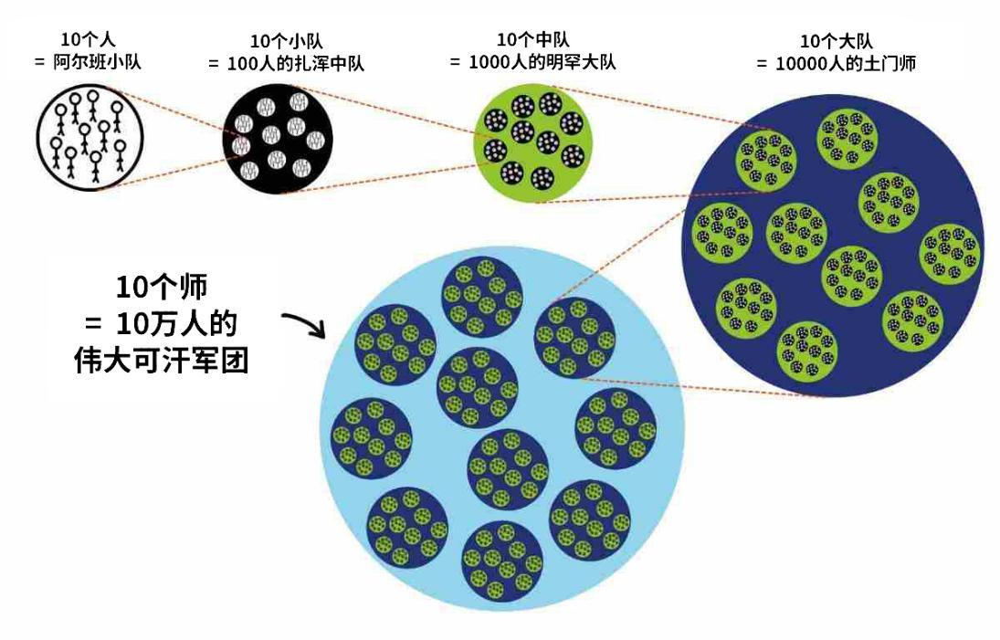

乔瓦尼写道，蒙古统治者对他们的军队施行极其严苛的纪律：

“当他们与其他民族作战时，除非全体同意撤退，否则任何逃兵都将被处死。如果十人中有两三人勇敢上阵，其余退缩不跟队，同样处死。如果十人或更多人中有一人被俘，同伴没能解救，也要被处以死刑。”

真庆幸我不在蒙古军队里。但更庆幸的是没有挡在蒙古军队的进攻路线上。历史学家J·J·桑德斯写道：

“（成吉思汗）擅长最恐怖的心理战术。他刻意树立起令人恐惧的凶残形象，期望（往往能够实现）吓得整个国家不战而降。蒙古人实施屠杀时表现出的冷酷野蛮令人反胃。一座注定毁灭的城市居民被逼到城外平原上集合，每个蒙古骑兵都手持一把战斧，被下令杀死特定数量的人，可能是十个、二十个或五十个。……屠杀几天后，军队被派回这座被毁的城镇，搜寻那些可能藏在洞穴或地窖里的可怜人，把他们拖出来杀掉。”

你能说出13世纪有多少名人？大概就两个吧？但你知道成吉思汗。每个人都知道成吉思汗。因为成吉思汗打造了人类历史上最大、最凶狠的魔像之一。

在神话中，魔像是一种又大又愚蠢的怪物，这让它成了低阶巨人的完美象征。

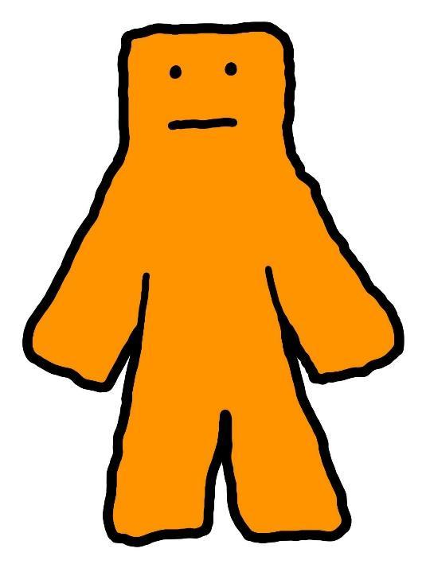

如果精灵是人类协作的产物，那么魔像就是人类从众的涌现结果。当人类像蚂蚁一样行动时，就会产生魔像。

蚂蚁的行为有两个组成部分：在蚁群中的严格顺从和在与其他蚁群打交道时的残酷无情。

在对内的一致性上，蒙古领袖把军队视为一台机器。如果一个十人小队里的成员叛逃了，他们会认为这个小队是机器的缺陷零件，无法自我管理，就把整个小队杀了抛弃它。这看起来可能疯了，但如果你的唯一目标就是创造完美魔像，这就像在癌细胞扩散之前切除癌

变肿瘤一样理所当然。

在对外的残酷性上，蒙古军队对挡在他们路径上的定居社会有明确的规则：要么顺从，要么反抗。立刻投降，你就可以加入我们活下去；抵抗，我们就灭了你们，从男人到女人到小孩一个不留。

我拿蒙古人举例，是因为他们是人类魔像的极端版本。但魔像无处不在。当一群人对内部表现出严格的一致性，对外表现出“我们对抗他们”的心态时——军队整齐行进，活动家高呼口号，公民集体举拳或敬礼，或者仅仅是一群人表现出强烈的回音室特征——那就是一群处于魔像模式的人。

精灵试图消除人类的认知弱点，而这恰恰是魔像擅长利用的。确信偏误的诡计——断章取义、预设动机的怀疑和推理——在大规模的系统中获益匪浅，因为最简洁、具有说服力的神圣观念会迅速传遍系统。在回音室里，所有个体偏见都指向同一方向，放大成魔像那超级偏见的宏观心智。虽然魔像内部的个体心智可能对神圣观念产生怀疑，但回音室文化的社会压力让整个巨人坚定不移。如果说精灵是终极科学家，那么魔像就是终极狂信徒——一个自以为是、完全无法学习或改变想法，且思维能力比普通人更差劲的巨人。

但魔不是为了思考或寻找真理而生。魔像的专长是蛮力。它是一个群体把自己变成大而可怕的怪物的方式。

我们讨论过精灵如何无缝地与其他精灵结合形成超级精灵。魔像也能扩大规模，但方式完全不同——基于冲突。魔像不仅偏好“我们对抗他们”的思维模式，还依赖于它。敌对魔像的存在是维系它们的关键。魔像通过共同敌人来联合力量。如果一群魔像战胜了共同敌人，联盟往往会分裂成较小的对立魔像，以维持“我们对抗他们”的结构。

让我们用一张图表来梳理这些概念：

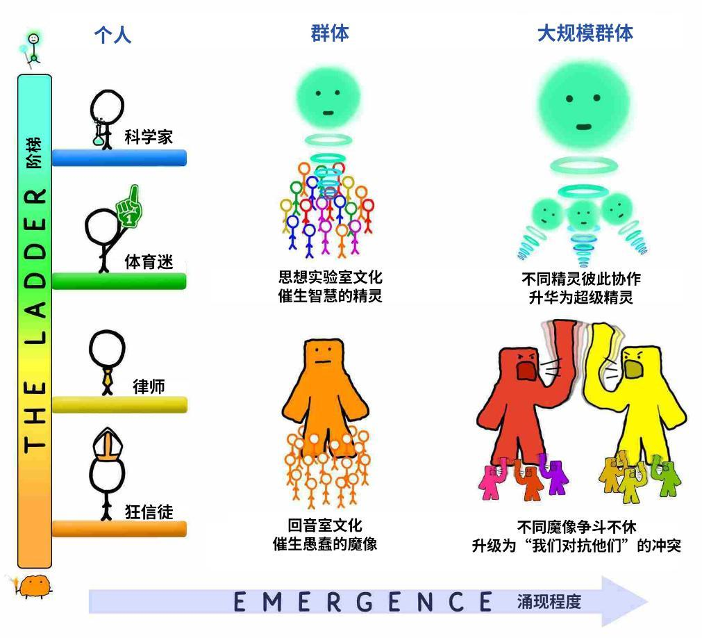

在阶梯的高层，个体茁壮成长，人类的智慧和知识呈指数级提升。而在阶梯的低处，个性被扼杀，幻想在滋生，群体智慧消失了，转而追求蛮力和大规模冲突。这又把我们带回到那个问题：既然高阶风景独好，为什么我们却倾向于待在低层？这是因为我们的原始心智被设定这么做，在遥远的过去，这是生存的最佳方式。低阶思考、低阶文化、低阶巨人构建，都是古老的求生行为——很久以前必要，如今看来却像飞蛾扑向街灯一般。当我观察今天的世界，我看到低阶思考和行为的流行病在蔓延。我们的头脑、社区、政党，以及社会，都在朝错误的方向滑落。阶梯框架将贯穿全书，也可以作为我们的指引罗盘。在序言中，我将人类的发展道路比作一个巨大的生命体在山脊上攀登的过程，两侧都是陡峭的悬崖。我把高梯度看作是帮助我们稳定和积极向上的源泉，而低梯度则是把我们拉下悬崖的引力。为了确保我们能在这条山脊上稳步前进，我们得看清低阶心理藏在哪里，并找到应对它的方法。

## 插曲

## 自由的博弈

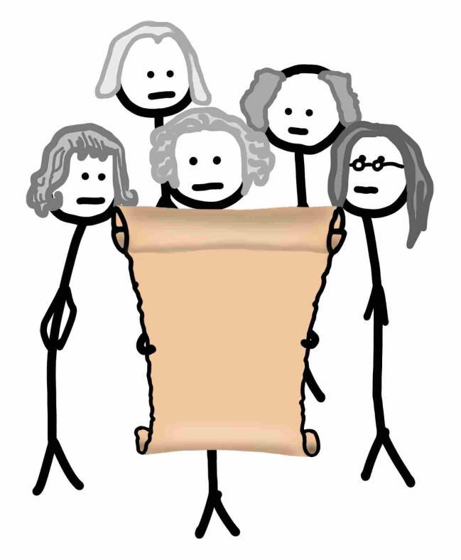

此前，我们讲述了一个熊与兔子的故事，结局对兔子而言并不理想。

自然界是一个危机四伏的地方，因为那里没有道德，没有准则，也没有人来确保公平。规则很简单：

只要你有能力，想干嘛就干嘛。

如果熊想吃兔子，只要它能追上兔子就可以。如果兔子想要继续生存，只要它跑得够快就行。就这么简单。

让我们称之为权力博弈。

长期以来，人类就像兔子和熊一样——住在森林或草原上，努力让自己吃饱、不被吃掉，和其他动物一样在权力博弈中挣扎。

但作弊式的大规模协作改变了一切。它赋予人类一种比任何长矛或弓箭都更强大的工具：精灵。

纵观人类历史，你会看到十几万年来，人类一直生活在小部落中——知识和技术进步极其缓慢。随后农业革命到来，人类聚集成更大的协作群体——这个物种开始创造奇迹。知识和技术飞速发展，建立起庞大的文明。人类个体的智力没有提升，但他们的集体智慧在增长。

更大规模的社会产生了更强大的精灵——更多的人互相交流、分享经验、揭穿误解。文字的出现使知识能够跨越时空传递，增强了精灵的记忆，使它们的头脑更加清晰。

我们如今所处的文明，所有令人难以置信的技术，不是单一人类创造的。人类根本没那么聪明。周围这个奇妙的世界，是拜精灵所赐。

大规模协作使人类摆脱了食物链的束缚——这成就让任何兔子或熊都羡慕得要命。但大规模协作也有其阴暗面。同样的突破不仅带来了精灵，还产生了比熊、狮子或鲨鱼更可怕的顶级掠食者：魔像。

亚述人、波斯人、马其顿人、罗马人、匈奴人、穆斯林、基督徒或扩张时碰到的所有人都会告诉你：如果面对魔像，而你防御不住，就会迎来灭顶之灾。你可以生活在一个繁荣的高阶乌托邦，有清晰文明的规则，但当魔像来袭，如果你无法在权力博弈中打败它，这些规则都将失去意义。

在历史的大多数时期，抵御世界上的魔像的唯一方式就是形成一个更强大、更凶猛的魔像。所以过去一万年基本就是魔像争斗不休，最强大、最凶残的魔像主宰着世界。

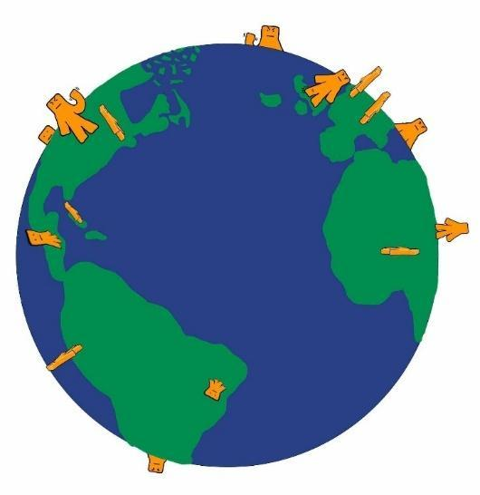

原始心智为了在权力博弈中生存而设定的，所以我们天生就能随时切换到魔像模式。这是人类面临的重大悖论：人类最大的威胁是低级的人性，而低级的人性又偏偏是应对这种威

胁的最佳防御。

为了真正地从动物世界的危机中解脱，我们得想办法智胜这最可怕的超级掠食者。几百年前，一群叛逆的思想家开始酝酿一个计划，他们相信这是可以做到的。

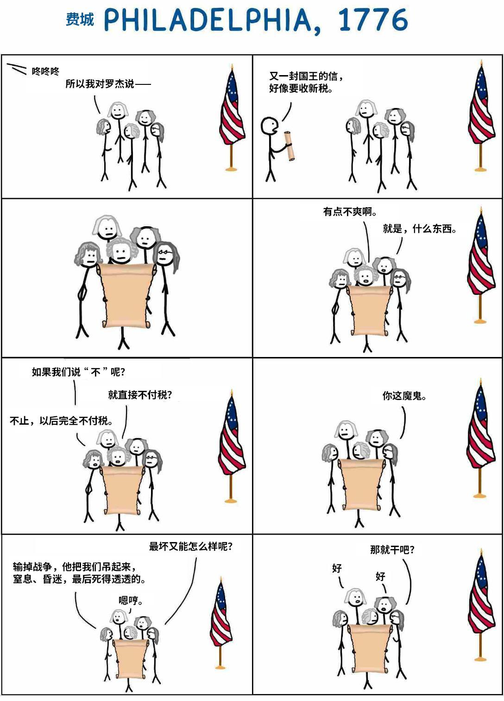

1776年的反叛并不新鲜，那时许多国家都在“暴政→政变→混乱→暴政”里循环。美国开国先辈的不同之处在于他们的长远规划。

通常，人民造反是因为他们厌倦了无权无势，渴望翻盘。于是叛乱推翻暴君，混乱随之而至，朋友互相残杀，一切尘埃落定时，新的暴君又会出现。但那是18世纪末期，先辈们是启蒙运动的继承者。

启蒙运动期间，欧洲一些地区的哲学家们开始传播新的理念。

这个理念建立在自古希腊就有的西方思想上，探讨了人权、法律平等、包容和自由等概念。他们认为，权力博弈是令人不快、不公平、没有效率，也不必要——更重要的是，它从根本上违背了道德，侵犯了作为人最基本的尊严。

这种思想像病毒般传播开来。不久，它跨越大西洋，在美洲殖民地的民众中扎根，将顺从的英国臣民转变为不满现状的启蒙者。美国开国先辈们正是在这样的背景下成长，他们决定采取行动。

于是，他们向伦敦寄出了一封信，阐明了这个新形势。

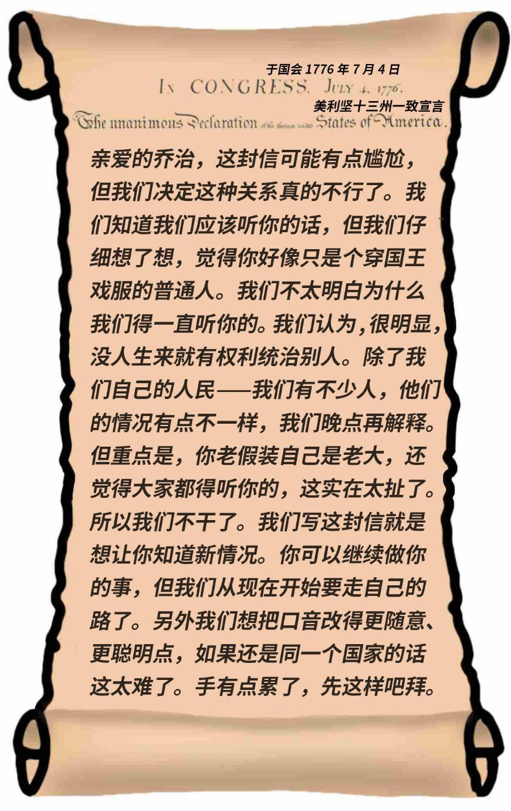

乔治国王和他的议会对此大发雷霆，英国人随即发动了战争。44岁的乔治·华盛顿肩负起了抵御英军的重任——有趣的是，据说他的母亲非常反对这件事。

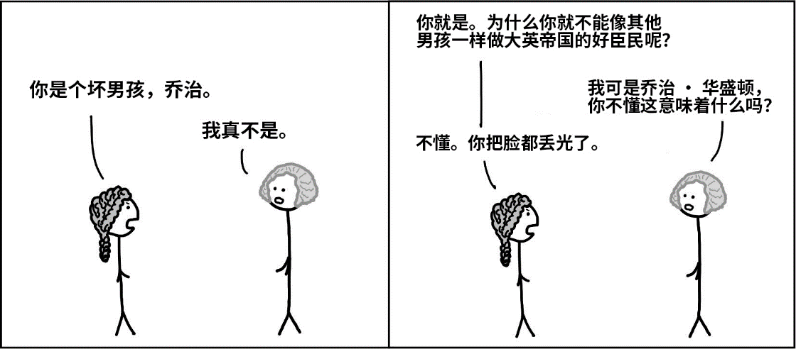

但这并未阻止乔治，在法国的欣然相助下，他和战友们成功抵御英军，直到英军最终放弃，灰溜溜地回到大洋彼岸。

美国人赢得了独立，赢得了一个难得的机会：从零开始建立一个新国家——将“如果能建立自己的国家，我会怎么做” 的幻想变成现实。是时候检验启蒙思想了。

### 设计美国巨人

我们可以将人类活动简化为一个公式。

人性是不变的，当你把这个不变的因素置于不同环境中时，会产生不同的行为。环境就是自变量。人类环境相当复杂——包括自然环境、周围的人和文化、主流信仰和体系，还有法律和规则。

过去许多国王、皇帝和军阀都采用权力博弈的方式塑造环境，以极权统治、严苛法律和残酷刑罚，来控制和折服民众。

启蒙思想家们觉得这可以改进。他们相信，通过更温和、更公平、更少干预的政府形式同样能够鼓励良好行为。我称这个体系为自由博弈。

在自由博弈中，公民不是被棍棒统治，而是遵循一套受启蒙哲学启发的自由原则。

美国开国者们通过宪法将这一理念正式确立：这套规则不服务于某个具体目标或结果，规

则本身就是神圣的。宪法描述了一个神圣的过程——一系列不可侵犯的边界，任何国家或个人目标都必须在这个边界内实现。它规定了选举领导人的方式、解决冲突和惩处违法者的方式、通过法案、制定法律和宣战的方式——所有程序都源自启蒙价值观。最重要的是，宪法严格限制政府权力，保护人民免受政府侵害。政府是维持运作的大执行者，但它的武力只能用在核心任务上。

自由博弈的另一个关键是自由。

权力博弈中最糟糕的事情之一就是没有自由。但想象一下，如果你拥有100%的自由，你周围的人也都拥有100%的自由。

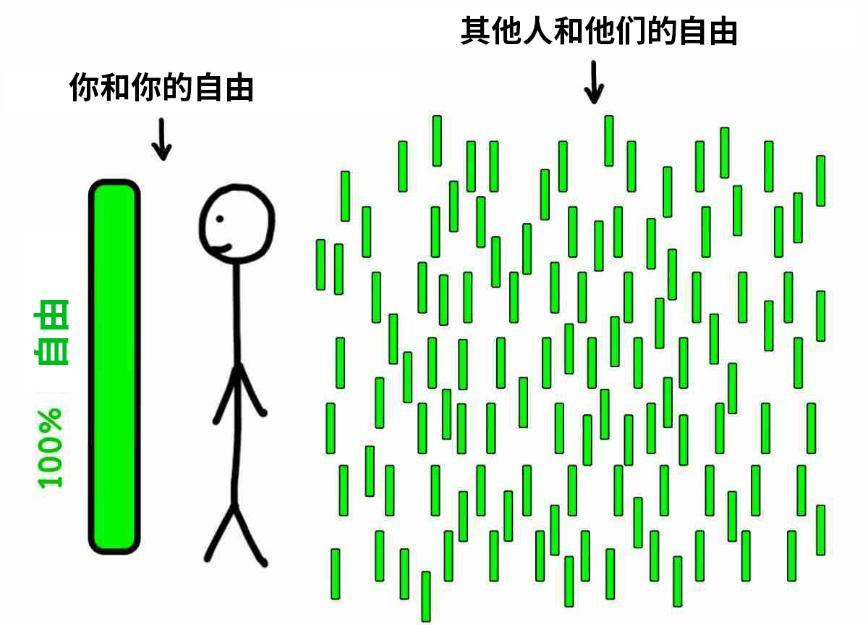

如果人人都能一直和睦相处，这种自由或许能持续。但这不可能。在权力博弈中，一旦发生冲突，权力的规则就会生效，拳头最大的人说了算。如果有人有能力欺压你，限制你的自由，你将无处可逃，也没有人可以求助。

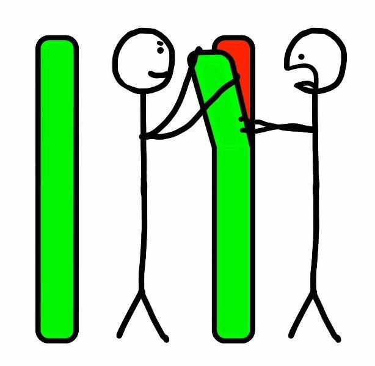

然后会出现一个更强大的恶霸，他们为所欲为。经过几轮这样的循环后，最强大的恶霸就会宣布每个人必须遵守的规则。这取决于那个人是谁，以及他们对你的感受，你会发现自己一点自由都没了。

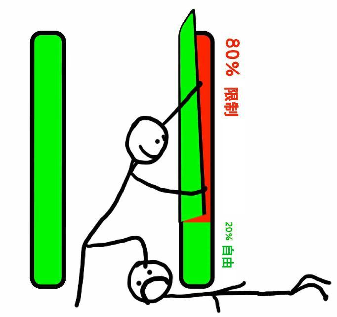

这就是为什么典型的权力博弈环境里，只有少数人是赢家，多数人都是输家。你的国家最终会变成这样：

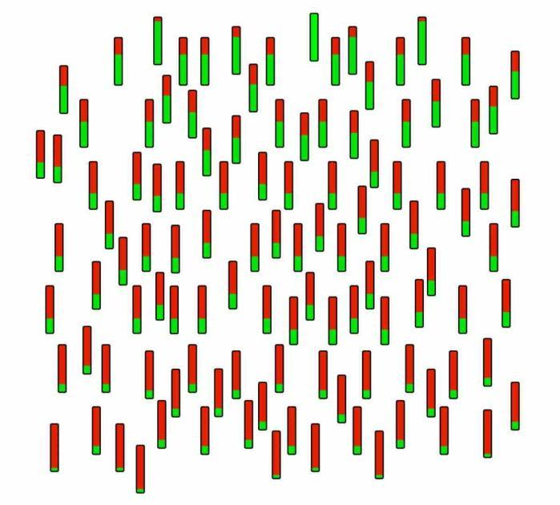

启蒙思想家们特别关注自由问题——通过改变权力博弈的规则来解决。权力博弈的规则是：

只要有能力，每个人都可以想干嘛就干嘛。

而自由博弈则提出了一个折中的方案：

每个人都可以想干嘛就干嘛，只要不伤害别人就行。

或者正如老话所说：

“你挥动手臂的权利止于他人的鼻子。”

放下棍棒、放弃压迫他人的自由，你就能换来一个完全不受任何人压迫的生活。这交易不错吧？在自由博弈中，没有人能完全自由，但所有公民都能基本自由：

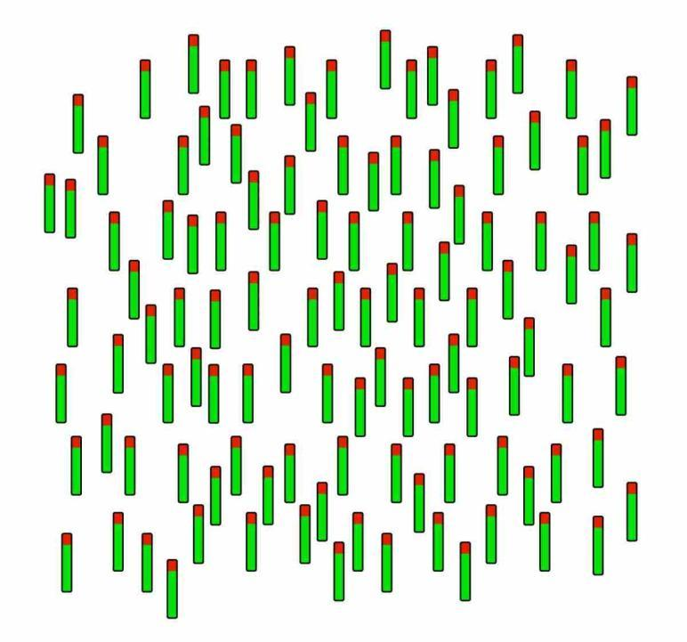

这个折中方案包含两个要点。第一点——每个人都可以想干嘛就干嘛——描述了公民可以做什么，即他们的权利。第二点——只要不伤害别人——描述了公民不能做什么，即他们的限制。美国政府得同时负责保护公民的权利和执行这些限制。

权利和限制是互斥的：保护公民免受某种行为伤害，同时也意味着禁止该行为。同样，授予公民的每一项自由，也意味着公民必须容忍他人行使这种自由。这就是为什么自由博弈中的自由与其说是完全的自由，不如说是自由与安全之间的妥协。关键在于伤害：如果一个行为是有害的，公民必须受到保护；如果无害，那么这项权利必须受到保护。

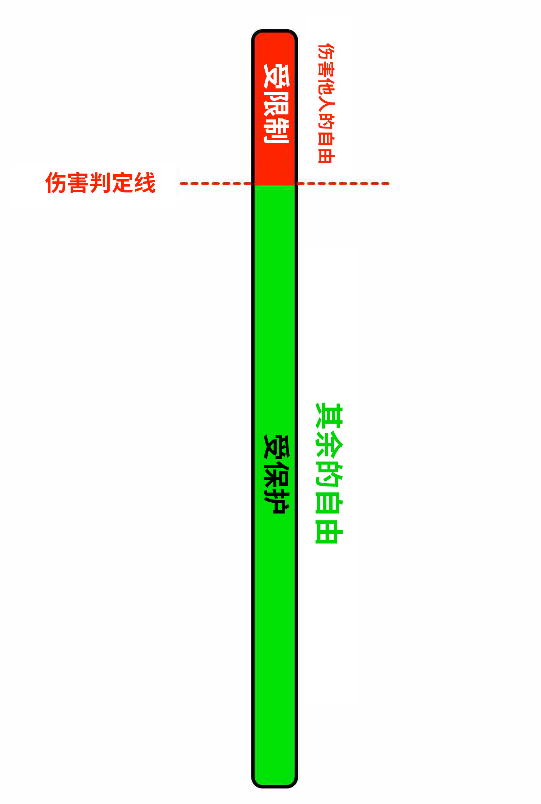

伤害界限的具体定义已经通过数十年的司法判决得到阐明，但其核心是启蒙哲学的基本理念：每个人都有生命、自由和财产的基本权利。

我们可以想象每个公民周围有两个圆圈：一个红色的安全圈和一个绿色的权利圈。

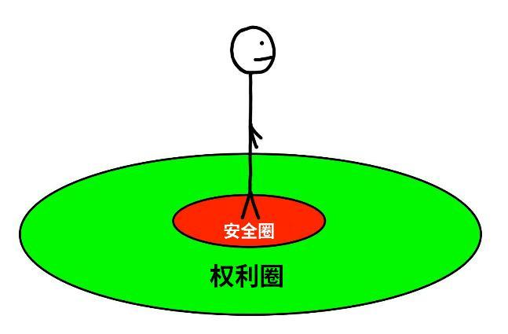

一个人的绿色圈会给予他们在权力博弈中罕见的巨大自由。但一旦某人的绿色圈侵犯了他人的红色圈，他们就违法了，政府就有义务介入。

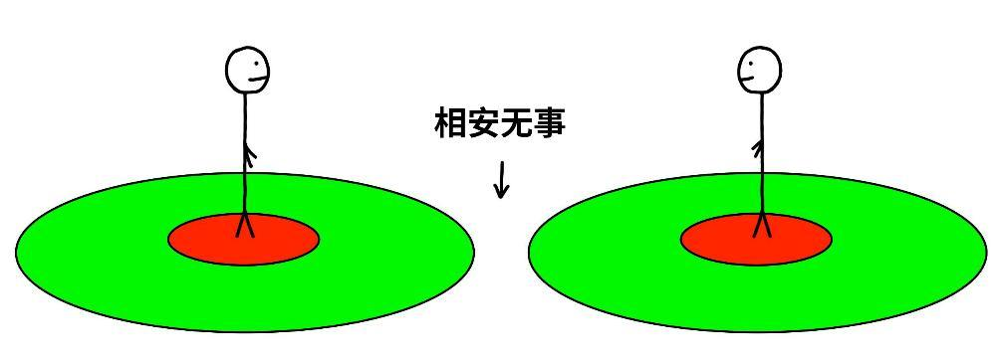

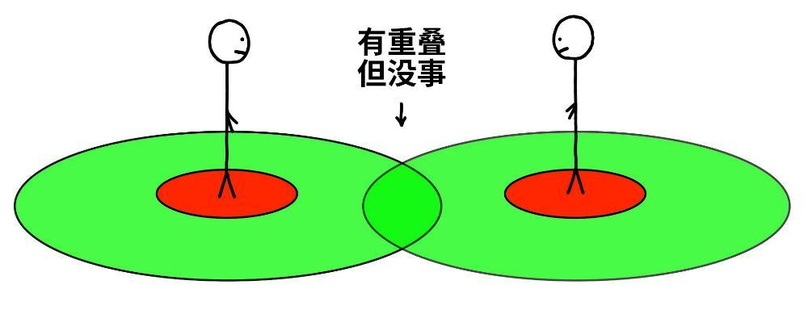

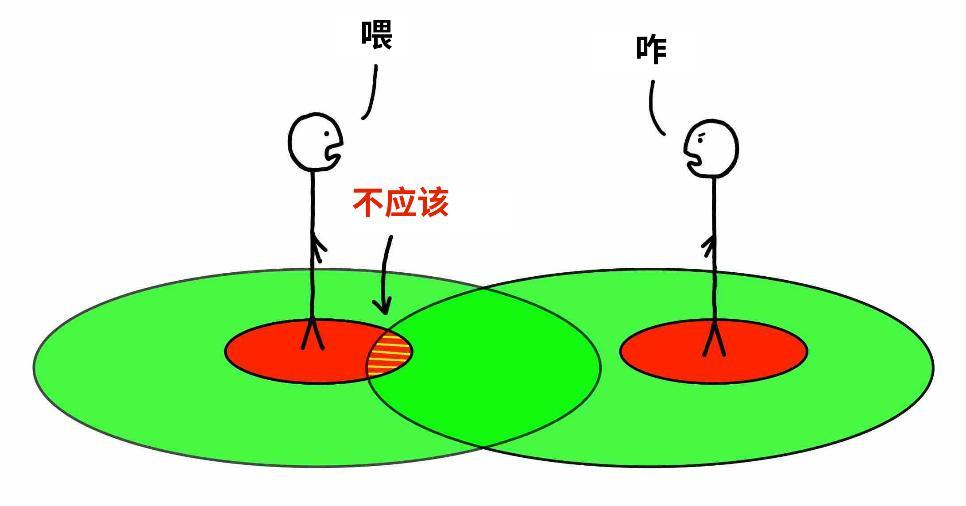

除了自由博弈关于自由的规则，还有平等的规则。强制实现结果平等或资源均分，需要一个强势的政府，这势必会极大地限制个人自由——这与建国先辈的愿景和自由博弈的精神完全冲突。所以，他们选择了另一个折中方案，这次是自由和平等之间的平衡：美国公民在法律面前平等，享有机会平等。（当然，这在美国到底能不能实现，就是另一个故事了。）

启蒙思想家们相信，自由博弈所倡导的自由、安全与机会平等的组合，不仅能满足核心哲学理念，还会带来一个绝妙的副产品：卓越的生产力。

自由博弈与权力博弈一样，都由人性驱动。但自由博弈在运行环境中增添了一条关键禁令：不得使用暴力为所欲为。不同于权力博弈倚重棍棒的力量，自由博弈完全建立在谈判的基础之上。

假如我想得到你的所有物，而我不能通过暴力或胁迫手段获取，那么唯一的选择就是说服你自愿给予。你也会有自己的利益考量，如果我能够提供比你手中的资源更有价值的“回

报”，那么我们就能达成交易。

当暴力手段从博弈选项中移除（或者说，对暴行施以严厉惩罚让它成为不可取的策略）后，竞争就从比拼谁更可怖、更危险、更具威胁性，转变为谁能为同胞创造更大价值的良性竞争。

举两个简单的例子：

在经济自由博弈中，理论上任何公民都可以追求财富。你可以自由申请工作或创业——但要将对财富的渴求转化为真金白银，你得让雇主或顾客自愿用金钱交换你所能提供的价值。

在政治自由博弈中，任何公民都可以参选公职，争取分配政府资源和权力的能力。但要真正获得这种权力，你必须说服其他公民投票支持你。

若缺乏适当的法律约束，人性中的自私就会失控，压倒一切，这也是为什么原始心智主宰了权力博弈。但自由博弈扭转了这一局面，迫使原始心智遵循启蒙规则行事。

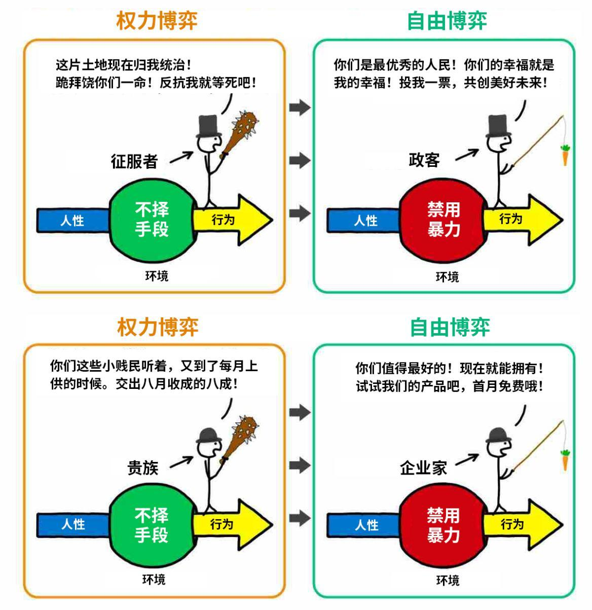

启蒙哲学家们认为，与其试图抑制国民的原始心智，不如通过自由制度将人类自私的火焰转化为一台永不熄灭、自我调节、自我推进的蒸汽引擎。

日复一日，自由博弈使高质量生活得以自我维持。正如亚当·斯密所言：“我们之所以能享用晚餐，不是来自于屠夫、酿酒师或面包师的仁慈，而是出于他们对自身利益的考量。”

从长远来看，启蒙思想家们相信自由博弈将造福所有公民，带来繁荣与巨大进步。今天的热水浴、抗生素、飞机和手机——这些在18世纪即使最富有者也只能梦想的第1000页奢侈品——都印证了自由博弈的效果。自由博弈的天才之处在于它并非一味抑制原始心智，而是将能量引导到正确的方向，同时防止这些能量征服整个社会。

启蒙运动最大的成果是言论自由。美国的言论自由法律为自由博弈打开了另一个市场：思想市场。在这里，任何人都能争取关注和影响力，时间一长，最好的思想将从中脱颖而出。言论自由允许公民运用魔像的力量，前提是必须遵循自由规则——从政治异议与抵制中汲取力量，而非使用暴力。

建国先贤们深知他们并不完全正确。他们明白在未来的数十年乃至数百年中，世界将不断变迁。他们意识到，无论多么深谋远虑，这个国家都只是一个初稿——美利坚合众国1.0版本。美国是一个前途无量的孩子，需要成长为一个更完美的联邦。面对神秘而模糊的未来，自由博弈会让这个新生国家在前进的道路上不断探索解法。

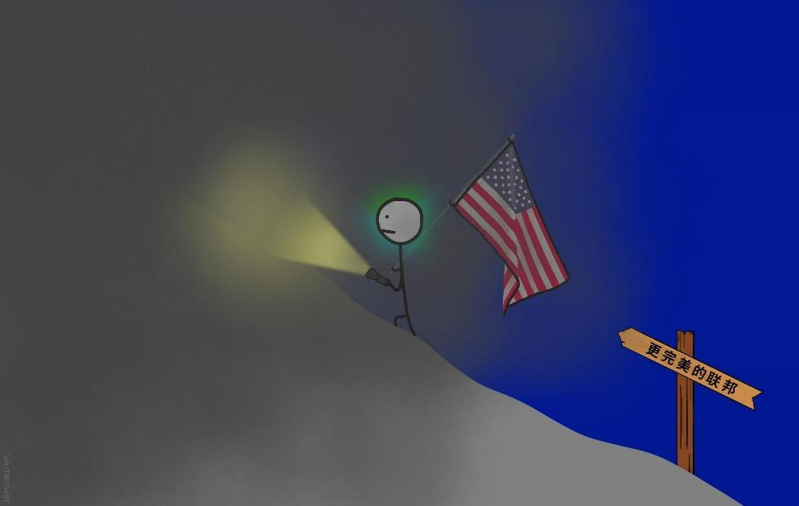

但当我们面对人性时，任何事情都知易行难。

将人从权力博弈中抽离是一回事，而将权力博弈从人性中抽离则是另一回事。虽然自由博弈是美国的官方运作方式，但每个美国公民和政府官员的内心深处都运行着一段更为原始的程序，使用着一套更古老的语言。自启蒙思想中诞生的宪法将原始思维置于笼中，但这些栅栏究竟有多牢固？

乔纳森·劳赫在其著作《知识宪法》中提醒我们：“成文宪法仅仅是纸上的文字；真正的宪法

是或明或暗的社会规则所编织的密集体系，其中许多条款并未付诸笔头。”如果将自由博弈比作一堵砖墙，成文宪法就是砖块，那么这个密集的社会规则系统——自由准则——就是将砖块粘合在一起并赋予墙体力量的砂浆。无论有多少成文规则，决定国家命运的是公民维护自由准则的能力。

这就是为什么美国历史本质上是一个民族与自身抗争的故事。这种永恒的拉锯战不仅在我们的头脑中、在我们的社区中进行，也在这个美国巨人的头脑中肆虐。让我们来看看它的本质。

### Chapter 2

### 阶梯上的政治

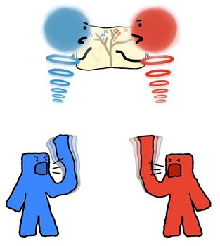

对人性的认知是政治教育的始终。

### ——亨利·亚当斯

在美国，我们通常这样描述政治格局：

这是一个两党制格局，红色保守派在右翼，由共和党代表；蓝色进步派在左翼，由民主党代表。这是一种简化的说法：实际上，自由意志主义者与社会保守主义者之间，或社会主义者与传统进步主义者之间，还存在微妙的差异。但这些都属于“思想立场”的范畴，在我们的框架中，它们都是一维的。

### “自由派”与“进步派”

在美国，我们常把“自由派”和“进步派”混为一谈，都指代“政治左派”。这种用法的由来不甚明了，但我真希望没这么干。在本书中，我们用“进步派”来指代“政治立场偏左”。而用“自由派”来泛指启蒙哲学——重视个人权利、公民自由、民主和自由企业。按照这个定义，美国政治光谱左右两端的大多数人都会自称“自由派”。

我们以美国政治作为框架的“示范系统”，但这个概念适用于所有国家：我们可以通过在标准的水平政治轴上添加“阶梯”，给政治增加一个垂直维度。

以四位政治思想家为例。左边的两个思想家，至少在当前话题上，持相似的政治立场。右边的两个也一样。

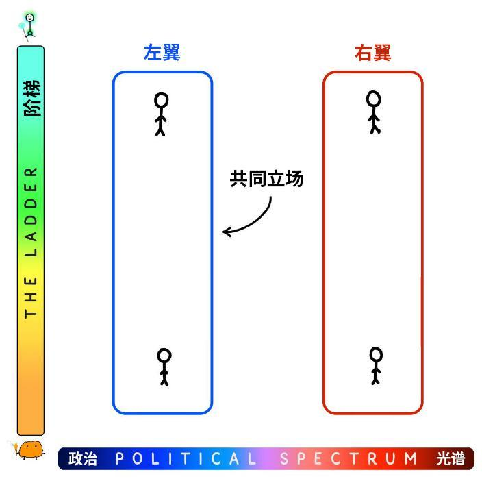

但处于高阶的两位思想家有共同之处——他们思考政治问题的方式相似。尽管他们的观点可能不同，但他们的方法是相通的。

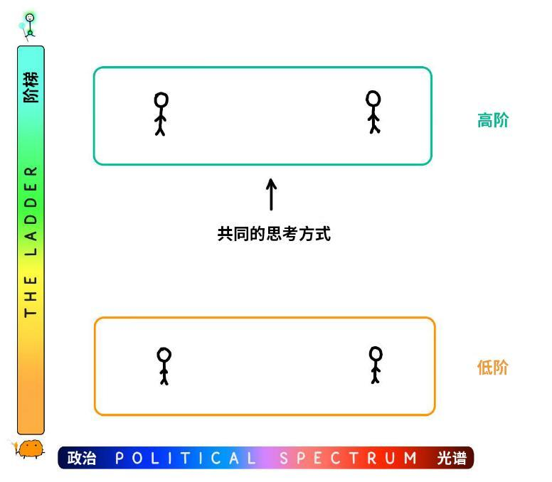

我们的社会喋喋不休地谈论政治光谱上的横向差异。我们擅长识别人们的政治倾向并据此分类，所以我们看到这四位思想家时，会简单地将他们划分为左派和右派。

但我们在讨论垂直差异时往往力不从心。当我听到辩论或读评论时，我注意到人们试图在论述政治人物或理念时区分高阶和低阶。但由于缺乏共同的语言，这些尝试通常被误解或干脆被忽视。

试图指代我们所说的高阶政治思维的人，常常使用“中间派”这个词。但“中间”是一个关于“思想立场”的词。它指的是横轴上的中间部分——仿佛持有这些领域的观点就是优秀思考者的标志。同样，人们经常用“极端”来代指“低阶”，比如称一个不妥协的进步主义狂热者为“极左”。这是一个误称，因为，第一，有许多不愿妥协的进步主义者的观点其实相当主流；第二，有许多持激进左派观点的人实际上见多识广且思维开放。像“高阶”和“低阶”这样的垂直术语使我们的讨论不那么受限，能更好地表达我们真正想说的观点。

让我们暂且搁置水平讨论，专注于政治的垂直层面。

### 高阶政治

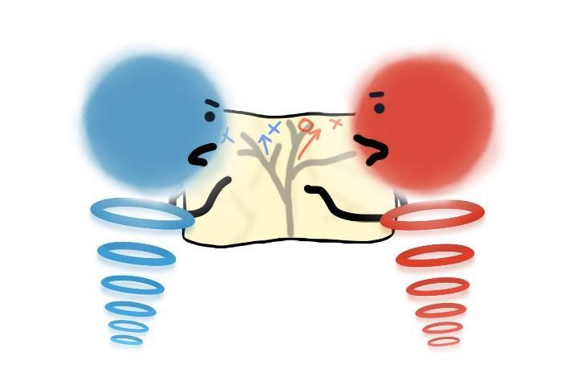

高阶政治是高级大脑处理政治的方式。它最看重真理。它把政治观点当科学实验，通过批评和激烈辩论来调整。它对狂热的确信抱持怀疑，对谦逊报以微笑，鼓励人们在不知道时说“我不知道”，并提醒人们在探索中保持谦虚。高阶政治文化鼓励个人的思想多样性和独立思考，以及对立精灵之间的协作。

并非所有参与高阶政治的人都是完全的无私、开放。在高阶政治环境中，你会发现许多带有某种党派倾向、存在确信偏误的政治“体育迷”。你也会发现一些深陷低阶、处于“不可说服之地”的顽固分子。但高阶文化占主导地位，这种文化能面对低阶心态——无论是内部还是外部的挑战——挺身自卫。低阶思维者在高阶政治讨论中必须遵守高阶对话的规则，否则将面临社会惩罚。

这并不意味着高阶政治世界中的人人都能和睦相处。争论是常态，而非例外。总体来说，高阶政治分歧主要发生在三个基本领域：

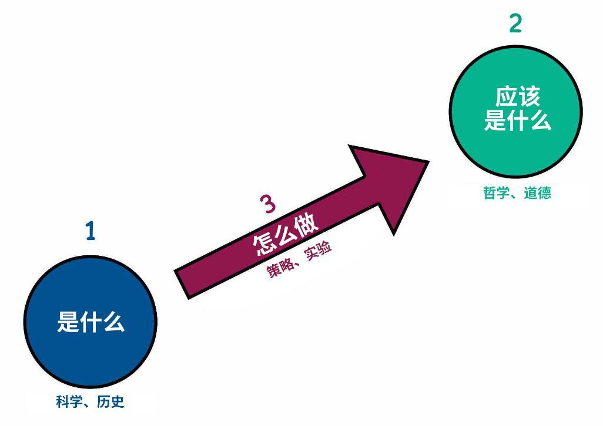

问题一：是什么？

如果不能充分理解现状，就无法探索如何构建一个更完美的联盟。人口构成是什么样的，怎么演变而来？当前政策是什么，它们如何运作？哪些实验项目正在试行，数据怎么说？资源现在是怎么分配的？腐败、剥削或歧视问题出现在哪里？国家面临的最大威胁是什么？这是政治学的领域。理解“是什么”离不开“过去是什么”的研究——也就是“是什么”怎么变成“是什么”的。这是历史学领域。

问题二：应该是什么？

“应该是什么”是哲学领域，也常是高阶思维中激烈冲突的主题。高阶政治的首要目标是朝着更完美的联邦迈进，但思想家们对哪些政策和体系最公平、最道德、最符合哲学意见不一。他们会深入探讨许多没有标准答案的难题：政府的角色应该是什么？为了保护公民，

应该限制哪些自由，不应该限制哪些？胎儿什么时候算作人类？“机会平等”的标准是什么？政府应该多大、多有权力？州和联邦权力的边界在哪里？国家在世界上的角色应该是什么，在什么情况下应该插手国际事务？哪些资源是权利，哪些是特权？问题很多，争论也很激烈。

问题三：我们如何从“是什么”达到“应该是什么”？

现实与理想之间的差距——即“是什么”和“应该是什么”之间的差距——是高阶政治亟待完成的清单。即便高阶思想家们在“是什么”和“应该是什么”上达成一致，他们也常在怎么实现上有分歧。如果两个人都认同中产阶级规模应当扩大，可能会在何种税收制度最有利于实现这一目标上意见相左。同样，如果两个人都无法容忍美国的种族不公，也可能在平权行动的道德或有效性上背道而驰。

通过这三个问题来分析政治争论，有助于我们明确争论的真正焦点。许多分歧源于对“是什么”的认知，因为确定事实真相从来都不是一件简单的事。有时候，在哲学观点上一致的思想家们会在策略上分歧。也可能有人全方面不同意。

诚然，政治不止是争论大杂烩——在自由民主制度下，政治必然会形成政党。即便在高阶政治，有时最佳的妥协方式就是形成两个阵营，硬碰硬。

在美国的高阶政坛，存在着两大超级精灵。

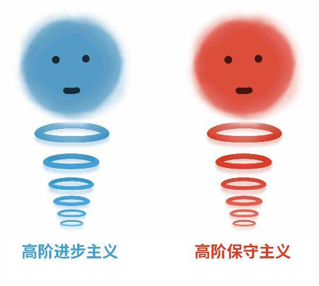

高阶思想家通常不会因为自称“进步派”或“保守派”而把自己锁进政治牢笼。他们往往在某些话题上进步，而在另一些话题上保守。同一个高阶思想家可能会在毒品法律上施加进步派压力，而在国家医疗改革上推动保守派力量。虽然个体在两个阵营之间来回摇摆，但在任何特定话题上，每个阵营都有足够的支持者，让这两大精灵始终存在。

简而言之，美国的高阶斗争有个两个积极作用：

### 调节变革速度

纵观历史，“进步主义”和“保守主义”一直是政治、经济、社会、哲学思想的大旗——有些重

叠，有些互不相关，有些则完全相互矛盾。在许多国家，政治回音室用这些词标榜自己的旗帜，也作为攻击对手的标签。但我们有必要提醒自己，这些词有它们的字面含义，我认为这些含义为政治思维提供了重要且有用的区分：

进步主义：关注通过改变现状来推动社会进步。这种进步可能是发现国家制度或文化缺陷并根除它，或者让优势更强。如果国家是一辆汽车，进步派掌管油门。

保守主义：关注保护社会已有的优点，对抗国家优势的侵蚀，或抵制那些可能适得其反的进步尝试。在国家这辆车里，保守派管刹车（偶尔还有倒车）。

不难明白为什么进步主义重要。没有哪个国家完美，不改变就没法变好。进步主义推动变革。

但保守主义同样关键。国家总有些地方已经很好了，这种情况下，保守派抵制变革的冲动很明智。进步主义还生出一堆新想法——大多未经检验，难免有坏主意。保守派对进步想法的抵抗提供了一个重要过滤器。

立场不是非黑即白的，而是一段光谱，在任何政治问题上造就了丰富的分歧生态。

大多数高阶政治发生在主流思想范围内，但光谱两端也是高阶政治拼图中的重要部分。激进进步派是颠覆者、打破框架的创新者——对他们来说，没有哪个传统神圣到不容质疑。极右保守派是国家核心理想最坚定的守护者，力求复兴一种早已逝去的生活方式。这些更极端群体也容易相信阴谋论，虽然阴谋论错的远比对的多——但这就是他们的使命，因为有时主流真会错得离谱。

从大局来看，高阶政治两边互相制约，彼此牵制。当保守派精灵过度兴奋时，可能会走向“国家现在就很完美”或“国家曾经完美无缺”的极端。当进步派精灵失控时，可能会陷入“我们的国家现在糟透了”或“我们的国家一直都很烂”的深渊。对方精灵的存在，才能避免两党的巨人活成自己的讽刺漫画版本。

### 找到平衡点

某些政治辩论不是关于改革，而是关于一系列可能性的光谱，以及我们的政策应该在光谱上的哪个位置。

光谱之争并不总是能很好地映射到“进步”或“保守”上，左派和右派可能在不同时期对同一问题采取相反立场。这没关系——重要的是每个问题的两边都有精灵在支持。这使得思想市场能够聚焦于一个合理妥协的平衡点（用绿色箭头表示）。随着辩论持续和公众意见的演

变，箭头的位置也可以随之调整。以下是关于美国光谱之争的一些简化的例子：

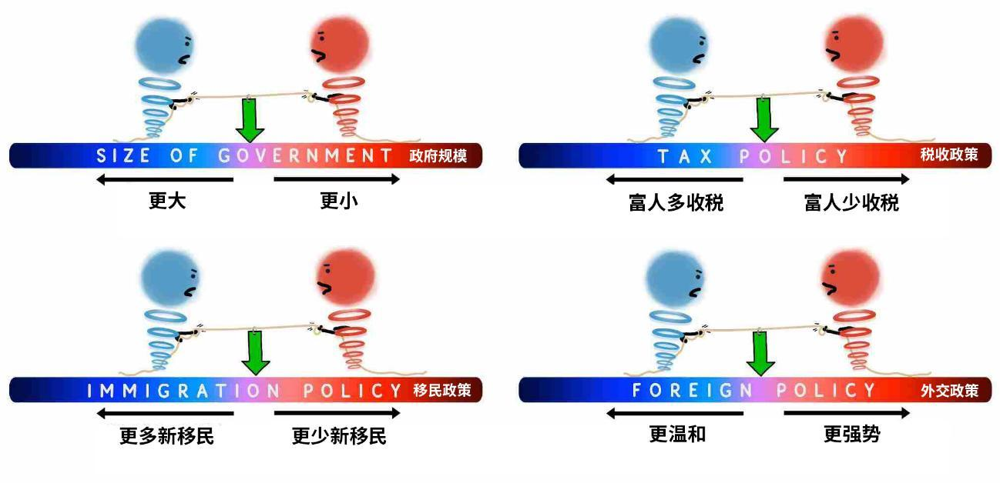

在现代美国，左派通常支持全球化，而右派强调国家利益。左派警惕不受控制的资本主义，而右派防备政府过度干预。左派关注保护和提高边缘群体的利益，而右派担心这些努力可能适得其反。在每种情况下，一方的盲点都被另一方清楚地看到，使得整个系统比任何一方单独运作时都更为明智。

辩论虽然激烈，但高阶政治文化提醒成员，归根结底，他们最终都是同一团队，一起攀登同一座山峰。

参与高阶政治的人，由于不受任何单一意识形态的严格束缚，可以将整个光谱的想法结合起来，形成一个灵活的政治超级大脑，能够以细腻入微的方式应对变化的时代。

### * * *

如果政治总是这样运作就太好了。但正如任何吃过彩虹糖的人一样，覆写古老程序并不容易。我们每个人的头脑中都有一个原始心智，即使是熟练的高阶思想家，在涉及政治时也容易退化成幼稚的低阶生物。这并不奇怪：政治涉及公平、资源分配和权力争夺——这些概念会激发原始心智的程序，因为它们对古代生存至关重要。有神经学证据表明，政治确实会激活我们大脑中与低阶思维相关的脑区。大量研究表明，政治容易会让人变得低阶——受教育程度较高的人群表现得最为明显。

高阶政治世界很活跃。只是在它之下，低阶世界更大。在那里，政治与其说是共同努力构建一个更完美的联盟，不如说是关于好人战胜坏人的政治战争。

### 低阶政治

### 又名

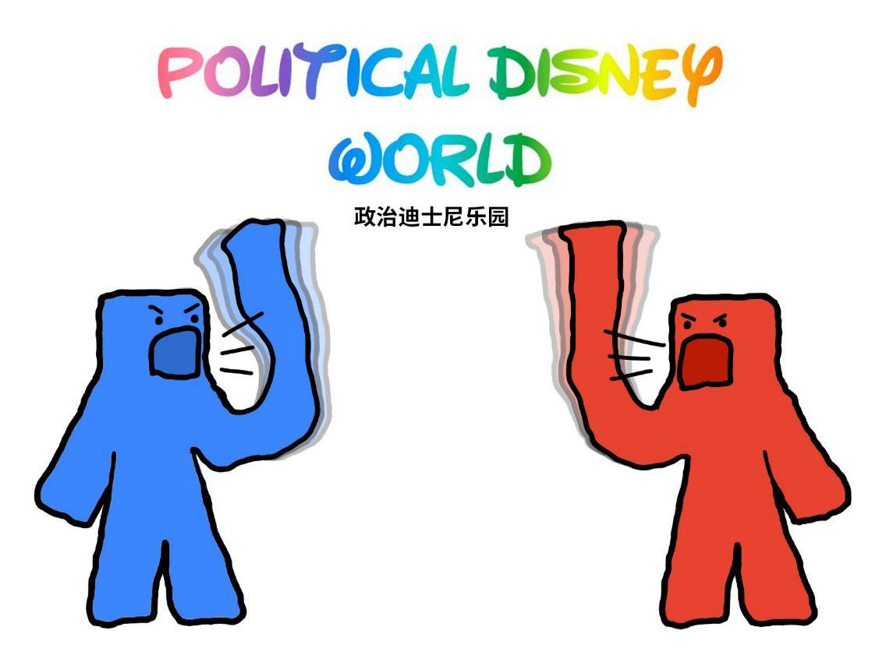

我很喜欢迪士尼电影，特别是《小美人鱼》、《美女与野兽》、《阿拉丁》和《狮子王》。我一直不确定这四部是不是客观上最好的迪士尼电影，还是说每个人都会特别迷恋他们7-12岁时期上映的电影。不管怎样，这显然是最好的四部。

但电影不是现实，对吧？孩子们可能认为迪士尼电影就是真实世界的样子，但其他人都知道现实世界并非如此。

对吧？

我也这么想。直到我开始写这本书。在过去几年思考政党之争和回音室文化后，我突然意识到：许多美国人认为他们生活在一部迪士尼电影里。让我解释一下。

现实世界是灰色、模糊、无穷复杂的。但迪士尼电影将世界简化为1和0的二进制代码。要么纯善（1），要么纯恶（0），很少有介于两者之间的。

真实的人复杂且有缺陷，虽有过错但几乎总是值得同情。而迪士尼角色要么全好，要么全坏。

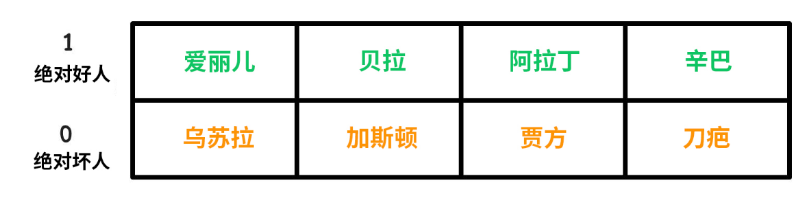

在现实中，每件事都充满潜在的利弊，理清这堆乱麻太难。迪士尼电影把这乱麻去掉。阿拉丁得到神灯=1，贾方偷走神灯=0。迪士尼甚至将天气二元化了，要么晴朗完美，要么在坏人得逞时阴雨连绵。

在迪士尼电影中，完全二元化是有道理的。他们的核心受众是小朋友，还无法理解太多灰色地带。在学会思考细微差别之前，他们需要先学习善与恶、对与错、安全与危险、快乐与悲伤等基本概念。

但过分简化现实是个坏主意——不幸的是，这正是原始心智喜欢做的事。所以低阶政治对参与者来说，很像一部迪士尼电影。

高阶的人们知道世界很混乱，也知道每个人都是混乱世界的缩影——人人都是美德与缺陷不断演变的灰色混合体。

政治迪士尼乐园要有趣得多。一切都清晰而完全数字化。好人和坏人，好主意和坏主意。好政客和坏政客带来好政策和坏政策，在好或坏的选举结果中赢得席位。对与错。聪明与无知。善良与邪恶。1和0。

当一群成年人确信他们生活在迪士尼电影中时，这通常表明原始心智已经接管，我们正在与魔像打交道。

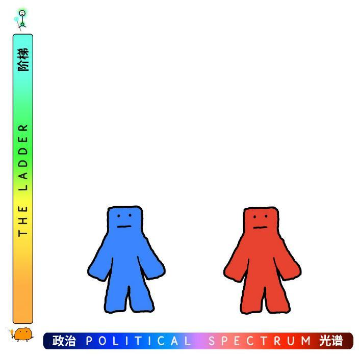

高阶政治中的个性化和彼此协作，在低阶中都消融了，只剩下僵化的蚁群结构。部落内的人被迫遵从，团结和力量来自对共同敌人的执念——坏人多蠢、多无知、多邪恶、多偏见、多投机、多狡猾、多毒、多自私、多危险。

每个政治迪士尼乐园的派系中，都有一个主导故事：他们的政治叙事。这些叙事包罗万象，覆盖了所有现实的版本。它们有自己的世界观、历史解读和对现状的描绘。这是每个阵营为自己的阵营量身定制的迪士尼电影。

在美国，民主派迪士尼乐园的人们将自己视为正义公民，他们不断努力将这个国家带入进步的乌托邦，对抗那些卑鄙偏执的共和党人——他们要让权势公司一手遮天，让国家倒退到全能公司和持枪厌女、白人至上政府统治的旧地。

共和党的迪士尼乐园则讲述着另一个故事，诚实勤劳的家庭拼尽全力让国家保持繁荣，而懒惰、道德败坏的民主党人则极力要将国家拖入一个由象牙塔精英统治的专制地狱，源源不断给危险移民发福利。

这些叙事让信徒们可以放弃对“是什么”、“应该是什么”和“怎么实现”这些灰色地带的辩论，代之以一份清晰、数字化的问题清单——每个议题都有正确的善良立场和错误的邪恶立场。在美国叙事中，目前清单包括以下项目：

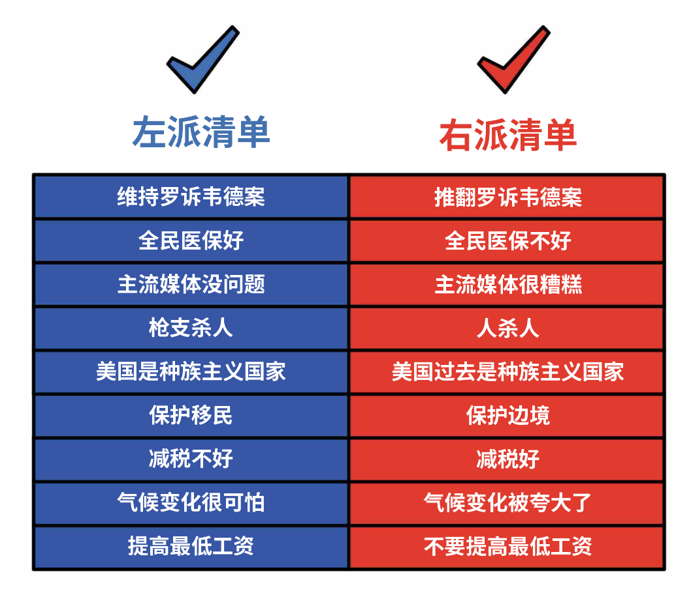

每个议题上，盟友们都忠实地遵从正派观点，并对反派立场不屑一顾。

政治迪士尼乐园叙事也充斥着荒谬的阴谋论。

在高阶政治领域，思想过滤器能够有效评估阴谋论，驳斥错误观点，同时让真实的见解逐渐进入主流。而在政治迪士尼乐园中，这种关键机制荡然无存，导致所有印证既定叙事的阴谋论都在人们头脑中不断盘旋。这就解释了为什么许多明显被驳斥的荒诞理论始终挥之不去——它们在高阶早已消亡，却在其下继续流传。

到目前为止，我们对阶梯的讨论主要聚焦于我们形成信念的方式。但我们还将从另外两个维度运用这一理论。第二种与我们的价值观和原则有关。

政治迪士尼乐园的另一个明显标志是——可以称之为——低阶道德。

高阶政治思想家对道德对错的分歧，和对事实对错的分歧一样激烈。但无论他们得出什么结论，都会始终如一地应用其道德标准——无论是对自己、朋友、陌生人还是对手。他们努力避免陷入阵营思维，试图在与政治光谱另一端的人交锋时保持同理心与批判性的平衡。

然而，“我们对抗他们”的思维模式扭曲了我们的道德判断，为“我们”和“他们”设立了不同的标准。在评判自己阵营中的成员时，人们会纵容甚至赞许那些在对手身上被视为令人不齿的行为。

低阶道德扭曲了我们的同理心。在政治迪士尼乐园中，人们善于对自己阵营的成员报以同情，看到他们意图中最好的一面，宽恕他们的过错。但我们阵营之外者采取相反态度，给他们贴上非人化的刻板标签，对其意图作最坏揣测，将任何道德缺陷都视为永久的道德破产。

在政治原则方面，低阶道德会导致猖獗的伪善。我们可以用一张简单的文氏图来解释这一点。

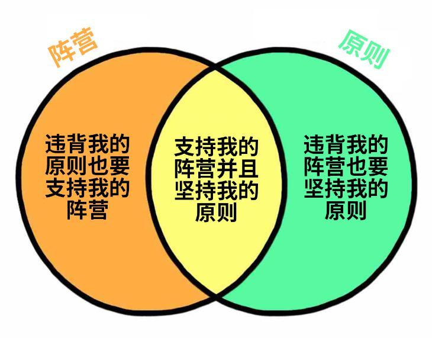

在政治圈里，大家都爱待在图表中间那，阵营行为与原则保持一致的区域——比如为志同道合者辩护言论自由——这种时候你看不出一个人的底细。真正的考验出现你不在中间部分时——你的阵营和原则发生了冲突。高阶政治思考者会坚守右侧圆圈，在符合原则时批评自己的盟友，甚至为对方阵营辩护。但低阶政治文化鼓励人们停留在左侧圆圈内，即使违背原则也要忠于阵营。

近几十年来，美国在诸多议题上都出现了伪善现象，包括对外干预、政府监控、激进政令、国债、州自治、言论自由、竞选财务改革、边境政策和政治抗议等。在这些问题上，极端党派人士的立场往往会根据执政党的更替而反复无常，而不是始终如一。

在政治迪士尼乐园中，那些声称持有自由主义价值观的人为了支持自己的阵营，会毫不犹豫地抛弃自由主义。当他们对选举结果不满时，就坚称自己被剥夺了选举权，认为制度一

定出了问题，选举被外国势力操纵或被对手操纵。当他们的候选人获胜时，就会说“对民主重拾信心了！”——翻译过来就是“民主只在我们候选人赢时才算正常”。

伴随低阶思维和低阶道德出现的，是低阶策略。魔像遵循权力博弈规则——只要有能力，就可以为所欲为。当他们遵守自由博弈规则时，也只是出于生存需要的无奈之举。只要有机会，魔像就会使用任何卑劣手段来击败敌人。选民压制、否定选举结果的合法性、审查制度、阻挠、贿赂、勒索，甚至暴力——对魔像来说都是可以接受的手段。我们将在本书后面章节详细讨论高阶和低阶策略。

低阶思维、道德和策略都源于同一个概念：当原始心智主导时，我们的思维处于远古生存模式，政治变成部落主义的工具。当我们处于这种状态时，真相、道德一致性和公平竞争都会被抛诸脑后。

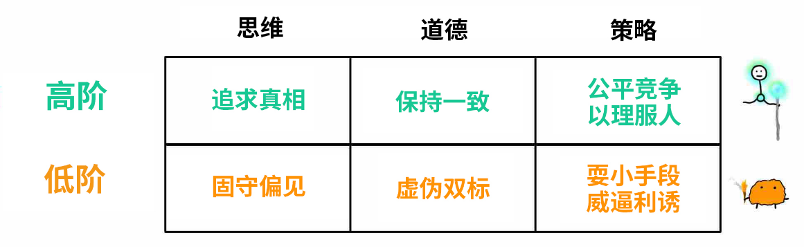

棘手的是，当心理陷入政治迪士尼乐园时，我们通常因为思维迷雾而无法意识到这一点。大多数读这本书的人都会认为自己站在高阶。我们相信，政治迪士尼乐园是其他烂人待的地方。

我我们聊过的区分能帮我们评估自己和别人在政治阶梯上的真实位置。我们的政治观点是否与某一方的立场完全一致？我们是否认为自己和政治盟友垄断了真理和道德？我们是否妖魔化政治对手，更多厌恶而非共情，并且对他们动机做出最不宽容的解读？我们是否曾经对反对派的某项政策或策略感到愤怒，后来自家用了就无所谓了？这些都是你已经陷入政治迪士尼乐园的迹象——这片蹒跚而行的政治魔像之地。

在自由博弈中，物理暴力被排除在外，信息自由流动，巨大的魔像面临着一场艰苦卓绝的战斗。为了生存，它们像任何恶劣环境下的生物一样：靠免疫系统自保。

### 魔像免疫系统

魔像的生命力在于顺从，靠成员对主导叙事的坚定信念支撑。信念越强烈、越统一，魔像越强大、越有力。

同样道理，对叙事的怀疑就像魔像的癌症。如果任由怀疑滋生蔓延，就会削弱魔像，威胁到它的存在。

因此，魔像的免疫系统任务很简单：保持坚定，排除疑虑。为完成这个任务，它有三大主

要机制。

机制一：信息过滤

魔像保持强大最简单的方法，是控制体系内信息碎片的传播。但在一个言论自由、新闻自由的互联网社会，这并不轻松。所以诞生了过滤器机制。

魔像的第一道防线是媒体。在当今世界，每个政治魔像都有自己的媒体渠道，充当巨人的眼睛和耳朵。为了保持魔像的强盛，这些渠道会传播并煽动那些印证叙事的故事。为了使巨人免受智识污染，它们淡化挑战叙事的新闻，或干脆不报。这是力量驱动的大规模挑挑拣拣：为了维护成员的信任，这些媒体得按魔像利益过滤新闻。

当危险异议进入魔像的信息波段时，第二道防线就会启动——回音室文化的社会压力。低阶政治阵营往往是乌合之众。

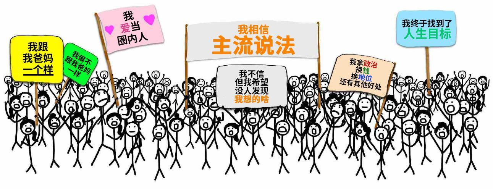

有狂信徒，他们相信叙事的每一个字；有阵营拥护者，他们沉迷于成为强大群体内的一份子，喜欢贬低其他群体；有机会主义者，他们利用政治获取社会地位或职业发展，获取点击率，打击敌人或赚钱；有些人将自己的身份与政治色彩紧密结合，以至于他们的意义感、目标感和正义感与这些色彩融为一体。另一些人则恰恰相反：他们是隐藏的高阶思考者，由于各种原因（如地理位置），陷入政治迪士尼乐园的社交圈中，为避免社会冲突而随波逐流。

虽然这些类别之间有许多重叠，但我们可以将它们简化为两大关键分类：相信叙事的人和假装相信叙事的人。

对于魔像的免疫系统来说，重要的不是其成员实际在想什么，而是大家嘴上说对的。个人脑子里的怀疑大多无害——只在表达时才成系统威胁。

回音室文化强大的社会激励机制让每个人都循规蹈矩。文化奖励不断表达符合叙事情感的观点，而将威胁主导叙事的想法视为禁忌。如果说媒体渠道决定了什么能进入政治魔像的大脑，那么社会压力就提供了第二重过滤，设定了信息如何在大脑中流通。

过滤系统身担重任，保证魔像思维纯粹。但要真正增强魔像的力量并保持其最佳状态，免疫系统辅以第二策略。

机制二：信息扭曲

像人的手或眼睛一样，人类的大脑是进化的产物，具有特定的目的。真相不是目的之一。

我们能够追求真相，但人类追求真相就像狗用后腿站立——非常吃力，不在我们舒适区。这就是为什么我们如此容易犯推理错误，即逻辑谬误。高阶世界会揭露逻辑谬误并将其根除，但错误推理在底层大行其道。对于政治迪士尼乐园的魔像来说，逻辑谬误——无论是有意无意——是一种极为强大的免疫系统。

让我们看看政治魔像内部扭曲信息的一些常见方式。

### 歪曲事实的谬论

低级政治有长期歪曲事实的传统：捏造有问题的研究或误导性统计数据，或者以最符合叙事的方式曲解新闻报道。

一种常见做法是趋势-轶事互换。

很简单：如果你遇到支持叙事的轶事，就将其框定为更大趋势的证据，让它看似代表更广泛的现实。同时，如果有一个确实代表更广泛现实的实际趋势——但这个趋势和你的叙事不符——就说成几件离奇的轶事。

另一个常见的谬误与相关性和因果性有关。统计学入门的一个常见概念是，相关不等于因果。2013年的一项研究发现，性生活更频繁的人收入更高。统计学业余人士可能会看到标题就跳到结论：更多的性生活导致人们赚更多钱。或者，赚更多钱带来更多性生活。但研究实际发现的是第三个变量——外向性——才是性和金钱趋势背后的原因。

对于任何相关性，都有四种可能的解释：

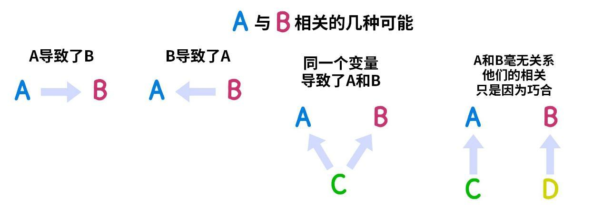

在高阶政治中，当人们遇到相关性时，他们会深入探索上述哪种情况才是真实的。但在政

治迪士尼乐园中，人们相信最能支持叙事的解释。

想象一个政治阵营，他们的叙事是，狗几乎总是善意的（反对就是有偏见），而大多数浣熊都是危险、邪恶的生物（反对也是有偏见）。现在想象一周内发生了这六条新闻：

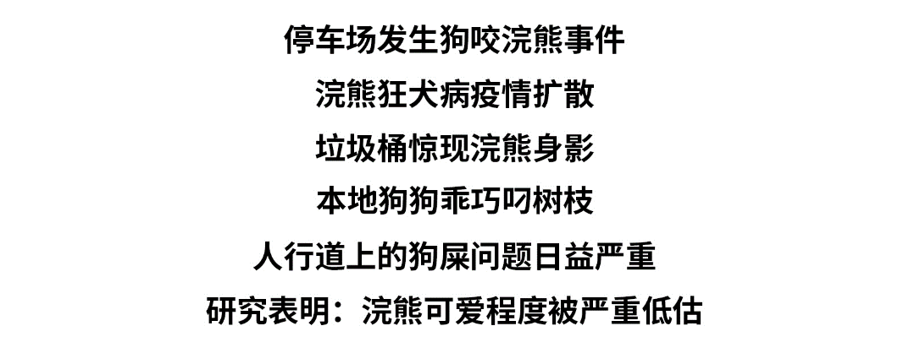

实际信息表明，这两种动物有时是好的，有时是坏的。但叙事没有留下混合信息的余地。狗好。浣熊坏。没了。亲狗媒体开始扭曲事实。

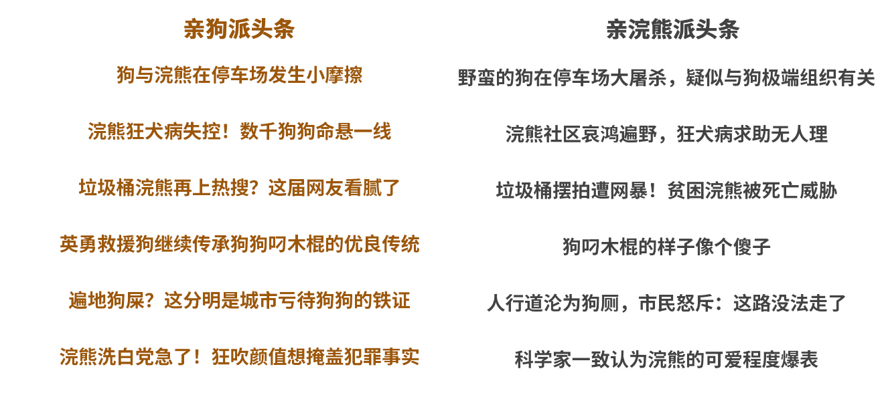

符合叙事的轶事（比如“浣熊在垃圾桶里被发现”）可以被重塑为趋势（“又一只浣熊在垃圾桶里被发现”）。亲狗媒体可以利用相关性/因果性谬误来进一步将当天的新闻导向有利于他们的方向，调整两个故事中的归责：“狗在停车场咬浣熊”将责任归于狗，这与亲狗叙事相冲突，所以可以调整为更中性的“狗和浣熊在停车场发生冲突”。狗在人行道上便便的标题可以改写成暗示根本不是狗造成的：“城市继续忽视狗公园，导致更多狗在人行道上便便”。

最后，亲狗媒体可能会为符合叙事的标题添加自己的耸动性色彩，同时淡化那些不符合的。与此同时，亲浣熊媒体一直在朝反方向做着同样的事情。经过这些扭曲之后，支持狗和支持浣熊的受众看到的是完全不同的故事。

高阶政治依赖于共同的现实认知——对“是什么”的共同理解。在政治迪士尼乐园中，不同阵营人们的信念和观点是建立在不同版本的现实之上的。

### 伪饰论点的谬误

真正检验论点质量的标杆，在于其能否经受严谨的批判。当你对观点有信心时，你会乐于让它与其他论点在擂台上一决高下，展现力量。这就像拳击：打败越强的对手，排名越高。这就是为什么一篇优秀的大学论文总是包含一个“灰熊级”重量级的反论点——它让论文在教授面前得以“炫耀”自身的力量。

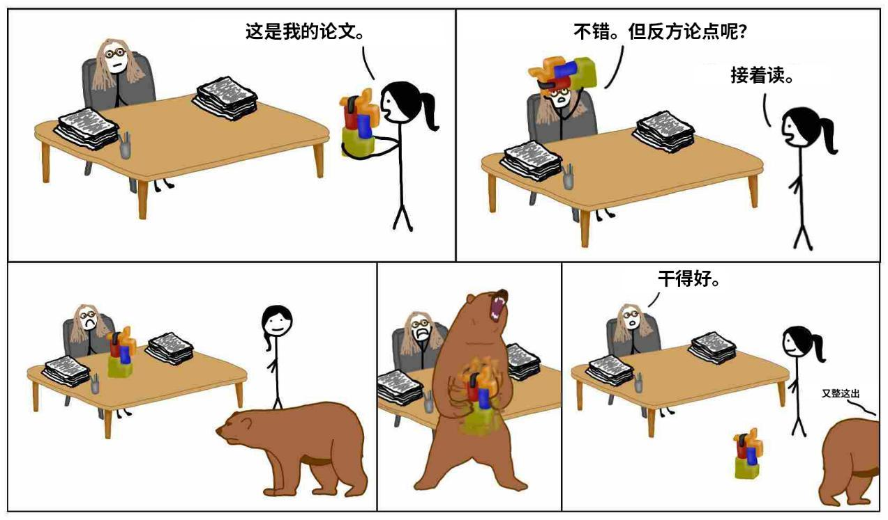

但如果对观点不自信，还想装能打？作为一名拖延症患者，我在大学期间写过很多仓促、糟糕的论文，我可以亲身告诉你，一篇站不住脚的论文标志之一就是其反论点更加薄弱。

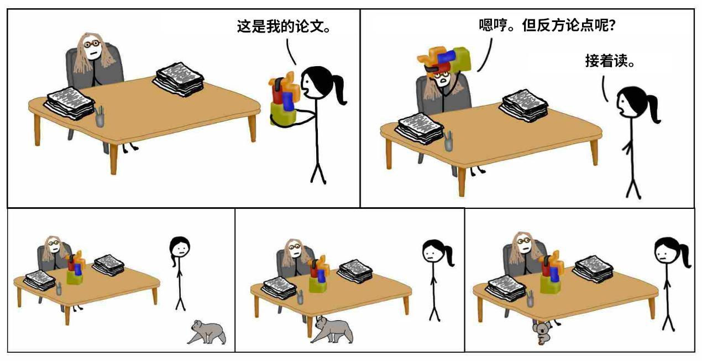

当面对高阶对手时，单一幼稚的叙事通常在第一回合就被击倒。因此，政治回音室将批评视为禁忌——这是他们防止任何人打出有力一拳的方式。

但要真正激发群体成员的坚定信念——即让人们深信不疑该叙事绝对正确——政治回音室需要将其包装成重量级拳王。为此，它们依赖看似真实的虚拟擂台战：在这些精心设计的对抗中，既定叙事总能获胜。这种运作依赖思想界底层最经久不衰的工具——稻草人谬误。

为了“稻草人化”你的对手，你要虚构一个针对你立场的薄弱反论，并假装这就是你对手的立场，尽管事实不是。这就是大学生烂论文的现实版：虚构一个弱小的对手，痛击，然后宣布胜利。

稻草人谬误经常出现在政治辩论中。

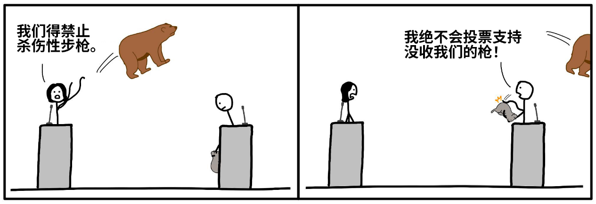

政治演讲也满是稻草人伎俩。

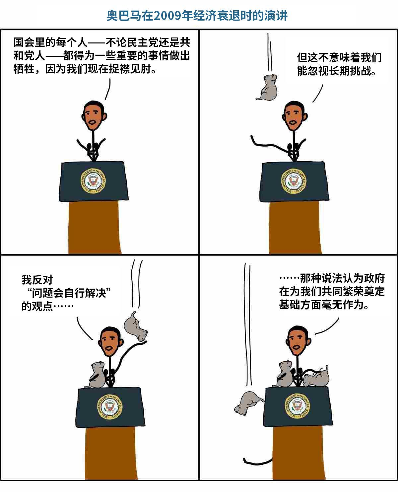

用稻草人能让不明真相的观众觉得你赢了，就像拳击手比赛中偷袭下三路，希望裁判没看见一样。

在政治迪士尼乐园中，当一则精心措辞的推文或评论文章用稻草人攻击对方时，其传播将呈病毒式扩散——很快，这场闹剧便会在回音室中循环播放，直至令人烦不胜烦。

稻草人谬误还有镜像变体——“外庭与内堡”谬误——常被用作防守策略。这一术语来源于10至13世纪北欧常见的一种双层中世纪堡垒。它的构造如下：

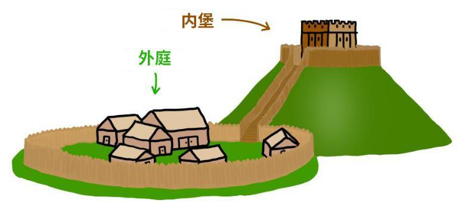

外围庭园是宜居宜产的经济腹地，却易攻难守。当庭园遭袭，居民们会跑上内堡，退守高塔。与外庭不同，内堡极难攻克——即便敌军占领外庭，也拿不下整座工事。最终，在高塔的箭雨压制下，进攻方只得弃战撤离，居民重返丰饶的外庭过舒坦日子。

哲学家尼古拉斯·沙克尔将“外庭与内堡”引申为一种诡辩的隐喻而广为流传：当某人持有的“外庭主张”（便利却难辩护）遭遇质疑时，便迅速退守至坚不可摧的“内堡立场”。这种策略在2003年伊拉克战争辩论中尤为典型。

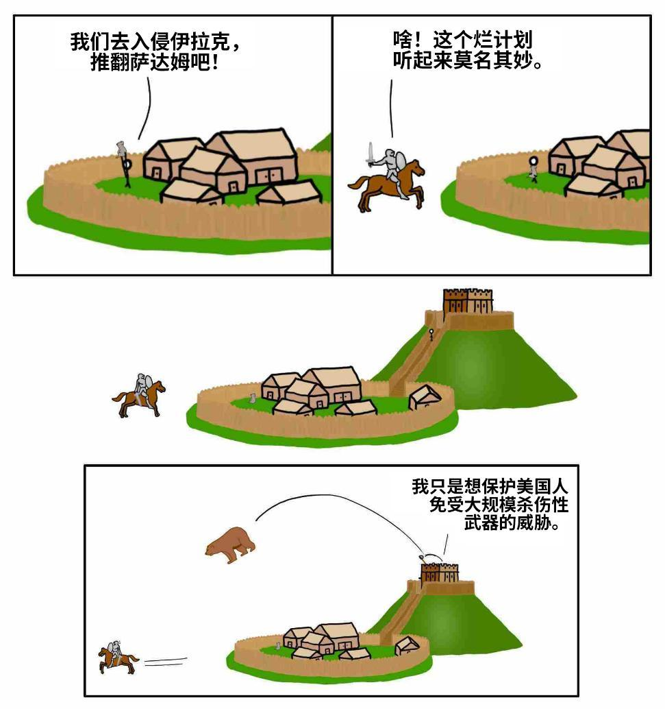

在政治迪士尼乐园中，处处可见星罗棋布的外庭主张，其间耸立着内堡立场的山丘。如果仔细倾听，你就会发现：每当有人质疑其观点时，就疾步退守到坚不可摧的内堡立场。

外庭与内堡谬误常与稻草人谬误协同使用：政治回音室通过后者矮化对手立场，鼓吹自身

观点的牢不可破。

2004年，小布什如此反驳伊拉克战争的反对者：“世界上有很多人不相信非白人族群可以实现自由自治……我坚决反对这种观念。穆斯林信徒能可以自治，不同肤色的族群同样可以。”

潜台词是：我们只是想保护美国人免受大规模杀伤性武器的威胁（退守内堡立场），反对者却认为棕色人种无法自治（架设稻草人）。

### 因人废言的谬误

碾压异见最简单的方式，就是直接质疑发言者资质，而完全不处理论点本身——这就是臭名昭著的人身攻击谬误。

在政治迪士尼乐园，人身攻击天天上演。当我们低阶时，总会本能地信任与我们意见一致的人。2019年，史蒂文·斯洛曼与埃尔克·韦伯教授汇编多篇研究政治两极化的科学文章，发现人们对其他阵营的预设极不宽容。如果一个反对派候选人大多持有主流观点但有几个极端立场，人们会武断认定其支持者正是被极端立场吸引——即使毫无证据。另一项研究发现，“民众倾向于将己方领袖行为解读为国家利益，将对手相同行为贬为个人私欲”即使所讨论的行为完全相同。

在这里，任何出自“错误对象”之口的论点，瞬间就会被贴上“胡扯”标签——不论内容。

两种信息控制机制——过滤和扭曲——让魔像得以维护内部的思想纯粹。

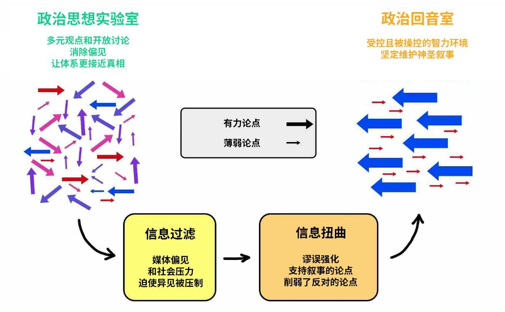

为保证群体信念的坚不可摧，还有最后一道防线：

机制三：确信偏误

当人们深陷某个叙事时，往往有强烈动力继续相信。这种动力通常来自三个方面：

### 社交依赖

在回音室里，质疑群体共识等于自我孤立：要么沉默寡言渐行渐远，要么成为异类陷入无休止的争执。最理想的情况是，你顶多吃点不痛快（最糟的情况是，你最终被整个社群孤立）。

试想，当身边亲友同事都深信某个观点，即便你心存疑虑，也会选择保持和谐——毕竟你仍然爱着他们，珍惜共同生活的日子。相信叙事使这一切变得更容易和简单。

### 智力依赖

回音室会让人产生“无所不知”的错觉。这里的信息永远简单明确，真理似乎触手可及。

当你长期浸泡在这样的环境中，你的思维肌肉会逐渐萎缩。你不仅缺乏知识，你的进取能力也会变得迟钝。思想实验室的人们通过观点交锋不断磨砺思辨力，在回音室远离异议的安全空间中，人们只能停留在业余水平。

越久，就越会侵蚀对思考的信心。这种不安如影随形，但只要主流观点确实站得住脚，就还能维持心理防线的安稳。

### 自尊依赖

低阶政治叙事总是将内部成员描绘成完全正义的主角，让信徒们自我感觉良好。

但如果叙事崩塌呢？

如果叙事并不像宣称的那样美好，成员就会像被洗脑的狂热分子。当我们的头脑处于政治迪士尼乐园时，对叙事的深层信念和自尊心是密不可分的。

有时甚至让人觉得，自己押上了重要的筹码——我们讨论过信念如何与我们的身份交织在一起，原始心智很难区分两者。当我们将自己与最坚定的信念联系在一起时，怀疑这些信念感觉就像一场存在主义危机。因此，异见可能会让我们的原始心智进入战或逃模式，将信念锁进保护性掩体中。

如果说回音室规则是外在约束，这三重机制就构成了内在枷锁。它们共同把人推向“不可说服之地”，在那里，所有异见都会撞上确信偏误的铜墙铁壁。

回音室环境使确信偏误越来越常见。“从众效应”描述了我们倾向于“如果每个人都相信，那它一定是真的”。回音室给成员们营造出“所有人都相信了”的强烈印象——单凭这种群体共识本身，就足以让多数人停止质疑。

1961年，社会心理学家威廉·麦奎尔提出了“接种效应”：许多疫苗的原理是让人的免疫系统接触危险病毒的弱版本。在身体战胜弱版本病毒后，它会对所有版本的病毒产生免疫力，包括更强的版本。麦奎尔发现人们的信念也以类似方式运作：反复接触某个立场的薄弱论证，会使人们对该立场的所有论证都持否定态度。

换句话说，若政治回音室内反复传播稻草人谬误，人们最终会认为这就是对立阵营的真实观点。经历足够多思想接种后，任何异议——哪怕是强有力的论证——都会被视作精致包装的荒谬论点。人们会获得“认知免疫”，彻底丧失改变立场的可能。这种免疫机制同样作用于外庭与内堡谬误：当人们不断听到己方观点被重塑为坚不可摧的内堡立场时，就会陷入过度自信的泥潭，以至于对自我怀疑产生免疫力。

巨人处理信息的方式如同显影剂，暴露出群体的深层动机。对于政治魔像来说，支持叙事的论据被社交激励传播，经谬误扭曲放大，最终全盘接纳。异见信息被媒体过滤弱化，经谬误扭曲贬损，最终被怀疑之墙阻隔。这套机制不利于探寻真相，却是守护指导性叙事的完美堡垒。

### 高阶免疫系统

精灵以完全不同的方式处理信息。没有必须保护特定叙事的负担，政治高层不需要控制或操纵信息。他们天生配置了根除偏见与谬误的认知程序，所以他们欢迎各种各样的人和想法——特别是那些挑战既有信念的异见者。

但精灵也需要免疫系统。人类天生自带低阶思维，原始心智就像狼群通过费洛蒙互相交流。魔像严防质疑入侵，精灵则需要防止自身滑落到低阶，成为魔像。

高阶免疫系统是开放讨论、理性辩论和道德一致的产物——以及面临或内或外的压制企图时，成员捍卫这种文化的坚定意志。

### 国家级拉锯战

所以尽管我们谈论美国政治时好像是这样的——

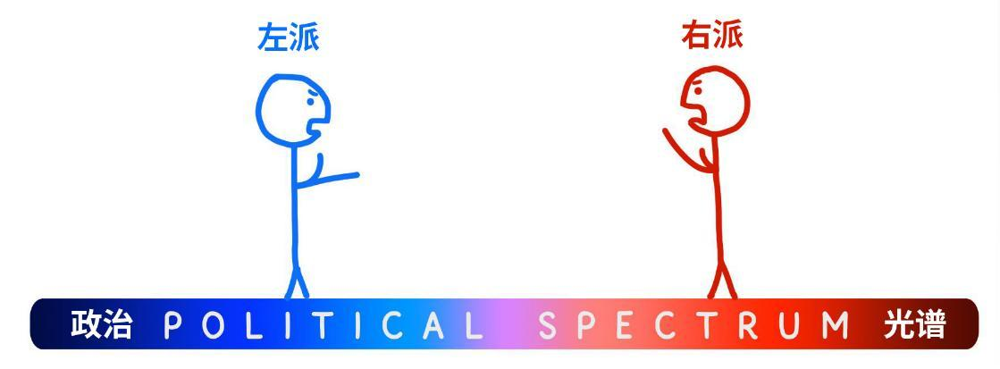

——但阶梯模型揭示它的本质更接近这样：

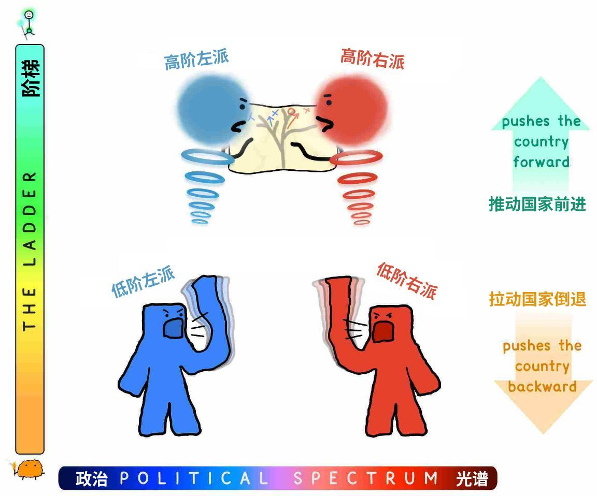

高阶政治将自由法制与开放文化结合，创造出人们可以充分享受自由博弈红利的环境，推动国家持续进步。但美国的政治魔像只懂一套古老规则：零和权力博弈。魔像间的厮杀终将损害国家利益，侵蚀高阶政治的进步成果。

早些时候，我们把美国想象成一个巨人，在山上艰难前行，致力于成为一个更完美的联邦。分解内部构造，我们可以看见：就像每个人一样，国家巨人也面临着高低阶思维的内部拉锯。当高阶政治占优时，国家向上攀登；当魔像暴走压制高阶力量时，国家向山下滑落。

这并非系统失灵。现代民主制度的设计初衷不是为了根除低阶心理或低阶文化，而是防止低阶巨人重演历史暴行——彻底掌控国家。

某种程度上，美国就像一个生态系统。

自然界里，动物受限于食物链——上位者掠食，下位者供应。生态系统是由许多物种组成的网络，每个物种的存在都会为其他物种带来限制，最终达到一种脆弱的平衡。

在一个自由主义国家，高低阶文化社群相互制衡，正是一种生态平衡。政治精灵如果不受阻碍，会将开放讨论和辩论的文化注入整个国家。同样，如果政治魔像得逞，它会扩张并征服整个国家，将其意识形态全盘强加于人。但二者都无法得逞，因为各自免疫系统能抵御对方入侵。它们在平衡中共存。

建国先贤期待高阶美国终将胜出——退一步，进两三步。历史基本验证了这点：尽管问题重重，但鲜有美国人愿重返1920年代。

但生态系统会变。

在自然界，任何一种变化——比如某个物种灭绝——都会对其他物种产生涟漪效应。灭绝物种的捕食者可能会饿死，或者数量锐减；而被捕食的动物因为天敌减少，数量就会爆发增长。最终，混乱会稳定在一个新的平衡点上。

我们从小生活在重视理性、公平和人性这些人造的社会环境中，很容易产生错觉：这样的好环境理所当然会一直存在。却忘了在人类历史长河里，这种依靠信任、文化共识和共同价值观维系的社会形态其实非常罕见。人们常常盲目相信眼下的安稳能持续，却忘了最原始的人类生存法则——弱肉强食的权力博弈——始终潜伏在文明表皮之下。

就像自然生态系统一样，社会生态的小变化也可能引发大混乱。回想那个大问题——我们出了什么问题？——这里浮现了第一条线索：我们的生存环境正在以惊人的速度改变。

### Chapter 3

### 螺旋式下坠

人性如此——当危险不再迫在眉睫时，我们总会把现有的一切视为理所当然。

### ——大卫·哈克沃斯

带着阶梯框架，让我们回到最初引发思考（也让你读到这里的）核心问题：美国社会显然出了问题。

有人称之为政治极化，有人归咎于威权主义抬头，也有人说是文化战争。我的解读是：

魔像正在崛起。

我们讨论过，人类行为是人性在特定环境中的表现。

因此魔像崛起，并非源于人类生物性改变，而是社会环境发生了剧变。为了理解环境变迁如何塑造当前的政治行为，让我们来看看过去几十年震荡美国生态系统的两个重大转变。

转变之一： 从分散型部落主义到集中型部落主义

像美国这么多元的国家，天生是群体冲突的沃土：保皇派与革命军、联邦派与反联邦派的分歧、南北战争、本土派与移民潮的对立等。

有过激烈政治冲突期——华盛顿卸任后的政坛乱局、内战前后动荡、二十世纪之交的社会变革。当然也有政治分歧退居次席的时期，比如二战期间举国抗敌的团结时刻。

1950年代正是这样的政治蜜月期，两党相似到许多美国人难以区分。两党内都有大量保守派与进步派，当战争英雄艾森豪威尔1950年代初宣布参选时，人们甚至不确定他会加入哪个党派。

但是政治极化的缺失，并不意味着1950年代的美国政坛一片太平。

有一句古老的谚语是这样说的：

我对抗兄弟；我和兄弟对抗堂表；我们堂表兄弟共同对抗外人。

这句话让我联想到人类在“涌现之塔”中乘电梯攀升的过程。

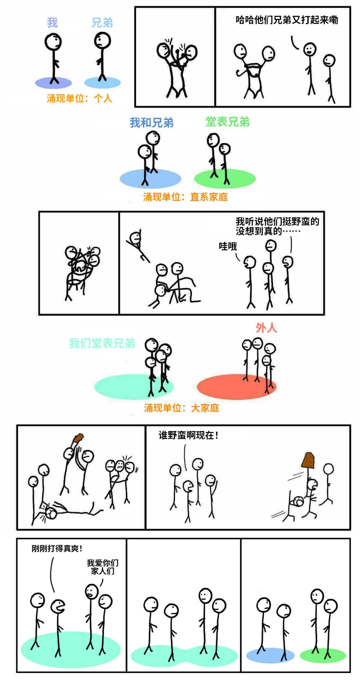

这正是魔像的运作方式。魔像必须时刻在零和博弈中扮演“我们”这一方，与“他们”对立。促使多个魔像融合成更大魔像的粘合剂，永远是共同敌人——一个让这些魔像产生统一战线的“他们”。当共同敌人消失时，高层的合作随之瓦解，魔像又分裂成相互竞争的小型群体。

魔像依赖共同敌人维系团结与力量。“他们”越强越危险，“我们”就越团结。

如果留意周遭世界和自身心理，就会发现这句谚语无处不在。你有没有注意到，世界上某一地区的国家往往彼此仇视，却在区域战争爆发时搁置争议；同一宗教内斗不止的教派，当整个宗教遭外界侮辱威胁时突然团结；足球俱乐部的宿敌之争，在世界杯期间偃旗息鼓；意识形态相左的政治派别，在大选或社会运动期间携手游行。9·11事件后，我目睹数百万素来冷漠的纽约人突然互相扶持——为陌生人扶门，关心他人安危，甚至在街头拥抱。这正是一夜之间集体攀升涌现之塔的写照。尽管外来入侵是场灾难，但它会奇迹般促进人类的团结。

这句谚语为理解现代美国提供了重要线索。在美国，我们可以把政党内部的派系视为谚语中的“兄弟”。这样一来，两大政党就是“堂表”，而其他国家则是“外人”。

20世纪上半叶笼罩在世界大战阴影下。国际战争使美国开启“我们堂表兄弟对抗外人”模式，促使整个美利坚“大家庭”在心理上凝结为统一阵营。

1950年代，二战记忆犹新，国民团结余温尚存。但此时两党自身意识形态混乱——都包含着各种意识形态立场，因此当时党内“兄弟”之争也很激烈。

所谓“政治蜜月期”实则暗流汹涌，只是分歧散落在涌现之塔的各个层级。换句话说，有些人的原始心智集中在较低的“派系”层面，为地方政治争执不休；有些人聚集在上层的“政党”层面，执着于国家政策博弈；更有少数人盘踞塔顶的“国家”层面，既被爱国热情激励，又被排外情绪裹挟。

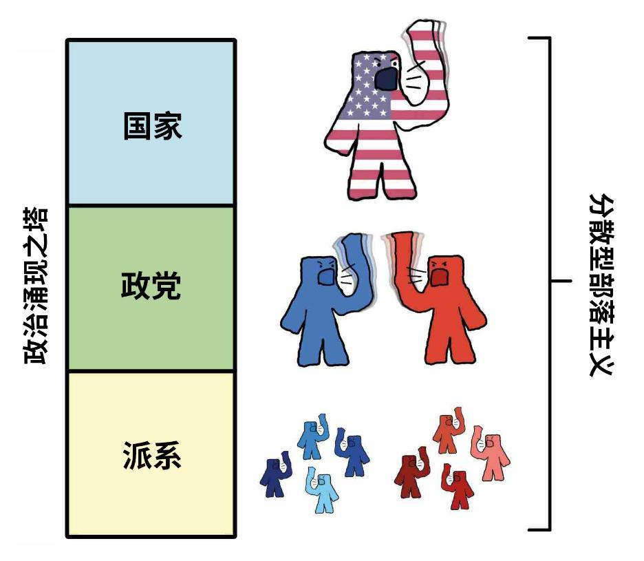

这种分散型部落主义能抑制原始思维最极端的冲动。上层矛盾可凝聚下层（如外敌威胁促成国内团结），下层分歧可缓解上层压力（如党内派系斗争促进跨党派合作）。微妙平衡避免了任一层级的对抗吞噬整个国家。

但平衡极其脆弱。原始思维总被最激烈的部落对立吸引，环境细微变化就可能导致体系崩塌。20世纪下半叶，支撑美国政治部落平衡的支柱开始瓦解。

当1950年代过渡到60年代、70年代和80年代，二战成为遥远的记忆，对共产主义和核战争的恐惧逐渐消退。自1930年代以来，国际冲突耗竭了部落精神，开始失去对美国原始心智的控制。渴求共同敌人的心理能量，开始转向国内政治战场——毕竟“我、兄弟、堂表”失去了凝聚彼此的“外人”。

与此同时，另一场环境剧变正在酝酿。

### 美国政党的意识形态纯化

1960年代是美国政治动荡的十年。大规模的经济计划得以实施，具有里程碑意义的民权立法相继出台，越南战争更让美国民众团结在一起。

变革发生的同时，民权运动迫使一个问题浮出水面——美国的两大政党究竟代表着什么？民主党多年来一直是北方进步派和南方保守派的尴尬联盟。支持民权运动是年轻选民认定的崇高使命，但会得罪至关重要的南方票仓。

共和党作为林肯的骄傲传人，长期以来一直在为非裔美国人的民权而战。却也面临白人选民对多元文化的抗拒。1960年代，他们害怕国家瞬息万变的状况。因此，当时两党当时对

民权运动都态度暧昧。

1964年，当巴里·戈德华特赢得共和党总统提名时，这成为了改变美国政治生态的第一块多米诺骨牌。他公开反对民权运动，试图吸引南方种族隔离主义者的支持——这是共和党百年来首次在南方向民主党挖角。虽然戈德华特在党内并不受欢迎，在大选中也遭遇惨败，却意外赢得大量南方州支持，为共和党日后成为民权反对派大本营埋下伏笔。

政治重组往往始于缓慢的涓滴细流，要对抗强大的惯性和根深蒂固的忠诚。但一旦开始，这个过程就会自我强化。1964年的事件足以开启这个涓滴效应。

1960年，非裔美国人的投票还相对分散，32%投票支持共和党候选人尼克松。但在看到戈德华特在竞选中公开讨好南方种族主义者后，非裔共和党人纷纷表示“算了吧”，他们与许多进步派共和党人一起大规模转向民主党（戈德华特只获得了6%的非裔选票）。

四年后，随着共和党疏远其进步派基本盘以换取南方新选民，将戈德华特的“南方战略”推向极致。他小心翼翼地避免批评种族隔离主义者，却被广泛认为通过“州权至上”和“法律与秩序”等口号向南方白人群体传递隐晦信号。

与此同时，民主党正面临内部极端派系的崛起——年轻、激进、政治好斗的新左派，他们的标志性特征是迷幻毒品、校园抗议、大标语、特立独行的发型和骚乱。由于失去南方传统票仓的支撑，民主党对新左派时常突破自由主义边界、偶发暴力的行为保留了暧昧态度。

当温和派与极端派争夺政党话语权时，任何不明确否定强硬派的行为，本质上都是默许他们是政党的一部分。毕竟若非如此，政党理应明确表态：“这些极端分子不能代表我们。”然而两党均未划清界限，放任极端派系深度融入政党身份。极端派如同互斥的磁极——其影响力越显著，两党就越被定义为“厌恶对方极端派系者”的聚集地。

这些涓滴持续累积，加速了政治重组。保守派民主党人和进步派共和党人因无法忍受本党日益极端的意识形态而转投他党，导致两党间的中间共识地带不断萎缩。政客们为迎合基本盘调整政治纲领，又引发更多党员出走，最终使政党内部的多元思想逐步演变为意识形态的纯化。

用我们的谚语来说，随着政党意识形态日趋统一，“兄弟”间的矛盾逐渐消退。当“外人”基本消失、“兄弟”愈发团结，1950年代分散型部落主义开始迅速坍缩，最终形成美国左翼与右翼间泾渭分明的二元对立。

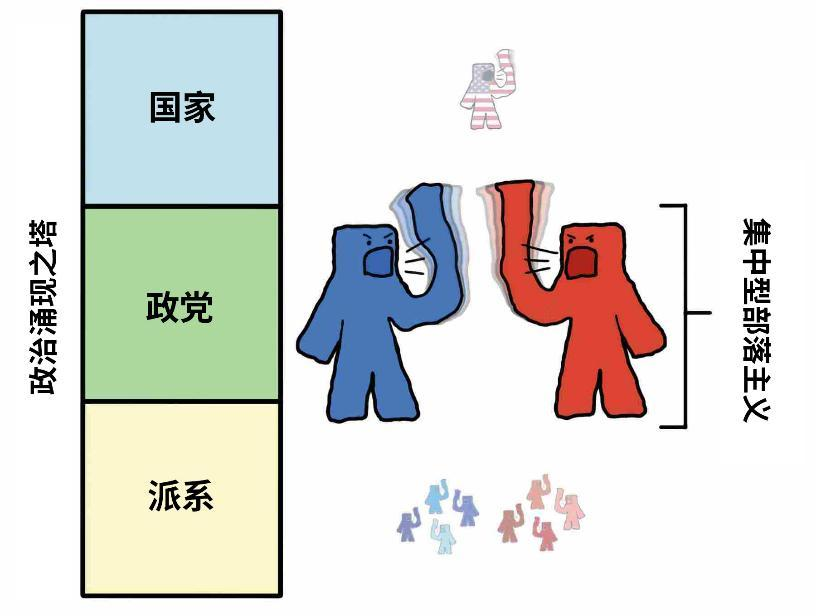

转变之二：从集中型部落主义到极端型部落主义

### “极化”的定义

关于政治极化的争论不少——部分源于语义混淆。

许多学者质疑“美国选民意识形态趋于极化”的观点，指出数据表明，尽管党派归属更加明确，但民众观点并未变得更极端（即中间派规模并未缩减)。这符合事实——相比普通选民，“意识形态极化”在政客群体中更为显著。

但当我们谈及当下美国政治极化时，更多指向“情感极化”现象：即不信任、不喜欢对方党派的人。这种趋势正在加剧，也是本章重点探讨的内容。

### 地理分化

在过去的一代人中，美国民众受教育程度提高，人口流动性增强。《经济学人》指出：“45%拥有大学学历的年轻人在毕业五年内跨州迁徙，而高中文凭群体这一比例仅为19%。”

流动性带来的启示是：当大量人群具备选择定居地的能力，且具有（哪怕是轻微的）同类聚居倾向时，最终都会形成完全隔离的社群。这种动态在1971年《隔离动态模型》论文中已有阐释，线上创作者Nicky Case与Vi Hart的互动模拟实验更是生动呈现了这一过程。

实验设定了两种角色：蓝色方块与黄色三角。

它们可以代表不同宗教、种族、社会阶层群体或任何身份。

在模拟中，有一个关键指标叫做“偏见百分比”——这个数字代表了这些形状对相似邻居的重视程度。如果偏见百分比是33%，这意味着居民需要至少三分之一的邻居是同类，否则就搬走。若三分之一以上相似，就留。

模拟开始时，蓝色方块和黄色三角形随机分布。当偏见百分比设为20%时，少数居民开始“不高兴”了，模拟系统开始运作，直到每个居民的20%最低阈值得到满足。结果诞生了一个非常混杂的社区：

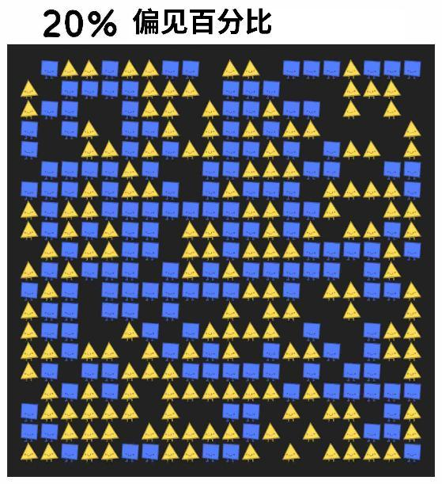

但将偏见百分比提高到33%时，更多居民不满了。为了让所有人满意，模拟不得不让环境更加同质化。当提升至50%——即居民不排斥多样性，但不愿成为社区少数派——最终形成完全隔离状态。

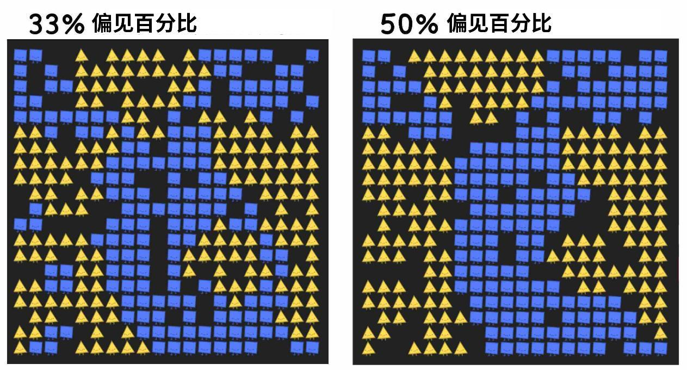

仅需一点偏见，就足以让每个人都完全被相似的人包围。正如Case和Hart所说：“个体的微小偏见将引发集体的巨大偏见。”在这个简化模型中，保持社区多样性（种族、民族、政治）的唯一途径，是居民对多元化的偏好必须显著强于对成为少数派的反感。

结合另一事实考量：随着政党意识形态“净化”，政治身份承载了更多文化意涵。今天的美国进步派不仅在政治立场上一致——他们更可能不信教，上过大学，去全食超市购物，读《纽约时报》，喜欢背包旅行和牛油果吐司。美国保守派除了意识形态相似外，往往去教堂，偏好传统餐饮，看福克斯新闻，喜欢纳斯卡赛车。这当然是概化描述，有无数例外——但正如模拟所示，即使这只是一点点微弱的倾向性，也会带来重大的连锁反应。

我有一个朋友举家从纽约迁居佛蒙特州时，特别强调他喜欢那块地方，是因为大家基本都是进步派。他选择定居地时，真是因为在意邻居的税收政策立场吗？并非如此。他和家人真正渴望的是生活在“同类”之中——周围是那些和他们逛同类商店、参加同类活动、光顾同类餐馆、选择同类学校的群体；是说着相似俚语、追看同类电视剧、偏爱同类度假地的人群。

回顾1950年代，人们同样追求和同类住在一起——但在政党混杂的背景下，文化同质社区仍能保持政治多样性。如今，两大政党已成为宏观文化的代名词，寻求同类社群往往意味着踏入政治立场趋同的居住环境。

比尔·毕夏普在《大分选》中指出：相比过去，美国人生活在政治多元社区的概率大幅降低。这种现象是地理层面的回音室——人们在晚宴派对、社区教堂、本地商铺乃至子女结识终生挚友的校园中，越来越难接触到异质政治观点。

在国会选举中，民调机构将“压倒性选区”定义为获胜者领先对手20个百分点以上的区域。1976年总统大选期间，仅27%美国人居住在此类深红或深蓝选区，其余73%生活在政治平衡的“紫色选区”；到1992年大选，前者比例攀升至38%；至2020年总统大选，58%美国人住在压倒性选区。

当然，这个结论存在争议。有学者认为“压倒性选区”更像是总统选举的独特现象，而非普遍趋势；有人质疑因果关系，指出政治趋同可能源于居民观点逐渐与环境趋同，而非主动搬往政治立场匹配的居住地。

无论如何，学界普遍认同政治部落主义正在抬头。这与我的观察高度吻合：如今美国人投入大量时间与政治立场相近者对话，却鲜少与异见者进行深度思想交锋。

当人们身处意识形态同质化群体时，观点会加速极化。一项有趣的研究开展了一场“交流日”实验：让自由派主导的博尔德市与保守派主导的科罗拉多泉市的居民分组讨论热门政治议题，比如气候变化、平权法案、同性伴侣等。

研究显示：经过组内讨论，自由派在三个议题上变得更加自由，保守派则愈发坚持传统立场。最终两城居民间的分歧显著扩大，内部共识度却不断提升，多样性持续衰减。

由此可见，文化分选催生政治分选，同质化环境又加剧观点极化。这种极化又强化人们对

异己党派的负面认知，促使他们更坚定地寻找同类社群——这正是典型的恶性循环。

而这仅仅是环境困局的开始。本书导论中讨论过指数级技术发展，在带来福祉的同时也暗藏危机。过去三十年的技术革命，已将政治部落主义推向前所未有的激化状态。

### 窄播媒体

以下是我称之为“媒体矩阵”的分析框架：

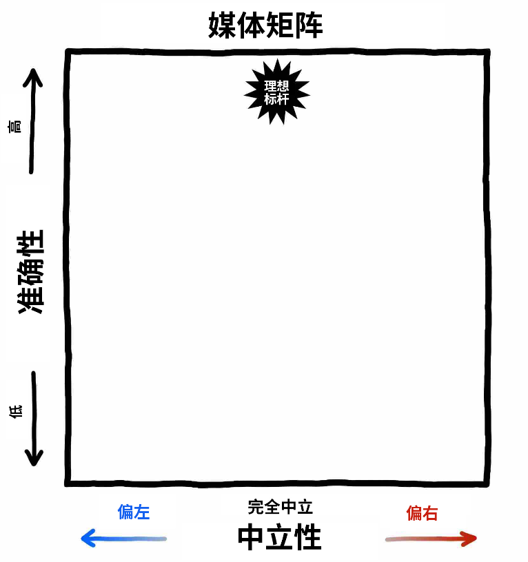

每个媒体品牌、人物或记者都能在这个矩阵中找到定位。

在媒体矩阵的顶端中央，矗立着新闻业的理想标杆。这里的媒体机构恪守精确性与中立性准则，竭力呈现完整真相——当真相未明，也会坦承不确定性。这是高阶新闻的圣域。

从理想标杆向左右偏移时，政治偏见开始渗透。这类媒体会讲述大部分事实，但可能选择性忽略新闻。当标杆移动到矩阵的顶端角落，你会看到有严重偏见的媒体品牌——它们注重准确却不中立，他们所报道的一切都是精心挑选的。

向下移动，准确性逐渐消失，让位于获利、娱乐或政治议程。处于底层的新闻源成为特定群体的坚定盟友，实时更新政治迪士尼乐园的最新话术——即便这意味着扭曲报道、滥用统计数据、断章取义、传播谣言或其他形式的胡说八道。

### 从广播到窄播

1980年代，大多数美国人通过三大全国性广播电视机构——CBS的丹·拉瑟、ABC的彼

得·詹宁斯与NBC的汤姆·布罗考——获取电视新闻；更早年间，则是沃尔特·克朗凯特这样的全国性新闻权威。在那个时代，这些平台为争夺最大观众份额展开竞争。他们小心翼翼避免政治偏见，他们知道，报道失实可能会让可信度受损，观众流失。在市场规律与政府监管的双重约束下，他们不敢偏离理想标杆的轨道太远。

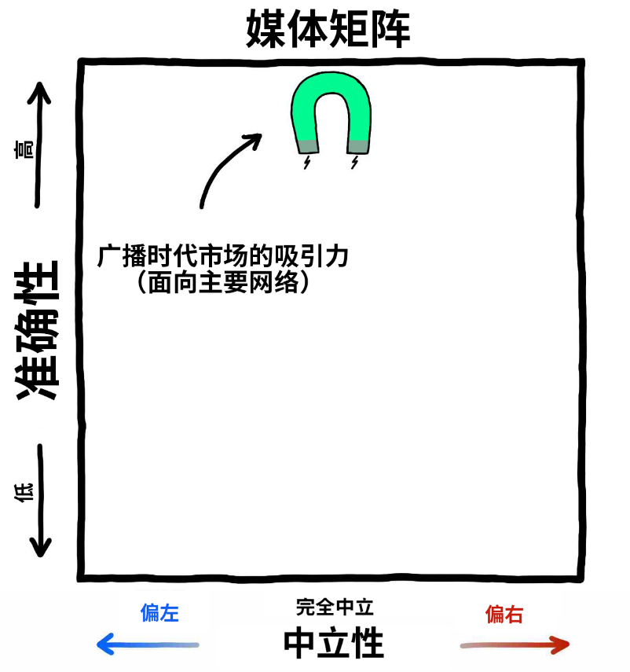

近几十年的技术革新彻底改变了这个格局。

首先是1980年前后有线电视的爆发式增长，随之而来的是24小时滚动新闻（CNN于1980年开播）。相较于传统电视网，有线频道的播出标准更为宽松，而且一天 24 小时都在工作，得以尝试更激进的新闻呈现方式。

接着是公平原则的终结。1949年，美国联邦通信委员会（FCC）制定该原则，要求所有广播执照持有者必须以“公正且平衡”地呈现“重大公共争议议题”，为“对立观点”提供发声平台。1987年，该原则与第一修正案的新闻自由产生直接冲突，被正式废除。

公平原则废除后，党派色彩明显的媒体数量急剧上升。保守派电台脱口秀在上世纪 80 年代末风靡一时，最著名的当属1988年全国首播的拉什·林堡秀——到1991年，林堡已成为全美电台联播网覆盖最广的主持人。1996年，福克斯新闻与微软全国广播公司相继诞生。这些新媒体不再面向全美广播，而是针对特定群体进行窄播。

2004年，我在大学里参加了一次特德·科佩尔的访谈现场，他是美国广播公司深夜新闻节目“夜线”的主持人。我记得主持人提到，科佩尔对自己的政治倾向守口如瓶是出了名的——这曾是顶级主持人的职业标准，但到1990年代末，越来越多美国人开始从毫不掩饰政治立场的媒体人处获取新闻。

与此同时，互联网带着德拉吉报告（1995）、Slate（1996）、《赫芬顿邮报》（2005）、布莱巴特新闻网（2007）以及无数政治博客和YouTube频道闯入我们的生活。网络将窄播推向全新维度：彻底成熟的部落化媒体生态。

福克斯新闻与保守派广播不断壮大，催生出一个与世隔绝的右翼信息茧房，直到今天。左翼阵营用一种新的电视新闻形式——政治讽刺剧——与之抗衡。《每日秀》始于1996 年，成为了一个持续数十年之久的现象级节目——在支持者眼中，它是在右翼癫狂蔓延时坚守理性的声音；在批评者看来，这是精英进步派看着乔恩·斯图尔特肆意嘲讽政敌的幸灾乐祸专栏。《每日秀》之后出现了一大批类似的“看看右翼有多烂”的喜剧/新闻节目，主持人都是《每日秀》的毕业生，由史蒂芬·科拜尔、约翰·奥利弗等《每日秀》出身的喜剧人主持。

窄播媒体迎合同质化的受众，这让他们失去了保持中立的动力，也强化了迎合既有观念的动机。他们不是像过去那样预测选举结果，而是告诉人们为什么他们最喜欢的候选人应该获胜，从中谋利。偏颇报道几乎不会损害声誉，因为它们可以持续抨击一方而纵容另一方，最终培养出更忠实的受众群体。如果说广播像恪守准则的科学家，窄播就是为委托人辩护的律师——当环境发生变化，行为模式必然随之改变。

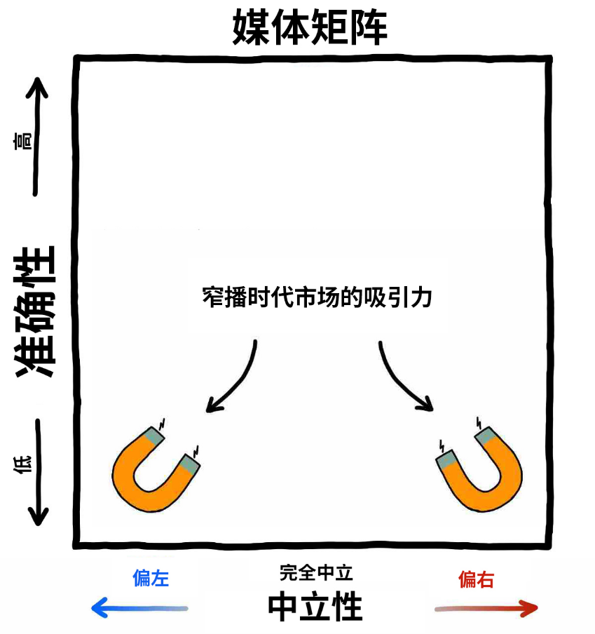

### 垃圾食品

许多企业深谙一个致富秘诀：绕过复杂的高阶心智，直接向简单可预测的原始心智兜售商品。要向高阶心智推销，必须兼顾品质与营养——成本高昂，难度巨大。但若将彩虹糖包装成营养食品卖给原始心智，事情就简单得多。

若专业新闻报道是营养食品，政治垃圾食品看起来就像这样（均为真实新闻标题）：

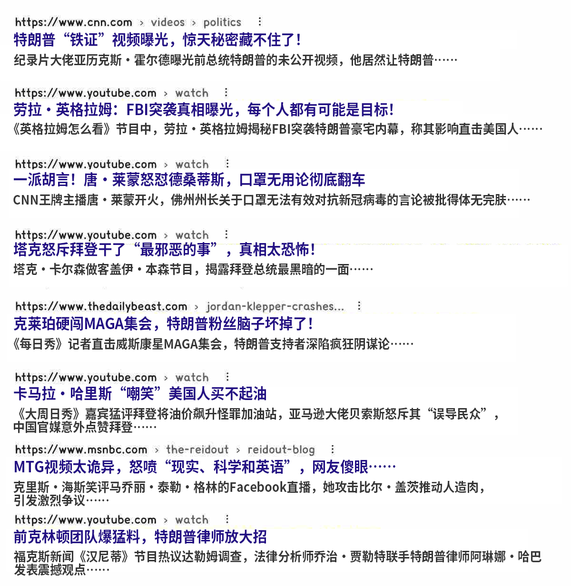

这类标题对原始心智的吸引力，就像彩虹糖包装纸承诺的甜蜜诱惑。政治垃圾食品不提供认知养分——它们从第一秒就宣告胜负归属，精准投喂原始心智最渴求的三重快感：立场和身份认同、攻击其他阵营和八卦谈资。

政治垃圾食品产业的爆炸式增长，将无数美国人拖入政治迪士尼乐园：这里只有好人、坏人和简单明了的故事情节。这种幻象反过来又催生了对垃圾食品更强烈的需求。

这种恶性循环持续越久，就越难逆转。媒体如果长期提供偏狭的部落式快餐，终将流失高阶心智受众，导致品牌愈发依赖迷恋垃圾食品的低阶群体。数千万美国人就这样患上了政治糖尿病。

随着媒体垃圾食品业日趋成熟，一种新型畸形娱乐正在吞噬观众：

### 政治真人秀

广播新闻试图呈现现实，窄播新闻却致力于制造现实真人秀——二者存在本质差异。

现实偶尔有趣，真人秀却要时刻精彩。制作人的绝招是什么？戏剧冲突与负能量。如果《比弗利娇妻》的主角们和睦相处，还有谁会看啊？所以每五分钟一定要吵起来。

当我们意识到新闻媒体本质也是娱乐产业，就能理解为何冲突与狗血永不停歇。

在美国，许多人都沉迷于一档低俗节目，我称之为《华盛顿政治真人秀》。

演员年年更迭，配方始终如一：明确的英雄与反派，持续发酵的剧情线，永不落幕的对抗戏码——堪称史诗级狗血连续剧的完美载体。

这些高频出镜的政客与夸张剧情并非全无价值，问题在于它们扭曲了政治议题的全貌。那些每天占据头条新闻的问题通常被过度渲染，而真正重要的政治进程——例如每周在参众两院委员会通过的法案——却很少获得关注。

我最近与一位国会温和派联盟的前主席，德里克·基尔默交谈。这位拥有99名成员的民主党联盟领袖，对如何改善国家有着细致审慎的思考。也正因如此，你从未听说过他——《华盛顿政治真人秀》的制片人绝不会浪费镜头给一个理性克制的政客，毕竟连写下这句话的我都快睡着了。

真实政治就像真实生活，让大多数人感到乏味。于是部落化的媒体效仿真人秀制作人，精心剪辑出娱乐性爆表的政治幻象。

这解释了为什么自称关心政治的美国人，大多说不出十位现任国会议员的名字，却对《华盛顿政治真人秀》每月力推的“主演”和热点话题如数家珍。

集中型部落主义加剧了社会分裂，但《华盛顿政治真人秀》更通过夸大党派分歧火上浇油。

以气候变化问题为例，我们经常听到这些说法：

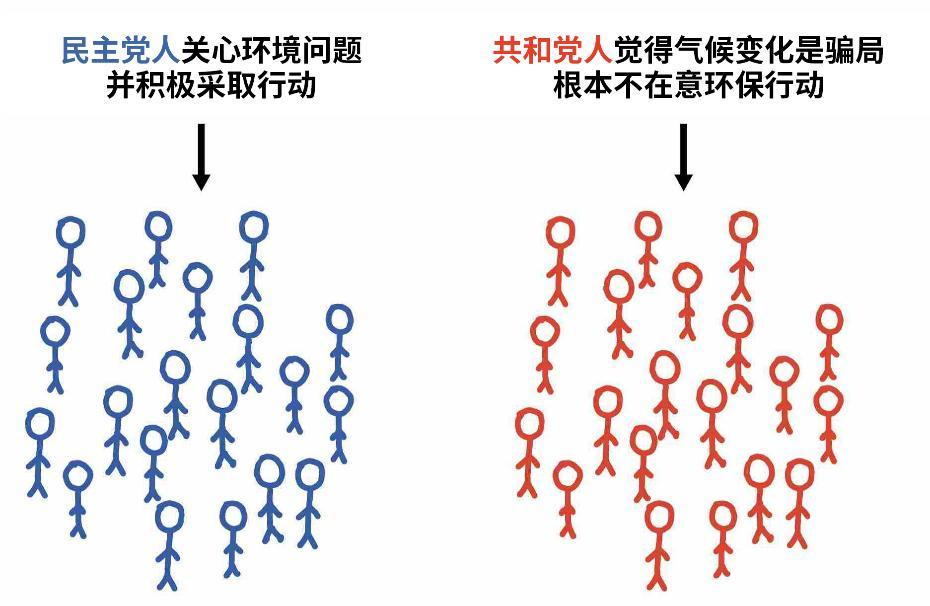

一些数据却让人惊讶：

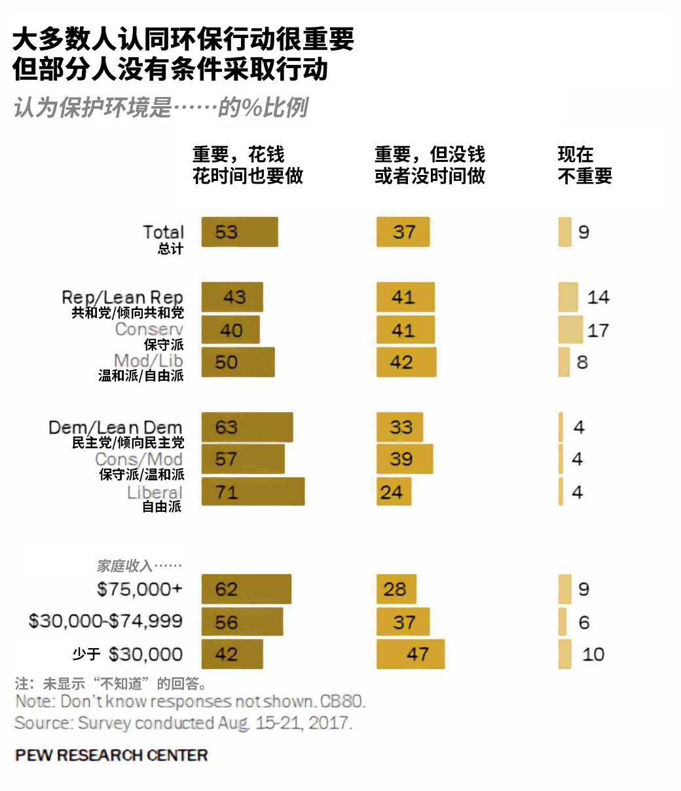

这说明真实情况可能是这样：

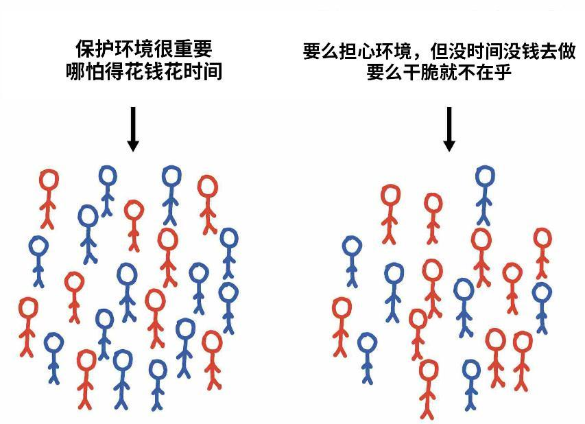

完全是另一个故事。当然，许多共和党政客对气候变化不屑一顾也是事实。而且“环保行动”未必等同于减少碳排放。但这些数据促使我们反思：环境活动价应如何建立有效的联盟来改变我们的发展轨迹？

顶着让真人秀更刺激、故事更丰富的名号——他们呈现出扭曲的现实，滋生错误的愤怒和分裂，也损害了推进关键议题的能力。

《华盛顿政治真人秀》最戏剧化的桥段当属大选——堪比最终集的高潮戏码。编剧们绞尽脑汁，使出浑身解数，来拉满大选的戏剧性。

让我们回顾美国过去一个世纪的总统选举：

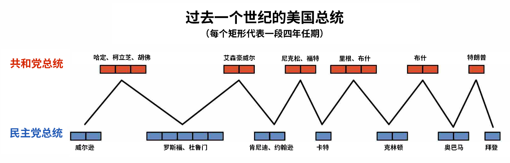

明显的锯齿形波动。然而2004年小布什连任时，有媒体评论断言因社会结构变化，民主党将再难回春。然而，2006年中期选举民主党大胜，2008年更夺回白宫。

2012年奥巴马成功连任之际，人们纷纷说“时代变了”：移民人口结构变化带来更多第一代美国公民，茶党运动已使共和党沦为政治配角，种种迹象似乎都印证着新时代降临——民主党会长久执政，总统宝座再难易主。

2016年共和党却横扫三权。舆论风向即刻逆转，媒体们异口同声：左派或许主导文化领域，但右派掌握着真正的政治权力机器。我还看到许多政治评论信誓旦旦分析称，共和党通过“杰利蝾螈”手段（系统性选区划分不公）掌握了结构性优势，民主党将永无翻身之日。但历史再次冷笑——2018年，民主党重夺众议院控制权，2020年更一举包揽总统宝座、参众两院多数席位，完成全面执政。

当代媒体的动机难以揣测——也许是政治宣传，也许是利润驱动的娱乐（碰巧起到了政治宣传的作用）。无论动机如何，但结果都一样：部落主义愈演愈烈。

转型窄播约十年后，又一技术突破为这场烈火添柴加薪。

### 算法牢笼

我感激谷歌搜索算法：它能根据我的居住地和兴趣偏好筛选结果，甚至在我输入几个字母后就能神奇预测完整搜索词，省去打字的麻烦。

我感激YouTube算法：它熟记我钟爱的频道，确保我不会错过任何更新。

我感激Facebook算法：它替我过滤二十年前高中同学杰克昨晚的晚餐照片，却在他订婚时及时提醒，好让我翻遍他最近的87张照片研究未婚妻来历。

但新技术往往伴随着意想不到的后果。

当我在YouTube观看视频时，侧边栏的封面缩略图中，历史科普类内容总能比影评视频更吸引我点击。YouTube精准捕捉到这一偏好，于是我的侧边栏再也看不到电影解析，取而代之的是源源不断的历史与科学科普推荐。

直到某个夜晚，有人发给我一段路人用手机拍摄的荒诞视频：拍摄者激怒另一司机，对方摇下车窗疯狂辱骂，盛怒之下挥拳猛击，竟把自己的后视镜打飞。这出人间喜剧让我笑出眼泪。

视频结束时，YouTube在侧边栏推荐了九个同类路怒视频。我点开其中一个观看，结束后平台又推送九个新推荐。当时我有重要工作要做，却按住Command键一次性打开所有标签页，在九个新页面中逐个欣赏。两小时后，我怀着自我厌恶感上演了戏剧性的一幕——长按Command-Q强制关闭八个Chrome窗口及127个标签页。这场杀时间的噩梦总算结束了。

但还未结束。YouTube算法像为蒂姆·厄本量身定制的鱼钩，从此我的侧边栏永久漂浮着顶级路怒视频精选。那个可悲夜晚的点击，给了我一个余生都浪费在看欢乐路怒视频的诅咒。

算法本质是逐利机器。当它服务于高阶心智，是得力助手；当它诱惑原始心智，就成了寄生毒瘤。

政治领域尤甚：原始心智热衷于点击政治垃圾食品——它会被那些不仅报道新闻，而且耸人听闻、娱乐化的文章和视频吸引。YouTube侧边栏可能瞬间变成《华盛顿政治真人秀》专栏，正如它曾用路怒视频淹没我一样。这助长了部落主义，扭曲了我们对现实的看法。

社交媒体更将这种现象推向史无前例的境地。它不仅放大政治垃圾食品，更参与塑造内容本身。当新闻事件爆发，社交媒体优先传播的不是最准确的分析，而是最能刺激转发的热门评论——有最抓人眼球的措辞和最煽动人心的情绪。这是一种进化机制的筛选，复杂的话题被简化，包装成我们原始心智无法抗拒的刺激片段。

只有少数人是极端党派主义者，但算法使已经极端的人更加极端。这些极端声音在社交平台形成扩音器效应，让人们觉得事情比实际情况更恶劣，更两极分化。

2020年纪录片《社交困境》中，计算机科学家杰伦·拉尼尔以维基百科为例揭示这种荒谬：“当你浏览维基词条时，看到的内容和别人看是一样的，这是我们难得的共识空间。试想如果维基百科宣布‘我们将为每个人定制不同词条来获利’——这意味着它会监视你，计算如何编辑词条来引诱你多付哪怕一点点钱。很难想象？没关系，你能想到的，因为这就是

Facebook和YouTube的运行逻辑。”

社交媒体动态越来越主导传统媒体报道。埃兹拉·克莱因在《为什么我们如此分裂》中指出：“以前记者判断新闻价值，是看其他媒体有没有报道这个事件。而在当代，他们的判断方式变成了看社媒上有没有被病毒式传播——如果某个故事或推文已经引发了热议，那它就代表了新闻价值。”

这是恶性循环。政治垃圾食品将受众拖入迪士尼乐园，低阶叙事在社交平台上病毒式传播，继而催生更多垃圾内容去强化、合理化这些流传的观点。互联网将媒体与受众熔铸成自我强化的闭环系统。

我们最终抵达的，正是我们当下所处的现实。

### 分裂的现实

自1994年以来收集的皮尤数据显示，在一系列议题上，民主党与共和党人的观点分歧越来越大：

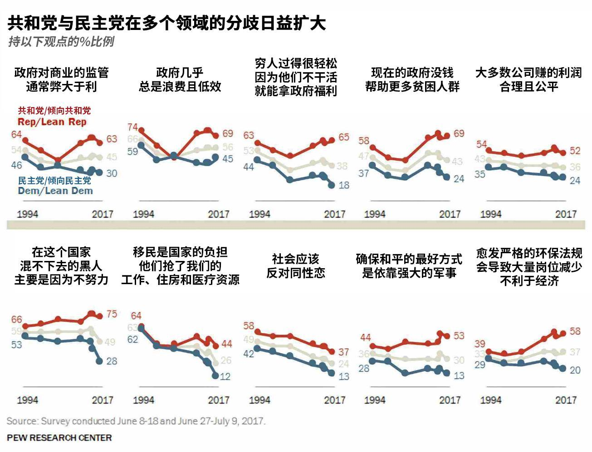

这十张图表中的分歧平均增幅揭示了一条平稳上升的曲线——而其他人口群体之间的分歧程度却基本不变：

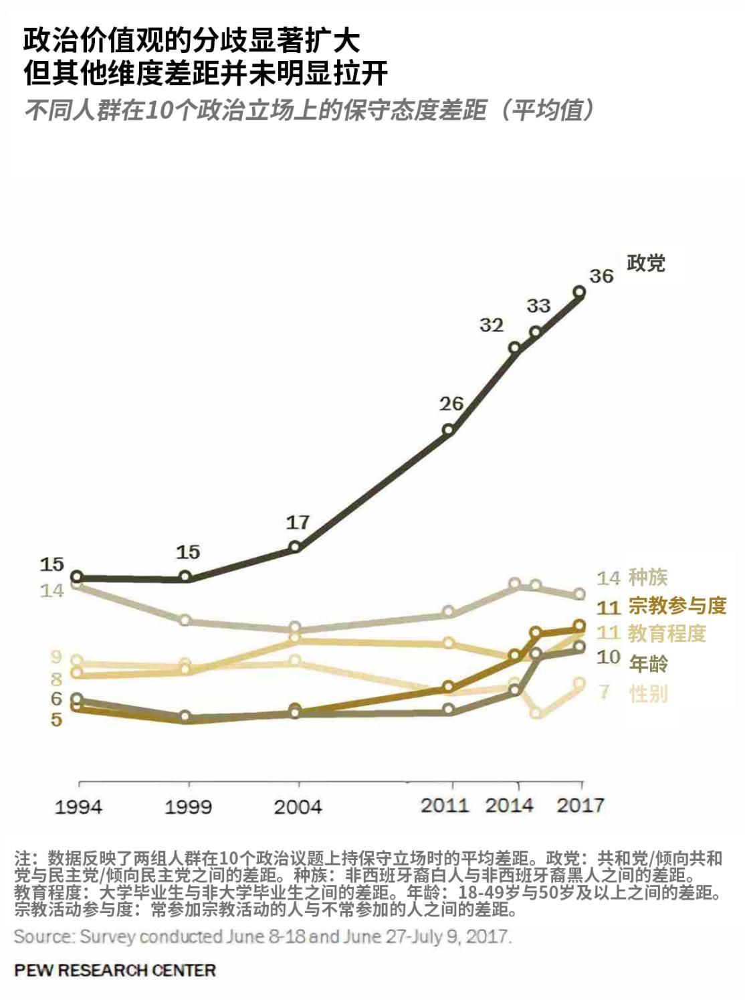

这种现象反复上演。2020年名为《对立现实》的民调显示，81%的共和党人认为“民主党已被社会主义者掌控”，而78%的民主党人则相信“共和党已被种族主义者劫持”。2022年皮尤调查发现，72%的美国人认为“在重要议题上，他们在政治上的立场输多赢少”，仅24%感觉己方占据上风——这正是政治媒体日益聚焦负面冲突的自然结果。

2017年一项名为《我们头脑中的党派》的研究，揭示了一个更发人深省的发现：受访者消费的政治新闻越多，他们对另一党派成员的看法就越扭曲。

当媒体矩阵的运作重心从理想标杆区域滑向底层角落时，现实分裂便成为必然——在那里，双方的报道几乎毫无交集。正如“狗镇与浣熊镇”的居民对现实产生了截然不同的看法，最沉迷政治新闻的群体往往也最脱离现实。

### 偏见的滋长

新闻媒体惯用的“破坏性筛选”臭名昭著——这种选择性报道偏爱负面故事，只因它们最能博眼球。举个例子，盖洛普调查显示自1990年以来，美国民众始终认为犯罪率在攀升，尽管事实是几乎年年下降。

这种“破坏性筛选”持续散播恐慌与悲观，过去二十年间愈演愈烈。在政治领域，可能会产生尤为危险的后果。

地理隔离使许多人几乎从不与异见者交往，对“另一群人”的认知完全来自失真的媒体过滤器。右翼叙事不断灌输“左派那帮人讨厌你们和你们坚信的一切”，反过来，左翼也在这么做。对这些信息的怒火在社交媒体上蔓延开来。

原始心智的发声会唤醒更多原始心智。持续不断收到“他们恨你”的信息流激活了人们的本能防御，往往催生相互蔑视，遮蔽人性光辉，触发远古的部落开关，将人群塑造成仇恨的魔像。描绘一个人们相互憎恨的社会成为一个自我实现的预言。1994至2022年间，将对立党派评为“极其反感”的人群比例增长三倍，也就不足为奇了。

很快，这就会唤起人类最可怕的情感：厌恶。

就像快乐、悲伤、愤怒和恐惧一样，厌恶是一种基本情绪，是所有人类与生俱来的。在谷歌图片上搜索“厌恶”，你会看到无数张相似的脸：眯眼皱眉，鼻翼皱起，作势欲呕。科学家认为这是进化赋予的防御机制——接触到毒素或疾病时，我们会本能屏住呼吸，尽可能地呼出有害物来保护自己。面对腐烂的食物、血液、粪便或蛆虫，我们都会做出这样的反应。

奇怪的是，这种生理厌恶会蔓延至人际关系。大量研究表明，当人们接触厌恶的事物后，会更加严厉地做出道德评判。一场实验中，一群加拿大人被要求观看令人不安但并不至于作呕的车祸照片，另一组观看咳嗽的人和其他疾病相关照片。然后两组人都被问到，他们认为加拿大应该尝试从哪些国家吸引移民。两组人都更喜欢来自熟悉国家的移民，而不是来自不太熟悉国家的移民，但看过疾病照片的那组人对移民更加排斥。另一项研究中，坐在脏乱桌子前的人对犯罪行为的判决更为严厉；一股飘散的有毒气味使得参与者对男同性恋者的好感降低。

科学家用“行为免疫系统”理论解释这种现象：人类的厌恶感与陌生族群或习俗（特别是性习俗）紧密相关——这是一种我们很久以前就形成的古老本能，因为那时与外国人和习俗的接触确实会让你面临疾病的风险。

我之所以说厌恶是人类所有情绪中最可怕的，是因为它是非人化的导火索，而非人化是人类最恶劣行径的开端。人类近代史上两场最黑暗的浩劫——纳粹大屠杀与卢旺达种族灭绝——都源自厌恶的煽动。纳粹将犹太人比作老鼠、猪猡、害虫，卢旺达广播称图西族为蟑螂——这些精心设计的厌恶隐喻，为二十世纪最惨烈的种族屠杀铺平了道路。

厌恶会蒙蔽心智，将普通人变成冷酷的施暴者或沉默的帮凶。这才是真正的恐怖故事。

地理隔离与政治垃圾食品的组合是致命的，为厌恶情绪提供了温床。我们很难对身边的熟人产生非人化的厌恶，但对素未谋面的“敌人”则不然——尤其是当媒体只展示对方最不堪的片段时。随着情感极化加剧，与你政见不同的人从错误或愚蠢印象逐渐沦为“令人作呕”。

我们都自认与偏见绝缘，但环境刺激足以唤醒每个人心中的偏见恶魔。

政治偏见与其他偏见一样真实。2014年研究显示，美国选民对异见党派的敌意已形成条件反射，歧视之深甚至超过种族偏见。

最危险的偏见往往难以自察。社会准则本是偏见最强大的约束——如今在美国，政治偏见几乎不再被视为禁忌。

### 螺旋式下坠

人类社会由文化、准则、价值观、法律和主流信仰编织而成。任何环境要素的改变都可能引发连锁反应。

部落化媒体使人更沉迷于政治垃圾食品，飙升的需求又催生更极端的媒体，形成恶性循环。

选民与政客间也存在类似的反馈回路：极端的政客将选民更深拖入政治迪士尼乐园，而低阶选民更欢迎这些哗众取宠的人，而冷落那些像成年人一样行事的政客。

随着政治部落主义盛行，中间选民日渐稀少。候选人不再费力争取温和派，转而操弄极端言论刺激基本盘投票率——这种策略在当代反而更见效。

与这些宏观趋势并行的，还有政治学家研究的其他变革——立法多数席位争夺白热化、选举规则调整、竞选资金改革、移民人口增长等等。这些变革究竟是当下政治气候的成因还是结果，学界仍存争议。我不打算逐一剖析，因为关键问题在于部落主义极端化的总体趋势，而非其所有潜在诱因。

当政治报道沦为真人秀，一套奖励使用煽动性言辞的机制便诞生了。正如纽特·金里奇所说：“制造冲突，才有关注。”当幼稚的政客成为收视宠儿，更大的曝光率会有助于他们当选，进而鼓励更多人效仿这种行为。

本章前半部分我们探讨了1960年代分散的政治部落主义如何逐渐汇聚成单一而尖锐的群体对立——这种环境让人们更容易滑向道德阶梯的低阶。当这种趋势与地理格局变迁、传统媒体转型、社交媒体崛起相结合时，整个国家便如同被卷入漩涡，在自我强化的恶性循环中加速坠落。

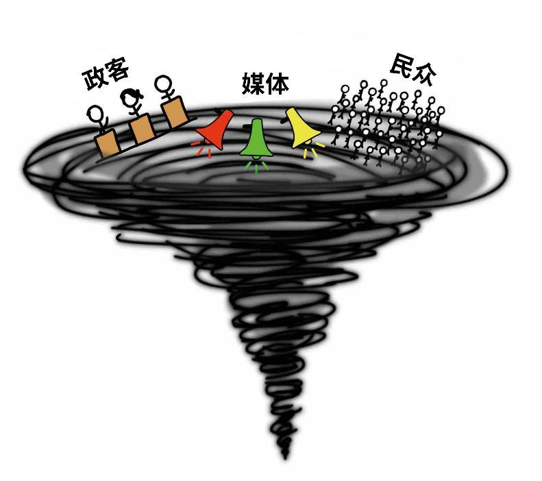

这个漩涡将美国带入了更危险的境地——我称之为“极端型部落主义”。

### 极端型部落主义

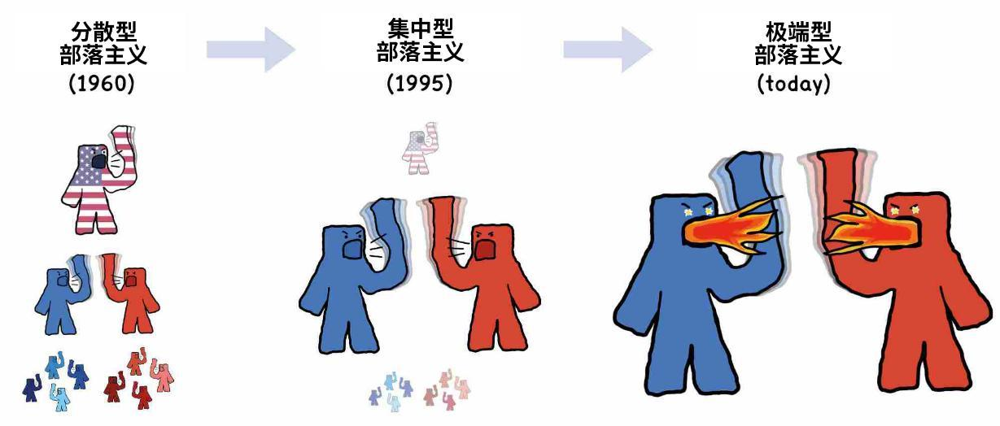

当集中的部落对立激化到宗教战争般的高度，吞噬整个社会与人民时，极端型部落主义就形成了。它把有思想、有情感的人类变成忠诚的工蚁，压制理性与人性，甚至对亲友的爱。这是一种群体性的疯狂——如同传染病般蔓延，瞬间唤醒数百万人脑中的原始生存本能，让庞大的群体一起进入魔像模式。

政治学家艾伦·艾布拉姆森和史蒂文·韦伯斯特研究过一个有趣指标：政治忠诚度。他们追踪过去五十年间，各选区在总统选举与国会选举中的投票情况，进行比较。1970年代相关性仅为0.54，意味着当时美国人当时美国人投票给国会一个党派，投票给总统的却是另一个党派的情况很普遍。但之后政治忠诚度持续攀升：

1972 - 1980: 0.54

1982 - 1990: 0.65

1992 - 2000: 0.78

2002 - 2010: 0.83

2012 - 2014: 0.94

2018: 0.97

相关性达到0.7-0.8已属集中型的部落主义，0.97则意味着更加极端。到2018年，几乎没人会在同一期选举中跨党投票。短短几十年间，支持敌对阵营的候选人已变得难以想象——无论对方是谁。

这种非黑即白的站队思维同样体现在具体议题上。过去，从某人对枪支管控的态度，很难推断其堕胎或移民立场。如今民主党与共和党支持者的观点却很容易预测。皮尤研究中心通过“意识形态一致性”量表分析选民，将人们从“彻底自由派”到“彻底保守派”排列。完全符合某党立场的人位于两端，混合立场者则靠近中间。这是近年的变化轨迹：

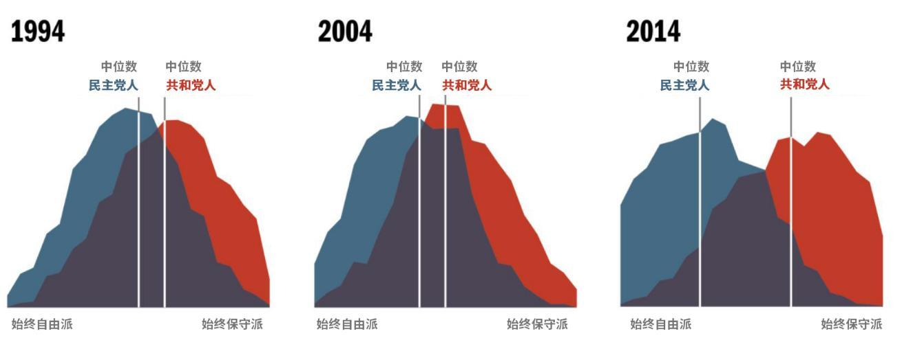

这种极化趋势并非源自1960年代的多元政治格局，真正的转折点出现在1994年。集中型部落主义还不足以造成如此严重的扭曲——但极端型部落主义可以。

政客的极化更触目惊心。咨询公司《国家期刊》根据议员在经济、社会、外交议题的投票情况，将议员们排列在意识形态光谱上。这是四十年来的变化：

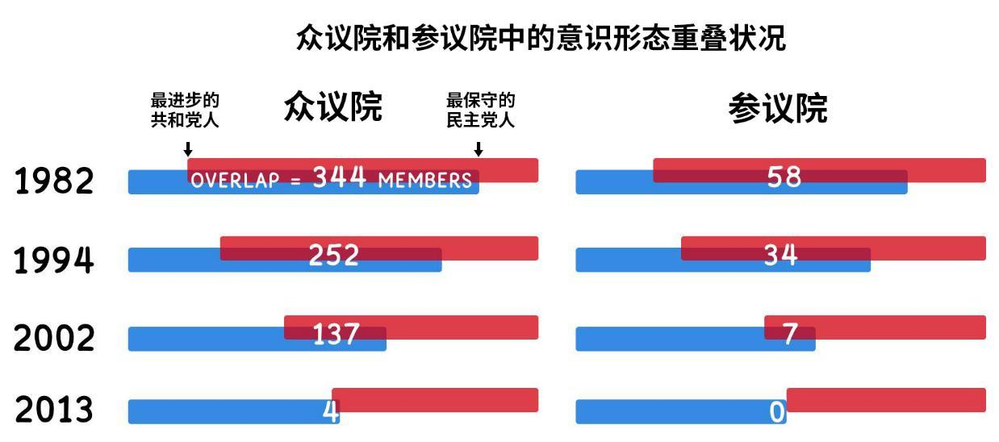

1980年代，共和党渐渐成为保守派的大本营，民主党则成为了进步派，但仍有相当重叠——毕竟数百位政客有自己独立的判断。如今这种重叠已消失。违背本党意识形态的投票不仅是冒险，更成了一种亵渎。这就是极端型部落主义。

衡量议员意识形态的常用指标是DW-NOMINATE评分体系，根据政客的投票行为，将他们分为自由派和保守派。这张图表显示两党均值差距——极化程度的直观反映：

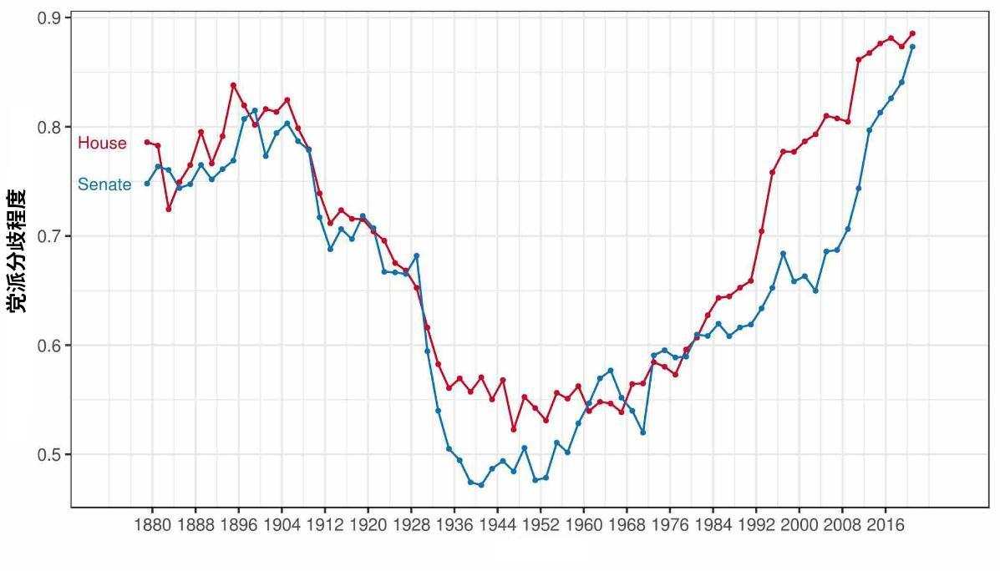

即使是最高法院，一个最应当中立的机构，也反映出这种趋势。政治学家李·爱泼斯坦与法学教授埃里克·波斯纳考察了法官的投票与任命他们的政党之间的相关性。过去，这种相关性很微弱，但他们指出“直到1990年代初，大法官仍可能做出意识形态预判之外的裁决”。但在极端型部落主义时代，这种情况不复存在。在5-3或5-4的胶着判决中，大法官现在几乎永远按党派立场投票。

爱泼斯坦和波斯纳认为：“有史以来，法院将第一次被公众视为一个由政党主导的机构，其对有争议的投票基本上是由最近几任总统的政党归属决定的。”

许多当今热议的政治分歧，其实近30年才形成。例如1990年代中期，两党对堕胎合法化的支持率还基本持平。控枪议题也类似：1990年支持加强枪支管制的民主党人占83%，共和党人76%；到2017年变成民主党90%，共和党33%。如今共和党信教比例远超民主党，但1990年双方几乎相同。这些议题如今都已被极端型部落主义掌控。

双方仇恨之深，甚至当一方强调外国威胁时，另一方会本能淡化危险，指责对方在操弄政治或散布偏见。如今连美国国旗都被不少左翼视为右翼象征。当整个民族的原始思维固着于某个“我们vs他们”的分界，原本可能缓解对立的因素反而成了火上浇油。

极端型政治部落主义如同磁石，吸附周遭一切事物：种族、宗教、教育、媒体、科技、商业、音乐、娱乐、科学、历史、体育、感恩节、圣诞节……在美国，它们都成了政治的一部分。每当新事件爆发——比如新冠疫情——几天之内，就会出现立场站队，演变成又一场政治代理人战争。实验室泄漏论变成右派专属，口罩成了左派标志。当社会陷入极端型部落主义，它会渗透职场、餐桌、教堂、校园，成为无处不在的幽灵。

随着越来越多美国人坠入政治迪士尼乐园，宏观上看就是美国巨人在阶梯上持续下滑，在文明拔河赛中节节败退。自由社会的生态系统本应维持精灵与魔像的平衡，极力避免魔像肆虐。但随着美国在极端型部落主义中越陷越深，社会的高阶免疫系统正在崩溃。政治魔像们抓住机会，迈着笨重的步伐碾过自由与文明，在这片土地上肆意践踏。

## 嘿

先暂停喘口气。现在我们走到了这里：

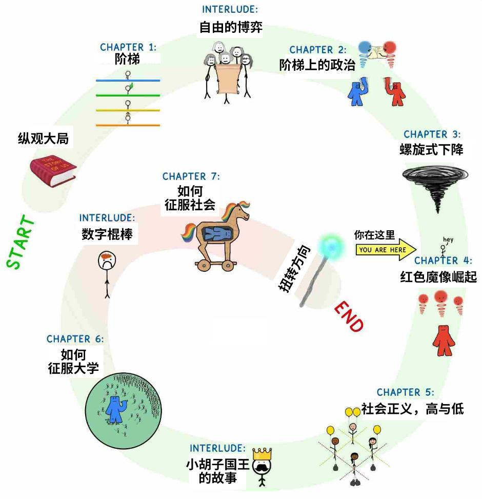

到目前为止我们都讲得比较宏观。接下来要进入本书中解读人们为什么会变成这样的部分：

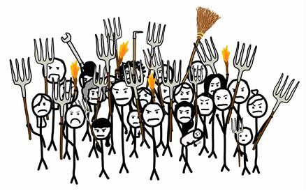

本章我们会先快速回顾共和党历史，作为这场认知暴走之旅的起点。随后几章将深入探讨美国社会正义运动——当然，这会让我的职业声望跌入谷底。这些话题近年已被反复讨论，但总让人觉得没抓到要害。我写这本书就是为了提供新视角：用一套框架，一种新的语言，我们可以用它来诊断和讨论我们周围发生的一切。

这并不是关于谁好、谁坏，而是关于低阶思维、道德绑架和病毒般扩散的战术如何侵蚀美国政治、制度与公共话语。要走出泥潭，必须先看清来时的路。

当然，这些敏感话题之所以敏感，正因为我们的原始心智对其异常执着。写作过程也充满挑战——我的原始心智总想跳出来指手画脚。

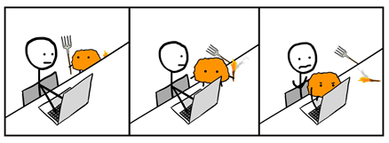

在此恳请大家：保持开放心态。用思想实验室的心态阅读，随时问自己“万一我错了呢？”希望这个过程能帮你打开些封闭的思维之门。至少，写这本书让我自己清醒了许多。

准备好了吗？

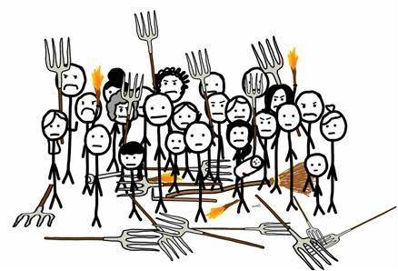

不错，那就开始吧。
